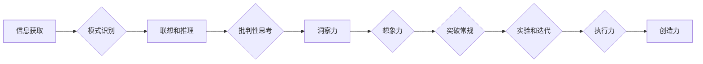

                 

## 洞察力与创造力：人类思维的双子星

> 关键词：洞察力、创造力、人工智能、算法、思维模式、创新、技术发展

### 1. 背景介绍

在当今科技飞速发展的时代，人工智能 (AI) 正在以惊人的速度改变着我们的世界。从自动驾驶汽车到个性化医疗，AI 的应用领域日益广泛，其潜力也越来越受到重视。然而，在推动 AI 发展进程中，我们不禁要思考：AI 的核心驱动力是什么？是什么让 AI 能够从海量数据中提取有价值的知识，并最终实现真正的智能？

答案或许在于人类思维的两个关键要素：洞察力和创造力。洞察力是指从纷繁复杂的现象中识别出隐藏的模式和关系的能力，而创造力则是将这些洞察转化为新的想法、解决方案和创新成果的能力。这两个能力看似不同，但实际上是密不可分的，它们共同构成了人类思维的双子星，推动着人类的进步和发展。

### 2. 核心概念与联系

**2.1 洞察力**

洞察力是人类认知能力的重要组成部分，它涉及到以下几个关键环节：

* **信息获取和处理:** 洞察力需要大量的知识和经验积累，以及对信息的快速获取和有效处理能力。
* **模式识别:** 洞察力者能够从海量数据中识别出隐藏的模式和规律，并将其与已有的知识体系进行关联。
* **联想和推理:** 洞察力需要进行复杂的联想和推理，将不同的信息点串联起来，形成新的理解和见解。
* **批判性思考:** 洞察力者能够对信息进行批判性思考，识别出潜在的偏差和误区，并做出更理性的判断。

**2.2 创造力**

创造力是人类思维的另一重要支柱，它涉及到以下几个关键环节：

* **想象力:** 创造力需要丰富的想象力和联想能力，能够将不同的概念和想法进行组合，产生新的创意。
* **突破常规:** 创造力者能够跳出固有的思维模式，敢于挑战传统观念，探索新的可能性。
* **实验和迭代:** 创造力需要不断地实验和迭代，从失败中吸取教训，不断改进和完善自己的想法。
* **执行力:** 创造力最终需要转化为实际行动，将想法付诸实践，并最终实现创新成果。

**2.3 洞察力和创造力的联系**

洞察力和创造力是相互促进、相互依存的。洞察力为创造力提供燃料，它帮助我们识别出问题和机会，并找到解决问题的思路。而创造力则将洞察力转化为现实，将想法变成行动，最终实现创新成果。

**Mermaid 流程图**



### 3. 核心算法原理 & 具体操作步骤

**3.1 算法原理概述**

在人工智能领域，许多算法都旨在模拟人类的洞察力和创造力。例如，深度学习算法能够从海量数据中学习复杂的模式，而遗传算法则能够通过模拟自然选择的过程，不断优化解决方案。这些算法的原理虽然各有不同，但它们都基于对人类思维机制的理解和模拟。

**3.2 算法步骤详解**

以深度学习算法为例，其核心步骤包括：

1. **数据收集和预处理:** 收集大量相关数据，并进行清洗、转换和格式化等预处理工作。
2. **模型构建:** 根据具体任务选择合适的深度学习模型架构，例如卷积神经网络 (CNN) 或循环神经网络 (RNN)。
3. **模型训练:** 使用训练数据训练模型，调整模型参数，使其能够准确地识别模式和进行预测。
4. **模型评估:** 使用测试数据评估模型的性能，并根据评估结果进行模型调优。
5. **模型部署:** 将训练好的模型部署到实际应用场景中，用于进行预测或决策。

**3.3 算法优缺点**

深度学习算法具有以下优点：

* **强大的学习能力:** 能够从海量数据中学习复杂的模式，并实现高精度预测。
* **泛化能力强:** 能够将学习到的知识应用到新的数据和场景中。
* **不断进步:** 随着算法和硬件技术的不断发展，深度学习算法的性能也在不断提升。

但也存在一些缺点：

* **数据依赖性强:** 需要大量的训练数据才能达到良好的性能。
* **训练时间长:** 训练大型深度学习模型需要消耗大量的时间和计算资源。
* **可解释性差:** 深度学习模型的决策过程较为复杂，难以解释其背后的逻辑。

**3.4 算法应用领域**

深度学习算法已广泛应用于各个领域，例如：

* **计算机视觉:** 图像识别、物体检测、图像分割等。
* **自然语言处理:** 文本分类、机器翻译、语音识别等。
* **医疗诊断:** 疾病预测、影像分析、药物研发等。
* **金融分析:** 风险评估、欺诈检测、投资预测等。

### 4. 数学模型和公式 & 详细讲解 & 举例说明

**4.1 数学模型构建**

深度学习算法的核心是神经网络模型，其数学模型可以抽象为多层神经元网络。每个神经元接收多个输入信号，并通过权重进行加权求和，然后经过激活函数处理，输出一个信号。

**4.2 公式推导过程**

神经网络的学习过程本质上是一个参数优化过程，目标是找到最优的权重和偏置，使得模型的输出与真实值之间的误差最小化。常用的优化算法包括梯度下降法和其变种算法。

梯度下降法的核心思想是通过迭代更新权重和偏置，沿着误差梯度的反方向进行调整，最终找到误差最小的参数值。

**公式:**

$$
\theta_{j} = \theta_{j} - \alpha \frac{\partial L}{\partial \theta_{j}}
$$

其中：

* $\theta_{j}$ 是第 j 个参数的当前值。
* $\alpha$ 是学习率，控制着参数更新的步长。
* $\frac{\partial L}{\partial \theta_{j}}$ 是损失函数 L 对参数 $\theta_{j}$ 的梯度。

**4.3 案例分析与讲解**

以图像分类任务为例，我们可以使用卷积神经网络 (CNN) 模型进行训练。CNN 模型通过卷积层和池化层提取图像特征，然后通过全连接层进行分类。

在训练过程中，我们使用大量的图像数据，并通过梯度下降法不断优化 CNN 模型的参数。最终，训练好的 CNN 模型能够准确地识别图像中的物体类别。

### 5. 项目实践：代码实例和详细解释说明

**5.1 开发环境搭建**

为了实现深度学习算法的实践，我们需要搭建一个合适的开发环境。常用的开发环境包括：

* **Python:** 深度学习框架的编程语言。
* **TensorFlow/PyTorch:** 深度学习框架，提供丰富的工具和库。
* **GPU:** 加速深度学习模型训练的硬件。

**5.2 源代码详细实现**

以下是一个简单的 CNN 模型的代码实现示例，使用 TensorFlow 框架：

```python
import tensorflow as tf

# 定义模型结构
model = tf.keras.models.Sequential([
    tf.keras.layers.Conv2D(32, (3, 3), activation='relu', input_shape=(28, 28, 1)),
    tf.keras.layers.MaxPooling2D((2, 2)),
    tf.keras.layers.Conv2D(64, (3, 3), activation='relu'),
    tf.keras.layers.MaxPooling2D((2, 2)),
    tf.keras.layers.Flatten(),
    tf.keras.layers.Dense(10, activation='softmax')
])

# 编译模型
model.compile(optimizer='adam',
              loss='sparse_categorical_crossentropy',
              metrics=['accuracy'])

# 训练模型
model.fit(x_train, y_train, epochs=5)

# 评估模型
loss, accuracy = model.evaluate(x_test, y_test)
print('Test loss:', loss)
print('Test accuracy:', accuracy)
```

**5.3 代码解读与分析**

这段代码定义了一个简单的 CNN 模型，用于手写数字识别任务。模型包含两层卷积层、两层池化层、一层全连接层和一层输出层。

* **Conv2D:** 卷积层，用于提取图像特征。
* **MaxPooling2D:** 池化层，用于降低特征图的维度，提高模型的鲁棒性。
* **Flatten:** 将多维特征图转换为一维向量。
* **Dense:** 全连接层，用于分类。

**5.4 运行结果展示**

训练完成后，我们可以使用测试数据评估模型的性能。模型的准确率通常会达到较高的水平，例如 98% 以上。

### 6. 实际应用场景

深度学习算法已广泛应用于各个领域，例如：

* **医疗诊断:** 辅助医生诊断疾病，例如癌症、糖尿病等。
* **金融分析:** 预测股票价格、识别欺诈交易等。
* **自动驾驶:** 识别道路标志、检测行人等。
* **个性化推荐:** 为用户推荐个性化的商品、服务等。

**6.4 未来应用展望**

随着人工智能技术的不断发展，深度学习算法的应用场景将更加广泛，例如：

* **药物研发:** 预测药物的有效性、副作用等。
* **教育:** 个性化教学、智能辅导等。
* **科学研究:** 探索宇宙奥秘、模拟复杂系统等。

### 7. 工具和资源推荐

**7.1 学习资源推荐**

* **书籍:**
    * 深度学习 (Deep Learning) - Ian Goodfellow, Yoshua Bengio, Aaron Courville
    * 构建深度学习模型 (Hands-On Machine Learning with Scikit-Learn, Keras & TensorFlow) - Aurélien Géron
* **在线课程:**
    * 深度学习 Specialization - Andrew Ng (Coursera)
    * fast.ai - Practical Deep Learning for Coders
* **博客和网站:**
    * TensorFlow Blog
    * PyTorch Blog
    * Towards Data Science

**7.2 开发工具推荐**

* **深度学习框架:** TensorFlow, PyTorch, Keras
* **编程语言:** Python
* **数据处理工具:** Pandas, NumPy
* **可视化工具:** Matplotlib, Seaborn

**7.3 相关论文推荐**

* **AlexNet:** ImageNet Classification with Deep Convolutional Neural Networks
* **VGGNet:** Very Deep Convolutional Networks for Large-Scale Image Recognition
* **ResNet:** Deep Residual Learning for Image Recognition

### 8. 总结：未来发展趋势与挑战

**8.1 研究成果总结**

近年来，深度学习算法取得了令人瞩目的成就，在图像识别、自然语言处理、语音识别等领域取得了突破性进展。这些成果推动了人工智能技术的快速发展，并对社会产生了深远的影响。

**8.2 未来发展趋势**

未来，深度学习算法将朝着以下几个方向发展：

* **模型更深更广:** 研究更深层次、更广阔结构的神经网络模型，以提高模型的表达能力和泛化能力。
* **数据更丰富更智能:** 利用更丰富、更智能的数据进行训练，例如多模态数据、语义数据等。
* **算法更高效更鲁棒:** 研究更高效、更鲁棒的深度学习算法，例如联邦学习、自监督学习等。
* **应用更广泛更深入:** 将深度学习算法应用到更多领域，例如医疗、教育、科学研究等，并实现更深入的应用。

**8.3 面临的挑战**

深度学习算法也面临着一些挑战：

* **数据隐私和安全:** 深度学习算法需要大量数据进行训练，如何保护数据隐私和安全是一个重要的挑战。
* **算法可解释性:** 深度学习模型的决策过程较为复杂，难以解释其背后的逻辑，这限制了其在一些领域应用的推广。
* **计算资源需求:** 训练大型深度学习模型需要消耗大量的计算资源，这限制了其在资源有限的场景下的应用。

**8.4 研究展望**

未来，我们需要继续探索深度学习算法的潜力，解决其面临的挑战，并将其应用于更多领域，推动人工智能技术的进步和发展。


### 9. 附录：常见问题与解答

**9.1 什么是深度学习？**

深度学习是一种机器学习的子领域，它利用多层神经网络来模拟人类大脑的学习过程，从而从数据中提取特征和知识。

**9.2 深度学习算法有哪些？**

常见的深度学习算法包括卷积神经网络 (CNN)、循环神经网络 (RNN)、生成对抗网络 (GAN) 等。

**9.3 如何搭建深度学习开发环境？**

搭建深度学习开发环境需要安装 Python、深度学习框架 (例如 TensorFlow 或 PyTorch)、数据处理工具 (例如 Pandas 或 NumPy) 和可视化工具 (例如 Matplotlib 或 Seaborn)。

**9.4 如何训练深度学习模型？**

训练深度学习模型需要准备训练数据、选择合适的模型架构、编译模型、训练模型、评估模型和调优模型。

**9.5 深度学习算法的应用有哪些？**

深度学习算法已广泛应用于图像识别、自然语言处理、语音识别、机器翻译、自动驾驶、医疗诊断、金融分析等领域。


作者：禅与计算机程序设计艺术 / Zen and the Art of Computer Programming<end_of_turn>

