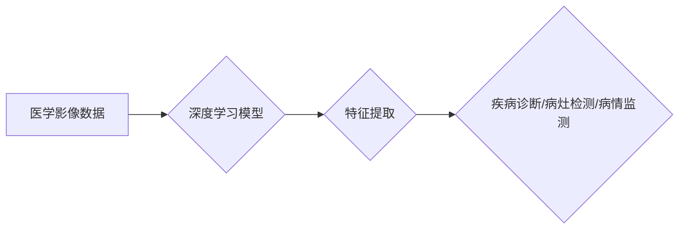

                 

## 深度学习在医学影像分析中的应用

> 关键词：深度学习、医学影像、计算机视觉、图像识别、病灶检测、诊断辅助、人工智能

## 1. 背景介绍

医学影像分析一直是医疗领域的重要研究方向，其目的是从医学影像数据中提取有价值的信息，辅助医生进行诊断、治疗和病情监测。传统医学影像分析方法主要依赖于人工特征提取和规则匹配，效率低、准确率有限。近年来，深度学习技术在计算机视觉领域取得了突破性进展，为医学影像分析带来了新的机遇。

深度学习是一种基于人工神经网络的机器学习方法，能够自动学习图像特征，并进行复杂的模式识别和预测。其强大的学习能力和泛化能力使其在医学影像分析中展现出巨大的潜力。

## 2. 核心概念与联系

### 2.1 深度学习

深度学习是机器学习的一个子领域，它使用多层神经网络来模拟人类大脑的学习过程。这些网络由多个神经元组成，每个神经元都连接到其他神经元，并通过权重进行信息传递。通过训练，网络可以学习到图像特征的层次表示，从低层次的边缘、纹理到高层次的物体、场景等。

### 2.2 医学影像

医学影像是指利用各种物理手段，如 X 射线、超声波、磁共振成像 (MRI) 和计算机断层扫描 (CT) 等，对人体内部结构进行成像的技术。这些影像数据通常是多维的，包含丰富的空间和组织信息。

### 2.3 联系

深度学习技术可以将医学影像数据作为输入，学习到图像特征，并用于各种医学影像分析任务，例如：

* **病灶检测:** 识别图像中的异常区域，例如肿瘤、骨折等。
* **疾病诊断:** 根据图像特征，辅助医生诊断疾病，例如癌症、心血管疾病等。
* **病情监测:** 跟踪疾病进展，评估治疗效果。
* **图像分割:** 将图像分割成不同的区域，例如器官、组织等。
* **图像增强:** 提高图像质量，例如清晰度、对比度等。

**Mermaid 流程图**



## 3. 核心算法原理 & 具体操作步骤

### 3.1 算法原理概述

深度学习在医学影像分析中常用的算法包括卷积神经网络 (CNN)、循环神经网络 (RNN) 和生成对抗网络 (GAN)。

* **卷积神经网络 (CNN):** CNN 擅长处理图像数据，其结构由多个卷积层、池化层和全连接层组成。卷积层通过卷积核提取图像特征，池化层降低特征维度，全连接层进行分类或回归。

* **循环神经网络 (RNN):** RNN 擅长处理序列数据，例如时间序列数据。其结构包含循环单元，能够记忆过去的输入信息，适用于处理医学影像序列数据，例如视频或动态图像。

* **生成对抗网络 (GAN):** GAN 由两个网络组成：生成器和鉴别器。生成器生成图像数据，鉴别器判断图像是否为真实数据。两者相互竞争，最终生成逼真的合成图像。

### 3.2 算法步骤详解

以 CNN 为例，其训练步骤如下：

1. **数据预处理:** 将医学影像数据进行裁剪、归一化等预处理，使其适合深度学习模型训练。
2. **模型构建:** 根据任务需求，设计 CNN 模型结构，包括卷积层、池化层和全连接层。
3. **模型训练:** 使用训练数据训练 CNN 模型，通过反向传播算法更新模型参数，使其能够准确地提取图像特征。
4. **模型评估:** 使用测试数据评估模型性能，例如准确率、召回率、F1-score 等。
5. **模型部署:** 将训练好的模型部署到实际应用场景中，例如医疗诊断系统、图像分析软件等。

### 3.3 算法优缺点

**CNN:**

* **优点:** 擅长处理图像数据，能够自动学习图像特征，准确率高。
* **缺点:** 需要大量的训练数据，训练时间长，参数量大。

**RNN:**

* **优点:** 擅长处理序列数据，能够记忆过去的输入信息，适用于处理医学影像序列数据。
* **缺点:** 训练难度高，容易出现梯度消失或爆炸问题。

**GAN:**

* **优点:** 可以生成逼真的合成图像，适用于图像增强、数据扩充等任务。
* **缺点:** 训练难度高，需要精心设计生成器和鉴别器网络。

### 3.4 算法应用领域

深度学习算法在医学影像分析领域有广泛的应用，例如：

* **肿瘤检测:** 识别肺癌、乳腺癌、脑肿瘤等。
* **心血管疾病诊断:** 诊断冠心病、心肌梗死等。
* **骨骼疾病诊断:** 诊断骨折、骨质疏松等。
* **眼科疾病诊断:** 诊断白内障、青光眼等。
* **神经影像分析:** 分析脑部结构和功能，辅助诊断神经疾病。

## 4. 数学模型和公式 & 详细讲解 & 举例说明

### 4.1 数学模型构建

深度学习模型的数学基础是神经网络，其核心是激活函数、权重和偏置。

* **激活函数:** 用于引入非线性，使神经网络能够学习复杂的模式。常见的激活函数包括 sigmoid、ReLU、tanh 等。

* **权重:** 连接神经元的参数，决定信息传递强度。

* **偏置:** 每个神经元的阈值，用于调整神经元的激活阈值。

### 4.2 公式推导过程

深度学习模型的训练过程基于梯度下降算法，其目标是最小化模型预测值与真实值的误差。

**损失函数:** 用于衡量模型预测值与真实值的差异。常见的损失函数包括均方误差 (MSE)、交叉熵损失 (Cross-Entropy Loss) 等。

**梯度下降算法:** 用于更新模型参数，使其朝着最小化损失函数的方向更新。

**公式:**

$$
\theta = \theta - \alpha \nabla L(\theta)
$$

其中：

* $\theta$ 是模型参数
* $\alpha$ 是学习率
* $\nabla L(\theta)$ 是损失函数对模型参数的梯度

### 4.3 案例分析与讲解

以 CNN 模型为例，其卷积层使用卷积核进行特征提取。卷积核是一个小的矩阵，滑动在图像上，计算每个位置的卷积结果。卷积结果可以看作是图像特征的局部表示。

**公式:**

$$
y_{i,j} = \sum_{m=0}^{M-1} \sum_{n=0}^{N-1} x_{i+m,j+n} * w_{m,n} + b
$$

其中：

* $y_{i,j}$ 是卷积结果的像素值
* $x_{i+m,j+n}$ 是输入图像的像素值
* $w_{m,n}$ 是卷积核的权重
* $b$ 是偏置项

## 5. 项目实践：代码实例和详细解释说明

### 5.1 开发环境搭建

* **操作系统:** Ubuntu 18.04
* **编程语言:** Python 3.6
* **深度学习框架:** TensorFlow 2.0
* **其他工具:** Jupyter Notebook、Git

### 5.2 源代码详细实现

```python
import tensorflow as tf

# 定义 CNN 模型
model = tf.keras.models.Sequential([
    tf.keras.layers.Conv2D(32, (3, 3), activation='relu', input_shape=(224, 224, 3)),
    tf.keras.layers.MaxPooling2D((2, 2)),
    tf.keras.layers.Conv2D(64, (3, 3), activation='relu'),
    tf.keras.layers.MaxPooling2D((2, 2)),
    tf.keras.layers.Flatten(),
    tf.keras.layers.Dense(10, activation='softmax')
])

# 编译模型
model.compile(optimizer='adam',
              loss='sparse_categorical_crossentropy',
              metrics=['accuracy'])

# 训练模型
model.fit(x_train, y_train, epochs=10)

# 评估模型
loss, accuracy = model.evaluate(x_test, y_test)
print('Test loss:', loss)
print('Test accuracy:', accuracy)
```

### 5.3 代码解读与分析

* **模型定义:** 使用 TensorFlow 的 Keras API 定义 CNN 模型，包括卷积层、池化层和全连接层。
* **模型编译:** 使用 Adam 优化器、交叉熵损失函数和准确率作为评估指标编译模型。
* **模型训练:** 使用训练数据训练模型，设置训练轮数为 10。
* **模型评估:** 使用测试数据评估模型性能，打印测试损失和准确率。

### 5.4 运行结果展示

训练完成后，可以将模型部署到实际应用场景中，例如医疗诊断系统、图像分析软件等。

## 6. 实际应用场景

深度学习在医学影像分析领域已有多种实际应用场景，例如：

* **肿瘤检测:** 

    * **肺癌检测:** 使用深度学习模型分析肺部 CT 图像，识别肺癌病灶，辅助医生进行诊断和治疗。
    * **乳腺癌检测:** 使用深度学习模型分析乳腺钼靶片图像，识别乳腺癌肿块，提高早期诊断率。

* **心血管疾病诊断:**

    * **冠心病诊断:** 使用深度学习模型分析心脏 CT 或 MRI 图像，识别冠状动脉狭窄，辅助诊断冠心病。
    * **心肌梗死诊断:** 使用深度学习模型分析心电图数据，识别心肌梗死特征，提高诊断准确率。

* **骨骼疾病诊断:**

    * **骨折诊断:** 使用深度学习模型分析 X 射线图像，识别骨折部位，辅助医生进行诊断和治疗。
    * **骨质疏松诊断:** 使用深度学习模型分析骨密度扫描图像，识别骨质疏松情况，辅助医生进行治疗方案制定。

* **眼科疾病诊断:**

    * **白内障诊断:** 使用深度学习模型分析眼底图像，识别白内障情况，辅助医生进行诊断和治疗。
    * **青光眼诊断:** 使用深度学习模型分析眼底图像，识别青光眼特征，提高早期诊断率。

### 6.4 未来应用展望

深度学习在医学影像分析领域仍有巨大的发展潜力，未来应用场景将更加广泛，例如：

* **个性化医疗:** 根据患者的影像数据，为患者制定个性化的治疗方案。
* **远程医疗:** 使用深度学习模型进行远程影像诊断，提高医疗资源的利用效率。
* **药物研发:** 使用深度学习模型分析药物对人体的影响，加速药物研发过程。

## 7. 工具和资源推荐

### 7.1 学习资源推荐

* **书籍:**
    * Deep Learning by Ian Goodfellow, Yoshua Bengio, and Aaron Courville
    * Hands-On Machine Learning with Scikit-Learn, Keras & TensorFlow by Aurélien Géron
* **在线课程:**
    * TensorFlow 官方教程: https://www.tensorflow.org/tutorials
    * Coursera 深度学习课程: https://www.coursera.org/learn/deep-learning

### 7.2 开发工具推荐

* **深度学习框架:** TensorFlow, PyTorch, Keras
* **图像处理库:** OpenCV, Pillow
* **数据可视化工具:** Matplotlib, Seaborn

### 7.3 相关论文推荐

* **AlexNet:** ImageNet Classification with Deep Convolutional Neural Networks
* **VGGNet:** Very Deep Convolutional Networks for Large-Scale Image Recognition
* **ResNet:** Deep Residual Learning for Image Recognition

## 8. 总结：未来发展趋势与挑战

### 8.1 研究成果总结

深度学习在医学影像分析领域取得了显著成果，例如：

* **提高了疾病诊断的准确率:** 深度学习模型能够识别细微的图像特征，提高疾病诊断的准确率。
* **加速了疾病诊断的速度:** 深度学习模型能够自动提取图像特征，加速疾病诊断的速度。
* **降低了疾病诊断的成本:** 深度学习模型能够自动化疾病诊断，降低了疾病诊断的成本。

### 8.2 未来发展趋势

* **模型更深、更复杂:** 研究更深、更复杂的深度学习模型，提高模型的学习能力和泛化能力。
* **数据更丰富、更多样化:** 收集更丰富、更多样化的医学影像数据，提高模型的训练质量。
* **模型解释性更强:** 研究更易于解释的深度学习模型，提高模型的可信度和可解释性。
* **临床应用更广泛:** 将深度学习模型应用到更广泛的临床场景，提高医疗服务质量。

### 8.3 面临的挑战

* **数据标注问题:** 医学影像数据标注工作量大、成本高，需要开发更有效的标注方法。
* **模型解释性问题:** 深度学习模型的决策过程难以解释，需要研究更易于解释的模型。
* **伦理问题:** 深度学习模型在医疗应用中需要考虑伦理问题，例如数据隐私、算法偏见等。

### 8.4 研究展望

未来，深度学习在医学影像分析领域将继续发展，为人类健康做出更大的贡献。


## 9. 附录：常见问题与解答

**Q1: 深度学习模型需要多少数据才能训练？**

A1: 深度学习模型需要大量的训练数据才能达到较好的性能。一般来说，需要至少几千到几百万个样本才能训练一个有效的模型。

**Q2: 深度学习模型的训练时间有多长？**

A2: 深度学习模型的训练时间取决于模型复杂度、数据量和硬件配置等因素。训练时间可以从几小时到几天甚至几周不等。

**Q3: 如何评估深度学习模型的性能？**

A3: 深度学习模型的性能可以通过准确率、召回率、F1-score 等指标进行评估。

**Q4: 深度学习模型的应用场景有哪些？**

A4: 深度学习模型在医学影像分析领域有广泛的应用场景，例如肿瘤检测、心血管疾病诊断、骨骼疾病诊断、眼科疾病诊断等。

**Q5: 深度学习模型的伦理问题有哪些？**

A5: 深度学习模型在医疗应用中需要考虑伦理问题，例如数据隐私、算法偏见等。


作者：禅与计算机程序设计艺术 / Zen and the Art of Computer Programming<end_of_turn>

