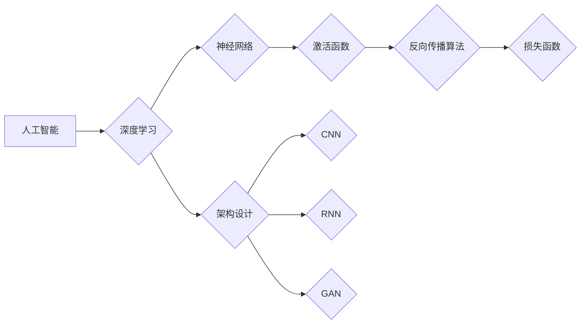

                 

## 深度思考：拉开人生差距的重要因素

> 关键词：深度学习、人工智能、算法、架构设计、代码实践、数学建模、项目实战、技术洞察、未来趋势

### 1. 背景介绍

在当今科技飞速发展的时代，人工智能（AI）正以惊人的速度改变着我们的世界。从自动驾驶汽车到智能语音助手，AI技术无处不在，并正在深刻地影响着我们的生活、工作和社会。在这个充满机遇和挑战的时代，掌握深度学习和人工智能的核心知识和技能，将成为拉开人生差距的关键因素。

然而，仅仅了解AI的概念远远不够。想要真正在这个领域取得成功，需要具备以下几个方面的深度思考能力：

* **算法原理的理解：** 深入理解深度学习算法的原理，才能更好地应用和改进这些算法。
* **架构设计的洞察：** 能够根据实际需求设计高效、可扩展的AI架构，才能构建出真正具有价值的AI系统。
* **代码实践的熟练：** 掌握编程语言和工具，能够将算法和架构转化为可运行的代码，才能将AI理念付诸实践。
* **数学建模的运用：** 能够利用数学模型和公式来描述和分析AI问题，才能更深入地理解AI背后的逻辑和原理。
* **项目实战的经验：** 通过参与实际项目，积累经验和解决问题的能力，才能将AI技术应用到实际场景中。

### 2. 核心概念与联系

深度学习是人工智能领域的一个重要分支，它利用多层神经网络来模拟人类大脑的学习过程。深度学习算法能够从海量数据中自动提取特征，并进行复杂的模式识别和预测。

**深度学习与人工智能的关系**

深度学习是人工智能的一个重要组成部分，它为人工智能提供了强大的学习和推理能力。人工智能是一个更广泛的概念，涵盖了各种智能行为，而深度学习则是其中一种实现方式。

**深度学习的核心概念**

* **神经网络：** 深度学习的核心是多层神经网络，它由多个神经元组成，每个神经元连接着其他神经元，并通过权重来传递信息。
* **激活函数：** 激活函数用于将神经元的输入转换为输出，它决定了神经网络的非线性特性。
* **反向传播算法：** 反向传播算法用于训练神经网络，它通过调整神经元的权重来最小化预测误差。
* **损失函数：** 损失函数用于衡量模型的预测误差，它指导着反向传播算法调整神经元的权重。

**深度学习架构**

深度学习的架构可以根据不同的任务和数据特点进行设计。常见的深度学习架构包括：

* **卷积神经网络（CNN）：** 用于图像识别、物体检测等任务。
* **循环神经网络（RNN）：** 用于自然语言处理、语音识别等任务。
* **生成对抗网络（GAN）：** 用于生成图像、文本等数据。

**Mermaid 流程图**



### 3. 核心算法原理 & 具体操作步骤

#### 3.1  算法原理概述

反向传播算法是深度学习训练神经网络的核心算法。它通过迭代地调整神经元的权重，来最小化模型的预测误差。

反向传播算法的基本步骤如下：

1. **前向传播：** 将输入数据通过神经网络进行前向传播，得到模型的预测输出。
2. **计算损失：** 计算模型预测输出与真实输出之间的误差，即损失函数的值。
3. **反向传播：** 从输出层开始，反向传播误差信息到输入层，并计算每个神经元的梯度。
4. **更新权重：** 根据梯度信息，更新每个神经元的权重，使模型的预测误差最小化。

#### 3.2  算法步骤详解

1. **初始化权重：** 在训练开始之前，需要对神经网络中的所有权重进行随机初始化。
2. **前向传播：** 将输入数据输入到神经网络的第一层，并通过激活函数进行处理。然后将处理后的结果传递到下一层，依次进行下去，直到得到模型的预测输出。
3. **计算损失：** 使用损失函数计算模型预测输出与真实输出之间的误差。常见的损失函数包括均方误差（MSE）、交叉熵损失等。
4. **反向传播：** 从输出层开始，计算每个神经元的梯度。梯度表示了权重变化对损失函数的影响。
5. **更新权重：** 使用梯度下降算法，根据梯度信息更新每个神经元的权重。梯度下降算法的目标是找到使损失函数最小化的权重值。
6. **重复步骤 2-5：** 将输入数据不断地输入到神经网络中，并重复前向传播、计算损失、反向传播和更新权重步骤，直到模型的预测误差达到预设的阈值。

#### 3.3  算法优缺点

**优点：**

* **能够自动提取特征：** 深度学习算法能够从海量数据中自动提取特征，无需人工特征工程。
* **性能优异：** 深度学习算法在许多任务中都取得了优异的性能，例如图像识别、自然语言处理等。
* **可扩展性强：** 深度学习算法可以很容易地扩展到更大的数据集和更复杂的模型。

**缺点：**

* **训练时间长：** 深度学习算法的训练时间通常很长，需要大量的计算资源。
* **数据依赖性强：** 深度学习算法的性能依赖于训练数据的质量和数量。
* **可解释性差：** 深度学习模型的决策过程通常难以解释，这使得其应用在一些需要透明度和可解释性的领域受到限制。

#### 3.4  算法应用领域

深度学习算法在各个领域都有广泛的应用，例如：

* **计算机视觉：** 图像识别、物体检测、图像分割、人脸识别等。
* **自然语言处理：** 机器翻译、文本摘要、情感分析、聊天机器人等。
* **语音识别：** 语音转文本、语音助手等。
* **医疗诊断：** 疾病诊断、影像分析等。
* **金融预测：** 股票预测、欺诈检测等。

### 4. 数学模型和公式 & 详细讲解 & 举例说明

#### 4.1  数学模型构建

深度学习算法的核心是神经网络，神经网络可以看作是一个复杂的数学模型。

**神经元模型：**

每个神经元可以看作是一个简单的数学函数，它接收多个输入信号，并通过权重进行加权求和，然后应用激活函数得到输出信号。

**公式：**

$$
y = f(w_1x_1 + w_2x_2 + ... + w_nx_n + b)
$$

其中：

* $y$ 是神经元的输出信号。
* $x_1, x_2, ..., x_n$ 是输入信号。
* $w_1, w_2, ..., w_n$ 是权重。
* $b$ 是偏置项。
* $f$ 是激活函数。

**神经网络模型：**

神经网络由多个神经元层组成，每一层的神经元都连接着上一层的输出神经元。

**公式：**

$$
h^{(l)} = f^{(l)}(W^{(l)}h^{(l-1)} + b^{(l)})
$$

其中：

* $h^{(l)}$ 是第 $l$ 层的隐藏层输出。
* $W^{(l)}$ 是第 $l$ 层的权重矩阵。
* $b^{(l)}$ 是第 $l$ 层的偏置向量。
* $f^{(l)}$ 是第 $l$ 层的激活函数。

#### 4.2  公式推导过程

反向传播算法的核心是计算每个神经元的梯度，并根据梯度更新权重。

**梯度计算：**

$$
\frac{\partial L}{\partial w_i} = \frac{\partial L}{\partial y} \cdot \frac{\partial y}{\partial w_i}
$$

其中：

* $L$ 是损失函数。
* $w_i$ 是第 $i$ 个权重。

**权重更新：**

$$
w_i = w_i - \eta \cdot \frac{\partial L}{\partial w_i}
$$

其中：

* $\eta$ 是学习率。

#### 4.3  案例分析与讲解

**举例说明：**

假设我们有一个简单的线性回归问题，目标是预测房价。我们使用一个单层神经网络，输入特征是房屋面积，输出是房价。

**模型：**

$$
y = f(w_1x_1 + b)
$$

其中：

* $y$ 是房价预测值。
* $x_1$ 是房屋面积。
* $w_1$ 是权重。
* $b$ 是偏置项。
* $f$ 是线性激活函数。

**损失函数：**

$$
L = \frac{1}{2} \sum_{i=1}^{n} (y_i - \hat{y}_i)^2
$$

其中：

* $y_i$ 是第 $i$ 个样本的真实房价。
* $\hat{y}_i$ 是第 $i$ 个样本的预测房价。

**反向传播算法：**

1. **前向传播：** 将房屋面积输入到神经网络中，得到房价预测值。
2. **计算损失：** 计算预测房价与真实房价之间的均方误差。
3. **反向传播：** 计算每个神经元的梯度，包括权重 $w_1$ 和偏置项 $b$。
4. **更新权重：** 根据梯度信息更新权重 $w_1$ 和偏置项 $b$。
5. **重复步骤 1-4：** 迭代地进行前向传播、计算损失、反向传播和更新权重，直到损失函数达到最小值。

### 5. 项目实践：代码实例和详细解释说明

#### 5.1  开发环境搭建

为了进行深度学习项目实践，需要搭建一个合适的开发环境。常见的开发环境包括：

* **Python:** 深度学习的编程语言。
* **TensorFlow/PyTorch:** 深度学习框架。
* **GPU:** 加速深度学习训练的硬件。

#### 5.2  源代码详细实现

以下是一个使用 TensorFlow 实现简单的线性回归模型的代码示例：

```python
import tensorflow as tf

# 定义模型
model = tf.keras.Sequential([
    tf.keras.layers.Dense(units=1, input_shape=[1])
])

# 定义损失函数和优化器
model.compile(loss='mean_squared_error', optimizer='adam')

# 训练模型
model.fit(x_train, y_train, epochs=100)

# 预测房价
predictions = model.predict(x_test)
```

#### 5.3  代码解读与分析

* **定义模型：** 使用 `tf.keras.Sequential` 创建一个线性回归模型，包含一个全连接层。
* **定义损失函数和优化器：** 使用 `mean_squared_error` 作为损失函数，`adam` 作为优化器。
* **训练模型：** 使用 `model.fit` 方法训练模型，输入训练数据 `x_train` 和 `y_train`，训练 100 个 epochs。
* **预测房价：** 使用 `model.predict` 方法预测测试数据 `x_test` 的房价。

#### 5.4  运行结果展示

训练完成后，可以评估模型的性能，例如使用测试数据计算均方误差。

### 6. 实际应用场景

深度学习技术在各个领域都有广泛的应用，例如：

* **医疗诊断：** 使用深度学习算法分析医学影像，辅助医生诊断疾病。
* **金融预测：** 使用深度学习算法预测股票价格、识别欺诈交易等。
* **自动驾驶：** 使用深度学习算法识别道路场景、预测车辆运动等。
* **自然语言处理：** 使用深度学习算法进行机器翻译、文本摘要、情感分析等。

### 6.4  未来应用展望

未来，深度学习技术将继续发展，并应用于更多领域。例如：

* **个性化推荐：** 使用深度学习算法分析用户的行为数据，提供个性化的商品推荐。
* **智能客服：** 使用深度学习算法构建智能客服系统，自动回答用户问题。
* **药物研发：** 使用深度学习算法加速药物研发过程。

### 7. 工具和资源推荐

#### 7.1  学习资源推荐

* **书籍：**
    * 深度学习
    * 构建深度学习模型
* **在线课程：**
    * Coursera 深度学习课程
    * Udacity 深度学习工程师 Nanodegree
* **博客和网站：**
    * TensorFlow 官方博客
    * PyTorch 官方博客
    * deeplearning.ai

#### 7.2  开发工具推荐

* **TensorFlow:** 开源深度学习框架。
* **PyTorch:** 开源深度学习框架。
* **Keras:** 高级深度学习API，可以运行在 TensorFlow、Theano 或 CNTK 后端。

#### 7.3  相关论文推荐

* **ImageNet Classification with Deep Convolutional Neural Networks**
* **Attention Is All You Need**
* **Generative Adversarial Nets**

### 8. 总结：未来发展趋势与挑战

#### 8.1  研究成果总结

深度学习技术取得了令人瞩目的成就，在图像识别、自然语言处理、语音识别等领域取得了突破性的进展。

#### 8.2  未来发展趋势

* **模型规模和复杂度提升：** 未来深度学习模型将更加庞大，更加复杂，能够处理更复杂的任务。
* **算法效率提升：** 研究人员将继续探索更有效的深度学习算法，降低训练时间和计算资源需求。
* **解释性和可信度提升：** 研究人员将致力于提高深度学习模型的解释性和可信度，使其能够更好地应用于需要透明度和可解释性的领域。

#### 8.3  面临的挑战

* **数据获取和标注：** 深度学习算法依赖于海量数据，获取和标注高质量数据仍然是一个挑战。
* **计算资源需求：** 训练大型深度学习模型需要大量的计算资源，这对于资源有限的机构和个人来说是一个障碍。
* **伦理和社会影响：** 深度学习技术的发展也带来了伦理和社会问题，例如算法偏见、隐私泄露等，需要引起重视和解决。

#### 8.4  研究展望

未来，深度学习技术将继续发展，并对我们的生活产生更深远的影响。我们需要积极探索深度学习技术的应用，并关注其潜在的风险和挑战，以确保深度学习技术能够造福人类。

### 9. 附录：常见问题与解答

**常见问题：**

* **什么是深度学习？**

深度学习是一种机器学习的子领域，它利用多层神经网络来模拟人类大脑的学习过程。

* **深度学习有什么应用？**

深度学习在各个领域都有广泛的应用，例如图像识别、自然语言处理、语音识别、医疗诊断、金融预测等。

* **如何学习深度学习？**

可以通过阅读书籍、在线课程、博客和网站等方式学习深度学习。

* **深度学习需要哪些工具？**

常见的深度学习工具包括 TensorFlow、PyTorch、Keras 等。

* **深度学习有哪些挑战？**

深度学习面临着数据获取、计算资源、伦理和社会影响等挑战。


作者：禅与计算机程序设计艺术 / Zen and the Art of Computer Programming<end_of_turn>

