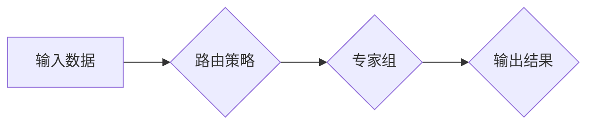

                 

## 混合专家模型（MoE）：AI的下一个前沿

> 关键词：混合专家模型，MoE，大规模语言模型，参数效率，模型架构，专家组，路由策略

### 1. 背景介绍

近年来，深度学习在人工智能领域取得了显著进展，尤其是大规模语言模型（LLM）的出现，例如GPT-3、BERT等，展现了强大的文本理解和生成能力。然而，这些模型通常拥有数亿甚至数十亿的参数，训练和部署成本极高，对硬件资源要求也十分苛刻。如何提高模型的效率和可扩展性，是当前人工智能研究的重要课题。

混合专家模型（MoE）应运而生，它是一种新的模型架构，旨在通过将多个小型专家模型组合起来，实现参数高效的大规模模型训练和推理。MoE模型的核心思想是将输入数据路由到最合适的专家模型进行处理，从而提高模型的整体性能，同时降低模型参数量和计算成本。

### 2. 核心概念与联系

MoE模型的核心概念是将一个大型模型拆分成多个小型专家模型，每个专家模型专注于处理特定类型的任务或数据。这些专家模型在训练过程中共享相同的参数，但只在路由到其对应的输入数据时才会被激活。

**MoE模型架构**



**核心概念解释:**

* **输入数据:**  指需要进行处理的文本数据。
* **路由策略:**  根据输入数据特征，将数据路由到最合适的专家模型。常见的路由策略包括线性路由、加权路由、基于嵌入的路由等。
* **专家组:**  由多个小型专家模型组成，每个专家模型负责处理特定类型的任务或数据。
* **输出结果:**  由专家模型处理后的结果，经过融合或聚合得到最终的输出。

### 3. 核心算法原理 & 具体操作步骤

#### 3.1  算法原理概述

MoE模型的核心算法原理是将大型模型拆分成多个小型专家模型，并通过路由策略将输入数据路由到最合适的专家模型进行处理。

**主要步骤:**

1. **专家模型训练:**  将大型模型拆分成多个小型专家模型，每个专家模型分别进行训练。
2. **路由策略设计:**  设计路由策略，根据输入数据特征，将数据路由到最合适的专家模型。
3. **模型推理:**  将输入数据路由到专家模型，由专家模型进行处理，最终得到输出结果。

#### 3.2  算法步骤详解

1. **数据预处理:**  对输入数据进行预处理，例如分词、词嵌入等。
2. **路由策略选择:**  根据任务需求和数据特征，选择合适的路由策略。
3. **专家模型选择:**  根据路由策略，选择最合适的专家模型进行处理。
4. **专家模型推理:**  将数据输入到选中的专家模型，进行推理得到输出结果。
5. **结果融合:**  将多个专家模型的输出结果进行融合或聚合，得到最终的输出结果。

#### 3.3  算法优缺点

**优点:**

* **参数效率:**  相比于大型单一模型，MoE模型可以显著降低参数量，从而降低训练和部署成本。
* **可扩展性:**  MoE模型可以轻松扩展到更大的规模，只需增加专家模型的数量即可。
* **任务特化:**  每个专家模型可以专注于处理特定类型的任务，从而提高模型的性能。

**缺点:**

* **路由策略设计:**  路由策略的设计对模型性能至关重要，需要根据具体任务和数据特征进行精心设计。
* **训练复杂度:**  MoE模型的训练复杂度较高，需要协调多个专家模型的训练过程。
* **推理延迟:**  由于需要进行路由决策，MoE模型的推理延迟可能比单一模型稍高。

#### 3.4  算法应用领域

MoE模型在自然语言处理、计算机视觉、推荐系统等领域具有广泛的应用前景。

* **自然语言处理:**  用于文本分类、情感分析、机器翻译等任务。
* **计算机视觉:**  用于图像识别、目标检测、图像分割等任务。
* **推荐系统:**  用于个性化推荐、商品搜索等任务。

### 4. 数学模型和公式 & 详细讲解 & 举例说明

#### 4.1  数学模型构建

MoE模型可以看作是一个多层神经网络，其中每一层都包含多个专家模型。每个专家模型是一个小型神经网络，负责处理特定类型的输入数据。

**数学模型表示:**

*  $x$：输入数据
*  $s_i$：第 $i$ 个专家模型的输出
*  $w_i$：第 $i$ 个专家模型的权重
*  $f_i$：第 $i$ 个专家模型的激活函数

**模型输出:**

$y = \sum_{i=1}^{N} w_i * f_i(x)$

其中，$N$ 是专家模型的数量。

#### 4.2  公式推导过程

MoE模型的训练目标是最大化模型输出与真实标签之间的相似度。可以使用交叉熵损失函数来衡量模型的性能。

**交叉熵损失函数:**

$L = -\sum_{i=1}^{M} y_i * log(p_i)$

其中，$M$ 是样本数量，$y_i$ 是真实标签，$p_i$ 是模型预测的概率。

#### 4.3  案例分析与讲解

假设我们有一个文本分类任务，需要将文本分类为正向情感和负向情感。我们可以使用MoE模型将大型模型拆分成两个专家模型，分别负责处理正向情感和负向情感的文本。

在训练过程中，每个专家模型都会学习到处理其对应情感类型的文本特征。在推理过程中，根据输入文本的特征，路由策略会将文本路由到最合适的专家模型进行处理，从而得到最终的分类结果。

### 5. 项目实践：代码实例和详细解释说明

#### 5.1  开发环境搭建

MoE模型的开发环境搭建需要以下软件和工具:

* Python 3.x
* TensorFlow 或 PyTorch 深度学习框架
* CUDA 和 cuDNN GPU加速库

#### 5.2  源代码详细实现

以下是一个简单的MoE模型的代码实现示例，使用 TensorFlow 框架:

```python
import tensorflow as tf

# 定义专家模型
class ExpertModel(tf.keras.Model):
    def __init__(self, units):
        super(ExpertModel, self).__init__()
        self.dense1 = tf.keras.layers.Dense(units, activation='relu')
        self.dense2 = tf.keras.layers.Dense(1, activation='sigmoid')

    def call(self, inputs):
        x = self.dense1(inputs)
        return self.dense2(x)

# 定义路由策略
def routing_strategy(inputs, num_experts):
    # 使用线性路由策略
    return tf.math.mod(tf.range(tf.shape(inputs)[0]), num_experts)

# 定义MoE模型
class MoEModel(tf.keras.Model):
    def __init__(self, num_experts, units):
        super(MoEModel, self).__init__()
        self.experts = [ExpertModel(units) for _ in range(num_experts)]
        self.routing_strategy = routing_strategy

    def call(self, inputs):
        expert_indices = self.routing_strategy(inputs, len(self.experts))
        expert_outputs = [expert(inputs) for expert, index in zip(self.experts, expert_indices)]
        return tf.reduce_mean(expert_outputs, axis=0)

# 实例化MoE模型
model = MoEModel(num_experts=4, units=128)

# 训练模型
# ...

# 推理模型
# ...
```

#### 5.3  代码解读与分析

* **专家模型:**  `ExpertModel` 类定义了每个专家模型的结构，包含两层全连接神经网络。
* **路由策略:**  `routing_strategy` 函数定义了路由策略，这里使用的是线性路由策略，将输入数据均匀地分配到不同的专家模型。
* **MoE模型:**  `MoEModel` 类定义了MoE模型的结构，包含多个专家模型和路由策略。在 `call` 方法中，根据路由策略选择合适的专家模型进行处理，并将多个专家模型的输出进行平均。

#### 5.4  运行结果展示

MoE模型的运行结果可以通过评估指标，例如准确率、F1-score等来衡量。

### 6. 实际应用场景

MoE模型在实际应用场景中展现出强大的潜力，例如:

* **个性化推荐:**  MoE模型可以根据用户的历史行为和偏好，将用户路由到最合适的专家模型，从而提供更个性化的推荐结果。
* **医疗诊断:**  MoE模型可以将患者的症状和病史路由到不同的专家模型，例如神经专家、心血管专家等，从而辅助医生进行诊断。
* **金融风险评估:**  MoE模型可以根据用户的财务状况和交易行为，路由到不同的专家模型，例如信用风险专家、欺诈风险专家等，从而进行更精准的风险评估。

#### 6.4  未来应用展望

MoE模型在未来将有更广泛的应用前景，例如:

* **多模态学习:**  MoE模型可以将文本、图像、音频等多模态数据路由到不同的专家模型，从而实现更全面的信息理解。
* **自适应学习:**  MoE模型可以根据输入数据的特征动态调整路由策略，从而实现更自适应的学习能力。
* **边缘计算:**  MoE模型可以部署在边缘设备上，实现更轻量级的推理和决策。

### 7. 工具和资源推荐

#### 7.1  学习资源推荐

* **论文:**  
    * "Mixture of Experts" by  Jacobs et al. (1991)
    * "Scaling Language Modeling with Mixture-of-Experts" by Google AI (2020)
* **博客:**  
    * https://ai.googleblog.com/2020/06/scaling-language-modeling-with.html
    * https://towardsdatascience.com/mixture-of-experts-in-deep-learning-a-comprehensive-guide-a86486609998

#### 7.2  开发工具推荐

* **TensorFlow:**  https://www.tensorflow.org/
* **PyTorch:**  https://pytorch.org/

#### 7.3  相关论文推荐

* **MoE论文:**  https://arxiv.org/abs/2006.04808
* **其他相关论文:**  https://arxiv.org/search/?query=mixture+of+experts&searchtype=all&source=header

### 8. 总结：未来发展趋势与挑战

#### 8.1  研究成果总结

MoE模型在参数效率、可扩展性和任务特化方面取得了显著的进展，为大规模模型的训练和部署提供了新的思路。

#### 8.2  未来发展趋势

* **路由策略优化:**  研究更有效的路由策略，例如基于注意力机制的路由策略、动态路由策略等。
* **专家模型设计:**  设计更强大的专家模型，例如Transformer-based专家模型、自适应专家模型等。
* **多模态MoE:**  将MoE模型扩展到多模态数据，实现更全面的信息理解。

#### 8.3  面临的挑战

* **训练复杂度:**  MoE模型的训练复杂度较高，需要更有效的训练算法和硬件资源。
* **路由策略设计:**  路由策略的设计对模型性能至关重要，需要更深入的研究和探索。
* **可解释性:**  MoE模型的决策过程相对复杂，需要提高模型的可解释性。

#### 8.4  研究展望

MoE模型作为一种新兴的模型架构，未来发展潜力巨大。随着研究的深入，MoE模型将更加高效、强大、可解释，并在更多领域得到应用。

### 9. 附录：常见问题与解答

* **MoE模型与Ensemble模型有什么区别？**

MoE模型和Ensemble模型都是将多个模型组合起来进行预测的，但MoE模型在训练过程中共享参数，而Ensemble模型每个模型独立训练。

* **MoE模型的路由策略如何设计？**

路由策略的设计需要根据具体任务和数据特征进行选择，常见的路由策略包括线性路由、加权路由、基于嵌入的路由等。

* **MoE模型的训练复杂度如何降低？**

可以通过使用分布式训练、模型剪枝等技术来降低MoE模型的训练复杂度。


作者：禅与计算机程序设计艺术 / Zen and the Art of Computer Programming 
<end_of_turn>

