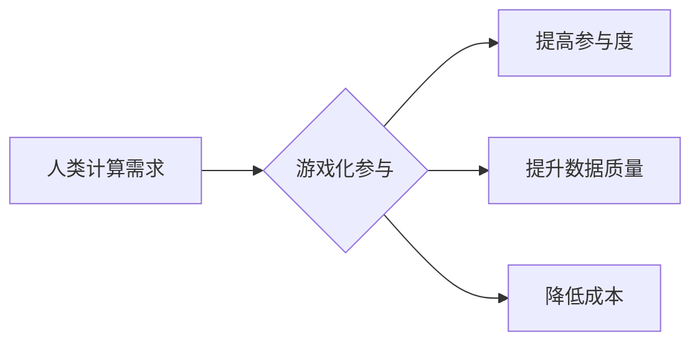

                 

# 游戏化参与：提升人类计算的趣味性

> 关键词：游戏化、人类计算、参与度、趣味性、算法、数据标注、人工智能

## 1. 背景介绍

随着人工智能技术的飞速发展，人类计算的需求也日益增长。从图像识别到自然语言处理，从药物研发到金融预测，人工智能算法都需要海量的数据进行训练和测试。然而，传统的收集和标注数据方式往往耗时费力，效率低下，难以满足快速发展的需求。

为了解决这一问题，游戏化参与模式逐渐成为一种备受关注的解决方案。游戏化参与是指利用游戏机制和元素，激发人们的参与热情，从而有效地收集和标注数据。这种模式能够将枯燥乏味的计算任务转化为有趣的游戏体验，提高参与者的积极性和效率。

## 2. 核心概念与联系

### 2.1 游戏化参与的核心概念

游戏化参与的核心概念包括：

* **游戏机制:**  借鉴游戏中的规则、奖励、竞争等机制，激发参与者的兴趣和动力。
* **趣味性:**  通过设计有趣的游戏任务和体验，提升参与者的参与度和粘性。
* **反馈机制:**  及时提供参与者的表现反馈，帮助他们了解自己的进度和成果，并不断改进。
* **社会化:**  鼓励参与者之间互动交流，形成社区氛围，增强参与者的归属感和参与热情。

### 2.2 人类计算与游戏化参与的联系

游戏化参与模式能够有效地提升人类计算的效率和质量，主要体现在以下几个方面：

* **提高参与度:**  游戏化的趣味性能够吸引更多人参与到数据标注和计算任务中，扩大数据收集的范围。
* **提升数据质量:**  游戏化的反馈机制能够帮助参与者不断改进自己的标注和计算精度，提高数据质量。
* **降低成本:**  游戏化参与模式能够有效地降低数据标注和计算的成本，提高资源利用效率。

**Mermaid 流程图:**



## 3. 核心算法原理 & 具体操作步骤

### 3.1 算法原理概述

游戏化参与模式通常采用一些算法来设计游戏任务、分配奖励、管理参与者等。常见的算法包括：

* **行为激励算法:**  根据参与者的行为，如完成任务、获得分数、帮助他人等，分配相应的奖励。
* **任务分配算法:**  根据参与者的技能水平、兴趣偏好等，分配合适的任务，提高任务完成效率。
* **社区管理算法:**  促进参与者之间互动交流，构建良好的社区氛围。

### 3.2 算法步骤详解

**行为激励算法:**

1. **定义行为指标:**  确定哪些行为值得奖励，例如完成任务、获得高分、帮助他人等。
2. **设定奖励机制:**  根据行为指标，设计相应的奖励，例如积分、虚拟物品、实物奖励等。
3. **分配奖励:**  根据参与者的行为记录，实时分配奖励。
4. **反馈奖励:**  及时向参与者反馈奖励信息，增强参与者的积极性。

**任务分配算法:**

1. **收集参与者信息:**  收集参与者的技能水平、兴趣偏好、可用时间等信息。
2. **分析任务需求:**  分析任务的难度、类型、所需技能等信息。
3. **匹配任务和参与者:**  根据参与者信息和任务需求，匹配合适的任务。
4. **动态调整任务分配:**  根据参与者的表现和任务进度，动态调整任务分配。

### 3.3 算法优缺点

**行为激励算法:**

* **优点:**  能够有效地激发参与者的积极性，提高任务完成效率。
* **缺点:**  容易导致参与者过度追求奖励，忽视任务本身的价值。

**任务分配算法:**

* **优点:**  能够根据参与者的能力和兴趣，分配合适的任务，提高任务完成质量。
* **缺点:**  需要收集和分析大量参与者信息，算法设计较为复杂。

### 3.4 算法应用领域

游戏化参与模式和相关算法广泛应用于以下领域:

* **数据标注:**  利用游戏化参与模式，收集和标注图像、文本、音频等数据，为人工智能算法提供训练数据。
* **科学计算:**  利用游戏化参与模式，解决复杂的科学计算问题，例如蛋白质折叠、药物设计等。
* **教育培训:**  利用游戏化参与模式，提高学生的学习兴趣和参与度，例如编程教育、科学实验等。

## 4. 数学模型和公式 & 详细讲解 & 举例说明

### 4.1 数学模型构建

游戏化参与模式的数学模型通常基于行为经济学和激励机制理论。

**行为经济学模型:**  

该模型假设参与者是理性的，但他们的决策受到认知偏差和情绪的影响。

**激励机制模型:**  

该模型分析参与者对奖励的敏感度、风险偏好等因素，设计相应的激励机制。

### 4.2 公式推导过程

**奖励函数:**

$$R(a) = \alpha * f(a) + \beta * g(a)$$

其中:

* $R(a)$ 是参与者获得的奖励，
* $a$ 是参与者的行为，
* $\alpha$ 和 $\beta$ 是权重系数，
* $f(a)$ 是行为的直接收益，
* $g(a)$ 是行为的间接收益，例如社会认可、成就感等。

**参与度模型:**

$$P(t) = \gamma * R(t) + \delta * S(t)$$

其中:

* $P(t)$ 是参与者在时间 $t$ 的参与度，
* $R(t)$ 是参与者在时间 $t$ 获得的奖励，
* $S(t)$ 是参与者在时间 $t$ 的社会互动程度，
* $\gamma$ 和 $\delta$ 是权重系数。

### 4.3 案例分析与讲解

**案例:**  

一个图像标注平台利用游戏化参与模式，设计了以下奖励机制:

* 完成一个图像标注任务，获得 10 分。
* 帮助其他用户解答问题，获得 5 分。
* 参与社区讨论，获得 2 分。

**分析:**  

该平台的奖励机制结合了直接收益和间接收益，能够有效地激发参与者的积极性。

## 5. 项目实践：代码实例和详细解释说明

### 5.1 开发环境搭建

* **操作系统:**  Windows/macOS/Linux
* **编程语言:**  Python
* **框架:**  Flask/Django
* **数据库:**  MySQL/PostgreSQL
* **工具:**  Git、Docker

### 5.2 源代码详细实现

```python
# Flask 应用示例

from flask import Flask, render_template, request

app = Flask(__name__)

# 模拟用户数据
users = {
    "user1": {"score": 0, "level": 1},
    "user2": {"score": 50, "level": 3},
}

@app.route('/')
def index():
    return render_template('index.html')

@app.route('/task', methods=['POST'])
def task():
    user_id = request.form.get('user_id')
    task_id = request.form.get('task_id')
    # 处理任务逻辑，例如更新用户分数
    users[user_id]['score'] += 10
    return '任务完成！'

if __name__ == '__main__':
    app.run(debug=True)
```

### 5.3 代码解读与分析

* **Flask 应用:**  代码使用 Flask 框架构建了一个简单的 Web 应用。
* **用户数据:**  `users` 字典模拟用户数据，包括用户 ID、分数和等级。
* **任务处理:**  `/task` 路由处理用户完成任务的请求，更新用户分数。

### 5.4 运行结果展示

运行代码后，访问 `http://127.0.0.1:5000/`，即可看到游戏化参与平台的首页。用户可以通过提交任务表单来完成任务，并获得相应的奖励。

## 6. 实际应用场景

### 6.1 数据标注平台

游戏化参与模式可以应用于数据标注平台，例如：

* **图像标注:**  设计游戏任务，让用户标注图像中的物体、场景等信息。
* **文本标注:**  设计游戏任务，让用户标注文本中的情感、主题、实体等信息。
* **语音标注:**  设计游戏任务，让用户标注语音中的说话人、语调、情感等信息。

### 6.2 科学计算平台

游戏化参与模式可以应用于科学计算平台，例如：

* **蛋白质折叠:**  设计游戏任务，让用户帮助预测蛋白质的折叠结构。
* **药物设计:**  设计游戏任务，让用户帮助筛选潜在的药物候选物。
* **气候模型:**  设计游戏任务，让用户帮助模拟气候变化的趋势。

### 6.3 教育培训平台

游戏化参与模式可以应用于教育培训平台，例如：

* **编程教育:**  设计游戏任务，让学生学习编程知识和技能。
* **科学实验:**  设计游戏任务，让学生进行虚拟科学实验，探索科学原理。
* **历史文化:**  设计游戏任务，让学生学习历史文化知识，体验历史场景。

### 6.4 未来应用展望

随着人工智能技术的不断发展，游戏化参与模式将有更广泛的应用场景，例如：

* **自动驾驶:**  利用游戏化参与模式，收集和标注自动驾驶数据，提高自动驾驶系统的安全性。
* **医疗诊断:**  利用游戏化参与模式，收集和标注医学影像数据，提高医疗诊断的准确性。
* **金融风险管理:**  利用游戏化参与模式，收集和分析金融数据，提高金融风险管理的效率。

## 7. 工具和资源推荐

### 7.1 学习资源推荐

* **书籍:**  《游戏化设计》
* **网站:**  Gamification.co, The Gamification Research Network
* **课程:**  Coursera, edX

### 7.2 开发工具推荐

* **游戏引擎:**  Unity, Unreal Engine
* **Web 开发框架:**  Flask, Django
* **数据标注工具:**  Labelbox, Amazon Mechanical Turk

### 7.3 相关论文推荐

* **《Gamification in Education: A Systematic Review》**
* **《The Gamification of Learning and Instruction》**
* **《Using Gamification to Improve Human Computation》**

## 8. 总结：未来发展趋势与挑战

### 8.1 研究成果总结

游戏化参与模式已经取得了一定的成果，在数据标注、科学计算、教育培训等领域得到了广泛应用。

### 8.2 未来发展趋势

* **更个性化的游戏体验:**  根据用户的不同需求和喜好，设计更个性化的游戏任务和奖励机制。
* **更智能化的游戏系统:**  利用人工智能技术，开发更智能的游戏系统，能够自动调整游戏难度和奖励机制。
* **更广泛的应用场景:**  将游戏化参与模式应用到更多领域，例如自动驾驶、医疗诊断、金融风险管理等。

### 8.3 面临的挑战

* **如何设计更有效的激励机制:**  需要深入研究用户的行为动机，设计更有效的激励机制，避免过度追求奖励。
* **如何保证数据质量:**  需要开发更严格的数据标注标准和审核机制，保证数据质量。
* **如何应对伦理问题:**  需要关注游戏化参与模式的伦理问题，例如数据隐私、公平性等。

### 8.4 研究展望

未来，游戏化参与模式将继续发展，成为人工智能时代的重要组成部分。需要进一步研究和探索，使其更有效、更智能、更公平，为人类计算的发展做出更大的贡献。

## 9. 附录：常见问题与解答

**Q1: 游戏化参与模式的成本如何?**

**A1:**  游戏化参与模式的成本取决于具体的设计和实施方案。一般来说，相对于传统的数据标注方式，游戏化参与模式的成本更低，并且可以提高数据质量，最终降低整体成本。

**Q2: 如何保证数据标注的准确性?**

**A2:**  需要制定严格的数据标注标准和审核机制，并对参与者进行培训和考核，确保数据标注的准确性。

**Q3: 游戏化参与模式的伦理问题有哪些?**

**A3:**  游戏化参与模式可能涉及数据隐私、公平性等伦理问题，需要认真考虑和解决。


作者：禅与计算机程序设计艺术 / Zen and the Art of Computer Programming 
<end_of_turn>

