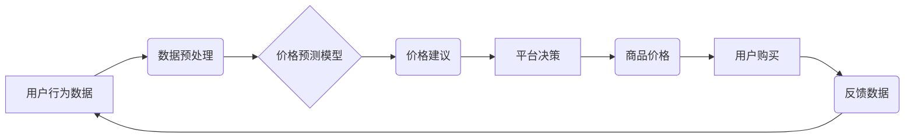

                 

## 电商平台中的AI智能定价系统设计与实现

> 关键词：电商平台、AI智能定价、机器学习、价格预测、市场分析、动态定价、优化算法

## 1. 背景介绍

在当今激烈的电商市场竞争中，定价策略对电商平台的成功至关重要。传统的定价方法往往依赖于人工经验和市场调研，缺乏灵活性、精准性和数据驱动性。随着人工智能技术的快速发展，AI智能定价系统应运而生，为电商平台提供了更智能、高效、精准的定价解决方案。

AI智能定价系统利用机器学习算法分析海量商品数据、市场趋势和用户行为，并根据这些数据进行预测和优化，从而实现动态调整商品价格，最大化平台利润和用户满意度。

## 2. 核心概念与联系

**2.1 核心概念**

* **智能定价:** 利用人工智能技术，根据实时数据和市场分析，自动调整商品价格，以实现利润最大化和用户体验优化。
* **机器学习:** 一种人工智能技术，通过算法训练，使系统能够从数据中学习并做出预测或决策。
* **价格预测:** 利用历史数据和市场趋势，预测未来商品价格走势。
* **市场分析:** 分析市场竞争、用户需求、商品供需等因素，为定价决策提供参考。
* **动态定价:** 根据实时数据变化，动态调整商品价格，以适应市场需求和竞争环境。

**2.2 架构图**



**2.3 核心联系**

AI智能定价系统通过收集用户行为数据、市场数据和商品信息，进行数据预处理和特征提取，然后利用机器学习模型进行价格预测。根据预测结果和平台策略，系统生成价格建议，最终由平台决策者进行调整，最终实现商品价格的动态调整。

## 3. 核心算法原理 & 具体操作步骤

**3.1 算法原理概述**

AI智能定价系统常用的算法包括：

* **线性回归:** 用于预测商品价格与相关因素之间的线性关系。
* **逻辑回归:** 用于预测商品是否会被购买，以及购买概率。
* **决策树:** 用于根据商品特征和市场条件，构建决策规则，预测价格。
* **支持向量机:** 用于在高维特征空间中寻找最佳价格分割超平面，实现价格预测。
* **神经网络:** 用于学习复杂非线性关系，实现更精准的价格预测。

**3.2 算法步骤详解**

1. **数据收集:** 收集商品信息、市场数据、用户行为数据等。
2. **数据预处理:** 清洗、转换、归一化数据，使其适合模型训练。
3. **特征工程:** 从原始数据中提取特征，例如商品属性、价格历史、市场趋势等。
4. **模型选择:** 根据数据特点和需求选择合适的机器学习算法。
5. **模型训练:** 利用训练数据训练模型，并进行参数调优。
6. **模型评估:** 利用测试数据评估模型性能，例如准确率、召回率等。
7. **价格预测:** 利用训练好的模型预测未来商品价格。
8. **价格建议:** 根据预测结果和平台策略，生成价格建议。
9. **平台决策:** 平台决策者根据价格建议进行最终价格调整。

**3.3 算法优缺点**

| 算法 | 优点 | 缺点 |
|---|---|---|
| 线性回归 | 简单易实现，解释性强 | 只能处理线性关系，对异常值敏感 |
| 逻辑回归 | 适合二分类问题，解释性强 | 只能处理线性关系，对非线性关系处理能力弱 |
| 决策树 | 可解释性强，处理非线性关系能力强 | 容易过拟合，对数据噪声敏感 |
| 支持向量机 | 对高维数据处理能力强，泛化能力强 | 计算复杂度高，参数调优困难 |
| 神经网络 | 处理非线性关系能力强，学习能力强 | 训练时间长，参数众多，解释性弱 |

**3.4 算法应用领域**

AI智能定价算法广泛应用于电商平台、旅游平台、金融平台等领域，例如：

* **商品定价:** 根据商品属性、市场需求、竞争对手价格等因素，自动调整商品价格。
* **促销定价:** 根据促销活动目标，制定差异化价格策略。
* **会员定价:** 根据会员等级和消费习惯，提供个性化价格优惠。
* **动态定价:** 根据实时市场变化，动态调整价格，例如航班票价、酒店房价等。

## 4. 数学模型和公式 & 详细讲解 & 举例说明

**4.1 数学模型构建**

AI智能定价系统常用的数学模型包括线性回归模型、逻辑回归模型、决策树模型等。

**4.1.1 线性回归模型**

线性回归模型假设商品价格与相关因素之间存在线性关系，可以用以下公式表示：

$$
P = \beta_0 + \beta_1 X_1 + \beta_2 X_2 + ... + \beta_n X_n + \epsilon
$$

其中：

* $P$ 是商品价格
* $X_1, X_2, ..., X_n$ 是相关因素，例如商品属性、市场需求、竞争对手价格等
* $\beta_0, \beta_1, ..., \beta_n$ 是模型参数，需要通过训练数据进行估计
* $\epsilon$ 是误差项

**4.1.2 逻辑回归模型**

逻辑回归模型用于预测商品是否会被购买，以及购买概率。模型输出是一个介于0和1之间的概率值，表示商品被购买的可能性。

$$
P(购买) = \frac{1}{1 + e^{-( \beta_0 + \beta_1 X_1 + \beta_2 X_2 + ... + \beta_n X_n)}}
$$

其中：

* $P(购买)$ 是商品被购买的概率
* $X_1, X_2, ..., X_n$ 是相关因素，例如用户特征、商品属性、购买历史等
* $\beta_0, \beta_1, ..., \beta_n$ 是模型参数，需要通过训练数据进行估计

**4.2 公式推导过程**

线性回归模型和逻辑回归模型的公式推导过程比较复杂，需要涉及到概率论、统计学和微积分等知识。

**4.3 案例分析与讲解**

假设我们想要预测电商平台上某款商品的价格，我们可以使用线性回归模型。

* **相关因素:** 商品属性（例如品牌、型号、颜色）、市场需求（例如搜索量、评论数）、竞争对手价格等。
* **训练数据:** 收集历史商品价格和相关因素的数据。
* **模型训练:** 利用训练数据训练线性回归模型，估计模型参数。
* **价格预测:** 利用训练好的模型，输入新的商品属性、市场需求和竞争对手价格数据，预测商品价格。

## 5. 项目实践：代码实例和详细解释说明

**5.1 开发环境搭建**

* 操作系统：Windows/macOS/Linux
* Python 版本：3.6+
* 必要的库：pandas, numpy, scikit-learn, matplotlib

**5.2 源代码详细实现**

```python
import pandas as pd
from sklearn.linear_model import LinearRegression
from sklearn.model_selection import train_test_split
from sklearn.metrics import mean_squared_error

# 1. 数据加载
data = pd.read_csv('商品价格数据.csv')

# 2. 数据预处理
# ...

# 3. 特征工程
X = data[['品牌', '型号', '颜色', '搜索量', '评论数', '竞争对手价格']]
y = data['价格']

# 4. 数据分割
X_train, X_test, y_train, y_test = train_test_split(X, y, test_size=0.2, random_state=42)

# 5. 模型训练
model = LinearRegression()
model.fit(X_train, y_train)

# 6. 模型评估
y_pred = model.predict(X_test)
mse = mean_squared_error(y_test, y_pred)
print(f'均方误差: {mse}')

# 7. 价格预测
new_data = pd.DataFrame({
    '品牌': ['品牌A'],
    '型号': ['型号B'],
    '颜色': ['红色'],
    '搜索量': [1000],
    '评论数': [50],
    '竞争对手价格': [100]
})
predicted_price = model.predict(new_data)
print(f'预测价格: {predicted_price}')
```

**5.3 代码解读与分析**

* 代码首先加载商品价格数据，然后进行数据预处理，例如缺失值处理、数据类型转换等。
* 然后进行特征工程，提取需要用于预测价格的特征。
* 将数据分割为训练集和测试集，用于模型训练和评估。
* 使用线性回归模型训练模型，并评估模型性能。
* 最后使用训练好的模型预测新商品的价格。

**5.4 运行结果展示**

运行代码后，会输出模型的均方误差以及新商品的预测价格。

## 6. 实际应用场景

AI智能定价系统在电商平台的实际应用场景非常广泛，例如：

* **商品促销:** 根据促销活动目标，制定差异化价格策略，例如限时抢购、满减优惠等。
* **会员定价:** 根据会员等级和消费习惯，提供个性化价格优惠，例如会员专属折扣、积分兑换等。
* **动态定价:** 根据实时市场变化，动态调整价格，例如航班票价、酒店房价等。
* **库存管理:** 根据商品价格和需求预测，优化库存管理，避免库存积压或缺货。

**6.4 未来应用展望**

未来，AI智能定价系统将更加智能化、个性化和精准化。例如：

* 利用更先进的机器学习算法，例如深度学习算法，实现更精准的价格预测。
* 利用大数据分析技术，分析更丰富的用户行为数据，提供更个性化的价格策略。
* 与其他电商平台系统集成，实现更全面的智能化运营。

## 7. 工具和资源推荐

**7.1 学习资源推荐**

* **书籍:**
    * 《Python机器学习》
    * 《深入理解机器学习》
    * 《电商平台技术架构》
* **在线课程:**
    * Coursera: 机器学习
    * edX: 数据科学
    * Udemy: Python机器学习

**7.2 开发工具推荐**

* **Python:** 强大的编程语言，广泛应用于机器学习领域。
* **pandas:** 用于数据分析和处理的Python库。
* **numpy:** 用于数值计算的Python库。
* **scikit-learn:** 用于机器学习的Python库。
* **matplotlib:** 用于数据可视化的Python库。

**7.3 相关论文推荐**

* **基于深度学习的电商商品价格预测模型**
* **动态定价策略研究**
* **AI智能定价系统在电商平台中的应用**

## 8. 总结：未来发展趋势与挑战

**8.1 研究成果总结**

AI智能定价系统已经取得了显著的成果，能够有效提高电商平台的利润和用户满意度。

**8.2 未来发展趋势**

未来，AI智能定价系统将更加智能化、个性化和精准化。

**8.3 面临的挑战**

* 数据质量问题：AI智能定价系统依赖于高质量的数据，而现实中数据往往存在缺失、错误等问题。
* 模型解释性问题：一些AI模型的决策过程难以解释，这可能会导致用户对定价结果的信任度降低。
* 伦理问题：AI智能定价系统可能会导致价格歧视等伦理问题，需要谨慎考虑。

**8.4 研究展望**

未来研究方向包括：

* 开发更鲁棒、更解释性的AI模型。
* 研究AI智能定价系统的伦理问题，并制定相应的规范。
* 将AI智能定价系统与其他电商平台系统集成，实现更全面的智能化运营。

## 9. 附录：常见问题与解答

**9.1 如何选择合适的AI智能定价算法？**

选择合适的AI智能定价算法需要根据具体业务需求和数据特点进行考虑。例如，如果数据特征简单，可以考虑使用线性回归模型；如果数据特征复杂，可以考虑使用神经网络模型。

**9.2 如何处理AI智能定价系统中的数据质量问题？**

可以采用以下方法处理数据质量问题：

* 数据清洗：删除重复数据、错误数据等。
* 数据转换：将数据类型转换为合适的格式。
* 数据填充：对缺失数据进行填充。

**9.3 如何评估AI智能定价系统的性能？**

常用的评估指标包括：

* 均方误差 (MSE)
* 平均绝对误差 (MAE)
* R-squared

**9.4 AI智能定价系统会带来哪些伦理问题？**

AI智能定价系统可能会导致价格歧视、算法偏见等伦理问题，需要谨慎考虑。


作者：禅与计算机程序设计艺术 / Zen and the Art of Computer Programming 
<end_of_turn>

