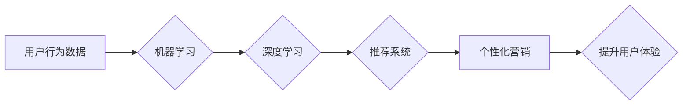

                 

## 电商平台中的AI驱动用户行为分析

> 关键词：电商平台、用户行为分析、人工智能、机器学习、深度学习、推荐系统、个性化营销

## 1. 背景介绍

在当今数据爆炸的时代，电商平台积累了海量用户行为数据，这些数据蕴藏着宝贵的商业价值。传统的用户行为分析方法往往依赖于人工经验和规则，难以挖掘数据中的深层模式和趋势。而人工智能（AI）技术的兴起为电商平台用户行为分析带来了新的机遇。

AI驱动的用户行为分析能够通过机器学习和深度学习算法，从海量数据中自动学习用户行为模式，并预测用户的未来行为，从而帮助电商平台实现以下目标：

* **精准用户画像：**  构建更精准的用户画像，了解用户的兴趣、偏好、购买习惯等，为个性化营销提供数据支撑。
* **个性化推荐：**  根据用户的行为数据，推荐更符合用户需求的商品，提高转化率和用户粘性。
* **预测用户行为：**  预测用户的购买意愿、浏览路径、退货率等，帮助电商平台优化库存管理、促销策略和客户服务。
* **提升用户体验：**  根据用户的行为数据，优化网站结构、商品展示、支付流程等，提升用户体验和购物满意度。

## 2. 核心概念与联系

### 2.1 用户行为数据

电商平台的用户行为数据包括用户访问记录、浏览历史、搜索记录、购买记录、评价信息、购物车操作等。这些数据可以反映用户的兴趣、偏好、购买习惯等，是AI驱动用户行为分析的基础。

### 2.2 机器学习

机器学习是人工智能的一个分支，它通过算法训练模型，使模型能够从数据中学习，并对新数据进行预测或分类。常用的机器学习算法包括：

* **监督学习：**  利用标记数据训练模型，例如分类、回归等。
* **无监督学习：**  利用未标记数据发现数据中的潜在模式，例如聚类、降维等。
* **强化学习：**  通过奖励和惩罚机制训练模型，使其在特定环境中做出最优决策。

### 2.3 深度学习

深度学习是机器学习的一个子领域，它利用多层神经网络来模拟人类大脑的学习过程。深度学习算法能够处理更复杂的数据，并学习更深层的特征，在图像识别、自然语言处理等领域取得了突破性进展。

### 2.4 推荐系统

推荐系统是基于用户行为数据，利用机器学习算法推荐用户感兴趣的商品或内容。常见的推荐系统算法包括：

* **协同过滤：**  根据用户的历史行为数据，推荐与用户兴趣相似的其他用户的商品。
* **内容过滤：**  根据商品的特征和用户的兴趣偏好，推荐相关的商品。
* **混合推荐：**  结合协同过滤和内容过滤算法，提高推荐效果。

**核心概念与联系流程图**



## 3. 核心算法原理 & 具体操作步骤

### 3.1 算法原理概述

在电商平台用户行为分析中，常用的机器学习算法包括：

* **K-Means聚类算法：**  将用户根据其行为特征进行聚类，形成不同类型的用户群体。
* **协同过滤算法：**  根据用户的历史行为数据，推荐与用户兴趣相似的其他用户的商品。
* **决策树算法：**  根据用户的特征和行为数据，构建决策树模型，预测用户的未来行为。
* **支持向量机算法：**  将用户行为数据映射到高维空间，寻找最佳的分隔超平面，用于分类和预测。

### 3.2 算法步骤详解

以K-Means聚类算法为例，其具体操作步骤如下：

1. **数据预处理：**  对用户行为数据进行清洗、转换和特征工程，例如将用户浏览历史转化为商品类别向量。
2. **初始化聚类中心：**  随机选择K个用户作为聚类中心。
3. **计算距离：**  计算每个用户到每个聚类中心的距离，例如使用欧氏距离。
4. **分配用户：**  将每个用户分配到距离其最近的聚类中心。
5. **更新聚类中心：**  重新计算每个聚类中心的坐标，作为新的聚类中心。
6. **重复步骤3-5：**  重复步骤3-5，直到聚类中心不再变化或达到最大迭代次数。

### 3.3 算法优缺点

**K-Means聚类算法**

* **优点：**  算法简单易懂，计算效率高，易于实现。
* **缺点：**  对初始聚类中心的选择敏感，容易陷入局部最优解，难以处理高维数据。

### 3.4 算法应用领域

K-Means聚类算法广泛应用于用户行为分析、市场细分、推荐系统等领域。

## 4. 数学模型和公式 & 详细讲解 & 举例说明

### 4.1 数学模型构建

K-Means聚类算法的数学模型可以表示为：

* **目标函数：**  最小化所有用户到其所属聚类中心的距离的平方和。
* **聚类中心更新公式：**  每个聚类中心的坐标更新为其所属用户数据的均值。

### 4.2 公式推导过程

目标函数的推导过程如下：

1. 定义用户 $i$ 到聚类中心 $k$ 的距离为 $d_{ik}$。
2. 定义所有用户到其所属聚类中心的距离的平方和为 $J(C)$，其中 $C$ 为聚类中心集合。
3. $J(C) = \sum_{i=1}^{n} \sum_{k=1}^{K} d_{ik}^2$，其中 $n$ 为用户总数，$K$ 为聚类数。
4. 为了最小化 $J(C)$，需要更新聚类中心 $C$，使其满足以下条件：

$\frac{\partial J(C)}{\partial c_k} = 0$

其中 $c_k$ 为聚类中心 $k$ 的坐标。

### 4.3 案例分析与讲解

假设有5个用户，每个用户有2个特征，需要将用户聚类为2个类别。

1. 随机选择2个用户作为初始聚类中心。
2. 计算每个用户到每个聚类中心的距离，并将其分配到距离最近的聚类中心。
3. 计算每个聚类中心的坐标，作为新的聚类中心。
4. 重复步骤2-3，直到聚类中心不再变化。

## 5. 项目实践：代码实例和详细解释说明

### 5.1 开发环境搭建

* Python 3.x
* scikit-learn 库
* pandas 库
* matplotlib 库

### 5.2 源代码详细实现

```python
import pandas as pd
from sklearn.cluster import KMeans

# 加载用户行为数据
data = pd.read_csv('user_behavior.csv')

# 数据预处理
# ...

# 训练K-Means聚类模型
kmeans = KMeans(n_clusters=2, random_state=0)
kmeans.fit(data)

# 获取聚类结果
labels = kmeans.labels_

# 将聚类结果添加到数据中
data['cluster'] = labels

# 展示聚类结果
print(data)
```

### 5.3 代码解读与分析

* `pandas` 库用于加载和处理用户行为数据。
* `scikit-learn` 库中的 `KMeans` 类用于训练K-Means聚类模型。
* `n_clusters` 参数指定聚类数，`random_state` 参数用于设置随机种子，确保每次运行结果一致。
* `fit()` 方法用于训练模型，`labels_` 属性返回每个用户的聚类标签。
* 将聚类结果添加到数据中，方便后续分析和使用。

### 5.4 运行结果展示

运行代码后，将输出包含用户行为数据和聚类标签的数据集。

## 6. 实际应用场景

### 6.1 用户画像构建

通过K-Means聚类算法，可以将用户根据其行为特征进行聚类，形成不同类型的用户群体，例如：

* **忠诚用户：**  经常购买、高消费的用户。
* **潜在用户：**  浏览商品、加入购物车但未购买的用户。
* **价格敏感用户：**  关注价格、经常比较价格的用户。

### 6.2 个性化推荐

根据用户的聚类标签，可以推荐更符合用户兴趣的商品。例如，可以推荐忠诚用户最新的产品，推荐潜在用户相关的商品，推荐价格敏感用户促销商品。

### 6.3 营销策略优化

根据不同用户群体的特征，可以制定不同的营销策略。例如，可以针对忠诚用户提供会员权益，针对潜在用户提供优惠券，针对价格敏感用户提供折扣活动。

### 6.4 未来应用展望

随着人工智能技术的不断发展，AI驱动的用户行为分析将在电商平台的应用场景中得到更广泛的应用，例如：

* **更精准的用户画像：**  利用深度学习算法，从用户行为数据中挖掘更深层的特征，构建更精准的用户画像。
* **更个性化的推荐：**  利用强化学习算法，根据用户的实时反馈，不断优化推荐策略，提供更个性化的推荐。
* **更智能的客户服务：**  利用自然语言处理技术，构建智能客服系统，为用户提供更便捷、更智能的客户服务。

## 7. 工具和资源推荐

### 7.1 学习资源推荐

* **书籍：**
    * 《Python机器学习》
    * 《深度学习》
* **在线课程：**
    * Coursera
    * edX
    * Udemy

### 7.2 开发工具推荐

* **Python：**  通用编程语言，广泛应用于机器学习和数据分析。
* **scikit-learn：**  机器学习库，提供各种算法和工具。
* **pandas：**  数据分析库，用于处理和分析数据。
* **matplotlib：**  数据可视化库，用于生成图表和图形。

### 7.3 相关论文推荐

* **K-Means聚类算法：**
    * Lloyd, S. (1982). Least squares quantization in PCM. IEEE Transactions on Information Theory, 28(2), 129-137.
* **协同过滤算法：**
    * Goldberg, D., Nichols, D., Oki, B., & Terry, D. (1992). Using collaborative filtering to weave an information tapestry. Communications of the ACM, 35(12), 61-70.
* **深度学习算法：**
    * LeCun, Y., Bengio, Y., & Hinton, G. (2015). Deep learning. Nature, 521(7553), 436-444.

## 8. 总结：未来发展趋势与挑战

### 8.1 研究成果总结

AI驱动的用户行为分析在电商平台的应用取得了显著成果，例如：

* **提高了用户体验：**  通过个性化推荐和智能客服，提升了用户的购物体验。
* **提升了营销效果：**  通过精准的用户画像和个性化营销，提高了营销效果。
* **降低了运营成本：**  通过自动化分析和决策，降低了运营成本。

### 8.2 未来发展趋势

未来，AI驱动的用户行为分析将朝着以下方向发展：

* **更精准的用户画像：**  利用更先进的机器学习和深度学习算法，从用户行为数据中挖掘更深层的特征，构建更精准的用户画像。
* **更个性化的推荐：**  利用强化学习算法，根据用户的实时反馈，不断优化推荐策略，提供更个性化的推荐。
* **更智能的客户服务：**  利用自然语言处理技术，构建更智能的客服系统，为用户提供更便捷、更智能的客户服务。

### 8.3 面临的挑战

AI驱动的用户行为分析也面临一些挑战：

* **数据质量问题：**  用户行为数据往往存在缺失、错误和噪声等问题，需要进行有效的数据清洗和预处理。
* **算法解释性问题：**  一些深度学习算法的决策过程难以解释，难以获得用户的信任。
* **隐私安全问题：**  用户行为数据包含敏感信息，需要采取有效措施保护用户的隐私安全。

### 8.4 研究展望

未来，需要进一步研究以下问题：

* 如何提高AI模型的解释性，增强用户的信任。
* 如何更好地保护用户隐私安全，确保数据安全和合规性。
* 如何将AI驱动的用户行为分析与其他技术融合，例如物联网、大数据等，构建更智能的电商平台生态系统。

## 9. 附录：常见问题与解答

**Q1：K-Means聚类算法的聚类数如何确定？**

**A1：**  聚类数的确定可以通过肘部法、Silhouette分析等方法进行。

**Q2：AI驱动的用户行为分析需要哪些数据？**

**A2：**  需要用户行为数据，例如用户访问记录、浏览历史、搜索记录、购买记录、评价信息等。

**Q3：AI驱动的用户行为分析有哪些伦理问题？**

**A3：**  需要关注用户隐私安全、数据公平性、算法透明度等伦理问题。

作者：禅与计算机程序设计艺术 / Zen and the Art of Computer Programming


<end_of_turn>

