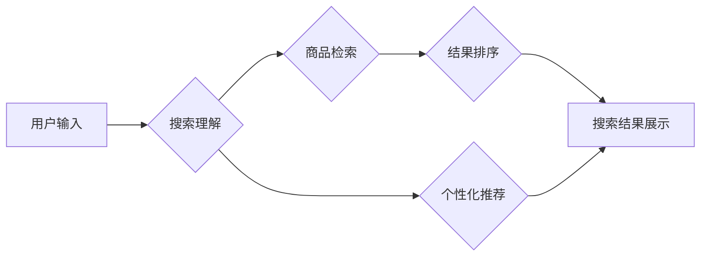

                 

## 电商搜索的下一个前沿：AI大模型的应用

> 关键词：电商搜索、AI大模型、自然语言处理、推荐系统、知识图谱、多模态搜索、个性化搜索

## 1. 背景介绍

电商搜索作为电商平台的核心功能之一，直接影响着用户体验和转化率。传统的电商搜索引擎主要依赖于关键词匹配和商品属性检索，但随着用户搜索行为的复杂化和商品信息的爆炸式增长，传统的搜索方式已难以满足用户的需求。

近年来，人工智能（AI）技术蓬勃发展，特别是深度学习的突破，为电商搜索带来了新的机遇。AI大模型凭借其强大的语义理解、文本生成和知识推理能力，正在改变电商搜索的格局，为用户提供更智能、更精准、更个性化的搜索体验。

## 2. 核心概念与联系

### 2.1 AI大模型概述

AI大模型是指在海量数据上训练的深度学习模型，拥有强大的泛化能力和学习能力。常见的AI大模型包括：

* **语言模型：**例如GPT-3、BERT、LaMDA等，擅长理解和生成自然语言文本。
* **图像模型：**例如DALL-E 2、Stable Diffusion等，能够生成逼真的图像和视频。
* **多模态模型：**例如FLAN-T5、CLIP等，能够处理多种数据类型，例如文本、图像、音频等。

### 2.2 AI大模型与电商搜索的联系

AI大模型可以应用于电商搜索的多个环节，例如：

* **搜索理解：**利用语言模型理解用户的搜索意图，识别关键词的含义和语义关系，提高搜索结果的准确性。
* **商品推荐：**根据用户的搜索历史、浏览记录、购买行为等数据，利用推荐算法和知识图谱，推荐与用户需求相匹配的商品。
* **个性化搜索：**根据用户的个人喜好、兴趣、购买偏好等信息，定制个性化的搜索结果，提供更精准的商品推荐。
* **多模态搜索：**支持用户使用图像、语音等多种方式进行搜索，扩展搜索功能，提高用户体验。

### 2.3 AI大模型架构



## 3. 核心算法原理 & 具体操作步骤

### 3.1 算法原理概述

AI大模型在电商搜索中的应用主要基于以下核心算法：

* **自然语言处理（NLP）:** 用于理解用户的搜索意图，识别关键词的含义和语义关系。
* **推荐算法:** 用于根据用户的搜索历史、浏览记录、购买行为等数据，推荐与用户需求相匹配的商品。
* **知识图谱:** 用于构建商品之间的知识关系，提高搜索结果的准确性和相关性。

### 3.2 算法步骤详解

1. **数据预处理:** 收集用户搜索数据、商品信息、用户行为数据等，进行清洗、格式化和特征提取。
2. **模型训练:** 利用训练数据训练AI大模型，例如语言模型、推荐模型、知识图谱构建模型等。
3. **搜索理解:** 当用户输入搜索词时，利用训练好的语言模型对搜索词进行分析，识别关键词的含义、语义关系和搜索意图。
4. **商品检索:** 根据搜索理解结果，从商品数据库中检索出与用户搜索意图相关的商品。
5. **结果排序:** 利用推荐算法和知识图谱，对检索结果进行排序，将与用户需求最匹配的商品排在前面。
6. **个性化推荐:** 根据用户的个人信息和行为数据，为用户提供个性化的商品推荐。
7. **搜索结果展示:** 将排序后的商品信息展示给用户，并提供相关信息，例如商品描述、价格、评价等。

### 3.3 算法优缺点

**优点:**

* **提高搜索准确性:** AI大模型能够理解用户的搜索意图，识别关键词的语义关系，提高搜索结果的准确性。
* **个性化推荐:** AI大模型能够根据用户的个人信息和行为数据，提供个性化的商品推荐，提升用户体验。
* **扩展搜索功能:** AI大模型支持多模态搜索，例如图像、语音等，扩展搜索功能，提高用户体验。

**缺点:**

* **数据依赖:** AI大模型的训练需要海量数据，数据质量直接影响模型性能。
* **计算资源消耗:** 训练和部署AI大模型需要大量的计算资源，成本较高。
* **模型解释性:** AI大模型的决策过程较为复杂，难以解释模型的决策逻辑。

### 3.4 算法应用领域

AI大模型在电商搜索领域的应用不仅限于商品检索和推荐，还可以应用于以下领域：

* **搜索结果优化:** 利用AI大模型分析用户点击行为，优化搜索结果页面布局和展示方式，提高用户转化率。
* **智能客服:** 利用AI大模型构建智能客服系统，自动回答用户常见问题，提高客服效率。
* **内容推荐:** 利用AI大模型分析用户兴趣偏好，推荐相关商品、文章、视频等内容，提升用户粘性。

## 4. 数学模型和公式 & 详细讲解 & 举例说明

### 4.1 数学模型构建

在电商搜索中，AI大模型通常采用以下数学模型：

* **词嵌入模型:** 将单词映射到低维向量空间，捕捉单词之间的语义关系。常见的词嵌入模型包括Word2Vec、GloVe、FastText等。
* **Transformer模型:** 利用注意力机制，捕捉文本序列中的长距离依赖关系，提高文本理解能力。BERT、GPT-3等都是基于Transformer模型的语言模型。
* **推荐模型:** 利用协同过滤、内容过滤、深度学习等算法，预测用户对商品的评分或购买概率。常见的推荐模型包括ALS、NCF、FM等。

### 4.2 公式推导过程

**词嵌入模型的训练目标:**

$$
\min_{W} \sum_{i=1}^{N} \sum_{j \in N(i)} \log \sigma(w_i^T w_j + b)
$$

其中：

* $W$ 是词嵌入矩阵
* $N(i)$ 是单词 $i$ 的上下文词集合
* $\sigma$ 是sigmoid函数

**Transformer模型的注意力机制:**

$$
Attention(Q, K, V) = \frac{exp(Q K^T / \sqrt{d_k})}{exp(Q K^T / \sqrt{d_k})} V
$$

其中：

* $Q$, $K$, $V$ 分别是查询矩阵、键矩阵和值矩阵
* $d_k$ 是键向量的维度

### 4.3 案例分析与讲解

**词嵌入模型:**

假设我们有一个词嵌入模型，将单词 "猫" 和 "狗" 映射到向量空间中。如果这两个单词在语义上相关，那么它们的向量表示应该相近。

**Transformer模型:**

Transformer模型可以捕捉文本序列中的长距离依赖关系。例如，在句子 "小明昨天去公园玩了，今天他去图书馆看书" 中，"昨天" 和 "今天" 是两个时间词，它们之间存在长距离依赖关系。Transformer模型可以通过注意力机制捕捉这种依赖关系，理解句子的整体含义。

## 5. 项目实践：代码实例和详细解释说明

### 5.1 开发环境搭建

* Python 3.7+
* TensorFlow/PyTorch
* CUDA/cuDNN

### 5.2 源代码详细实现

```python
# 使用BERT模型进行商品搜索理解
from transformers import AutoTokenizer, AutoModel

# 加载预训练模型和词表
tokenizer = AutoTokenizer.from_pretrained("bert-base-uncased")
model = AutoModel.from_pretrained("bert-base-uncased")

# 用户输入的搜索词
query = "寻找适合夏天穿的衣服"

# 对搜索词进行token化
input_ids = tokenizer.encode(query, add_special_tokens=True)

# 将token化结果输入模型进行推理
outputs = model(input_ids)

# 从模型输出中提取语义表示
sentence_embedding = outputs.last_hidden_state[:, 0, :]

# 使用语义表示进行商品检索和排序
# ...
```

### 5.3 代码解读与分析

* 使用预训练的BERT模型进行商品搜索理解，捕捉搜索词的语义信息。
* 对用户输入的搜索词进行token化，将文本转换为模型可理解的格式。
* 将token化结果输入BERT模型进行推理，获取每个词的语义表示。
* 从模型输出中提取句子的整体语义表示，用于商品检索和排序。

### 5.4 运行结果展示

* 根据用户输入的搜索词，检索出与之相关的商品信息。
* 对检索结果进行排序，将与用户需求最匹配的商品排在前面。
* 将排序后的商品信息展示给用户，并提供相关信息，例如商品描述、价格、评价等。

## 6. 实际应用场景

### 6.1 个性化商品推荐

利用AI大模型分析用户的搜索历史、浏览记录、购买行为等数据，为用户提供个性化的商品推荐，提高用户体验和转化率。

### 6.2 智能客服

利用AI大模型构建智能客服系统，自动回答用户常见问题，例如商品信息、物流查询、退换货政策等，提高客服效率和用户满意度。

### 6.3 多模态搜索

支持用户使用图像、语音等多种方式进行搜索，扩展搜索功能，提高用户体验。例如，用户可以通过上传图片搜索类似商品，或者通过语音描述搜索商品。

### 6.4 未来应用展望

* **更精准的搜索结果:** 利用更先进的AI大模型和算法，进一步提高搜索结果的准确性和相关性。
* **更个性化的搜索体验:** 根据用户的个人信息和行为数据，提供更个性化的搜索结果和推荐。
* **更丰富的搜索功能:** 支持更多种类的搜索方式，例如视频搜索、3D模型搜索等。
* **更智能的电商助手:** 利用AI大模型构建更智能的电商助手，帮助用户完成购物任务，例如自动添加购物车、自动结账等。

## 7. 工具和资源推荐

### 7.1 学习资源推荐

* **书籍:**
    * 《深度学习》
    * 《自然语言处理》
    * 《推荐系统》
* **在线课程:**
    * Coursera
    * edX
    * Udacity

### 7.2 开发工具推荐

* **Python:** 
    * TensorFlow
    * PyTorch
    * scikit-learn
* **云平台:**
    * AWS
    * Azure
    * Google Cloud

### 7.3 相关论文推荐

* BERT: Pre-training of Deep Bidirectional Transformers for Language Understanding
* GPT-3: Language Models are Few-Shot Learners
* Transformer: Attention Is All You Need

## 8. 总结：未来发展趋势与挑战

### 8.1 研究成果总结

AI大模型在电商搜索领域取得了显著的成果，提高了搜索准确性、个性化推荐效果和用户体验。

### 8.2 未来发展趋势

* **模型规模和能力的提升:** 训练更大规模、更强大的AI大模型，提高模型的泛化能力和理解能力。
* **多模态搜索的深入研究:** 探索更有效的多模态搜索方法，支持用户使用多种方式进行搜索。
* **个性化搜索的精准化:** 利用更丰富的用户数据，提供更精准的个性化搜索体验。
* **AI大模型的解释性:** 研究更有效的AI大模型解释方法，提高模型的透明度和可信度。

### 8.3 面临的挑战

* **数据质量和隐私问题:** AI大模型的训练需要海量数据，数据质量直接影响模型性能。同时，用户数据隐私保护也是一个重要的挑战。
* **模型训练和部署成本:** 训练和部署AI大模型需要大量的计算资源和成本。
* **模型安全性和可控性:** AI大模型的决策过程较为复杂，需要确保模型的安全性和可控性，避免模型被恶意利用。

### 8.4 研究展望

未来，AI大模型将在电商搜索领域发挥越来越重要的作用，为用户提供更智能、更便捷、更个性化的购物体验。


## 9. 附录：常见问题与解答

**Q1: AI大模型的训练需要多少数据？**

A1: AI大模型的训练数据量取决于模型规模和复杂度。一般来说，需要百万甚至数十亿条数据才能训练出性能良好的AI大模型。

**Q2: 如何保证AI大模型的公平性和不歧视性？**

A2: 训练数据中的偏见会影响AI大模型的公平性和不歧视性。需要对训练数据进行清洗和标注，确保数据中不存在偏见。同时，还需要对模型进行测试和评估，确保模型输出结果公平公正。

**Q3: 如何解释AI大模型的决策过程？**

A3: AI大模型的决策过程较为复杂，难以直接解释。目前，一些研究方法可以帮助解释模型的决策过程，例如注意力机制可视化、特征重要性分析等。


作者：禅与计算机程序设计艺术 / Zen and the Art of Computer Programming 
<end_of_turn>

