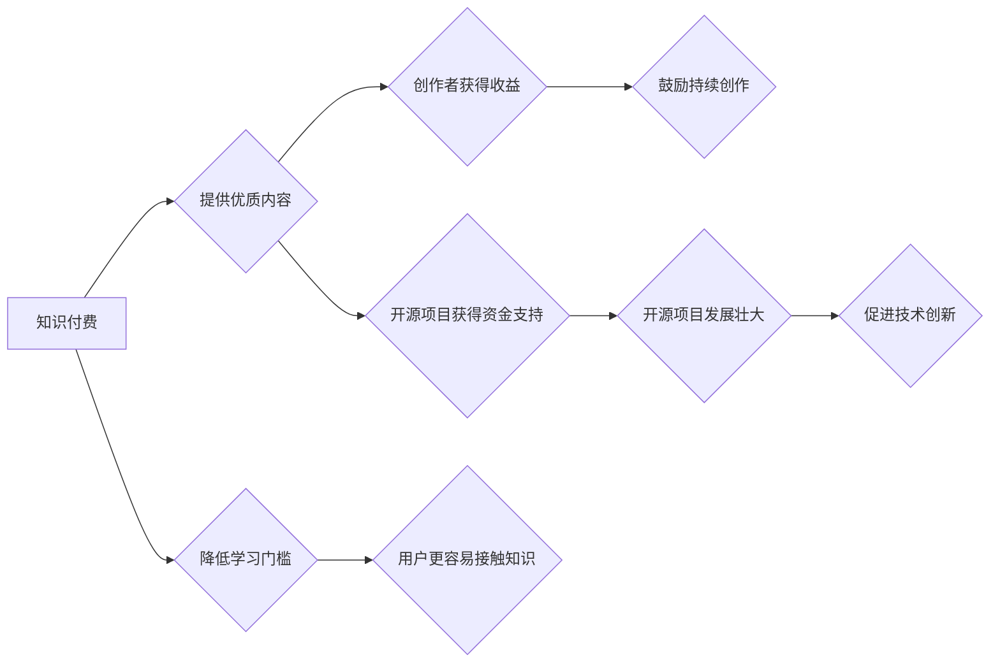

                 

## 知识付费与开源精神的平衡之道

> 关键词：知识付费、开源精神、软件开发、技术传播、社区建设、商业模式、创新生态

### 1. 背景介绍

在当今科技飞速发展的时代，知识已成为最宝贵的资源之一。软件开发领域更是如此，新技术层出不穷，程序员需要不断学习和更新知识才能保持竞争力。知识付费和开源精神是软件开发领域中两种重要的文化现象，它们在推动技术进步和促进软件开发生态发展方面发挥着重要作用。

知识付费是指通过付费的方式获取知识和技能，例如购买在线课程、参加培训班、订阅技术期刊等。开源精神则强调知识的免费共享和开放合作，例如开源软件、开源代码库、开源社区等。

这两者看似矛盾，实则互补。知识付费可以为创作者提供经济支持，鼓励他们持续创作和分享优质内容；而开源精神则可以促进知识的传播和普及，加速技术创新。

### 2. 核心概念与联系

#### 2.1 知识付费

知识付费的核心是将知识和技能商品化，通过付费的方式提供给有需求的用户。它可以帮助创作者获得收益，并激励他们持续创作高品质的内容。

#### 2.2 开源精神

开源精神的核心是知识的免费共享和开放合作。开源软件的代码通常是公开可访问的，任何人都可以查看、修改和重新发布。开源社区通过协作开发和共同维护开源软件，推动技术进步和创新。

#### 2.3 联系

知识付费和开源精神并非完全对立，它们可以相互补充，共同促进软件开发生态的发展。

* **知识付费可以为开源项目提供资金支持：** 许多开源项目依赖于赞助和捐款来维持运营。知识付费可以为开源项目提供稳定的资金来源，帮助他们更好地发展。
* **开源精神可以降低知识付费的门槛：** 开源软件和代码库可以作为学习和实践的资源，帮助用户降低学习门槛，更容易接触到知识付费的内容。
* **知识付费可以提供更深入的学习和指导：** 知识付费课程和培训班可以提供更深入的学习和指导，帮助用户更好地理解和应用开源技术。

**Mermaid 流程图**



### 3. 核心算法原理 & 具体操作步骤

#### 3.1 算法原理概述

知识付费和开源精神的平衡之道，本质上是关于如何构建一个可持续发展的技术生态系统。

这个生态系统需要既有创作者的激励机制，也有用户的学习和参与机会。

#### 3.2 算法步骤详解

1. **建立开放的知识共享平台：** 提供一个平台，让创作者可以免费分享他们的知识和技能，同时也可以通过付费的方式提供更深入的学习和指导。
2. **鼓励社区建设：** 构建一个活跃的社区，让用户可以互相交流学习，共同解决问题，并为开源项目贡献力量。
3. **制定合理的商业模式：** 探索不同的商业模式，例如订阅制、会员制、赞助制等，为创作者提供稳定的收益来源，同时确保知识的公平性和可访问性。
4. **促进跨界合作：** 鼓励不同领域的创作者和用户进行合作，打破知识壁垒，促进技术创新和产业发展。

#### 3.3 算法优缺点

* **优点：**
    * 促进知识的传播和普及。
    * 鼓励技术创新和发展。
    * 建立一个可持续发展的技术生态系统。
* **缺点：**
    * 需要协调好知识付费和开源精神之间的关系。
    * 需要建立一个完善的监管机制，防止知识盗版和滥用。

#### 3.4 算法应用领域

* 软件开发
* 教育培训
* 科研技术
* 医疗保健
* 艺术文化

### 4. 数学模型和公式 & 详细讲解 & 举例说明

#### 4.1 数学模型构建

我们可以用一个简单的数学模型来描述知识付费和开源精神之间的关系：

* **K:** 代表知识的价值
* **P:** 代表知识付费的比例
* **O:** 代表开源精神的比例

则：

* **K = P * K_p + O * K_o**

其中：

* **K_p:** 代表付费获取知识的价值
* **K_o:** 代表开源获取知识的价值

#### 4.2 公式推导过程

这个公式表明，知识的总价值等于付费获取知识的价值与开源获取知识的价值的加权平均。

* 当 **P** 较高时，知识付费的价值更大，开源精神的价值相对较小。
* 当 **O** 较高时，开源精神的价值更大，知识付费的价值相对较小。

#### 4.3 案例分析与讲解

例如，在开源软件领域，代码通常是免费共享的，因此 **O** 较高。

但是，一些开源项目会提供付费的培训课程和支持服务，因此 **P** 也有一定的比例。

这种平衡的模式可以确保开源软件的持续发展，同时也能为创作者提供经济支持。

### 5. 项目实践：代码实例和详细解释说明

#### 5.1 开发环境搭建

* 语言：Python
* 框架：Django
* 数据库：PostgreSQL

#### 5.2 源代码详细实现

```python
# models.py
class Course(models.Model):
    title = models.CharField(max_length=200)
    description = models.TextField()
    price = models.DecimalField(max_digits=10, decimal_places=2)
    is_free = models.BooleanField(default=False)

# views.py
def course_list(request):
    courses = Course.objects.all()
    return render(request, 'course_list.html', {'courses': courses})

def course_detail(request, pk):
    course = Course.objects.get(pk=pk)
    return render(request, 'course_detail.html', {'course': course})
```

#### 5.3 代码解读与分析

* **models.py:** 定义了课程模型，包括标题、描述、价格和是否免费等字段。
* **views.py:** 定义了课程列表和课程详情页的视图函数。

#### 5.4 运行结果展示

* 课程列表页面显示所有课程的信息。
* 课程详情页面显示单个课程的详细信息，包括价格和是否免费。

### 6. 实际应用场景

#### 6.1 在线教育平台

* 知识付费可以为在线教育平台提供收入来源，支持平台运营和内容更新。
* 开源精神可以促进教育资源的共享和普及，让更多人有机会获得优质教育。

#### 6.2 软件开发社区

* 知识付费可以为软件开发社区提供资金支持，帮助社区发展和维护。
* 开源精神可以促进软件开发的协作和创新，让社区成员共同进步。

#### 6.3 技术博客和论坛

* 知识付费可以为技术博客和论坛的作者提供收入来源，鼓励他们持续创作高质量内容。
* 开源精神可以促进技术知识的传播和分享，让更多人受益。

#### 6.4 未来应用展望

随着科技的发展，知识付费和开源精神的平衡之道将更加重要。

未来，我们可能会看到更多创新性的商业模式和技术应用，例如：

* 基于区块链技术的知识付费平台，可以更加安全和透明地管理知识产权。
* 人工智能驱动的开源社区，可以帮助用户更有效地查找和利用开源资源。
* 混合模式的知识共享平台，可以结合知识付费和开源精神，提供更加灵活和多样化的学习和参与方式。

### 7. 工具和资源推荐

#### 7.1 学习资源推荐

* **Coursera:** https://www.coursera.org/
* **edX:** https://www.edx.org/
* **Udemy:** https://www.udemy.com/

#### 7.2 开发工具推荐

* **GitHub:** https://github.com/
* **GitLab:** https://about.gitlab.com/
* **Bitbucket:** https://bitbucket.org/

#### 7.3 相关论文推荐

* **The Economics of Open Source Software**
* **The Open Source Advantage**
* **The Future of Knowledge Sharing**

### 8. 总结：未来发展趋势与挑战

#### 8.1 研究成果总结

知识付费和开源精神的平衡之道是一个重要的研究课题，它涉及到技术、经济、社会等多个方面。

通过对知识付费和开源精神的分析和研究，我们可以更好地理解它们之间的关系，并探索如何构建一个更加可持续和健康的软件开发生态系统。

#### 8.2 未来发展趋势

未来，知识付费和开源精神的平衡之道将继续发展和演变。

随着科技的发展，新的商业模式和技术应用将会不断涌现，为知识共享和传播提供新的可能性。

#### 8.3 面临的挑战

* 如何平衡知识付费和开源精神之间的关系，既能激励创作者，又能保证知识的公平性和可访问性。
* 如何建立一个完善的监管机制，防止知识盗版和滥用。
* 如何促进跨界合作，打破知识壁垒，促进技术创新和产业发展。

#### 8.4 研究展望

未来，我们需要继续深入研究知识付费和开源精神的平衡之道，探索新的商业模式和技术应用，为构建一个更加可持续和健康的软件开发生态系统做出贡献。

### 9. 附录：常见问题与解答

* **Q1: 知识付费和开源精神是否冲突？**

* **A1:** 知识付费和开源精神并非完全对立，它们可以相互补充，共同促进软件开发生态的发展。

* **Q2: 如何平衡知识付费和开源精神？**

* **A2:** 需要制定合理的商业模式，鼓励社区建设，促进跨界合作。

* **Q3: 如何防止知识盗版和滥用？**

* **A3:** 需要建立一个完善的监管机制，例如版权保护、知识产权管理等。


作者：禅与计算机程序设计艺术 / Zen and the Art of Computer Programming 
<end_of_turn>

