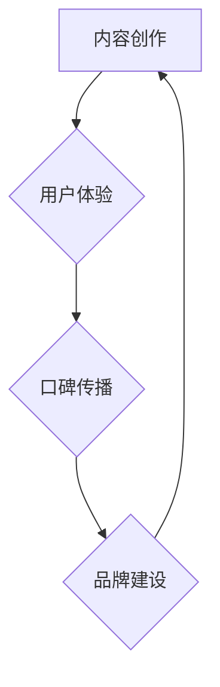

                 

## 知识付费创业中的用户口碑营销策略

> 关键词：知识付费、口碑营销、用户体验、内容价值、社区建设、信任机制、数据分析

### 1. 背景介绍

知识付费行业近年来蓬勃发展，涌现出众多优质内容创作者和平台。然而，市场竞争日益激烈，用户对内容质量和服务体验的要求也越来越高。在这种背景下，用户口碑营销成为知识付费创业不可或缺的策略。

口碑营销是指通过用户对产品或服务的真实评价和推荐，来影响其他用户的购买决策。在知识付费领域，用户口碑的价值尤为显著，因为用户对知识产品的评价往往更加理性、客观，并具有较强的说服力。

### 2. 核心概念与联系

**2.1 用户口碑营销的本质**

用户口碑营销的核心在于建立信任和共鸣。用户对知识产品的评价不仅取决于内容本身的质量，还包括创作者的专业度、服务态度、互动方式等因素。

**2.2  知识付费与口碑营销的关联**

知识付费和口碑营销之间存在着相互促进的关系。优质的知识产品能够产生正面的用户口碑，从而吸引更多用户付费购买。反之，良好的用户口碑能够提升知识产品的信誉度，促进销售增长。

**2.3  用户口碑营销的流程**

用户口碑营销是一个循序渐进的过程，包括以下几个阶段：

* **内容创作：** 创作者需要创作高质量、有价值的知识内容，满足用户的学习需求。
* **用户体验：** 平台需要提供良好的用户体验，包括便捷的学习平台、高效的客服服务、完善的社区互动等。
* **口碑传播：** 用户对知识产品进行评价和推荐，通过社交媒体、论坛、评论区等渠道传播口碑信息。
* **品牌建设：** 平台需要积极引导用户口碑，建立良好的品牌形象，提升用户信任度。

**2.4  Mermaid 流程图**



### 3. 核心算法原理 & 具体操作步骤

**3.1  算法原理概述**

用户口碑营销的核心算法原理是基于用户行为数据分析和预测。通过分析用户的学习记录、评价反馈、互动行为等数据，可以识别出优质内容、活跃用户、潜在用户等关键信息，并根据这些信息进行精准的营销策略制定。

**3.2  算法步骤详解**

1. **数据采集:** 收集用户学习记录、评价反馈、互动行为等数据。
2. **数据清洗:** 对收集到的数据进行清洗和处理，去除无效数据和噪声数据。
3. **特征提取:** 从用户数据中提取关键特征，例如学习时长、评价分数、互动频率等。
4. **模型训练:** 利用机器学习算法对用户数据进行训练，建立用户口碑预测模型。
5. **模型评估:** 对模型进行评估，验证其预测准确率和稳定性。
6. **策略制定:** 根据模型预测结果，制定精准的营销策略，例如推荐优质内容、引导用户评价、组织社区活动等。

**3.3  算法优缺点**

* **优点:** 能够精准识别用户需求，提高营销效率，提升用户转化率。
* **缺点:** 需要大量的数据支持，模型训练和维护成本较高。

**3.4  算法应用领域**

* **内容推荐:** 根据用户的学习记录和偏好，推荐相关的知识产品。
* **用户分层:** 将用户根据其价值和活跃度进行分层，制定针对性的营销策略。
* **口碑引导:** 通过激励用户评价和推荐，引导用户口碑传播。

### 4. 数学模型和公式 & 详细讲解 & 举例说明

**4.1  数学模型构建**

用户口碑营销模型可以采用基于用户行为数据的推荐系统模型，例如协同过滤模型或内容基模型。

**4.2  公式推导过程**

协同过滤模型的核心是计算用户之间或物品之间的相似度，并根据相似度进行推荐。例如，基于用户的协同过滤模型可以采用余弦相似度公式：

$$
\text{相似度} = \frac{\mathbf{u} \cdot \mathbf{v}}{||\mathbf{u}|| ||\mathbf{v}||}
$$

其中，$\mathbf{u}$ 和 $\mathbf{v}$ 分别代表两个用户的特征向量，$\cdot$ 表示点积，$||\mathbf{u}||$ 和 $||\mathbf{v}||$ 分别表示两个特征向量的模长。

**4.3  案例分析与讲解**

假设有两个用户 A 和 B，他们对知识产品的评价如下：

* 用户 A 对产品 1 的评价为 5 分，对产品 2 的评价为 3 分。
* 用户 B 对产品 1 的评价为 4 分，对产品 3 的评价为 5 分。

我们可以将用户的评价数据表示为特征向量：

* $\mathbf{u}_A = [5, 3]$
* $\mathbf{u}_B = [4, 5]$

根据余弦相似度公式，我们可以计算出用户 A 和 B 之间的相似度：

$$
\text{相似度} = \frac{[5, 3] \cdot [4, 5]}{||[5, 3]|| ||[4, 5]||} = \frac{20 + 15}{\sqrt{34} \sqrt{41}}
$$

通过计算，我们可以得到用户 A 和 B 之间的相似度值。如果相似度值较高，则表明用户 A 和 B 的兴趣偏好相似，可以推荐用户 A 喜欢的产品给用户 B。

### 5. 项目实践：代码实例和详细解释说明

**5.1  开发环境搭建**

* Python 3.x
* TensorFlow 或 PyTorch
* Jupyter Notebook

**5.2  源代码详细实现**

```python
import numpy as np
from sklearn.metrics.pairwise import cosine_similarity

# 用户评价数据
ratings = np.array([
    [5, 3, 0],
    [4, 5, 0],
    [0, 0, 5],
])

# 计算用户之间的余弦相似度
similarity_matrix = cosine_similarity(ratings)

# 打印相似度矩阵
print(similarity_matrix)
```

**5.3  代码解读与分析**

* 首先，我们导入必要的库函数。
* 然后，我们定义一个用户评价数据矩阵 `ratings`，其中每一行代表一个用户，每一列代表一个知识产品。
* 接下来，我们使用 `cosine_similarity` 函数计算用户之间的余弦相似度，并存储在 `similarity_matrix` 矩阵中。
* 最后，我们打印 `similarity_matrix` 矩阵，展示用户之间的相似度关系。

**5.4  运行结果展示**

运行上述代码后，会输出一个相似度矩阵，其中每个元素代表两个用户之间的相似度值。

### 6. 实际应用场景

**6.1  内容推荐**

根据用户的学习记录和评价反馈，推荐用户可能感兴趣的知识产品。

**6.2  用户分层**

根据用户的价值和活跃度，将用户进行分层，制定针对性的营销策略。

**6.3  口碑引导**

通过激励用户评价和推荐，引导用户口碑传播。

**6.4  未来应用展望**

* **个性化推荐:** 基于用户的学习行为和偏好，提供更加个性化的知识产品推荐。
* **智能客服:** 利用自然语言处理技术，开发智能客服系统，为用户提供更便捷的咨询服务。
* **社区运营:** 建立用户社区，促进用户之间的互动和交流，增强用户粘性。

### 7. 工具和资源推荐

**7.1  学习资源推荐**

* **书籍:** 《推荐系统实践》、《深度学习》
* **在线课程:** Coursera、edX、Udacity

**7.2  开发工具推荐**

* **Python:** TensorFlow、PyTorch、Scikit-learn
* **数据分析工具:** Jupyter Notebook、Tableau

**7.3  相关论文推荐**

* **协同过滤:** "Collaborative Filtering: A User-Based Approach"
* **内容基模型:** "Content-Based Recommendation Systems"

### 8. 总结：未来发展趋势与挑战

**8.1  研究成果总结**

用户口碑营销在知识付费行业中发挥着越来越重要的作用。通过数据分析和算法模型，可以精准识别用户需求，提升营销效率，促进用户转化。

**8.2  未来发展趋势**

* **个性化推荐:** 基于用户的学习行为和偏好，提供更加个性化的知识产品推荐。
* **智能客服:** 利用自然语言处理技术，开发智能客服系统，为用户提供更便捷的咨询服务。
* **社区运营:** 建立用户社区，促进用户之间的互动和交流，增强用户粘性。

**8.3  面临的挑战**

* **数据质量:** 用户数据质量直接影响算法模型的准确性，需要不断完善数据采集和清洗机制。
* **算法复杂度:** 随着用户数据量的增加，算法模型的复杂度也会随之提高，需要不断优化算法效率。
* **隐私保护:** 用户数据涉及个人隐私，需要采取有效的措施保障用户数据安全。

**8.4  研究展望**

未来，用户口碑营销将在知识付费行业中得到更广泛的应用，并不断朝着更加智能化、个性化、安全的方向发展。


### 9. 附录：常见问题与解答

**9.1  如何提高用户口碑营销的有效性？**

* **创作高质量内容:** 这是口碑营销的基础，需要不断提升内容的价值和吸引力。
* **提供优质用户体验:** 平台需要提供便捷的学习平台、高效的客服服务、完善的社区互动等，提升用户满意度。
* **引导用户口碑传播:** 可以通过激励用户评价和推荐，组织用户活动等方式，引导用户口碑传播。

**9.2  如何应对负面口碑？**

* **及时发现和处理:** 需要建立有效的监控机制，及时发现负面评论和反馈。
* **真诚回应用户:** 对负面评论要真诚地进行回应，并积极解决用户的问题。
* **化解用户情绪:** 可以通过道歉、补偿等方式，化解用户的负面情绪。


作者：禅与计算机程序设计艺术 / Zen and the Art of Computer Programming 
<end_of_turn>

