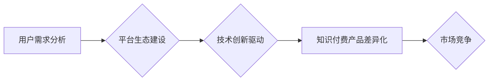

                 

## 知识付费创业的产品差异化策略

> 关键词：知识付费、产品差异化、市场竞争、用户需求、内容价值、平台生态、技术创新、商业模式

### 1. 背景介绍

知识付费行业近年来发展迅速，涌现出众多平台和内容创作者。然而，随着市场竞争的加剧，如何打造差异化产品，吸引用户并实现可持续发展成为摆在知识付费创业者面前的重大挑战。

**1.1 知识付费市场现状**

知识付费市场规模持续增长，用户群体也日益扩大。从教育培训、职业技能到兴趣爱好，各种类型的知识付费产品应运而生。

**1.2 市场竞争激烈**

知识付费市场竞争日益激烈，平台之间、内容创作者之间都存在着激烈的竞争。

**1.3 用户需求多元化**

用户对知识付费产品的需求日益多元化，不仅追求知识的深度和广度，更注重学习体验、互动交流和个性化定制。

### 2. 核心概念与联系

**2.1 知识付费产品差异化**

知识付费产品差异化是指在同质化竞争中，通过产品功能、内容形式、服务模式等方面的创新，打造独特的价值主张，满足用户特定需求，从而获得竞争优势。

**2.2 用户需求分析**

用户需求分析是打造差异化产品的关键环节，需要深入了解用户的学习目标、痛点、偏好和行为习惯。

**2.3 平台生态建设**

知识付费平台需要构建完善的生态系统，包括内容创作者、用户、技术支持、运营团队等，形成良性循环。

**2.4 技术创新驱动**

技术创新是知识付费产品差异化的重要驱动力，例如人工智能、大数据、虚拟现实等技术可以提升用户体验和学习效率。

**Mermaid 流程图**



### 3. 核心算法原理 & 具体操作步骤

**3.1 算法原理概述**

知识付费产品差异化算法是一种基于用户需求分析、平台生态建设和技术创新的算法，旨在帮助知识付费平台和内容创作者打造差异化产品，提升用户体验和学习效率。

**3.2 算法步骤详解**

1. **用户画像构建:** 收集用户数据，包括学习目标、兴趣爱好、学习习惯、付费意愿等，构建用户画像。
2. **内容推荐:** 基于用户画像，推荐个性化内容，例如推荐与用户兴趣相关的课程、推荐与用户学习目标相符的学习资源。
3. **学习路径规划:** 根据用户学习进度和目标，规划个性化学习路径，帮助用户高效学习。
4. **互动交流:** 提供互动交流平台，例如在线答疑、学习小组、论坛等，促进用户之间的交流和学习。
5. **数据分析反馈:** 收集用户学习数据，分析用户学习行为和反馈，不断优化产品和服务。

**3.3 算法优缺点**

**优点:**

* **个性化推荐:** 能够根据用户需求推荐个性化内容，提升用户学习体验。
* **学习效率提升:** 帮助用户规划学习路径，提高学习效率。
* **用户粘性增强:** 提供互动交流平台，增强用户粘性。

**缺点:**

* **数据依赖:** 需要大量用户数据才能构建准确的用户画像。
* **算法复杂度:** 算法设计和实现较为复杂。
* **隐私安全:** 需要妥善处理用户数据隐私安全问题。

**3.4 算法应用领域**

* 在线教育平台
* 职业技能培训平台
* 兴趣爱好学习平台
* 个人知识管理平台

### 4. 数学模型和公式 & 详细讲解 & 举例说明

**4.1 数学模型构建**

知识付费产品差异化算法可以构建数学模型来量化用户需求、内容价值和平台生态的影响因素。例如，可以构建一个用户满意度模型，将用户学习体验、互动交流、学习效率等因素作为输入，预测用户满意度。

**4.2 公式推导过程**

用户满意度模型可以采用线性回归模型，公式如下：

$$
S = \beta_0 + \beta_1 * X_1 + \beta_2 * X_2 + \beta_3 * X_3 + \epsilon
$$

其中：

* $S$：用户满意度
* $\beta_0$：截距项
* $\beta_1$, $\beta_2$, $\beta_3$：各因素的权重系数
* $X_1$, $X_2$, $X_3$：用户学习体验、互动交流、学习效率等因素的数值
* $\epsilon$：随机误差项

**4.3 案例分析与讲解**

假设一个在线教育平台想要构建用户满意度模型，可以收集用户学习体验、互动交流、学习效率等方面的评分数据，并结合用户学习时长、课程完成率等指标，训练模型。通过模型训练，可以得到各因素的权重系数，例如用户学习体验对满意度的影响最大，其次是互动交流，最后是学习效率。

### 5. 项目实践：代码实例和详细解释说明

**5.1 开发环境搭建**

* Python 3.x
* Jupyter Notebook
* scikit-learn

**5.2 源代码详细实现**

```python
from sklearn.linear_model import LinearRegression
import pandas as pd

# 加载数据
data = pd.read_csv('user_data.csv')

# 训练模型
model = LinearRegression()
model.fit(data[['学习体验', '互动交流', '学习效率']], data['满意度'])

# 预测用户满意度
new_data = pd.DataFrame({'学习体验': [4], '互动交流': [3], '学习效率': [5]})
predicted_satisfaction = model.predict(new_data)

print(predicted_satisfaction)
```

**5.3 代码解读与分析**

* 使用 scikit-learn 库中的 LinearRegression 模型训练用户满意度模型。
* 将用户学习体验、互动交流、学习效率等因素作为输入特征，用户满意度作为输出目标。
* 使用训练好的模型预测新用户的满意度。

**5.4 运行结果展示**

运行代码后，可以得到新用户的预测满意度值。

### 6. 实际应用场景

**6.1 个性化内容推荐**

根据用户画像和学习行为，推荐个性化课程和学习资源。

**6.2 学习路径规划**

根据用户学习目标和进度，规划个性化学习路径，帮助用户高效学习。

**6.3 互动交流平台**

提供在线答疑、学习小组、论坛等互动交流平台，促进用户之间的交流和学习。

**6.4 未来应用展望**

* 基于人工智能技术的个性化学习辅导
* 虚拟现实和增强现实技术的沉浸式学习体验
* 区块链技术的知识版权保护和激励机制

### 7. 工具和资源推荐

**7.1 学习资源推荐**

* 《深度学习》
* 《机器学习实战》
* 《Python数据科学手册》

**7.2 开发工具推荐**

* Python
* Jupyter Notebook
* scikit-learn
* TensorFlow

**7.3 相关论文推荐**

* Recommender Systems: A Survey
* Deep Learning for Recommender Systems
* Personalized Learning: A Survey

### 8. 总结：未来发展趋势与挑战

**8.1 研究成果总结**

知识付费产品差异化算法可以帮助知识付费平台和内容创作者打造差异化产品，提升用户体验和学习效率。

**8.2 未来发展趋势**

* 人工智能技术的应用将更加广泛，例如个性化学习辅导、智能内容推荐等。
* 虚拟现实和增强现实技术的应用将提升学习体验。
* 区块链技术的应用将保障知识版权和激励创作者。

**8.3 面临的挑战**

* 数据隐私安全问题
* 算法复杂度和计算资源需求
* 内容质量和用户信任问题

**8.4 研究展望**

* 研究更精准的用户画像构建方法
* 研究更有效的个性化学习路径规划算法
* 研究更安全的知识版权保护机制

### 9. 附录：常见问题与解答

**9.1 如何构建用户画像？**

用户画像可以基于用户数据，例如学习目标、兴趣爱好、学习习惯、付费意愿等，使用机器学习算法进行分析和构建。

**9.2 如何选择合适的算法？**

选择合适的算法需要根据具体业务需求和数据特点进行分析，例如用户画像构建可以使用聚类算法，个性化推荐可以使用协同过滤算法。

**9.3 如何保障用户数据隐私安全？**

需要采用数据加密、匿名化等技术手段，确保用户数据的安全和隐私。


作者：禅与计算机程序设计艺术 / Zen and the Art of Computer Programming 
<end_of_turn>

