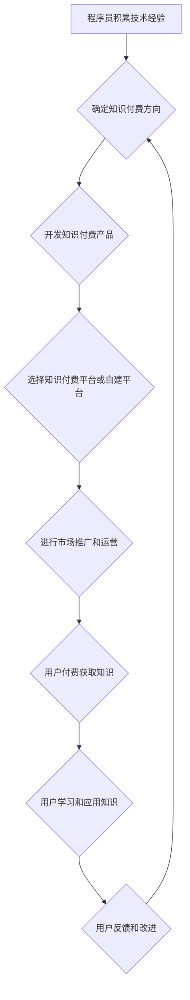

                 

## 知识付费时代程序员的创业思维与策略

> 关键词：知识付费、程序员创业、技术产品、市场定位、商业模式、内容运营、品牌建设、社区运营

### 1. 背景介绍

互联网时代，信息爆炸，知识成为最宝贵的资源。程序员作为技术人才，拥有丰富的技术知识和经验，在知识付费时代拥有巨大的创业机遇。 

近年来，知识付费市场蓬勃发展，从在线课程、付费博客到技术咨询，各种形式的知识付费模式层出不穷。程序员凭借其专业技能，可以将知识转化为产品，通过线上平台或线下活动，向其他程序员、开发者或企业提供价值。

然而，知识付费创业并非易事。程序员需要具备不仅仅是技术能力，还需要具备创业思维和策略，才能在激烈的市场竞争中脱颖而出。

### 2. 核心概念与联系

**2.1 知识付费的核心概念**

知识付费是指通过付费的方式获取知识、技能或服务的商业模式。它打破了传统教育模式的限制，让知识更加便捷、高效地传播和获取。

**2.2 程序员创业的核心概念**

程序员创业是指程序员利用其技术能力和经验，创办自己的技术公司或项目，并从中获得收益。

**2.3 知识付费与程序员创业的联系**

知识付费为程序员创业提供了新的模式和机遇。程序员可以将自己的技术知识和经验转化为产品，通过知识付费平台或自建平台，向其他程序员或开发者提供服务，从而实现创业目标。

**2.4 知识付费与程序员创业的流程图**



### 3. 核心算法原理 & 具体操作步骤

**3.1 算法原理概述**

知识付费创业的核心算法在于如何将技术知识转化为有价值的产品，并通过有效的营销和运营策略，吸引用户付费获取。

**3.2 算法步骤详解**

1. **技术能力评估:** 程序员需要首先评估自己的技术能力和经验，确定哪些知识点具有市场价值，并能够转化为产品。
2. **市场调研:** 程序员需要进行市场调研，了解目标用户的需求和痛点，确定产品的定位和竞争优势。
3. **产品开发:** 程序员需要根据市场调研结果，开发具有实用价值和吸引力的知识付费产品，例如在线课程、付费博客、技术文档、代码库等。
4. **平台选择:** 程序员可以选择现有的知识付费平台，例如Udemy、Coursera、知识星球等，或者自建平台。
5. **内容运营:** 程序员需要持续更新和维护产品内容，并通过社交媒体、博客等渠道进行推广，吸引用户关注。
6. **用户服务:** 程序员需要提供优质的用户服务，及时解答用户疑问，解决用户问题，提升用户体验。

**3.3 算法优缺点**

* **优点:** 
    * 降低创业门槛: 知识付费模式不需要大量资金投入，程序员可以利用自身的技术优势，快速启动创业项目。
    * 灵活多样: 知识付费产品形式多样，程序员可以根据自身特点和市场需求，选择合适的模式。
    * 持续收益: 知识付费产品具有复用性，可以持续为程序员带来收益。
* **缺点:** 
    * 市场竞争激烈: 知识付费市场竞争激烈，程序员需要不断提升产品质量和服务水平，才能脱颖而出。
    * 内容更新压力: 程序员需要持续更新和维护产品内容，才能保持用户粘性。
    * 用户获取成本: 吸引用户付费获取知识需要投入一定的营销和推广成本。

**3.4 算法应用领域**

* **在线课程:** 程序员可以开发针对特定编程语言、框架或技术的在线课程，向其他程序员提供学习和提升技能的机会。
* **付费博客:** 程序员可以分享自己的技术经验和见解，通过付费博客吸引读者付费订阅。
* **技术文档:** 程序员可以编写高质量的技术文档，例如API文档、开发指南等，向开发者提供技术支持。
* **代码库:** 程序员可以开发开源代码库，并提供付费支持服务，例如代码定制、bug修复等。

### 4. 数学模型和公式 & 详细讲解 & 举例说明

**4.1 数学模型构建**

知识付费创业的成功可以看作是一个复杂的系统，我们可以用数学模型来描述其运作机制。

* **用户价值模型:**  用户价值 = 产品价值 - 成本
* **产品价值模型:** 产品价值 = 学习效果 * 知识实用性 * 用户体验
* **成本模型:** 成本 = 开发成本 + 运营成本 + 市场推广成本

**4.2 公式推导过程**

* **用户价值最大化:** 为了最大化用户价值，程序员需要不断提升产品价值，降低成本。
* **产品价值提升:** 提升产品价值可以通过提高学习效果、增强知识实用性、优化用户体验等方式实现。
* **成本控制:** 控制成本可以通过优化开发流程、提高运营效率、选择合适的推广渠道等方式实现。

**4.3 案例分析与讲解**

假设一个程序员开发了一门关于Python编程的在线课程。

* **产品价值:** 课程内容全面，学习效果好，知识实用性强，用户体验良好。
* **成本:** 开发成本为10000元，运营成本为5000元，市场推广成本为2000元。
* **用户价值:** 课程价格为500元，用户认为课程价值超过500元，因此愿意付费购买。

在这个案例中，程序员通过开发高质量的产品，并控制成本，成功吸引了用户付费，实现了知识付费创业的目标。

### 5. 项目实践：代码实例和详细解释说明

**5.1 开发环境搭建**

* **操作系统:** Windows/macOS/Linux
* **编程语言:** Python
* **开发工具:** VS Code/PyCharm
* **知识付费平台:** Udemy/Coursera/知识星球

**5.2 源代码详细实现**

以下是一个简单的Python课程示例代码：

```python
def hello_world():
  print("Hello, world!")

hello_world()
```

**5.3 代码解读与分析**

* `def hello_world():` 定义了一个名为`hello_world`的函数。
* `print("Hello, world!")` 在函数体内打印“Hello, world!”字符串。
* `hello_world()` 调用函数，执行代码。

**5.4 运行结果展示**

运行以上代码，将会在控制台输出：

```
Hello, world!
```

### 6. 实际应用场景

**6.1 在线课程平台**

程序员可以将自己的技术知识录制成视频课程，上传到在线课程平台，例如Udemy、Coursera等，向全球用户提供学习机会。

**6.2 付费博客平台**

程序员可以开设付费博客，分享自己的技术经验、项目案例、行业见解等，吸引读者付费订阅。

**6.3 技术咨询服务**

程序员可以提供技术咨询服务，帮助企业解决技术难题，例如软件开发、系统架构、网络安全等。

**6.4 代码库和开源项目**

程序员可以开发开源代码库或项目，并提供付费支持服务，例如代码定制、bug修复、技术文档等。

**6.5 社区运营和技术交流**

程序员可以建立技术社区，组织线上线下活动，促进技术交流，并通过会员制度或赞助等方式获得收益。

**6.6 未来应用展望**

随着人工智能、大数据等技术的不断发展，知识付费市场将迎来更大的发展机遇。程序员可以利用这些新技术，开发更具创新性和实用性的知识付费产品，满足用户不断变化的需求。

### 7. 工具和资源推荐

**7.1 学习资源推荐**

* **在线学习平台:** Udemy、Coursera、Udacity、Khan Academy
* **技术博客:** Hacker News、Medium、Dev.to
* **开源社区:** GitHub、Stack Overflow、GitLab

**7.2 开发工具推荐**

* **代码编辑器:** VS Code、Sublime Text、Atom
* **版本控制系统:** Git、GitHub
* **项目管理工具:** Trello、Asana、Jira

**7.3 相关论文推荐**

* The Economics of Online Education
* The Future of Work: How Technology Will Transform the Workplace
* The Sharing Economy: A New Paradigm for Business and Society

### 8. 总结：未来发展趋势与挑战

**8.1 研究成果总结**

知识付费时代为程序员创业提供了新的机遇和挑战。程序员需要具备技术能力、创业思维和市场策略，才能在激烈的竞争中脱颖而出。

**8.2 未来发展趋势**

* **个性化定制:** 知识付费产品将更加个性化，满足不同用户需求。
* **沉浸式体验:** 虚拟现实、增强现实等技术将被应用于知识付费产品，提供更沉浸式的学习体验。
* **人工智能驱动:** 人工智能将被用于知识付费产品的推荐、个性化学习路径规划等方面。

**8.3 面临的挑战**

* **内容质量竞争:** 知识付费市场竞争激烈，程序员需要不断提升产品质量，才能吸引用户。
* **用户信任问题:** 用户需要信任知识付费产品的价值和可靠性，程序员需要建立良好的品牌形象和口碑。
* **知识产权保护:** 程序员需要重视知识产权保护，避免知识被盗用或抄袭。

**8.4 研究展望**

未来研究可以关注以下方面:

* **知识付费产品创新:** 开发更具创新性和实用性的知识付费产品。
* **用户学习行为研究:** 深入研究用户学习行为，优化知识付费产品的学习体验。
* **知识付费商业模式探索:** 探索新的知识付费商业模式，提高程序员的收益。

### 9. 附录：常见问题与解答

**9.1 如何确定知识付费方向？**

程序员可以根据自身技术优势、市场需求和个人兴趣，确定知识付费方向。可以进行市场调研，了解哪些技术领域有较大的需求，哪些知识点缺乏优质的学习资源。

**9.2 如何开发高质量的知识付费产品？**

开发高质量的知识付费产品需要以下几个方面:

* **内容深度:** 内容要全面、深入，能够解决用户实际问题。
* **学习效果:** 学习内容要易懂、易吸收，能够帮助用户快速掌握知识。
* **用户体验:** 产品界面要简洁易用，学习流程要流畅，能够提供良好的用户体验。

**9.3 如何推广知识付费产品？**

程序员可以利用多种渠道推广知识付费产品，例如:

* **社交媒体:** 在微信、微博、知乎等平台分享产品信息，吸引用户关注。
* **博客:** 在个人博客或技术博客上发布产品介绍、案例分享等内容。
* **线上社区:** 在技术社区、论坛等平台参与讨论，推广产品。
* **付费广告:** 在相关平台投放付费广告，精准触达目标用户。


作者：禅与计算机程序设计艺术 / Zen and the Art of Computer Programming 
<end_of_turn>

