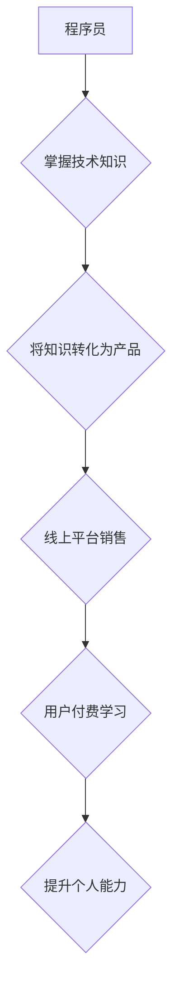

                 

## 知识付费时代程序员的创业机会

> 关键词：知识付费、程序员、创业机会、技术博客、在线课程、技术社区、开源项目、技术咨询

### 1. 背景介绍

随着互联网技术的飞速发展和数字经济的蓬勃兴起，知识付费行业迎来了爆发式增长。人们越来越重视知识的获取和提升，而程序员作为掌握着核心技术和解决问题能力的群体，在知识付费领域拥有着独特的优势和广阔的创业机会。

传统意义上的程序员工作模式主要集中在为公司或个人开发软件，但随着知识付费时代的到来，程序员可以将自己的技术经验和知识转化为有价值的产品和服务，通过线上平台进行销售和推广，实现自我价值和经济效益的双重提升。

### 2. 核心概念与联系

**2.1 知识付费**

知识付费是指以知识、技能、经验等为核心内容，通过线上或线下平台向用户提供付费学习服务的商业模式。其核心价值在于为用户提供有价值的知识和技能，帮助他们提升个人能力和解决实际问题。

**2.2 程序员**

程序员是指从事软件开发、维护和测试等工作的专业人员。他们需要具备扎实的编程基础、良好的逻辑思维能力和解决问题的能力。

**2.3 联系**

知识付费时代为程序员提供了新的创业机会，他们可以将自己的技术知识和经验转化为线上课程、技术博客、开源项目、技术咨询等服务，通过知识付费平台向用户提供付费学习服务。

**Mermaid 流程图**



### 3. 核心算法原理 & 具体操作步骤

**3.1 算法原理概述**

知识付费平台的运营需要依赖于一系列算法，例如用户画像算法、内容推荐算法、付费转化算法等。这些算法通过对用户行为、内容特征、市场趋势等数据的分析，实现个性化推荐、内容优化、用户留存等目标。

**3.2 算法步骤详解**

1. **数据采集:** 收集用户行为数据、内容数据、市场数据等。
2. **数据清洗:** 对收集到的数据进行清洗和预处理，去除噪声和异常值。
3. **特征提取:** 从数据中提取用户画像、内容特征、市场趋势等关键特征。
4. **模型训练:** 利用机器学习算法对特征进行训练，构建用户画像模型、内容推荐模型、付费转化模型等。
5. **模型评估:** 对模型进行评估，调整模型参数，提高模型精度。
6. **模型部署:** 将训练好的模型部署到线上平台，实现自动化运营。

**3.3 算法优缺点**

**优点:**

* **个性化推荐:** 算法可以根据用户的兴趣和需求，推荐更精准的内容。
* **内容优化:** 算法可以分析内容的受欢迎程度，帮助平台优化内容质量。
* **用户留存:** 算法可以预测用户的流失风险，采取措施提高用户留存率。

**缺点:**

* **数据依赖:** 算法的准确性依赖于数据的质量和数量。
* **算法黑盒:** 一些算法的决策机制难以解释，缺乏透明度。
* **伦理问题:** 算法可能会存在偏见和歧视，需要谨慎使用。

**3.4 算法应用领域**

* **内容推荐:** 推荐用户感兴趣的内容，例如新闻、视频、文章等。
* **广告投放:** 根据用户的兴趣和行为，精准投放广告。
* **用户画像:** 建立用户的画像，了解用户的兴趣、需求和行为模式。
* **付费转化:** 预测用户的付费意愿，提高付费转化率。

### 4. 数学模型和公式 & 详细讲解 & 举例说明

**4.1 数学模型构建**

知识付费平台的运营可以抽象为一个用户-内容-平台的交互系统。我们可以使用数学模型来描述这个系统的行为，例如：

* **用户行为模型:** 描述用户在平台上的行为模式，例如浏览、点赞、评论、付费等。
* **内容推荐模型:** 描述平台如何根据用户的行为和兴趣推荐内容。
* **付费转化模型:** 描述用户付费的概率和因素。

**4.2 公式推导过程**

例如，我们可以使用贝叶斯定理来推导用户付费的概率：

$$P(付费|浏览,点赞,评论) = \frac{P(浏览,点赞,评论|付费) * P(付费)}{P(浏览,点赞,评论)}$$

其中：

* $P(付费|浏览,点赞,评论)$: 用户在浏览、点赞、评论的情况下付费的概率。
* $P(浏览,点赞,评论|付费)$: 用户付费的情况下浏览、点赞、评论的概率。
* $P(付费)$: 用户付费的概率。
* $P(浏览,点赞,评论)$: 用户浏览、点赞、评论的概率。

**4.3 案例分析与讲解**

假设一个知识付费平台，用户浏览、点赞、评论的概率分别为0.8、0.5、0.3，付费用户浏览、点赞、评论的概率分别为0.9、0.7、0.6，付费用户的比例为10%。

我们可以使用贝叶斯定理计算用户在浏览、点赞、评论的情况下付费的概率：

$$P(付费|浏览,点赞,评论) = \frac{0.9 * 0.7 * 0.6 * 0.1}{0.8 * 0.5 * 0.3} = 0.756$$

这意味着，用户在浏览、点赞、评论的情况下，付费的概率为75.6%。

### 5. 项目实践：代码实例和详细解释说明

**5.1 开发环境搭建**

* Python 3.x
* Django 或 Flask 框架
* 数据库 (例如 PostgreSQL, MySQL)
* 前端框架 (例如 React, Vue)

**5.2 源代码详细实现**

以下是一个简单的知识付费平台代码示例，使用 Python 和 Django 框架实现：

```python
# models.py
from django.db import models

class Course(models.Model):
    title = models.CharField(max_length=255)
    description = models.TextField()
    price = models.DecimalField(max_digits=10, decimal_places=2)

class User(models.Model):
    username = models.CharField(max_length=255)
    email = models.EmailField()
    password = models.CharField(max_length=255)

# views.py
from django.shortcuts import render
from .models import Course

def course_list(request):
    courses = Course.objects.all()
    return render(request, 'course_list.html', {'courses': courses})

def course_detail(request, course_id):
    course = Course.objects.get(id=course_id)
    return render(request, 'course_detail.html', {'course': course})
```

**5.3 代码解读与分析**

* models.py 定义了课程和用户的模型，包括标题、描述、价格等字段。
* views.py 定义了课程列表和课程详情页的视图函数，用于处理用户请求并渲染页面。

**5.4 运行结果展示**

运行上述代码，可以创建一个简单的知识付费平台，用户可以浏览课程列表和课程详情页。

### 6. 实际应用场景

**6.1 在线课程平台**

程序员可以将自己的技术知识和经验录制成在线课程，通过平台进行销售和推广，例如 Udemy、Coursera、Skillshare 等。

**6.2 技术博客**

程序员可以开设技术博客，分享自己的技术文章、代码示例、项目经验等，通过广告、赞助、会员订阅等方式获得收益。

**6.3 开源项目**

程序员可以开发开源项目，并提供付费支持服务，例如代码定制、技术咨询、培训等。

**6.4 技术咨询**

程序员可以提供技术咨询服务，帮助企业或个人解决技术问题，例如软件开发、系统维护、网络安全等。

**6.5 未来应用展望**

随着人工智能、大数据等技术的不断发展，知识付费平台将更加智能化、个性化和多元化。程序员可以利用这些技术，开发更具创新性和价值的知识付费产品和服务。

### 7. 工具和资源推荐

**7.1 学习资源推荐**

* **在线课程平台:** Udemy、Coursera、Skillshare
* **技术博客:** Hacker News、Medium、Dev.to
* **开源项目平台:** GitHub、GitLab、Bitbucket

**7.2 开发工具推荐**

* **编程语言:** Python、Java、JavaScript
* **框架:** Django、Flask、React、Vue
* **数据库:** PostgreSQL、MySQL、MongoDB

**7.3 相关论文推荐**

* **知识付费平台的推荐算法研究**
* **知识付费平台的用户画像分析**
* **知识付费平台的付费转化模型构建**

### 8. 总结：未来发展趋势与挑战

**8.1 研究成果总结**

知识付费时代为程序员提供了新的创业机会，他们可以将自己的技术知识和经验转化为有价值的产品和服务，通过线上平台进行销售和推广。

**8.2 未来发展趋势**

* **个性化推荐:** 利用人工智能技术，更加精准地推荐用户感兴趣的内容。
* **内容多元化:** 除了在线课程，还将出现更多形式的知识付费产品，例如直播、互动社区、技术咨询等。
* **平台生态化:** 知识付费平台将更加注重生态建设，形成用户、内容创作者、平台之间的良性循环。

**8.3 面临的挑战**

* **内容质量:** 知识付费平台需要保证内容的质量和原创性，避免出现低质量或抄袭内容。
* **用户信任:** 用户需要对平台和内容创作者的信任，才能愿意付费学习。
* **商业模式创新:** 知识付费平台需要不断探索新的商业模式，提高盈利能力。

**8.4 研究展望**

未来，知识付费平台将更加智能化、个性化和多元化，程序员需要不断学习新的技术和知识，才能抓住机遇，实现自我价值和经济效益的双重提升。

### 9. 附录：常见问题与解答

**9.1 如何选择合适的知识付费平台？**

* **平台规模:** 选择用户量大、内容丰富、口碑好的平台。
* **平台收费模式:** 了解平台的收费模式，选择适合自己的模式。
* **平台服务:** 了解平台提供的服务，例如技术支持、推广帮助等。

**9.2 如何打造优质的知识付费产品？**

* **内容价值:** 提供有价值、实用、原创的内容。
* **内容形式:** 选择适合目标用户的形式，例如视频、音频、文字等。
* **用户体验:** 优化用户体验，例如页面设计、交互设计等。


作者：禅与计算机程序设计艺术 / Zen and the Art of Computer Programming 
<end_of_turn>

