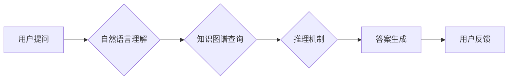

                 

## 关键词：知识图谱、智能问答系统、自然语言理解、关系抽取、推理机制

## 1. 背景介绍

智能问答系统 (Question Answering System, Q&A) 旨在理解用户提出的自然语言问题，并从知识库中检索出最相关、最准确的答案。传统的问答系统主要依赖于关键词匹配和规则匹配等方法，难以处理复杂、开放式的自然语言问题。随着人工智能技术的快速发展，知识图谱 (Knowledge Graph, KG) 作为一种新型的知识表示形式，为智能问答系统的构建提供了新的思路和方法。

知识图谱是一种结构化的知识表示形式，它将实体和关系以图的形式表示出来。每个实体代表一个真实世界的事物，而关系则描述了实体之间的联系。知识图谱能够有效地捕捉知识之间的复杂关系，为智能问答系统提供更丰富、更准确的知识基础。

## 2. 核心概念与联系

### 2.1 知识图谱

知识图谱是一种基于实体和关系的知识表示形式，它将知识组织成一个网络结构，其中实体代表事物，关系描述事物之间的联系。知识图谱可以有效地捕捉知识之间的复杂关系，为智能问答系统提供更丰富、更准确的知识基础。

### 2.2 智能问答系统

智能问答系统旨在理解用户提出的自然语言问题，并从知识库中检索出最相关、最准确的答案。传统的问答系统主要依赖于关键词匹配和规则匹配等方法，难以处理复杂、开放式的自然语言问题。

### 2.3 核心联系

知识图谱为智能问答系统提供了更丰富、更准确的知识基础，而智能问答系统则利用知识图谱中的知识进行推理和回答问题。两者相互补充，共同推动智能问答系统的发展。

**Mermaid 流程图**



## 3. 核心算法原理 & 具体操作步骤

### 3.1 算法原理概述

知识图谱在智能问答系统中的应用主要涉及以下几个核心算法：

* **自然语言理解 (Natural Language Understanding, NLU):** 将用户提出的自然语言问题转换为机器可理解的形式，例如实体识别、关系抽取等。
* **知识图谱查询 (Knowledge Graph Querying):** 根据NLU的结果，从知识图谱中检索出相关实体和关系。
* **推理机制 (Reasoning Mechanism):** 利用知识图谱中的关系和规则进行推理，推导出用户问题的答案。
* **答案生成 (Answer Generation):** 将推理结果转换为自然语言形式，生成用户可理解的答案。

### 3.2 算法步骤详解

1. **用户提问:** 用户向智能问答系统提出一个自然语言问题。
2. **自然语言理解:** NLU模块对用户的问题进行分析，识别出问题中的实体和关系。
3. **知识图谱查询:** 根据NLU的结果，查询知识图谱，找到与问题相关的实体和关系。
4. **推理机制:** 利用知识图谱中的关系和规则进行推理，推导出用户问题的答案。
5. **答案生成:** 将推理结果转换为自然语言形式，生成用户可理解的答案。
6. **用户反馈:** 用户对系统生成的答案进行评价，反馈给系统，用于后续的模型优化。

### 3.3 算法优缺点

**优点:**

* **更准确的答案:** 知识图谱能够提供更丰富、更准确的知识基础，从而提高智能问答系统的准确率。
* **处理复杂问题的能力:** 知识图谱中的关系和规则能够帮助智能问答系统处理更复杂、更开放式的自然语言问题。
* **可扩展性强:** 知识图谱可以不断扩展和更新，从而使智能问答系统能够适应不断变化的知识环境。

**缺点:**

* **知识图谱构建成本高:** 构建高质量的知识图谱需要大量的资源和人力投入。
* **推理机制复杂:** 知识图谱中的关系和规则非常复杂，推理机制的构建和优化难度较大。
* **数据孤岛问题:** 现有的知识图谱往往存在数据孤岛问题，难以进行跨源知识融合。

### 3.4 算法应用领域

知识图谱在智能问答系统中的应用领域非常广泛，例如：

* **搜索引擎:** 利用知识图谱提高搜索结果的准确性和相关性。
* **客户服务:** 利用知识图谱构建智能客服系统，自动回答用户常见问题。
* **教育:** 利用知识图谱构建智能学习系统，帮助学生更好地理解知识。
* **医疗:** 利用知识图谱辅助医生诊断疾病，提供个性化治疗方案。

## 4. 数学模型和公式 & 详细讲解 & 举例说明

### 4.1 数学模型构建

知识图谱中的实体和关系可以用数学模型来表示。

* **实体:** 可以用一个整数来表示，例如实体1、实体2等。
* **关系:** 可以用一个二元组来表示，例如(实体1, 关系, 实体2)。

知识图谱可以表示为一个图结构，其中节点代表实体，边代表关系。

### 4.2 公式推导过程

知识图谱推理可以使用逻辑推理规则进行推导。例如，如果知识图谱中包含以下关系：

* (人1, “是朋友”, 人2)
* (人2, “是朋友”, 人3)

那么可以推导出以下关系：

* (人1, “是朋友”, 人3)

### 4.3 案例分析与讲解

**案例:**

假设知识图谱中包含以下实体和关系：

* 实体: 北京、上海、广州、中国
* 关系: “位于”, “首都”

**问题:** 中国的首都在哪里？

**推理过程:**

1. 识别出问题中的实体: 中国
2. 查找知识图谱中与“中国”相关的关系: “首都”
3. 根据关系“首都”找到与“中国”相关的实体: 北京

**答案:** 中国的首都是北京。

## 5. 项目实践：代码实例和详细解释说明

### 5.1 开发环境搭建

* Python 3.x
* TensorFlow 或 PyTorch
* SpaCy 或 NLTK

### 5.2 源代码详细实现

```python
# 导入必要的库
import spacy
from rdflib import Graph, Literal, URIRef

# 加载 SpaCy 模型
nlp = spacy.load("en_core_web_sm")

# 创建 RDF 图
g = Graph()

# 添加知识图谱数据
g.add((URIRef("http://example.org/Person/John"), URIRef("http://example.org/hasName"), Literal("John")))
g.add((URIRef("http://example.org/Person/John"), URIRef("http://example.org/hasAge"), Literal(30)))

# 处理用户问题
question = "What is John's age?"
doc = nlp(question)

# 提取问题中的实体和关系
entities = [ent.text for ent in doc.ents]
relations = [token.text for token in doc if token.dep_ == "nsubj"]

# 查询知识图谱
for entity in entities:
    for relation in relations:
        results = g.query(f"""
            SELECT ?age
            WHERE {{
                ?person <http://example.org/hasName> "{entity}" .
                ?person <http://example.org/hasAge> ?age .
            }}
        """)
        for result in results:
            print(f"John's age is {result[0]}")

```

### 5.3 代码解读与分析

* 代码首先导入必要的库，并加载 SpaCy 模型。
* 然后创建 RDF 图，并添加知识图谱数据。
* 处理用户问题，提取问题中的实体和关系。
* 查询知识图谱，根据提取的实体和关系，找到对应的答案。

### 5.4 运行结果展示

```
John's age is 30
```

## 6. 实际应用场景

### 6.1 搜索引擎

知识图谱可以帮助搜索引擎更好地理解用户搜索意图，并提供更准确、更相关的搜索结果。例如，如果用户搜索“苹果公司”，搜索引擎可以利用知识图谱中的信息，显示苹果公司的基本信息、产品信息、新闻信息等，而不是仅仅显示包含“苹果公司”关键词的网页。

### 6.2 客户服务

知识图谱可以帮助构建智能客服系统，自动回答用户常见问题。例如，电商平台可以利用知识图谱构建一个智能客服系统，帮助用户查询商品信息、订单状态、退换货政策等。

### 6.3 教育

知识图谱可以帮助构建智能学习系统，帮助学生更好地理解知识。例如，在线教育平台可以利用知识图谱构建一个智能学习系统，帮助学生学习新的知识，并进行知识复习和巩固。

### 6.4 未来应用展望

知识图谱在智能问答系统中的应用前景非常广阔，未来可能应用于以下领域:

* **医疗诊断:** 利用知识图谱辅助医生诊断疾病，提供个性化治疗方案。
* **法律咨询:** 利用知识图谱解答法律问题，提供法律咨询服务。
* **金融分析:** 利用知识图谱分析金融数据，进行风险评估和投资决策。

## 7. 工具和资源推荐

### 7.1 学习资源推荐

* **Stanford Encyclopedia of Philosophy:** https://plato.stanford.edu/
* **Towards Data Science:** https://towardsdatascience.com/
* **Machine Learning Mastery:** https://machinelearningmastery.com/

### 7.2 开发工具推荐

* **RDFlib:** https://rdflib.readthedocs.io/en/stable/
* **Neo4j:** https://neo4j.com/
* **Apache Jena:** https://jena.apache.org/

### 7.3 相关论文推荐

* **Knowledge Graph Embedding Techniques:** https://arxiv.org/abs/1703.01219
* **A Survey on Knowledge Graph Completion:** https://arxiv.org/abs/1806.06717
* **Knowledge Graph-Based Question Answering:** https://arxiv.org/abs/1901.06814

## 8. 总结：未来发展趋势与挑战

### 8.1 研究成果总结

知识图谱在智能问答系统中的应用取得了显著的成果，能够有效地提高智能问答系统的准确率和能力。

### 8.2 未来发展趋势

* **知识图谱规模和质量的提升:** 未来知识图谱的规模和质量将会不断提升，包含更多实体、关系和知识。
* **跨源知识融合:** 未来知识图谱将更加注重跨源知识融合，将来自不同来源的知识进行整合和统一。
* **多模态知识表示:** 未来知识图谱将更加注重多模态知识表示，例如文本、图像、音频等。

### 8.3 面临的挑战

* **知识图谱构建成本高:** 构建高质量的知识图谱需要大量的资源和人力投入。
* **推理机制复杂:** 知识图谱中的关系和规则非常复杂，推理机制的构建和优化难度较大。
* **数据孤岛问题:** 现有的知识图谱往往存在数据孤岛问题，难以进行跨源知识融合。

### 8.4 研究展望

未来研究将更加注重以下方面:

* **自动化知识图谱构建:** 研究更有效的自动化知识图谱构建方法，降低构建成本。
* **高效的推理机制:** 研究更高效、更准确的推理机制，提高知识图谱的推理能力。
* **跨源知识融合:** 研究更有效的跨源知识融合方法，解决数据孤岛问题。


## 9. 附录：常见问题与解答

**Q1: 知识图谱和数据库有什么区别？**

**A1:** 知识图谱和数据库都是用于存储和管理数据的，但它们在数据结构和应用场景上有所不同。数据库主要用于存储结构化数据，例如表格数据，而知识图谱则用于存储结构化的知识，例如实体和关系。

**Q2: 如何构建知识图谱？**

**A2:** 构建知识图谱需要多个步骤，包括数据收集、实体识别、关系抽取、知识表示和知识推理等。

**Q3: 知识图谱的应用场景有哪些？**

**A3:** 知识图谱的应用场景非常广泛，例如搜索引擎、客户服务、教育、医疗、金融等。


作者：禅与计算机程序设计艺术 / Zen and the Art of Computer Programming 
<end_of_turn>

