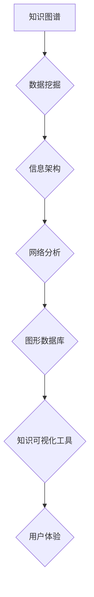

                 

## 知识的可视化工具：辅助理解的新方法

> 关键词：知识可视化、信息架构、数据挖掘、网络分析、图形数据库、认知科学、用户体验

## 1. 背景介绍

在信息爆炸的时代，人类面临着海量数据的挑战。如何有效地获取、理解和利用这些信息成为了当今社会面临的重大课题。传统的文本形式难以有效地呈现复杂知识结构，导致信息获取效率低下，理解难度增加。知识可视化作为一种新兴的技术，通过将抽象的知识转化为直观的图形表示，为用户提供了一种全新的理解和交互方式。

知识可视化工具利用图形、图表、网络等形式，将知识结构、关系和模式可视化呈现，帮助用户快速识别关键信息、发现隐藏的联系和模式，从而提升理解效率和知识获取能力。

## 2. 核心概念与联系

**2.1 知识图谱**

知识图谱是知识可视化的基础，它是一种结构化的知识表示形式，将知识表示为实体和关系的网络结构。实体代表现实世界中的事物，关系描述实体之间的联系。

**2.2 信息架构**

信息架构是指组织和结构化信息的方式，它决定了信息的层次、分类、导航和检索方式。良好的信息架构可以帮助用户快速找到所需信息，并理解信息之间的关系。

**2.3 数据挖掘**

数据挖掘是指从海量数据中提取有价值的知识和模式。通过数据挖掘技术，可以从文本、图像、音频等多种数据源中提取知识，构建知识图谱。

**2.4 网络分析**

网络分析是指研究网络结构和节点之间的关系。通过网络分析技术，可以分析知识图谱中的节点和关系，发现知识结构中的重要节点、关键路径和潜在的社区结构。

**2.5 图形数据库**

图形数据库是一种专门用于存储和查询图形数据的数据库。它可以高效地存储和查询知识图谱，并支持复杂的查询操作。

**2.6 认知科学**

认知科学研究人类的思维、学习和记忆过程。认知科学的原理可以指导知识可视化的设计，使其更符合人类的认知方式。

**2.7 用户体验**

用户体验是指用户使用产品或服务的感受。良好的用户体验可以提高用户的使用效率和满意度。

**Mermaid 流程图**



## 3. 核心算法原理 & 具体操作步骤

**3.1 算法原理概述**

知识可视化算法主要包括以下几个方面：

* **节点布局算法:** 将知识图谱中的节点按照一定的规则布局，使图形结构更加清晰易懂。常见的节点布局算法包括力导向布局、树形布局、层级布局等。
* **链接样式算法:** 根据节点之间的关系类型，选择不同的链接样式和颜色，使知识结构更加直观。
* **图形样式算法:** 根据节点类型和属性，选择不同的图形样式和颜色，突出关键信息。
* **交互算法:** 实现用户与知识图谱的交互，例如节点点击、链接跟踪、筛选过滤等。

**3.2 算法步骤详解**

1. **数据预处理:** 将原始数据清洗、转换和结构化，构建知识图谱。
2. **节点布局:** 使用节点布局算法将知识图谱中的节点布局，使图形结构更加清晰易懂。
3. **链接样式:** 根据节点之间的关系类型，选择不同的链接样式和颜色，使知识结构更加直观。
4. **图形样式:** 根据节点类型和属性，选择不同的图形样式和颜色，突出关键信息。
5. **交互实现:** 实现用户与知识图谱的交互，例如节点点击、链接跟踪、筛选过滤等。

**3.3 算法优缺点**

* **优点:** 
    * 可以有效地呈现复杂知识结构。
    * 可以帮助用户快速识别关键信息和隐藏的联系。
    * 可以提高用户对知识的理解和记忆。
* **缺点:** 
    * 算法复杂度较高，需要较强的计算能力。
    * 需要专业的知识和技能进行设计和实现。
    * 对于规模庞大的知识图谱，可视化效果可能存在性能瓶颈。

**3.4 算法应用领域**

* **教育:** 可视化学习内容，帮助学生理解复杂概念。
* **科研:** 可视化研究数据，发现隐藏的知识和模式。
* **商业:** 可视化商业数据，帮助企业决策。
* **医疗:** 可视化患者数据，辅助医生诊断和治疗。

## 4. 数学模型和公式 & 详细讲解 & 举例说明

**4.1 数学模型构建**

知识图谱可以表示为一个图结构，其中节点代表实体，边代表关系。可以使用数学模型来描述知识图谱的结构和性质。

* **节点:** 可以用一个集合表示，例如：N = {实体1, 实体2, ..., 实体n}
* **边:** 可以用一个关系集表示，例如：E = {(实体1, 关系1, 实体2), (实体2, 关系2, 实体3), ..., (实体m, 关系n, 实体n+1)}

**4.2 公式推导过程**

* **度数:** 节点的度数是指连接该节点的边的数量。
* **聚类系数:** 度量节点在图中的聚集程度。
* **中心性:** 度量节点在图中的重要性。

**4.3 案例分析与讲解**

例如，我们可以构建一个关于电影的知识图谱，其中节点代表电影、演员、导演等实体，边代表“主演”、“导演”等关系。通过分析知识图谱的度数、聚类系数和中心性，我们可以发现哪些电影比较受欢迎，哪些演员比较有影响力，哪些导演的作品风格比较独特。

## 5. 项目实践：代码实例和详细解释说明

**5.1 开发环境搭建**

* **编程语言:** Python
* **图形库:** NetworkX
* **可视化库:** Matplotlib

**5.2 源代码详细实现**

```python
import networkx as nx
import matplotlib.pyplot as plt

# 创建知识图谱
graph = nx.Graph()

# 添加节点
graph.add_node("电影1")
graph.add_node("电影2")
graph.add_node("演员1")
graph.add_node("演员2")
graph.add_node("导演1")

# 添加边
graph.add_edge("电影1", "演员1", relation="主演")
graph.add_edge("电影1", "导演1", relation="导演")
graph.add_edge("电影2", "演员2", relation="主演")

# 节点布局
pos = nx.spring_layout(graph)

# 绘制知识图谱
nx.draw(graph, pos, with_labels=True, node_color="skyblue", node_size=500, font_size=10)
plt.show()
```

**5.3 代码解读与分析**

* 使用 NetworkX 库创建知识图谱。
* 添加节点和边，定义实体和关系。
* 使用 spring_layout 布局算法布局节点。
* 使用 Matplotlib 库绘制知识图谱。

**5.4 运行结果展示**

代码运行后，将生成一个简单的电影知识图谱，展示了电影、演员和导演之间的关系。

## 6. 实际应用场景

**6.1 教育领域**

* 可视化学习内容，帮助学生理解复杂概念。例如，可视化历史事件的因果关系，可视化生物体的进化过程。
* 构建知识地图，帮助学生构建知识体系。
* 进行知识竞赛，激发学生的学习兴趣。

**6.2 科研领域**

* 可视化研究数据，发现隐藏的知识和模式。例如，可视化基因组数据，可视化蛋白质相互作用网络。
* 辅助科学发现，促进科研成果的传播。

**6.3 商业领域**

* 可视化商业数据，帮助企业决策。例如，可视化销售数据，可视化客户关系。
* 进行市场分析，识别潜在的市场机会。
* 提升产品设计，满足用户的需求。

**6.4 未来应用展望**

* **人工智能辅助知识可视化:** 利用人工智能技术自动生成知识图谱和可视化表示，降低知识可视化的门槛。
* **沉浸式知识可视化:** 利用虚拟现实和增强现实技术，构建沉浸式的知识体验环境。
* **个性化知识可视化:** 根据用户的需求和认知风格，定制个性化的知识可视化方案。

## 7. 工具和资源推荐

**7.1 学习资源推荐**

* **书籍:**
    * 《知识图谱：构建、查询和应用》
    * 《数据可视化：设计与实践》
* **在线课程:**
    * Coursera: 数据可视化
    * edX: 知识图谱

**7.2 开发工具推荐**

* **NetworkX:** Python 图论库
* **Gephi:** 开源图形可视化软件
* **D3.js:** JavaScript 图形库

**7.3 相关论文推荐**

* **Knowledge Graph Embedding: A Survey**
* **Visual Analytics for Knowledge Graphs**

## 8. 总结：未来发展趋势与挑战

**8.1 研究成果总结**

知识可视化技术在近年来取得了显著的进展，为我们提供了更加直观、高效的知识理解和交互方式。

**8.2 未来发展趋势**

* **人工智能辅助知识可视化:** 利用人工智能技术自动生成知识图谱和可视化表示，降低知识可视化的门槛。
* **沉浸式知识可视化:** 利用虚拟现实和增强现实技术，构建沉浸式的知识体验环境。
* **个性化知识可视化:** 根据用户的需求和认知风格，定制个性化的知识可视化方案。

**8.3 面临的挑战**

* **数据规模和复杂度:** 随着数据量的不断增长，知识图谱的规模和复杂度也随之增加，对算法和计算资源提出了更高的要求。
* **知识表示和推理:** 如何更好地表示和推理复杂知识，是知识可视化领域面临的重大挑战。
* **用户体验:** 如何设计更加直观、易用、交互性的知识可视化工具，是提升用户体验的关键。

**8.4 研究展望**

未来，知识可视化技术将继续朝着更加智能、个性化、沉浸式的方向发展，为我们提供更加高效、便捷的知识获取和理解方式。

## 9. 附录：常见问题与解答

**9.1 如何选择合适的节点布局算法？**

不同的节点布局算法具有不同的特点，选择合适的算法取决于具体的应用场景和数据特点。例如，力导向布局适合展示节点之间的关系，树形布局适合展示层次结构。

**9.2 如何设计交互式知识可视化工具？**

交互式知识可视化工具需要考虑用户的操作习惯和认知方式，设计直观、易用的交互操作，例如节点点击、链接跟踪、筛选过滤等。

**9.3 如何评估知识可视化工具的效果？**

可以根据用户反馈、任务完成时间、知识理解程度等指标来评估知识可视化工具的效果。


作者：禅与计算机程序设计艺术 / Zen and the Art of Computer Programming 
<end_of_turn>

