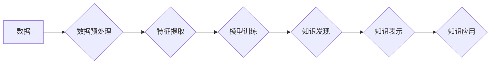

                 

## 知识管理的新纪元：知识发现引擎大放异彩

> 关键词：知识发现引擎、知识管理、人工智能、机器学习、深度学习、数据挖掘、知识图谱

### 1. 背景介绍

在信息爆炸的时代，海量数据无处不在，但这些数据往往散落在各个角落，难以被有效利用。传统的知识管理方法难以应对这种挑战，亟需新的技术手段来挖掘隐藏在数据中的知识。知识发现引擎作为一种新兴的技术，正逐渐成为知识管理的新纪元。

知识发现引擎（Knowledge Discovery Engine，KDE）是一种利用人工智能、机器学习、深度学习等技术，从海量数据中自动发现、提取、整理和呈现有价值的知识的系统。它能够帮助我们从数据中发现隐藏的模式、趋势和关系，从而为决策提供更科学、更精准的依据。

### 2. 核心概念与联系

#### 2.1  知识管理

知识管理是指组织内部知识的创建、共享、应用和维护的过程。它旨在通过有效地管理知识资产，提高组织的竞争力。传统的知识管理方法主要依靠人工收集、整理和传播知识，效率低下，难以应对海量数据的挑战。

#### 2.2  数据挖掘

数据挖掘是指从大量数据中发现隐藏的模式、趋势和关系的技术。它利用统计学、机器学习等方法，对数据进行分析和挖掘，从而提取出有价值的信息。

#### 2.3  人工智能

人工智能是指模拟人类智能的计算机系统。它包括机器学习、深度学习、自然语言处理等多个领域。人工智能技术为知识发现引擎提供了强大的分析和推理能力。

#### 2.4  知识发现引擎

知识发现引擎将上述三个概念有机结合，通过人工智能技术对数据进行分析和挖掘，从而发现隐藏的知识。它可以帮助我们从海量数据中提取出有价值的信息，并将其转化为可理解的知识，从而为决策提供支持。

**Mermaid 流程图**



### 3. 核心算法原理 & 具体操作步骤

#### 3.1  算法原理概述

知识发现引擎的核心算法主要包括：

* **数据预处理:** 对原始数据进行清洗、转换和格式化，使其适合后续的分析和挖掘。
* **特征提取:** 从数据中提取出具有代表性的特征，以便于模型训练和知识发现。
* **模型训练:** 利用机器学习算法对提取的特征进行训练，建立知识发现模型。
* **知识发现:** 利用训练好的模型对新的数据进行分析，发现隐藏的知识。
* **知识表示:** 将发现的知识以可理解的形式进行表示，例如知识图谱、规则等。
* **知识应用:** 将表示的知识应用于实际场景，例如决策支持、问题解答等。

#### 3.2  算法步骤详解

1. **数据收集:** 从各种数据源收集相关数据，例如文本、图像、音频等。
2. **数据清洗:** 去除数据中的噪声、缺失值和重复数据，确保数据质量。
3. **数据转换:** 将数据转换为适合模型训练的格式，例如数值化、向量化等。
4. **特征工程:** 通过提取、转换和组合特征，构建更具代表性的特征集。
5. **模型选择:** 根据具体任务选择合适的机器学习算法，例如分类、聚类、关联规则挖掘等。
6. **模型训练:** 利用训练数据对模型进行训练，调整模型参数，使其能够准确地发现知识。
7. **模型评估:** 利用测试数据对模型进行评估，衡量模型的性能，例如准确率、召回率等。
8. **知识发现:** 利用训练好的模型对新的数据进行分析，发现隐藏的知识。
9. **知识表示:** 将发现的知识以可理解的形式进行表示，例如知识图谱、规则等。
10. **知识应用:** 将表示的知识应用于实际场景，例如决策支持、问题解答等。

#### 3.3  算法优缺点

**优点:**

* 自动化知识发现: KDE 可以自动从海量数据中发现知识，无需人工干预。
* 提高效率: KDE 可以显著提高知识发现效率，节省人力成本。
* 发现隐藏知识: KDE 可以发现传统方法难以发现的隐藏知识。

**缺点:**

* 数据质量依赖: KDE 的性能依赖于数据质量，数据质量差会导致知识发现结果不准确。
* 算法选择困难: 选择合适的算法对知识发现结果至关重要，需要根据具体任务进行选择。
* 知识解释性: 一些 KDE 算法的知识解释性较差，难以理解模型的决策过程。

#### 3.4  算法应用领域

* **商业智能:** 从销售数据、客户数据等中发现商业模式和趋势。
* **医疗保健:** 从患者数据、医学文献等中发现疾病诊断和治疗方法。
* **金融服务:** 从交易数据、市场数据等中发现投资机会和风险。
* **教育:** 从学生数据、学习资源等中发现个性化学习方案。
* **科学研究:** 从实验数据、文献数据等中发现科学规律和新知识。

### 4. 数学模型和公式 & 详细讲解 & 举例说明

#### 4.1  数学模型构建

知识发现引擎的数学模型通常基于统计学、概率论和机器学习算法。常见的数学模型包括：

* **贝叶斯网络:** 用于表示变量之间的概率关系，可以用于分类、预测和推理。
* **决策树:** 用于将数据分类或预测，通过一系列的决策规则将数据划分为不同的类别。
* **支持向量机:** 用于分类和回归，通过寻找最佳的分隔超平面将数据划分为不同的类别。
* **神经网络:** 用于模拟人类大脑的学习过程，可以用于图像识别、自然语言处理等任务。

#### 4.2  公式推导过程

具体的公式推导过程取决于所使用的算法和模型。例如，决策树的构建过程涉及信息增益、基尼不纯度等概念，其公式推导过程较为复杂。

#### 4.3  案例分析与讲解

以贝叶斯网络为例，假设我们想要预测一个人的患病风险，根据其年龄、性别、家族病史等特征。我们可以构建一个贝叶斯网络模型，其中每个节点代表一个变量，例如年龄、性别、家族病史、患病风险等。

每个节点之间的边表示变量之间的概率关系。例如，年龄和性别可能影响患病风险，家族病史也可能影响患病风险。通过收集数据并训练贝叶斯网络模型，我们可以得到每个变量之间的概率关系，从而预测一个人的患病风险。

### 5. 项目实践：代码实例和详细解释说明

#### 5.1  开发环境搭建

* **操作系统:** Linux/macOS/Windows
* **编程语言:** Python
* **库依赖:** scikit-learn、TensorFlow、PyTorch等

#### 5.2  源代码详细实现

```python
# 导入必要的库
import pandas as pd
from sklearn.model_selection import train_test_split
from sklearn.linear_model import LogisticRegression

# 加载数据
data = pd.read_csv("data.csv")

# 划分训练集和测试集
X_train, X_test, y_train, y_test = train_test_split(data.drop("target", axis=1), data["target"], test_size=0.2)

# 创建逻辑回归模型
model = LogisticRegression()

# 训练模型
model.fit(X_train, y_train)

# 预测测试集
y_pred = model.predict(X_test)

# 评估模型性能
from sklearn.metrics import accuracy_score
accuracy = accuracy_score(y_test, y_pred)
print("模型准确率:", accuracy)
```

#### 5.3  代码解读与分析

* **数据加载:** 使用 pandas 库加载数据文件。
* **数据划分:** 使用 train_test_split 函数将数据划分为训练集和测试集。
* **模型创建:** 使用 LogisticRegression 类创建逻辑回归模型。
* **模型训练:** 使用 fit 函数训练模型，将训练数据输入模型进行学习。
* **模型预测:** 使用 predict 函数对测试集进行预测。
* **模型评估:** 使用 accuracy_score 函数计算模型的准确率。

#### 5.4  运行结果展示

运行上述代码后，会输出模型的准确率。

### 6. 实际应用场景

#### 6.1  商业智能

* **客户画像:** 从客户数据中发现客户的特征和行为模式，进行精准营销。
* **市场趋势分析:** 从市场数据中发现产品需求和市场趋势，进行产品开发和市场策略调整。
* **风险预测:** 从财务数据中发现潜在的财务风险，进行风险控制和管理。

#### 6.2  医疗保健

* **疾病诊断:** 从患者数据中发现疾病的诊断特征，提高诊断准确率。
* **药物研发:** 从生物数据中发现新的药物靶点和药物候选物，加速药物研发。
* **个性化治疗:** 从患者数据中发现患者的个体差异，制定个性化的治疗方案。

#### 6.3  金融服务

* **欺诈检测:** 从交易数据中发现欺诈行为的特征，提高欺诈检测准确率。
* **信用评估:** 从客户数据中评估客户的信用风险，为贷款决策提供依据。
* **投资预测:** 从市场数据中预测股票价格和市场趋势，为投资决策提供支持。

#### 6.4  未来应用展望

随着人工智能技术的不断发展，知识发现引擎将应用于更多领域，例如教育、制造、能源等。未来，知识发现引擎将更加智能化、自动化，能够更好地帮助我们理解世界，解决问题，创造价值。

### 7. 工具和资源推荐

#### 7.1  学习资源推荐

* **书籍:**
    * 《数据挖掘：概念与技术》
    * 《机器学习》
    * 《深度学习》
* **在线课程:**
    * Coursera: 数据挖掘和机器学习
    * edX: 深度学习
    * Udacity: 机器学习工程师

#### 7.2  开发工具推荐

* **Python:** 广泛应用于数据挖掘和机器学习领域，拥有丰富的库和工具。
* **R:** 专注于统计分析和数据可视化，也用于数据挖掘和机器学习。
* **KNIME:** 开源数据挖掘平台，提供图形化界面和丰富的节点，方便数据分析和模型构建。

#### 7.3  相关论文推荐

* **《Knowledge Discovery in Databases》:** 
* **《Machine Learning》:** 
* **《Artificial Intelligence》:**

### 8. 总结：未来发展趋势与挑战

#### 8.1  研究成果总结

知识发现引擎作为一种新兴技术，取得了显著的成果，在商业智能、医疗保健、金融服务等领域得到了广泛应用。

#### 8.2  未来发展趋势

* **更智能的算法:** 发展更智能、更强大的机器学习算法，例如深度学习、强化学习等。
* **更丰富的知识表示:** 探索更丰富的知识表示形式，例如知识图谱、语义网络等。
* **更个性化的知识发现:** 基于用户需求和偏好，提供更个性化的知识发现服务。
* **更广泛的应用场景:** 将知识发现引擎应用于更多领域，例如教育、制造、能源等。

#### 8.3  面临的挑战

* **数据质量问题:** 数据质量差会影响知识发现结果的准确性。
* **算法解释性问题:** 一些算法的决策过程难以解释，难以理解模型的推理过程。
* **知识可信度问题:** 发现的知识需要进行验证和评估，确保其可信度。

#### 8.4  研究展望

未来，知识发现引擎的研究将继续深入，探索更智能、更强大的知识发现方法，为人类社会创造更多价值。

### 9. 附录：常见问题与解答

* **什么是知识发现引擎？**

知识发现引擎是一种利用人工智能技术从海量数据中自动发现、提取、整理和呈现有价值的知识的系统。

* **知识发现引擎有哪些应用场景？**

知识发现引擎应用于商业智能、医疗保健、金融服务、教育、制造、能源等多个领域。

* **如何选择合适的知识发现引擎？**

选择合适的知识发现引擎需要根据具体任务、数据类型、性能要求等因素进行考虑。

* **如何评估知识发现引擎的性能？**

常用的评估指标包括准确率、召回率、F1-score等。

* **如何保证知识发现引擎的知识可信度？**

发现的知识需要进行验证和评估，确保其准确性和可靠性。


作者：禅与计算机程序设计艺术 / Zen and the Art of Computer Programming 
<end_of_turn>

