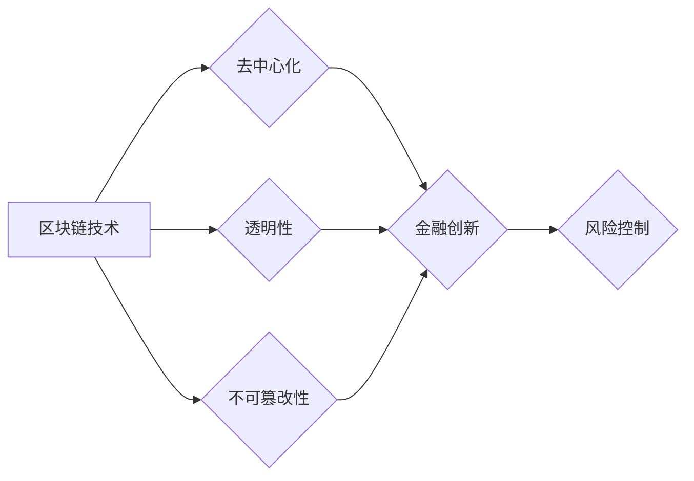

                 

## 硅谷区块链金融创新的风险控制

> 关键词：区块链、金融创新、风险控制、智能合约、去中心化、监管、安全、隐私

## 1. 背景介绍

硅谷作为全球科技创新的中心，近年来区块链技术在金融领域的应用日益广泛，催生了一系列金融创新，例如去中心化金融 (DeFi)、数字资产交易、供应链金融等。这些创新为金融服务带来了新的机遇，但也带来了新的风险。

区块链技术的去中心化、透明性和不可篡改性为金融创新提供了强大的技术基础，但也带来了新的挑战。例如，智能合约的执行不可逆转，一旦出现漏洞或恶意攻击，可能导致不可挽回的损失；去中心化的特性使得监管难度增加，也为洗钱、诈骗等犯罪活动提供了便利。

因此，如何有效控制区块链金融创新的风险，保障金融安全和稳定，成为业界关注的焦点。

## 2. 核心概念与联系

### 2.1 区块链技术

区块链是一种分布式账本技术，其核心特点包括：

* **去中心化:** 数据存储在多个节点上，不存在单一中心控制，提高了系统的安全性与抗攻击性。
* **透明性:** 所有交易记录都公开透明，任何人都可以查看，提高了交易的信任度。
* **不可篡改性:** 数据一旦写入区块链，就无法修改，保证了数据的完整性和可靠性。

### 2.2 金融创新

区块链技术为金融创新提供了新的可能性，例如：

* **去中心化金融 (DeFi):** 通过智能合约实现去中心化的金融服务，例如借贷、交易、保险等，降低了金融服务的成本和门槛。
* **数字资产交易:** 区块链技术可以用于创建和交易数字资产，例如加密货币、代币等，为金融市场带来了新的投资机会。
* **供应链金融:** 区块链技术可以提高供应链的透明度和效率，为供应链金融提供了新的解决方案。

### 2.3 风险控制

风险控制是指识别、评估和管理各种可能威胁组织目标的风险。在区块链金融领域，风险控制需要考虑以下方面：

* **技术风险:** 区块链技术本身的缺陷或漏洞，例如智能合约漏洞、网络攻击等。
* **合规风险:** 违反相关法律法规，例如反洗钱、反恐融资等。
* **运营风险:** 系统故障、数据丢失、人员错误等。

**核心概念与联系流程图**



## 3. 核心算法原理 & 具体操作步骤

### 3.1 算法原理概述

区块链技术的核心算法包括：

* **哈希算法:** 用于生成区块的唯一标识，确保数据的完整性和不可篡改性。
* **密码学算法:** 用于加密和解密数据，保障交易的安全性。
* **共识算法:** 用于验证交易和生成新的区块，确保区块链的去中心化和一致性。

### 3.2 算法步骤详解

**哈希算法步骤:**

1. 将待哈希的数据进行编码。
2. 使用哈希函数对编码后的数据进行计算。
3. 得到一个固定长度的哈希值，作为数据的唯一标识。

**密码学算法步骤:**

1. 选择合适的加密算法，例如RSA、ECC等。
2. 生成密钥对，包括公钥和私钥。
3. 使用私钥加密数据，只有拥有对应公钥的人才能解密。

**共识算法步骤:**

1. 节点接收交易请求。
2. 节点验证交易的合法性。
3. 节点将交易打包成区块。
4. 节点使用共识算法竞争生成新的区块。
5. 获胜节点将新的区块添加到区块链中。

### 3.3 算法优缺点

**哈希算法:**

* **优点:** 具有不可逆性和抗碰撞性，保证数据的完整性和安全性。
* **缺点:** 无法验证数据的真实性，只能保证数据的完整性。

**密码学算法:**

* **优点:** 可以实现数据加密和解密，保障交易的安全性。
* **缺点:** 密钥管理复杂，密钥泄露可能导致数据泄露。

**共识算法:**

* **优点:** 确保区块链的去中心化和一致性。
* **缺点:** 不同的共识算法性能和效率不同，需要根据实际情况选择。

### 3.4 算法应用领域

* **哈希算法:** 数字签名、数据完整性验证、密码学等。
* **密码学算法:** 电子商务、金融交易、信息安全等。
* **共识算法:** 区块链技术、分布式账本等。

## 4. 数学模型和公式 & 详细讲解 & 举例说明

### 4.1 数学模型构建

区块链的安全性依赖于哈希函数的抗碰撞性。哈希函数可以看作是一个映射函数，将任意长度的数据映射到固定长度的哈希值。

假设哈希函数为H(x)，其中x为输入数据，H(x)为输出哈希值。

**数学模型:**

```
H(x) = y
```

其中，y为哈希值，是一个固定长度的字符串。

### 4.2 公式推导过程

哈希函数的抗碰撞性是指，给定一个哈希值y，很难找到一个不同的输入数据x'，使得H(x') = y。

**碰撞攻击:**

碰撞攻击是指找到两个不同的输入数据x和x'，使得H(x) = H(x')。

**抗碰撞性:**

抗碰撞性是指，对于任意给定的哈希值y，找到一个满足H(x) = y的输入数据x的难度非常高。

### 4.3 案例分析与讲解

**SHA-256哈希算法:**

SHA-256是一种常用的哈希算法，其输出哈希值长度为256位。

**案例:**

假设我们想要使用SHA-256哈希算法对一个字符串"Hello, world!"进行哈希运算。

**结果:**

SHA-256("Hello, world!") = 098f2bc8221e4c58a2b291567d031a79b1110990e914601739020705a7b55404

**分析:**

即使我们稍微修改字符串，例如将"Hello"改为"Goodbye"，SHA-256哈希值也会发生巨大的变化。

这表明SHA-256哈希算法具有很强的抗碰撞性，可以有效保证数据的完整性和安全性。

## 5. 项目实践：代码实例和详细解释说明

### 5.1 开发环境搭建

* **操作系统:** Linux、macOS或Windows
* **编程语言:** Python、Go、JavaScript等
* **区块链框架:** Ethereum、Hyperledger Fabric等

### 5.2 源代码详细实现

**Python代码示例 (使用Ethereum区块链框架):**

```python
from web3 import Web3

# 连接到Ethereum节点
w3 = Web3(Web3.HTTPProvider("https://mainnet.infura.io/v3/YOUR_INFURA_PROJECT_ID"))

# 创建智能合约
contract_abi = [
    {
        "constant": True,
        "inputs": [],
        "name": "getBalance",
        "outputs": [{"name": "", "type": "uint256"}],
        "payable": False,
        "stateMutability": "view",
        "type": "function"
    }
]
contract_address = "0xYOUR_CONTRACT_ADDRESS"
contract = w3.eth.contract(address=contract_address, abi=contract_abi)

# 调用智能合约函数
balance = contract.functions.getBalance().call()

# 打印余额
print(balance)
```

### 5.3 代码解读与分析

* **连接到Ethereum节点:** 使用Web3库连接到Ethereum主网节点。
* **创建智能合约:** 使用智能合约的ABI和地址创建合约对象。
* **调用智能合约函数:** 使用合约对象调用智能合约的函数，获取余额信息。
* **打印余额:** 打印获取到的余额信息。

### 5.4 运行结果展示

运行代码后，将打印出智能合约的余额信息。

## 6. 实际应用场景

### 6.1 DeFi

* **去中心化借贷平台:** 用户可以利用自己的加密资产作为抵押品，从平台借取稳定币或其他加密资产。
* **去中心化交易所:** 用户可以进行加密资产的直接交易，无需第三方平台。
* **去中心化保险平台:** 用户可以购买去中心化的保险产品，保障自己的资产安全。

### 6.2 数字资产交易

* **加密货币交易平台:** 用户可以进行加密货币的买卖交易。
* **代币发行平台:** 项目方可以使用区块链技术发行自己的代币，用于融资或社区治理。
* **数字资产管理平台:** 用户可以管理自己的数字资产，例如加密货币、NFT等。

### 6.3 供应链金融

* **供应链融资:** 供应商可以利用区块链技术获得更便捷的融资，降低融资成本。
* **供应链管理:** 区块链技术可以提高供应链的透明度和效率，降低供应链风险。
* **贸易融资:** 贸易商可以使用区块链技术进行贸易融资，提高融资效率。

### 6.4 未来应用展望

* **数字身份:** 区块链技术可以用于创建去中心化的数字身份，保障个人隐私和数据安全。
* **数据共享:** 区块链技术可以用于构建安全的跨组织数据共享平台，促进数据流通和应用。
* **投票和选举:** 区块链技术可以用于构建安全的投票和选举系统，提高投票的透明度和安全性。

## 7. 工具和资源推荐

### 7.1 学习资源推荐

* **书籍:**
    * "Mastering Bitcoin" by Andreas M. Antonopoulos
    * "Blockchain Revolution" by Don Tapscott and Alex Tapscott
* **在线课程:**
    * Coursera: Blockchain Specialization
    * edX: Blockchain Fundamentals
* **博客和论坛:**
    * BitcoinTalk
    * Ethereum Stack Exchange

### 7.2 开发工具推荐

* **开发环境:**
    * Remix IDE
    * Truffle Suite
* **钱包:**
    * MetaMask
    * MyEtherWallet
* **区块链浏览器:**
    * Etherscan
    * Blockchair

### 7.3 相关论文推荐

* **"Bitcoin: A Peer-to-Peer Electronic Cash System"** by Satoshi Nakamoto
* **"A Next-Generation Smart Contract Platform"** by Gavin Wood
* **"The Blockchain Revolution: How the Technology Behind Bitcoin Is Changing Money, Business, and the World"** by Don Tapscott and Alex Tapscott

## 8. 总结：未来发展趋势与挑战

### 8.1 研究成果总结

区块链技术在金融领域的应用取得了显著进展，为金融创新带来了新的机遇。

### 8.2 未来发展趋势

* **更广泛的应用场景:** 区块链技术将应用于更多金融领域，例如保险、投资、财富管理等。
* **更强大的功能:** 区块链技术将不断发展，提供更强大的功能，例如隐私保护、可信计算等。
* **更完善的监管框架:** 随着区块链技术的成熟，各国将逐步建立完善的监管框架，保障区块链金融的健康发展。

### 8.3 面临的挑战

* **技术挑战:** 区块链技术还存在一些技术挑战，例如可扩展性、安全性、隐私保护等。
* **监管挑战:** 区块链技术的去中心化特性使得监管难度增加，需要各国政府加强合作，制定统一的监管标准。
* **公众认知挑战:** 公众对区块链技术的认知度还比较低，需要加强宣传教育，提高公众对区块链技术的理解和接受度。

### 8.4 研究展望

未来，区块链技术将继续发展，为金融行业带来更多创新和变革。

## 9. 附录：常见问题与解答

**常见问题:**

* **什么是区块链？**

区块链是一种分布式账本技术，其核心特点包括去中心化、透明性和不可篡改性。

* **区块链技术如何应用于金融？**

区块链技术可以应用于金融领域的多个领域，例如去中心化金融、数字资产交易、供应链金融等。

* **区块链金融有哪些风险？**

区块链金融存在技术风险、合规风险、运营风险等。

* **如何控制区块链金融的风险？**

可以通过技术手段、法律法规、监管制度等方式控制区块链金融的风险。

**作者：禅与计算机程序设计艺术 / Zen and the Art of Computer Programming**<end_of_turn>

