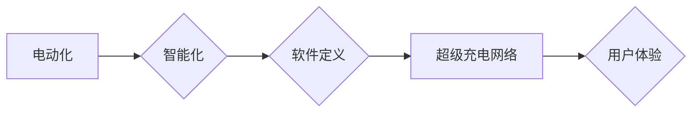

                 

## 硅谷新能源汽车:特斯拉的崛起

> 关键词：特斯拉，新能源汽车，电动汽车，自动驾驶，人工智能，电池技术，软件定义汽车

## 1. 背景介绍

21世纪初，全球范围内对环境污染和能源安全问题的日益关注，推动了新能源汽车产业的快速发展。作为这场革命的领军者，特斯拉凭借其创新的技术、强大的品牌影响力和商业模式的突破，迅速崛起，成为全球新能源汽车行业的标杆。本文将从技术、商业模式和社会影响等多个角度，深入探讨特斯拉的成功之道，并分析其对未来汽车行业的深远影响。

### 1.1 新能源汽车发展现状

传统燃油汽车的排放污染和对化石燃料的依赖，已成为全球面临的重大挑战。新能源汽车作为一种清洁、高效、可持续的交通方式，逐渐成为主流汽车发展趋势。近年来，全球范围内对新能源汽车的投资和研发力度不断加大，市场规模持续扩大。

### 1.2 特斯拉的崛起

特斯拉成立于2003年，由马斯克、塔尔博和马丁等一群科技创业者创立。公司最初专注于开发高性能电动跑车，并通过其独特的品牌定位和营销策略，迅速吸引了全球消费者的关注。随着技术的不断进步和成本的下降，特斯拉逐步扩展产品线，推出了一系列车型，涵盖轿车、SUV和卡车等，满足了不同消费者的需求。

## 2. 核心概念与联系

特斯拉的成功离不开其在多个核心领域的创新和突破。

* **电动化:**特斯拉将电动技术应用于汽车领域，彻底颠覆了传统燃油汽车的动力系统。
* **智能化:**特斯拉将人工智能、自动驾驶和互联技术融入汽车设计，打造了智能化、互联化的驾驶体验。
* **软件定义:**特斯拉将软件视为汽车的核心竞争力，通过不断更新的软件版本，提升汽车的功能和性能。
* **超级充电网络:**特斯拉建立了全球性的超级充电网络，为用户提供便捷的充电服务，解决了电动汽车续航焦虑。

**核心概念与联系流程图:**

## 3. 核心算法原理 & 具体操作步骤

特斯拉的自动驾驶系统是其核心技术之一，其背后基于一系列复杂的算法和模型。

### 3.1  算法原理概述

特斯拉的自动驾驶系统主要依赖于计算机视觉、深度学习和路径规划等算法。

* **计算机视觉:**利用摄像头、雷达和超声波传感器等感知设备，获取车辆周围环境的信息，并进行图像识别、目标检测和场景理解。
* **深度学习:**利用深度神经网络模型，对感知到的环境数据进行分析和学习，识别道路标志、交通信号灯、行人、车辆等物体，并预测其运动轨迹。
* **路径规划:**根据感知到的环境信息和目标位置，规划出最优的驾驶路径，并控制车辆的转向、加速和制动。

### 3.2  算法步骤详解

1. **数据采集:**利用感知设备收集车辆周围环境的数据，包括图像、雷达信号和超声波数据。
2. **数据预处理:**对采集到的数据进行清洗、格式化和增强，以便于后续算法的训练和应用。
3. **模型训练:**利用深度学习算法，对预处理后的数据进行训练，建立起识别物体、预测轨迹和规划路径的模型。
4. **模型推理:**将训练好的模型应用于实时数据，进行物体识别、轨迹预测和路径规划。
5. **控制执行:**根据规划出的路径，控制车辆的转向、加速和制动，实现自动驾驶功能。

### 3.3  算法优缺点

**优点:**

* **高精度:**深度学习算法能够实现高精度的物体识别和轨迹预测。
* **适应性强:**模型能够根据不同的环境和驾驶场景进行自适应调整。
* **持续进化:**通过不断收集数据和进行模型更新，自动驾驶系统能够不断提升其性能。

**缺点:**

* **数据依赖:**深度学习算法需要大量的训练数据，数据质量和数量直接影响模型的性能。
* **计算复杂度高:**模型训练和推理过程需要大量的计算资源。
* **安全风险:**自动驾驶系统仍然存在安全风险，需要不断完善算法和测试机制。

### 3.4  算法应用领域

特斯拉的自动驾驶算法不仅应用于其自身的汽车产品，也为其他汽车制造商和自动驾驶技术公司提供技术支持。

## 4. 数学模型和公式 & 详细讲解 & 举例说明

特斯拉的自动驾驶系统中，路径规划算法是一个关键环节，其核心是利用数学模型和公式来计算最优的驾驶路径。

### 4.1  数学模型构建

路径规划算法通常基于图论模型，将道路环境抽象为一个图结构，其中节点代表路口或关键位置，边代表道路连接。

* **节点:**每个节点包含位置信息、道路类型、交通信号灯状态等信息。
* **边:**每条边包含长度、速度限制、弯道半径等信息。

### 4.2  公式推导过程

最优路径规划算法通常采用 Dijkstra 算法或 A* 算法。

* **Dijkstra 算法:**从起点节点出发，逐层扩展到相邻节点，计算每个节点到终点的最短距离，最终找到最短路径。
* **A* 算法:**基于 Dijkstra 算法，引入了启发函数，根据节点到终点的估计距离，优先搜索更靠近终点的节点，提高算法效率。

### 4.3  案例分析与讲解

假设一辆特斯拉汽车需要从起点 A 到达终点 B，道路环境可以抽象为一个图结构，其中 A 和 B 是两个节点，连接它们的道路是边。

Dijkstra 算法会从起点 A 开始，计算到每个相邻节点的距离，并选择距离最短的节点进行扩展。重复此过程，直到到达终点 B。

A* 算法会根据启发函数，优先搜索更靠近终点的节点，从而更快地找到最短路径。

## 5. 项目实践：代码实例和详细解释说明

特斯拉的自动驾驶系统是一个复杂的软件系统，其代码实现涉及多个领域，包括计算机视觉、深度学习、路径规划和控制算法。

### 5.1  开发环境搭建

特斯拉的自动驾驶系统开发环境通常基于 Linux 操作系统，并使用 Python 作为主要编程语言。

### 5.2  源代码详细实现

由于特斯拉的源代码是私有的，无法公开分享。

### 5.3  代码解读与分析

特斯拉的自动驾驶系统代码实现涉及多个模块，包括：

* **感知模块:**负责处理摄像头、雷达和超声波传感器等数据的采集和预处理。
* **决策模块:**利用深度学习算法，对感知到的环境数据进行分析和决策，例如识别物体、预测轨迹和规划路径。
* **控制模块:**根据决策模块的输出，控制车辆的转向、加速和制动。

### 5.4  运行结果展示

特斯拉的自动驾驶系统在实际道路环境中表现出色，能够实现自动驾驶、自动泊车、自动变道等功能。

## 6. 实际应用场景

特斯拉的自动驾驶系统已在全球范围内应用于其汽车产品，为用户提供更安全、更便捷的驾驶体验。

### 6.1  自动驾驶

特斯拉的自动驾驶系统能够实现 L2 级和部分 L3 级自动驾驶功能，例如自动加速、自动制动、自动转向和自动泊车。

### 6.2  自动泊车

特斯拉的自动泊车功能能够自动寻找停车位并完成泊车操作，减轻用户的驾驶负担。

### 6.3  自动变道

特斯拉的自动变道功能能够自动判断变道安全情况，并完成变道操作。

### 6.4  未来应用展望

随着自动驾驶技术的不断发展，特斯拉的自动驾驶系统将实现更高的自动化程度，并应用于更多场景，例如自动驾驶出租车、自动驾驶货车等。

## 7. 工具和资源推荐

### 7.1  学习资源推荐

* **Coursera:** 提供自动驾驶、机器学习和深度学习等相关课程。
* **Udacity:** 提供自动驾驶工程师和数据科学家等专业培训课程。
* **OpenCV:** 一个开源计算机视觉库，用于图像处理、物体识别和视频分析。
* **TensorFlow:** 一个开源深度学习框架，用于训练和部署深度学习模型。

### 7.2  开发工具推荐

* **ROS (Robot Operating System):** 一个开源机器人操作系统，用于开发自动驾驶系统。
* **Gazebo:** 一个开源机器人仿真平台，用于测试和验证自动驾驶算法。
* **Python:** 一个开源编程语言，广泛应用于自动驾驶系统开发。

### 7.3  相关论文推荐

* **"End to End Learning for Self-Driving Cars"**
* **"Deep Learning for Autonomous Driving"**
* **"A Survey of Deep Learning for Autonomous Driving"**

## 8. 总结：未来发展趋势与挑战

### 8.1  研究成果总结

特斯拉的成功证明了新能源汽车和自动驾驶技术的巨大潜力，其创新技术和商业模式为全球汽车行业带来了深刻变革。

### 8.2  未来发展趋势

* **自动驾驶技术将更加成熟:**自动驾驶系统将实现更高的自动化程度，并应用于更多场景。
* **电池技术将不断进步:**电池续航里程将进一步提升，充电时间将缩短。
* **智能化和互联化将更加深入:**汽车将成为一个智能终端，提供更丰富的娱乐、信息和服务功能。

### 8.3  面临的挑战

* **安全风险:**自动驾驶系统仍然存在安全风险，需要不断完善算法和测试机制。
* **法规政策:**自动驾驶技术的应用需要完善的法律法规和政策支持。
* **成本问题:**自动驾驶系统和新能源汽车的成本仍然较高，需要进一步降低。

### 8.4  研究展望

未来，自动驾驶技术将继续朝着更安全、更可靠、更智能的方向发展，特斯拉将继续引领行业发展，推动汽车行业向未来迈进。

## 9. 附录：常见问题与解答

### 9.1  特斯拉的自动驾驶系统是否完全自动驾驶？

特斯拉的自动驾驶系统目前实现的是部分自动驾驶功能，例如自动加速、自动制动、自动转向和自动泊车。用户仍然需要保持对车辆的监控，并随时准备接管驾驶控制权。

### 9.2  特斯拉的自动驾驶系统是否安全可靠？

特斯拉的自动驾驶系统经过了严格的测试和验证，但仍然存在安全风险。用户需要了解自动驾驶系统的功能和局限性，并谨慎使用。

### 9.3  特斯拉的自动驾驶系统需要支付哪些费用？

特斯拉的自动驾驶系统需要购买软件授权，费用根据车型和功能有所不同。

### 9.4  特斯拉的自动驾驶系统是否支持所有道路环境？

特斯拉的自动驾驶系统在特定道路环境下表现出色，但并不支持所有道路环境。例如，在复杂的路况、恶劣的天气条件下，自动驾驶系统可能会遇到困难。

作者：禅与计算机程序设计艺术 / Zen and the Art of Computer Programming 
<end_of_turn>

