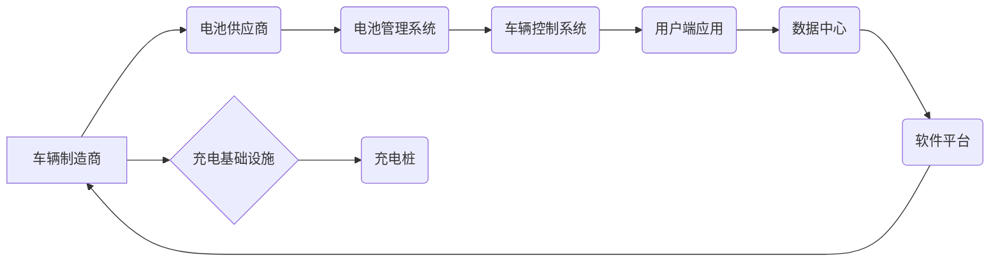

                 

## 硅谷新能源汽车竞争:电动车生态系统

> 关键词：电动汽车、生态系统、软件架构、人工智能、电池技术、自动驾驶、数据分析、云计算

## 1. 背景介绍

21世纪，全球范围内对可持续发展和环境保护的关注日益加剧，新能源汽车作为替代传统燃油汽车的绿色出行方式，逐渐成为全球汽车产业发展的主流趋势。硅谷，作为全球科技创新的中心，在电动汽车领域也涌现出众多科技巨头和新兴企业，掀起了激烈的竞争浪潮。本文将深入探讨硅谷新能源汽车竞争的现状，分析电动车生态系统的核心概念、技术架构、算法原理、数学模型以及实际应用场景，并展望未来发展趋势和挑战。

## 2. 核心概念与联系

电动车生态系统是一个复杂而庞大的网络，涉及到车辆制造、电池技术、充电基础设施、软件平台、数据分析、用户服务等多个环节。

**2.1  电动车生态系统架构**



**2.2  核心概念**

* **车辆制造商:**  负责设计、开发和生产电动汽车。
* **电池供应商:**  提供电动汽车所需的电池组和电池管理系统。
* **充电基础设施:**  包括充电桩、充电网络和支付系统等，为电动汽车提供充电服务。
* **软件平台:**  提供车辆控制、数据分析、用户服务等功能，连接车辆、用户和服务商。
* **数据中心:**  收集和存储车辆运行数据，用于优化车辆性能、预测维护需求和提供个性化服务。

## 3. 核心算法原理 & 具体操作步骤

**3.1  算法原理概述**

电动车生态系统中，许多关键功能都依赖于复杂的算法，例如电池管理、充电策略、自动驾驶、数据分析等。这些算法通常基于机器学习、深度学习、优化算法等技术，通过对海量数据进行分析和处理，实现智能化控制和决策。

**3.2  算法步骤详解**

以电池管理系统为例，其核心算法通常包括以下步骤：

1. **电池状态估计:**  利用传感器数据和电池模型，实时估计电池的电量、温度、电压等状态参数。
2. **充电策略优化:**  根据电池状态、充电环境和用户需求，制定最优的充电策略，以延长电池寿命和提高充电效率。
3. **电池健康管理:**  通过对电池运行数据进行分析，识别电池老化和故障迹象，并采取相应的措施进行维护和修复。

**3.3  算法优缺点**

* **优点:**  智能化控制、提高效率、延长电池寿命、增强安全性。
* **缺点:**  算法复杂度高、数据依赖性强、需要强大的计算能力。

**3.4  算法应用领域**

* **电池管理系统:**  优化电池充电和放电策略，延长电池寿命。
* **自动驾驶系统:**  感知环境、规划路径、控制车辆行驶。
* **数据分析平台:**  分析车辆运行数据，优化车辆性能、预测维护需求。
* **用户服务平台:**  提供个性化服务、远程诊断、车辆远程控制等功能。

## 4. 数学模型和公式 & 详细讲解 & 举例说明

**4.1  数学模型构建**

电池管理系统中，常用的数学模型包括电池电化学模型、电池热管理模型、电池寿命预测模型等。

**4.2  公式推导过程**

以电池电化学模型为例，其核心公式描述了电池电压、电流和电量之间的关系。

$$V = V_0 - k_1 \cdot I - k_2 \cdot I^2$$

其中：

* $V$：电池电压
* $V_0$：电池开路电压
* $I$：电池电流
* $k_1$、$k_2$：电池电化学参数

**4.3  案例分析与讲解**

通过对电池电化学模型的分析，可以预测电池在不同充电电流和放电电流下的电压变化趋势，从而制定最优的充电策略，延长电池寿命。

## 5. 项目实践：代码实例和详细解释说明

**5.1  开发环境搭建**

开发电动车生态系统相关的软件项目，需要搭建相应的开发环境，包括操作系统、编程语言、开发工具等。

**5.2  源代码详细实现**

以电池管理系统的代码实现为例，可以使用Python语言结合机器学习库进行开发。

```python
# 导入必要的库
import numpy as np
from sklearn.linear_model import LinearRegression

# 定义电池电化学模型
def battery_model(voltage, current):
    # 使用线性回归模型拟合电池电化学参数
    model = LinearRegression()
    model.fit(np.array([current]).reshape(-1, 1), np.array([voltage]))
    k1 = model.coef_[0]
    k2 = model.intercept_
    return k1, k2

# 获取电池电压和电流数据
voltage = 4.2
current = 10

# 调用电池电化学模型
k1, k2 = battery_model(voltage, current)

# 打印电池电化学参数
print(f"k1: {k1}")
print(f"k2: {k2}")
```

**5.3  代码解读与分析**

这段代码首先导入必要的库，然后定义了一个电池电化学模型函数，该函数使用线性回归模型拟合电池电化学参数。接着，获取电池电压和电流数据，调用电池电化学模型函数进行计算，最后打印电池电化学参数。

**5.4  运行结果展示**

运行这段代码后，会输出电池电化学参数 $k_1$ 和 $k_2$ 的值。

## 6. 实际应用场景

电动车生态系统已经广泛应用于各个领域，例如：

* **个人出行:**  电动汽车为个人出行提供绿色、环保、经济的出行方式。
* **公共交通:**  电动公交车、电动出租车等，可以减少城市交通拥堵和空气污染。
* **物流运输:**  电动货车、电动卡车等，可以提高物流效率和降低运输成本。

**6.4  未来应用展望**

未来，电动车生态系统将更加智能化、互联化和个性化。例如：

* **自动驾驶:**  自动驾驶技术将进一步成熟，电动汽车将能够实现无人驾驶，提高出行安全性和效率。
* **智能充电:**  智能充电系统将能够根据用户需求和电网状态，优化充电时间和充电功率，提高充电效率和降低电网负担。
* **车联网:**  电动汽车将与其他车辆和基础设施进行互联，形成一个庞大的车联网生态系统，实现车辆之间的数据共享和协同控制。

## 7. 工具和资源推荐

**7.1  学习资源推荐**

* **书籍:**  《电动汽车技术》、《电池管理系统》、《自动驾驶技术》
* **在线课程:**  Coursera、edX、Udacity 等平台提供相关的电动汽车和智能交通课程。
* **学术期刊:**  IEEE Transactions on Vehicular Technology、Journal of Power Sources 等期刊发表最新的电动汽车和电池技术研究成果。

**7.2  开发工具推荐**

* **编程语言:**  Python、C++、Java 等
* **机器学习库:**  TensorFlow、PyTorch、Scikit-learn 等
* **仿真工具:**  MATLAB、Simulink 等

**7.3  相关论文推荐**

* **电池管理系统:**  "A Review of Battery Management Systems for Electric Vehicles"
* **自动驾驶系统:**  "Deep Learning for Autonomous Driving"
* **数据分析平台:**  "Data Analytics for Electric Vehicle Charging Infrastructure Optimization"

## 8. 总结：未来发展趋势与挑战

**8.1  研究成果总结**

硅谷新能源汽车竞争激化，电动车生态系统不断发展，取得了显著的成果。电池技术、自动驾驶技术、数据分析技术等领域取得了突破性进展，为电动汽车的普及和发展提供了坚实的基础。

**8.2  未来发展趋势**

未来，电动车生态系统将朝着智能化、互联化、个性化方向发展，并与其他新兴技术融合，例如人工智能、云计算、5G 通信等，形成更加复杂的生态系统。

**8.3  面临的挑战**

* **电池技术:**  提高电池能量密度、循环寿命和安全性仍然是关键挑战。
* **充电基础设施:**  建设完善的充电基础设施，满足电动汽车的快速充电需求。
* **数据安全:**  电动汽车收集和处理大量用户数据，需要加强数据安全保护。
* **法规政策:**  制定完善的电动汽车相关法规政策，促进电动汽车产业健康发展。

**8.4  研究展望**

未来，需要继续加强对电动车生态系统各个环节的研究，探索新的技术和解决方案，以应对挑战，推动电动汽车产业的持续发展。

## 9. 附录：常见问题与解答

**9.1  电动汽车的续航里程如何保证？**

电动汽车的续航里程取决于电池容量、电机效率、驾驶习惯等因素。随着电池技术的进步，电动汽车的续航里程不断提高。

**9.2  电动汽车的充电时间有多长？**

电动汽车的充电时间取决于充电功率和电池容量。快速充电可以实现30分钟左右的充电时间，而慢充则需要数小时。

**9.3  电动汽车的维护成本如何？**

电动汽车的维护成本相对较低，因为其没有复杂的发动机和传动系统。主要维护项目包括电池维护、轮胎更换和刹车系统检查。


作者：禅与计算机程序设计艺术 / Zen and the Art of Computer Programming 
<end_of_turn>

