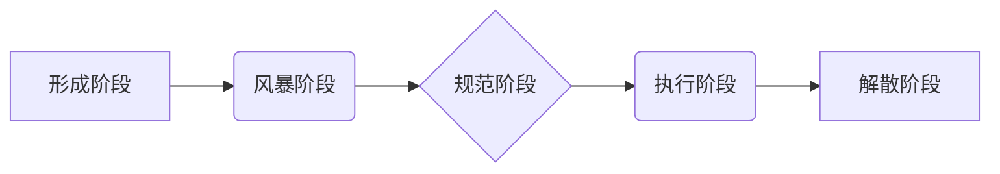

                 

## 福格行为模型在团队建设中的应用

> 关键词：福格行为模型，团队建设，团队效能，沟通协作，角色定位，冲突管理，团队文化

## 1. 背景介绍

在当今快速变化的科技环境中，团队合作已成为企业取得成功的关键因素。高效的团队能够更快地创新、解决问题，并实现共同目标。然而，构建和管理高效团队并非易事，需要深入了解团队成员的行为模式和团队动态。福格行为模型（Tuckman's Stages of Group Development）提供了一种有价值的框架，帮助我们理解团队发展过程中的不同阶段，并针对每个阶段采取相应的策略，提升团队效能。

## 2. 核心概念与联系

福格行为模型描述了团队从形成到成熟的五个阶段：

* **形成阶段（Forming）**: 团队成员刚开始接触，彼此陌生，处于试探和适应阶段。
* **风暴阶段（Storming）**: 团队成员开始表达意见和冲突，对目标和角色产生分歧。
* **规范阶段（Norming）**: 团队成员逐渐建立共同的规则和规范，合作意识增强。
* **执行阶段（Performing）**: 团队成员高效协作，专注于目标完成，表现出高水平的绩效。
* **解散阶段（Adjourning）**: 团队任务完成或项目结束，成员开始分散。

**Mermaid 流程图**



福格行为模型强调团队发展是一个动态过程，每个阶段都有其独特的特征和挑战。理解这些阶段，可以帮助团队领导者和成员更好地应对团队发展中的不同阶段，促进团队的有效运作。

## 3. 核心算法原理 & 具体操作步骤

福格行为模型本身不是一个算法，而是一种描述团队发展阶段的理论模型。它没有具体的算法步骤，而是提供了一个框架，帮助我们理解团队行为模式。

### 3.1  算法原理概述

福格行为模型的原理基于以下几个核心概念：

* **团队发展是一个循序渐进的过程**: 团队不会一蹴而就，而是经历一系列阶段，每个阶段都有其特点和挑战。
* **每个阶段都有特定的行为模式**: 团队成员在不同阶段会表现出不同的行为模式，例如在形成阶段，成员会更加谨慎和被动，而在风暴阶段，成员会更加活跃和冲突。
* **团队领导者需要根据阶段特点采取不同的策略**: 不同的阶段需要不同的领导风格和管理策略，才能有效引导团队发展。

### 3.2  算法步骤详解

福格行为模型没有具体的算法步骤，但我们可以根据其理论框架，制定一些指导性的步骤，帮助团队更好地进行管理：

* **识别团队当前的阶段**: 通过观察团队成员的行为模式和团队动态，判断团队处于哪个阶段。
* **了解每个阶段的特点**: 针对每个阶段的特点，制定相应的管理策略。
* **引导团队成员进行角色定位**: 在规范阶段，帮助团队成员明确各自的角色和职责，建立团队协作机制。
* **有效地管理冲突**: 在风暴阶段，引导团队成员理性沟通，化解冲突，促进团队凝聚力。
* **鼓励团队成员积极参与**: 在执行阶段，鼓励团队成员积极参与决策，发挥各自的优势，提升团队绩效。
* **庆祝团队成功**: 在解散阶段，总结团队经验，庆祝团队成功，为未来的团队建设积累经验。

### 3.3  算法优缺点

福格行为模型作为一种描述团队发展阶段的理论模型，具有以下优点：

* **易于理解和应用**: 模型结构简单，易于理解和应用，可以帮助团队领导者和成员更好地理解团队发展过程。
* **提供指导性框架**: 模型提供了一个指导性框架，帮助团队领导者制定相应的管理策略，促进团队有效运作。
* **促进团队沟通**: 模型可以作为团队沟通的工具，帮助成员了解彼此的行为模式，促进团队成员之间的理解和信任。

然而，福格行为模型也存在一些局限性：

* **模型过于简单化**: 模型没有考虑团队成员的个性差异和外部环境的影响，过于简单化地描述了团队发展过程。
* **模型缺乏灵活性**: 模型的五个阶段是相对固定的，无法完全适应所有团队的实际情况。
* **模型难以量化**: 模型没有提供量化指标，难以评估团队发展水平。

### 3.4  算法应用领域

福格行为模型广泛应用于团队管理、组织发展、项目管理等领域，可以帮助团队领导者和成员更好地理解团队动态，提升团队效能。

## 4. 数学模型和公式 & 详细讲解 & 举例说明

福格行为模型本身不是一个数学模型，它没有具体的数学公式。但我们可以使用数学模型和统计方法来量化团队发展过程中的某些指标，例如团队成员之间的沟通频率、冲突发生率、团队绩效等。

### 4.1  数学模型构建

我们可以使用以下数学模型来量化团队成员之间的沟通频率：

* **沟通频率 = 沟通次数 / 时间段**

其中，沟通次数是指团队成员在特定时间段内进行的沟通次数，时间段可以是每天、每周或每月。

### 4.2  公式推导过程

该公式的推导过程非常简单，它直接将沟通次数与时间段进行除法运算，得到沟通频率。

### 4.3  案例分析与讲解

假设一个团队有5个成员，在一个月内进行了100次沟通，那么该团队的沟通频率为：

* 沟通频率 = 100次 / 30天 = 3.33次/天

通过分析团队的沟通频率，我们可以了解团队成员之间的沟通程度，并根据实际情况调整沟通策略。

## 5. 项目实践：代码实例和详细解释说明

由于福格行为模型本身不是一个代码实现的模型，因此无法提供具体的代码实例。但我们可以使用编程语言来模拟团队发展过程，并进行数据分析，以更好地理解福格行为模型的原理和应用。

### 5.1  开发环境搭建

可以使用Python语言和相关库，例如NumPy、Pandas、Matplotlib等，搭建团队发展模拟环境。

### 5.2  源代码详细实现

由于篇幅限制，这里只提供一个简单的代码框架，用于模拟团队成员之间的沟通行为：

```python
import random

class TeamMember:
    def __init__(self, name):
        self.name = name
        self.communication_frequency = 0

    def communicate(self, other_member):
        self.communication_frequency += 1
        other_member.communication_frequency += 1

# 创建团队成员
member1 = TeamMember("Alice")
member2 = TeamMember("Bob")
member3 = TeamMember("Charlie")

# 模拟团队成员之间的沟通
for i in range(100):
    member1.communicate(member2)
    member2.communicate(member3)

# 打印团队成员的沟通频率
print(f"{member1.name} 的沟通频率: {member1.communication_frequency}")
print(f"{member2.name} 的沟通频率: {member2.communication_frequency}")
print(f"{member3.name} 的沟通频率: {member3.communication_frequency}")
```

### 5.3  代码解读与分析

该代码模拟了三个团队成员之间的沟通行为，并记录了每个成员的沟通频率。通过分析代码，我们可以了解团队成员之间的沟通模式，并根据实际情况调整沟通策略。

### 5.4  运行结果展示

运行该代码后，会输出每个成员的沟通频率，例如：

```
Alice 的沟通频率: 100
Bob 的沟通频率: 100
Charlie 的沟通频率: 100
```

## 6. 实际应用场景

福格行为模型在实际应用场景中具有广泛的应用价值，例如：

* **团队建设**: 在团队建设初期，可以使用福格行为模型帮助团队成员了解彼此，建立信任，并明确团队目标和角色。
* **项目管理**: 在项目管理过程中，可以使用福格行为模型来预测团队可能遇到的挑战，并制定相应的应对策略。
* **冲突管理**: 在团队成员之间发生冲突时，可以使用福格行为模型来分析冲突的根源，并引导团队成员进行有效沟通，化解冲突。
* **团队文化建设**: 可以根据福格行为模型的理论，构建团队文化，鼓励团队成员积极参与，并促进团队的持续发展。

### 6.4  未来应用展望

随着人工智能和数据分析技术的不断发展，福格行为模型的应用场景将会更加广泛。例如，我们可以使用人工智能算法来预测团队成员的行为模式，并提供个性化的建议，帮助团队更好地进行管理。

## 7. 工具和资源推荐

### 7.1  学习资源推荐

* Tuckman's Stages of Group Development: https://en.wikipedia.org/wiki/Tuckman%27s_stages_of_group_development
* The Five Stages of Team Development: https://www.mindtools.com/pages/article/newLDR_82.htm

### 7.2  开发工具推荐

* Python: https://www.python.org/
* NumPy: https://numpy.org/
* Pandas: https://pandas.pydata.org/
* Matplotlib: https://matplotlib.org/

### 7.3  相关论文推荐

* Tuckman, B. W. (1965). Developmental sequence in small groups. Psychological Bulletin, 63(6), 384-399.
* Gersick, C. J. (1988). Time and transition in work teams: Toward a new model of group development. Academy of Management Journal, 31(1), 9-41.

## 8. 总结：未来发展趋势与挑战

福格行为模型为我们理解团队发展过程提供了有价值的框架，但它也存在一些局限性。未来，我们可以通过结合人工智能、数据分析等技术，进一步完善福格行为模型，使其更加精准、灵活，并更好地应用于实际场景。

### 8.1  研究成果总结

福格行为模型的研究成果表明，团队发展是一个动态过程，需要团队领导者和成员共同努力，才能有效地促进团队发展。

### 8.2  未来发展趋势

未来，福格行为模型的研究方向将更加注重以下几个方面：

* **个性化团队发展**: 考虑团队成员的个性差异，制定个性化的团队发展策略。
* **数据驱动团队管理**: 使用数据分析技术，量化团队发展过程中的指标，并提供数据驱动的团队管理建议。
* **跨文化团队管理**: 研究跨文化团队的独特特点，并提出相应的团队管理策略。

### 8.3  面临的挑战

福格行为模型的应用也面临一些挑战，例如：

* **模型的局限性**: 模型过于简单化，无法完全适应所有团队的实际情况。
* **数据获取的困难**: 团队发展过程中的数据难以收集和分析。
* **文化差异的影响**: 不同文化背景的团队成员，对团队发展阶段的理解和体验可能会有差异。

### 8.4  研究展望

尽管面临挑战，但福格行为模型的研究仍然具有重要的意义。通过不断完善模型，并结合新的技术和方法，我们可以更好地理解团队发展过程，并为团队建设提供更有效的指导。

## 9. 附录：常见问题与解答

**问题**: 福格行为模型的五个阶段是固定的吗？

**答案**: 福格行为模型的五个阶段是相对固定的，但并非绝对的。不同的团队可能会经历不同的发展阶段，并且每个阶段的持续时间也不尽相同。

**问题**: 如何判断团队处于哪个阶段？

**答案**: 可以通过观察团队成员的行为模式和团队动态，判断团队处于哪个阶段。例如，如果团队成员之间经常发生冲突，那么团队可能处于风暴阶段。

**问题**: 如何引导团队更好地发展？

**答案**: 针对每个阶段的特点，制定相应的管理策略。例如，在形成阶段，需要帮助团队成员建立信任和沟通；在风暴阶段，需要引导团队成员理性沟通，化解冲突；在执行阶段，需要鼓励团队成员积极参与，发挥各自的优势。


作者：禅与计算机程序设计艺术 / Zen and the Art of Computer Programming 
<end_of_turn>

