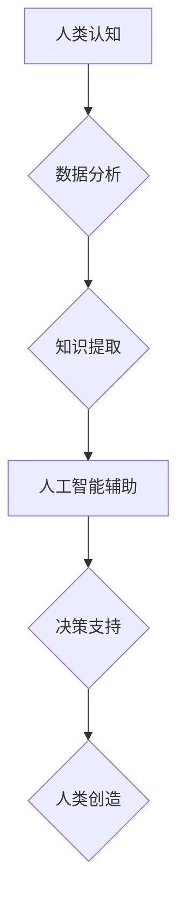

                 

## 科技与人文的交汇：人类计算的独特价值

> 关键词：人工智能、人类计算、认知科学、计算模型、伦理、未来趋势、跨学科研究

### 1. 背景介绍

科技的飞速发展，特别是人工智能领域的突破，让人们对机器智能的潜力充满期待。从自动驾驶到医疗诊断，从个性化教育到艺术创作，人工智能正在深刻地改变着我们的生活。然而，在追求机器智能的极致时，我们也必须思考一个至关重要的问题：人类计算在未来扮演着怎样的角色？

人类计算，顾名思义，是指人类运用其独特的认知能力进行计算和推理的过程。它不仅仅是简单的数字运算，更包含了理解、判断、创造和解决问题等复杂的能力。尽管机器学习算法在某些特定领域取得了惊人的成就，但人类的认知能力仍然在许多方面超越机器。

### 2. 核心概念与联系

**2.1 人类计算与人工智能的差异**

人类计算和人工智能并非完全对立的概念，它们之间存在着相互补充和协同发展的关系。

* **人工智能**侧重于模拟人类智能，通过算法和数据训练机器完成特定的任务。
* **人类计算**则强调人类的认知能力，包括逻辑推理、创造力、情感理解和社会认知等。

**2.2 人类计算的优势**

人类计算在以下方面具有独特的优势：

* **泛化能力强:** 人类能够将已有的知识和经验应用于新的、未曾见过的场景，而机器学习算法往往局限于训练数据中的模式。
* **创造力和想象力:** 人类能够进行原创性思考，产生新的想法和解决方案，而机器学习算法主要依赖于已有的数据和算法。
* **情感理解和社会认知:** 人类能够理解和回应他人的情感，并进行复杂的社会互动，而机器学习算法在这些方面仍然存在着局限性。

**2.3 人类计算与人工智能的协同发展**

未来，人类计算和人工智能将更加紧密地结合，形成一个更加强大的智能体系。

* 人工智能可以帮助人类进行数据分析、信息处理和重复性任务，释放人类的认知资源，使其能够专注于更高级别的思考和创造。
* 人类可以为人工智能提供更丰富的知识、经验和情感理解，帮助人工智能更好地理解和服务人类。

**Mermaid 流程图**



### 3. 核心算法原理 & 具体操作步骤

**3.1 算法原理概述**

人类计算的核心算法原理是基于认知科学和心理学的研究，试图模拟人类的思维过程，例如：

* **逻辑推理:** 利用逻辑规则和知识库进行推理和判断。
* **知识表示:** 将知识以结构化的形式表示，以便于机器理解和处理。
* **自然语言处理:** 理解和生成人类语言，以便于人机交互。
* **机器学习:** 利用数据训练模型，提高算法的泛化能力。

**3.2 算法步骤详解**

一个典型的基于人类计算的算法流程可以概括为以下步骤：

1. **数据收集:** 收集与任务相关的各种数据，包括文本、图像、音频等。
2. **数据预处理:** 对收集到的数据进行清洗、转换和格式化，使其能够被算法处理。
3. **知识表示:** 将数据转化为结构化的知识表示，例如知识图谱或概念网络。
4. **推理和决策:** 利用逻辑推理、规则引擎或机器学习模型进行推理和决策。
5. **结果输出:** 将推理结果以可理解的形式输出，例如文本、图像或语音。

**3.3 算法优缺点**

**优点:**

* 能够处理复杂、模糊和不确定性强的任务。
* 具有较强的泛化能力和适应性。
* 可以结合人类的经验和知识进行决策。

**缺点:**

* 算法设计和实现较为复杂。
* 需要大量的训练数据和计算资源。
* 算法的解释性和透明度相对较低。

**3.4 算法应用领域**

人类计算算法在以下领域具有广泛的应用前景：

* **医疗诊断:** 利用患者的病史、症状和医学影像数据进行诊断。
* **法律判决:** 分析法律法规和案件证据进行判决。
* **金融风险评估:** 评估投资风险和预测市场趋势。
* **教育个性化:** 根据学生的学习情况提供个性化的学习方案。

### 4. 数学模型和公式 & 详细讲解 & 举例说明

**4.1 数学模型构建**

人类计算的数学模型通常基于概率论、统计学和图论等数学工具。

* **概率论:** 用于描述人类认知过程中的不确定性和随机性。
* **统计学:** 用于分析数据、识别模式和建立预测模型。
* **图论:** 用于表示知识和关系，并进行推理和导航。

**4.2 公式推导过程**

例如，在知识表示领域，可以使用贝叶斯网络来建模人类的知识和信念。贝叶斯网络是一种概率图模型，它使用节点和边来表示知识和因果关系。

$$P(A|B) = \frac{P(B|A)P(A)}{P(B)}$$

其中：

* $P(A|B)$ 是在已知 B 为真的情况下 A 为真的概率。
* $P(B|A)$ 是在已知 A 为真的情况下 B 为真的概率。
* $P(A)$ 是 A 为真的概率。
* $P(B)$ 是 B 为真的概率。

**4.3 案例分析与讲解**

例如，假设我们想要构建一个知识图谱来表示人类对“猫”的知识。我们可以使用贝叶斯网络来表示猫的特征、行为和与其他实体的关系。例如，我们可以将“猫”节点与“哺乳动物”节点、“宠物”节点和“有毛”节点相连接，并使用概率来表示这些关系的强度。

### 5. 项目实践：代码实例和详细解释说明

**5.1 开发环境搭建**

为了实现人类计算算法，我们可以使用 Python 语言和相关的库，例如：

* **NLTK:** 自然语言处理工具包。
* **spaCy:** 自然语言处理库。
* **TensorFlow:** 深度学习框架。
* **PyTorch:** 深度学习框架。

**5.2 源代码详细实现**

以下是一个简单的基于规则引擎的人类计算算法的代码示例：

```python
# 定义规则
rules = {
    "猫": ["哺乳动物", "有毛", "喜欢抓老鼠"],
    "狗": ["哺乳动物", "有毛", "喜欢摇尾巴"],
}

# 定义输入数据
input_data = "这是一只猫"

# 使用规则引擎进行推理
for entity in input_data.split():
    if entity in rules:
        print(f"{entity} 是 {', '.join(rules[entity])}")
```

**5.3 代码解读与分析**

这段代码首先定义了一个规则字典，其中每个键代表一个实体，值是一个列表，包含该实体的特征。然后，它读取输入数据，并使用循环遍历每个单词。如果单词存在于规则字典中，则打印该单词及其对应的特征。

**5.4 运行结果展示**

当输入数据为“这是一只猫”时，代码将输出：

```
猫 是 哺乳动物, 有毛, 喜欢抓老鼠
```

### 6. 实际应用场景

**6.1 医疗诊断辅助系统**

人类计算算法可以帮助医生分析患者的病史、症状和医学影像数据，提供辅助诊断建议。例如，可以利用知识图谱表示疾病的症状、诊断标准和治疗方案，并根据患者的具体情况进行推理和决策。

**6.2 法律判决支持系统**

人类计算算法可以帮助法官分析法律法规、案件证据和相关案例，提供判决支持。例如，可以利用规则引擎和机器学习模型来识别案件的关键证据、判断案件的法律依据和预测判决结果。

**6.3 金融风险评估系统**

人类计算算法可以帮助金融机构评估投资风险、预测市场趋势和识别欺诈行为。例如，可以利用统计学和机器学习模型来分析市场数据、识别异常交易和预测投资回报率。

**6.4 教育个性化学习系统**

人类计算算法可以根据学生的学习情况、兴趣和能力提供个性化的学习方案。例如，可以利用知识图谱和机器学习模型来构建个性化的学习路径、推荐合适的学习资源和提供个性化的反馈。

**6.5 未来应用展望**

随着人工智能技术的不断发展，人类计算将在更多领域得到应用，例如：

* **自动驾驶:** 人类计算可以帮助自动驾驶系统理解道路环境、预测其他车辆的行为和做出更安全、更智能的决策。
* **机器人交互:** 人类计算可以帮助机器人更好地理解人类语言、情感和行为，从而实现更自然、更流畅的人机交互。
* **创意设计:** 人类计算可以帮助人类进行创意设计，例如生成新的音乐、绘画和建筑方案。

### 7. 工具和资源推荐

**7.1 学习资源推荐**

* **书籍:**
    * 《人工智慧：现代方法》
    * 《认知科学导论》
    * 《深度学习》
* **在线课程:**
    * Coursera: 人工智能课程
    * edX: 认知科学课程
    * Udacity: 深度学习课程

**7.2 开发工具推荐**

* **Python:** 人工智能和机器学习开发的常用语言。
* **NLTK:** 自然语言处理工具包。
* **spaCy:** 自然语言处理库。
* **TensorFlow:** 深度学习框架。
* **PyTorch:** 深度学习框架。

**7.3 相关论文推荐**

* **《人类计算的未来》**
* **《人工智能与人类认知的融合》**
* **《基于知识图谱的人类计算模型》**

### 8. 总结：未来发展趋势与挑战

**8.1 研究成果总结**

人类计算的研究取得了显著进展，在医疗诊断、法律判决、金融风险评估和教育个性化等领域展现出巨大的潜力。

**8.2 未来发展趋势**

未来，人类计算将朝着以下方向发展：

* **更加智能化:** 利用深度学习和强化学习等先进算法，提高人类计算的智能水平。
* **更加个性化:** 根据用户的需求和偏好，提供更加个性化的计算服务。
* **更加协同化:** 人类和人工智能更加紧密地协同工作，形成一个更加强大的智能体系。

**8.3 面临的挑战**

人类计算也面临着一些挑战：

* **算法解释性和透明度:** 人类计算算法的决策过程往往比较复杂，难以解释和理解，这可能会导致信任问题。
* **数据隐私和安全:** 人类计算算法需要处理大量的人类数据，因此数据隐私和安全问题需要得到充分重视。
* **伦理问题:** 人类计算的应用可能会引发一些伦理问题，例如算法偏见、责任归属等，需要进行深入探讨和规范。

**8.4 研究展望**

未来，人类计算的研究需要更加注重以下方面：

* **开发更加解释性和透明的人类计算算法。**
* **建立更加完善的数据隐私和安全保护机制。**
* **探讨和解决人类计算的伦理问题。**


### 9. 附录：常见问题与解答

**9.1 如何理解人类计算与人工智能的区别？**

人类计算强调人类的认知能力，包括逻辑推理、创造力、情感理解和社会认知等，而人工智能则侧重于模拟人类智能，通过算法和数据训练机器完成特定的任务。

**9.2 人类计算算法的应用场景有哪些？**

人类计算算法在医疗诊断、法律判决、金融风险评估、教育个性化等领域具有广泛的应用前景。

**9.3 人类计算面临哪些挑战？**

人类计算面临着算法解释性和透明度、数据隐私和安全、伦理问题等挑战。

**9.4 未来人类计算的发展趋势是什么？**

未来，人类计算将朝着更加智能化、个性化和协同化的方向发展。


作者：禅与计算机程序设计艺术 / Zen and the Art of Computer Programming 
<end_of_turn>

