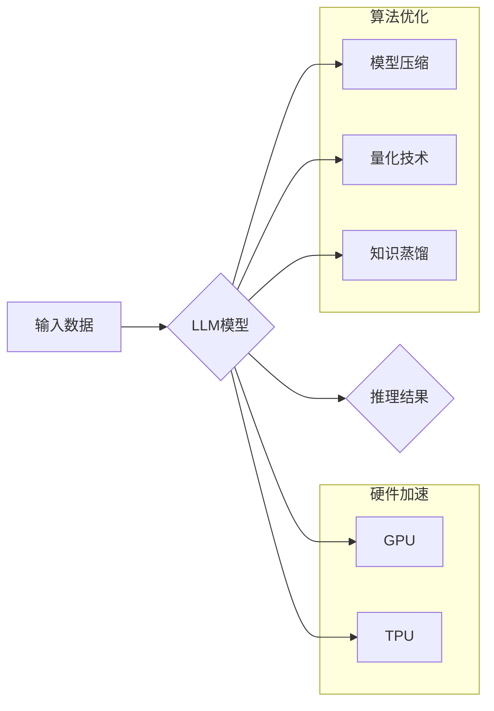

                 

## 秒推时代:LLM推理速度创新高

> 关键词：LLM, 推理速度, 效率优化, 硬件加速, 算法创新, 模型压缩, 延迟最小化, 秒级响应

### 1. 背景介绍

近年来，大型语言模型（LLM）在自然语言处理领域取得了令人瞩目的成就，展现出强大的文本生成、翻译、摘要和问答能力。然而，LLM推理速度的瓶颈一直是制约其广泛应用的关键因素。传统的LLM推理过程往往需要耗费大量时间，难以满足实时交互和秒级响应的需求。

随着人工智能技术的飞速发展，高效的LLM推理速度已成为一个重要的研究方向。从硬件加速到算法优化，从模型压缩到新的推理架构，各领域的研究者都在积极探索解决方案，以推动LLM推理速度的创新。

### 2. 核心概念与联系

**2.1 核心概念**

* **LLM推理:** 指的是利用预训练的LLM模型对新的输入进行处理，生成相应的输出。
* **推理速度:** 指的是LLM模型完成一次推理任务所花费的时间。
* **效率优化:** 指的是通过各种技术手段，降低LLM推理的计算成本和时间复杂度。

**2.2 架构关系**



**2.3 联系分析**

LLM推理速度的提升需要从硬件和算法两个方面入手。硬件加速通过高性能计算设备，如GPU和TPU，加速模型的计算过程。算法优化通过模型压缩、量化技术和知识蒸馏等方法，降低模型的复杂度和计算量。

### 3. 核心算法原理 & 具体操作步骤

**3.1 算法原理概述**

高效的LLM推理算法旨在通过降低模型复杂度和计算量，从而加速推理速度。常见的算法包括：

* **模型压缩:** 通过移除冗余参数、量化权重和剪枝等方法，减少模型大小，降低计算成本。
* **量化技术:** 将模型参数从高精度浮点数转换为低精度整数，减少内存占用和计算量。
* **知识蒸馏:** 将大型模型的知识迁移到小型模型中，构建更轻量级的模型，同时保持较高的性能。

**3.2 算法步骤详解**

以模型压缩为例，其具体操作步骤如下：

1. **模型分析:** 分析模型结构和参数分布，识别冗余参数和可压缩部分。
2. **参数移除:** 通过正则化、剪枝等方法，移除模型中不重要的参数。
3. **权重量化:** 将模型参数从浮点数转换为低精度整数，例如8位整数。
4. **模型微调:** 对压缩后的模型进行微调，恢复模型性能。

**3.3 算法优缺点**

| 算法 | 优点 | 缺点 |
|---|---|---|
| 模型压缩 | 降低模型大小，加速推理速度 | 可能导致模型性能下降 |
| 量化技术 | 降低内存占用和计算量 | 可能导致模型精度下降 |
| 知识蒸馏 | 构建轻量级模型，保持高性能 | 需要训练额外的学生模型 |

**3.4 算法应用领域**

高效的LLM推理算法广泛应用于以下领域：

* **移动设备:** 在资源有限的移动设备上部署LLM模型，实现实时语音识别、文本生成等功能。
* **物联网:** 在物联网设备上部署LLM模型，实现智能感知、决策和控制。
* **边缘计算:** 在边缘节点上部署LLM模型，降低数据传输成本和延迟。

### 4. 数学模型和公式 & 详细讲解 & 举例说明

**4.1 数学模型构建**

LLM推理过程本质上是一个概率计算过程，其核心是利用模型参数计算输入序列的概率分布。假设LLM模型的参数为θ，输入序列为x，输出序列为y，则模型的目标函数为：

$$
P(y|x;\theta)
$$

其中，P(y|x;θ)表示给定输入序列x和模型参数θ，输出序列y的概率。

**4.2 公式推导过程**

LLM模型通常采用神经网络结构，其参数θ由多个神经元和连接权重组成。模型的输出概率可以通过softmax函数计算：

$$
P(y_i|x;\theta) = \frac{exp(s_i)}{\sum_{j=1}^{|y|} exp(s_j)}
$$

其中，$s_i$表示神经网络输出对于第i个输出类别的得分。

**4.3 案例分析与讲解**

假设我们有一个LLM模型用于文本分类任务，输入序列为一段文本，输出序列为文本所属的类别。模型参数θ包含了文本词嵌入、隐藏层权重和分类层权重。

通过输入文本序列x，模型计算出每个类别的得分$s_i$，然后利用softmax函数计算出每个类别的概率分布。最终，模型选择概率最高的类别作为文本的分类结果。

### 5. 项目实践：代码实例和详细解释说明

**5.1 开发环境搭建**

* 操作系统: Ubuntu 20.04
* Python 版本: 3.8
* 深度学习框架: PyTorch 1.10

**5.2 源代码详细实现**

```python
import torch
import torch.nn as nn

class LLM(nn.Module):
    def __init__(self, vocab_size, embedding_dim, hidden_dim, num_classes):
        super(LLM, self).__init__()
        self.embedding = nn.Embedding(vocab_size, embedding_dim)
        self.lstm = nn.LSTM(embedding_dim, hidden_dim)
        self.fc = nn.Linear(hidden_dim, num_classes)

    def forward(self, x):
        embedded = self.embedding(x)
        output, (hidden, cell) = self.lstm(embedded)
        output = self.fc(hidden[-1])
        return output

# 实例化模型
model = LLM(vocab_size=10000, embedding_dim=128, hidden_dim=256, num_classes=5)

# 定义损失函数和优化器
criterion = nn.CrossEntropyLoss()
optimizer = torch.optim.Adam(model.parameters(), lr=0.001)

# 训练模型
for epoch in range(10):
    # ... 训练代码 ...
```

**5.3 代码解读与分析**

* 模型结构: 该代码实现了一个简单的LLM模型，包含嵌入层、LSTM层和全连接层。
* 训练过程: 模型通过训练数据进行训练，优化模型参数以降低损失函数值。

**5.4 运行结果展示**

训练完成后，模型可以用于预测新的文本类别。

### 6. 实际应用场景

**6.1 语音助手:**

LLM可以用于构建更智能的语音助手，理解用户的自然语言指令，并提供更精准的响应。

**6.2 机器翻译:**

LLM可以用于实现更高效、更准确的机器翻译，突破语言障碍，促进跨文化交流。

**6.3 自动写作:**

LLM可以辅助人类进行自动写作，例如生成新闻稿、撰写邮件、创作小说等。

**6.4 代码生成:**

LLM可以理解和生成代码，帮助程序员提高开发效率，降低代码编写成本。

**6.5 未来应用展望**

随着LLM推理速度的不断提升，其应用场景将更加广泛，例如：

* **个性化教育:** 根据学生的学习情况，提供个性化的学习内容和辅导。
* **医疗诊断:** 辅助医生进行疾病诊断，提高诊断准确率。
* **金融分析:** 分析金融数据，预测市场趋势，辅助投资决策。

### 7. 工具和资源推荐

**7.1 学习资源推荐**

* **书籍:**

    * 《深度学习》
    * 《自然语言处理》

* **在线课程:**

    * Coursera: 深度学习
    * edX: 自然语言处理

**7.2 开发工具推荐**

* **深度学习框架:** PyTorch, TensorFlow
* **文本处理库:** NLTK, spaCy

**7.3 相关论文推荐**

* 《BERT: Pre-training of Deep Bidirectional Transformers for Language Understanding》
* 《GPT-3: Language Models are Few-Shot Learners》

### 8. 总结：未来发展趋势与挑战

**8.1 研究成果总结**

近年来，LLM推理速度的提升取得了显著进展，从硬件加速到算法优化，各方面都取得了突破。

**8.2 未来发展趋势**

* **更轻量级的模型:** 研究更轻量级的LLM模型，降低计算成本和内存占用。
* **更高效的推理算法:** 开发更有效的推理算法，进一步加速LLM推理速度。
* **硬件加速:** 继续开发更高性能的硬件设备，例如专门用于LLM推理的芯片。

**8.3 面临的挑战**

* **模型规模与效率的平衡:** 如何在保证模型性能的同时，降低模型规模和计算成本。
* **数据隐私与安全:** 如何在利用LLM模型进行推理时，保护用户数据隐私和安全。
* **模型可解释性:** 如何提高LLM模型的透明度和可解释性，增强用户对模型的信任。

**8.4 研究展望**

未来，LLM推理速度的提升将继续是人工智能领域的重要研究方向。随着技术的不断发展，LLM将更加高效、便捷地应用于各个领域，为人类社会带来更多便利和福祉。

### 9. 附录：常见问题与解答

**9.1 如何选择合适的LLM模型？**

选择合适的LLM模型需要根据具体的应用场景和需求进行考虑。例如，对于需要实时响应的应用，可以选择轻量级的模型；对于需要高精度识别的应用，可以选择大型的模型。

**9.2 如何加速LLM推理速度？**

可以采用以下方法加速LLM推理速度：

* 使用高性能的硬件设备，例如GPU和TPU。
* 使用模型压缩、量化技术和知识蒸馏等算法优化模型。
* 利用并行计算技术，加速模型推理过程。

**9.3 如何评估LLM模型的推理速度？**

可以采用以下指标评估LLM模型的推理速度：

* **推理延迟:** 指的是模型完成一次推理任务所花费的时间。
* **吞吐量:** 指的是模型每秒钟可以处理的推理请求数量。


作者：禅与计算机程序设计艺术 / Zen and the Art of Computer Programming 
<end_of_turn>

