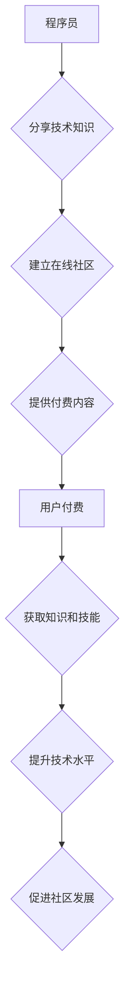

                 

## 程序员如何打造知识付费的在线社区

> 关键词：知识付费、在线社区、程序员、技术分享、内容运营、社区建设、商业模式

### 1. 背景介绍

在互联网时代，知识成为了最宝贵的资源。程序员作为科技领域的领军者，拥有丰富的技术经验和实战技巧。如何将这些宝贵知识转化为价值，并通过知识付费的方式实现自我价值和经济回报，成为了越来越多的程序员关注的焦点。

知识付费的模式在教育、培训、咨询等领域已经取得了成功，而程序员群体也具备了打造知识付费在线社区的独特优势：

* **专业性强:** 程序员拥有扎实的技术基础和丰富的实践经验，能够提供高质量的技术内容。
* **需求明确:** 程序员对技术知识的渴求度高，愿意为优质的学习资源付费。
* **社群属性:** 程序员群体具有强烈的社群属性，愿意与同行交流学习，共同进步。

基于以上优势，程序员打造知识付费在线社区，不仅可以分享知识，还能建立自己的个人品牌，获得经济收益。

### 2. 核心概念与联系

知识付费在线社区的核心概念包括：

* **知识付费:** 指通过付费的方式获取知识、技能或服务。
* **在线社区:** 指通过互联网平台搭建的虚拟空间，用户可以进行交流、分享、学习等活动。
* **程序员:** 指从事软件开发、编程等技术工作的专业人员。

这些概念相互关联，共同构成了知识付费在线社区的完整生态系统。

**Mermaid 流程图:**



### 3. 核心算法原理 & 具体操作步骤

#### 3.1  算法原理概述

知识付费在线社区的运营需要遵循一定的算法原理，以确保内容的质量、用户体验和商业模式的可持续性。

* **内容推荐算法:** 基于用户的兴趣、行为和历史数据，推荐相关且有价值的内容。
* **社区活跃度算法:** 通过分析用户参与度、互动频率等指标，评估社区的活跃度，并采取措施提升活跃度。
* **付费转化算法:** 分析用户付费行为，优化付费策略，提高付费转化率。

#### 3.2  算法步骤详解

* **内容推荐算法:**
    1. 收集用户数据：包括用户注册信息、浏览记录、点赞、评论等行为数据。
    2. 建立用户画像：根据用户数据，构建用户兴趣、偏好和行为特征的画像。
    3. 计算内容相似度：利用机器学习算法，计算内容与用户画像的相似度。
    4. 推荐相关内容：根据相似度排序，推荐用户感兴趣的内容。
* **社区活跃度算法:**
    1. 监测用户参与度：包括发帖、评论、点赞、转发等行为。
    2. 计算互动频率：分析用户在社区内进行互动的时间和频率。
    3. 评估社区活跃度：根据参与度和互动频率，评估社区的活跃度。
    4. 采取措施提升活跃度：例如举办线上活动、邀请嘉宾分享、设置奖励机制等。
* **付费转化算法:**
    1. 分析用户付费行为：包括付费金额、付费频率、付费渠道等数据。
    2. 识别付费用户特征：分析付费用户的共同特征，例如年龄、职业、兴趣等。
    3. 优化付费策略：根据付费用户特征，调整付费价格、优惠活动、支付方式等策略。
    4. 提高付费转化率：通过优化付费策略，提高用户付费意愿和转化率。

#### 3.3  算法优缺点

* **优点:**
    * 自动化运营: 算法可以自动完成内容推荐、社区活跃度监测、付费转化分析等任务，提高运营效率。
    * 数据驱动决策: 算法可以根据数据分析结果，优化运营策略，提升运营效果。
    * 个性化体验: 算法可以根据用户需求，提供个性化的内容推荐和服务。
* **缺点:**
    * 数据依赖: 算法需要大量的数据支持，数据质量直接影响算法效果。
    * 算法偏差: 算法本身可能存在偏差，导致推荐结果不准确或偏向特定用户群体。
    * 人工干预: 算法需要定期维护和更新，并结合人工干预，才能更好地满足用户需求。

#### 3.4  算法应用领域

* **内容推荐:** 在线教育平台、新闻资讯网站、电商平台等。
* **社区运营:** 社交平台、论坛、兴趣小组等。
* **营销推广:** 广告投放、精准营销、用户画像分析等。

### 4. 数学模型和公式 & 详细讲解 & 举例说明

#### 4.1  数学模型构建

知识付费在线社区的运营可以构建一个数学模型，以描述用户行为、内容传播和商业模式之间的关系。

* **用户行为模型:** 可以使用马尔科夫链模型来描述用户的行为模式，例如用户从注册到付费的路径。
* **内容传播模型:** 可以使用SIR模型来描述内容的传播过程，例如内容的感染力、传播速度和最终覆盖范围。
* **商业模式模型:** 可以使用收益函数来描述社区的商业模式，例如付费用户数量、付费金额和运营成本之间的关系。

#### 4.2  公式推导过程

* **马尔科夫链模型:**

$$P(s_t|s_{t-1})$$

其中，$P(s_t|s_{t-1})$ 表示用户在时间 $t$ 状态 $s_t$ 的概率，给定时间 $t-1$ 状态 $s_{t-1}$。

* **SIR模型:**

$$
\begin{cases}
\frac{dS}{dt} = -\beta SI \\
\frac{dI}{dt} = \beta SI - \gamma I \\
\frac{dR}{dt} = \gamma I
\end{cases}
$$

其中，$S$ 表示易感用户数量，$I$ 表示感染用户数量，$R$ 表示恢复用户数量，$\beta$ 表示感染率，$\gamma$ 表示恢复率。

* **收益函数:**

$$
Profit = Revenue - Cost
$$

其中，$Revenue$ 表示社区的收入，$Cost$ 表示社区的运营成本。

#### 4.3  案例分析与讲解

* **用户行为模型:** 可以分析用户在社区内的注册、登录、浏览、点赞、评论等行为，构建用户行为模型，预测用户付费行为。
* **内容传播模型:** 可以分析内容的传播速度、覆盖范围和影响力，优化内容创作和传播策略。
* **商业模式模型:** 可以分析社区的收入和成本，制定合理的付费策略和运营模式。

### 5. 项目实践：代码实例和详细解释说明

#### 5.1  开发环境搭建

* **操作系统:** Linux/macOS/Windows
* **编程语言:** Python
* **框架:** Django/Flask
* **数据库:** MySQL/PostgreSQL
* **云服务:** AWS/Azure/GCP

#### 5*2 源代码详细实现

```python
# Django 项目示例代码

# models.py
from django.db import models

class User(models.Model):
    username = models.CharField(max_length=255)
    email = models.EmailField()
    # ... 其他用户属性

class Course(models.Model):
    title = models.CharField(max_length=255)
    description = models.TextField()
    price = models.DecimalField(max_digits=10, decimal_places=2)
    # ... 其他课程属性

# views.py
from django.shortcuts import render
from .models import Course

def course_list(request):
    courses = Course.objects.all()
    return render(request, 'course_list.html', {'courses': courses})

# course_list.html
<h1>课程列表</h1>
<ul>
    
    <li>
        <h2>{{ course.title }}</h2>
        <p>{{ course.description }}</p>
        <p>价格: {{ course.price }}</p>
    </li>
    
</ul>
```

#### 5.3  代码解读与分析

* **models.py:** 定义了用户和课程的模型，用于存储用户和课程数据。
* **views.py:** 定义了课程列表页面的视图函数，用于获取课程数据并渲染页面。
* **course_list.html:** 定义了课程列表页面的模板，用于展示课程信息。

#### 5.4  运行结果展示

运行上述代码，可以创建一个简单的课程列表页面，展示所有课程的信息。

### 6. 实际应用场景

#### 6.1  在线学习平台

程序员可以利用知识付费在线社区，创建自己的在线学习平台，分享编程技巧、开发经验和项目案例。

#### 6.2  技术博客

程序员可以将自己的技术博客与知识付费在线社区结合，提供付费内容，例如深度技术文章、源码解析、在线答疑等。

#### 6.3  技术社群

程序员可以创建技术社群，提供付费会员服务，例如专属论坛、技术交流会、线下活动等。

#### 6.4  未来应用展望

随着互联网技术的不断发展，知识付费在线社区将迎来更广阔的发展空间。未来，知识付费在线社区将更加智能化、个性化和互动化，为程序员提供更优质的学习和交流平台。

### 7. 工具和资源推荐

#### 7.1  学习资源推荐

* **在线课程平台:** Udemy、Coursera、edX
* **技术博客:** Hacker News、Medium、Stack Overflow
* **开源社区:** GitHub、GitLab、Bitbucket

#### 7.2  开发工具推荐

* **内容管理系统:** WordPress、Drupal、Joomla
* **在线社区平台:** Discourse、Flarum、NodeBB
* **支付平台:** Stripe、PayPal、Alipay

#### 7.3  相关论文推荐

* **The Economics of Online Education**
* **The Impact of Social Media on Knowledge Sharing**
* **The Future of Online Learning**

### 8. 总结：未来发展趋势与挑战

#### 8.1  研究成果总结

知识付费在线社区为程序员提供了新的学习和交流模式，并促进了技术知识的传播和价值实现。

#### 8.2  未来发展趋势

* **智能化:** 利用人工智能技术，提供更智能化的内容推荐、社区运营和用户服务。
* **个性化:** 根据用户的学习需求和兴趣，提供个性化的学习路径和内容。
* **互动化:** 增强用户之间的互动和交流，打造更活跃的社区氛围。

#### 8.3  面临的挑战

* **内容质量:** 保障知识付费内容的质量和原创性。
* **用户粘性:** 提升用户粘性和活跃度，避免用户流失。
* **商业模式:** 探索更可持续的商业模式，实现社区的盈利和发展。

#### 8.4  研究展望

未来，需要进一步研究知识付费在线社区的运营机制、用户行为模式和商业模式，以推动其健康发展。

### 9. 附录：常见问题与解答

* **如何打造高质量的知识付费内容？**

  * 深入研究技术领域，掌握核心知识和技能。
  * 结合自身经验，分享实战技巧和项目案例。
  * 采用多种形式呈现内容，例如文章、视频、音频等。
  * 持续更新内容，保持内容的时效性和价值。

* **如何提升用户粘性和活跃度？**

  * 建立活跃的社区氛围，鼓励用户互动交流。
  * 定期举办线上活动，例如技术分享会、问答会等。
  * 提供专属会员服务，例如折扣优惠、VIP资源等。
  * 收集用户反馈，不断优化社区运营策略。

* **如何实现知识付费在线社区的盈利？**

  * 设置合理的付费价格，根据内容价值和用户需求进行调整。
  * 提供多种付费方式，例如订阅、购买课程、会员制度等。
  * 探索广告合作、赞助合作等多元化收入模式。


作者：禅与计算机程序设计艺术 / Zen and the Art of Computer Programming 
<end_of_turn>

