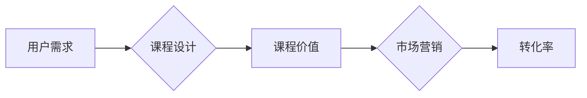

                 

## 程序员如何打造高转化率的知识付费课程

> 关键词：知识付费、程序员、课程设计、转化率、教学方法、市场营销、技术内容、用户需求

## 1. 背景介绍

近年来，随着互联网技术的快速发展和知识经济的兴起，知识付费行业蓬勃发展。程序员作为技术领域的高需求人才，其技能和经验也成为知识付费市场的重要资源。越来越多的程序员开始尝试通过线上课程的方式分享自己的技术知识，并从中获得收益。然而，知识付费课程市场竞争激烈，如何打造高转化率的课程，吸引用户付费学习，成为许多程序员面临的挑战。

## 2. 核心概念与联系

**2.1 知识付费课程的核心概念**

知识付费课程是指以知识、技能、经验等为核心内容，通过线上平台向用户提供付费学习服务的课程。其核心价值在于为用户提供有价值的知识和技能，帮助他们提升自身能力，实现职业发展和个人成长。

**2.2 课程设计与转化率的关系**

课程设计是影响知识付费课程转化率的关键因素之一。良好的课程设计能够清晰地传达课程价值，满足用户需求，激发用户的学习兴趣，最终提升转化率。

**2.3 课程设计与用户需求的关系**

用户需求是课程设计的出发点和落脚点。了解用户的学习目标、痛点和需求，才能设计出真正有价值、用户喜爱的课程。

**2.4 课程设计与市场营销的关系**

课程设计与市场营销相互促进，共同影响课程的转化率。优秀的课程设计能够为市场营销提供有力的支撑，而有效的市场营销策略能够帮助课程获得更广泛的用户认知和关注。

**Mermaid 流程图**



## 3. 核心算法原理 & 具体操作步骤

**3.1 算法原理概述**

打造高转化率的知识付费课程，本质上是一种“用户需求匹配”的算法。 

这个算法的核心在于：

* **精准定位用户需求:** 通过市场调研、用户画像分析等方式，深入了解目标用户的学习目标、痛点、知识结构等。
* **匹配课程内容:** 根据用户需求，精心设计课程内容，确保课程内容与用户需求高度契合，提供有价值的知识和技能。
* **优化课程结构:**  合理安排课程章节、学习节奏、教学方法等，提升用户学习体验，提高课程完成率。
* **精准营销推广:**  根据用户特征，选择合适的营销渠道和推广策略，精准触达目标用户，提升课程曝光率和转化率。

**3.2 算法步骤详解**

1. **需求调研:** 

   *  **市场调研:** 分析市场趋势、竞争对手课程、用户评价等，了解目标用户的学习需求和市场痛点。
   * **用户画像:**  构建目标用户的画像，包括年龄、性别、职业、学习背景、学习目标、痛点等。
   * **问卷调查:**  设计问卷调查，收集用户对课程内容、教学方式、价格等方面的反馈。

2. **课程内容设计:**

   * **确定课程主题:**  根据需求调研结果，选择具有市场竞争力和用户需求的课程主题。
   * **构建课程体系:**  将课程内容按照逻辑顺序和知识结构进行分类和组织，形成清晰的课程体系。
   * **撰写课程内容:**  根据用户需求和课程体系，撰写高质量的课程内容，包括文字、视频、音频、案例等多种形式。

3. **课程结构优化:**

   * **章节划分:**  将课程内容按照合适的章节进行划分，每个章节内容独立完整，方便用户学习和理解。
   * **学习节奏:**  合理安排课程学习节奏，避免过快或过慢，保持用户学习兴趣和动力。
   * **教学方法:**  采用多种教学方法，例如讲解、案例分析、互动练习、项目实战等，提升用户学习体验。

4. **精准营销推广:**

   * **目标用户定位:**  根据用户画像，精准定位目标用户群体。
   * **营销渠道选择:**  选择合适的营销渠道，例如社交媒体、搜索引擎、线上社区等，精准触达目标用户。
   * **推广策略制定:**  制定有效的推广策略，例如内容营销、付费广告、合作推广等，提升课程曝光率和转化率。

**3.3 算法优缺点**

* **优点:** 

   *  能够精准匹配用户需求，提升课程价值和用户满意度。
   *  能够优化课程结构和教学方法，提升用户学习体验和课程完成率。
   *  能够精准营销推广，提升课程曝光率和转化率。

* **缺点:** 

   *  需要投入大量时间和精力进行需求调研和课程设计。
   *  需要不断优化和迭代课程内容和教学方法，以适应用户需求的变化。
   *  需要掌握一定的市场营销知识和技能，才能进行有效的推广。

**3.4 算法应用领域**

*  在线教育平台
*  技术培训机构
*  个人知识分享者

## 4. 数学模型和公式 & 详细讲解 & 举例说明

**4.1 数学模型构建**

我们可以用一个简单的数学模型来表示知识付费课程的转化率：

```latex
转化率 = (付费用户数 / 总访问用户数) * 100%
```

其中：

*  付费用户数：购买课程的用户数量
*  总访问用户数：访问课程页面或宣传页面的用户数量

**4.2 公式推导过程**

这个公式的推导过程很简单，就是将付费用户数与总访问用户数进行比例计算，并乘以100%得到转化率的百分比表示。

**4.3 案例分析与讲解**

假设一个知识付费课程的总访问用户数为1000人，付费用户数为100人，那么该课程的转化率为：

```latex
转化率 = (100 / 1000) * 100% = 10%
```

这意味着该课程的10%的用户最终购买了课程。

## 5. 项目实践：代码实例和详细解释说明

**5.1 开发环境搭建**

打造知识付费课程需要搭建一个合适的开发环境，包括：

*  课程内容管理系统：用于管理课程内容、章节、学习资源等。
*  用户管理系统：用于管理用户注册、登录、支付等功能。
*  学习平台：用于用户学习课程、互动交流、提交作业等。

可以使用现有的开源平台或自行开发，根据实际需求选择合适的方案。

**5.2 源代码详细实现**

由于篇幅限制，这里只提供一个简单的课程内容管理系统代码示例，使用Python语言实现：

```python
class Course:
    def __init__(self, name, description, chapters):
        self.name = name
        self.description = description
        self.chapters = chapters

    def display_info(self):
        print(f"课程名称: {self.name}")
        print(f"课程描述: {self.description}")
        print("课程章节:")
        for chapter in self.chapters:
            print(f"- {chapter}")

# 创建一个课程实例
course = Course("Python编程入门", "这是一门介绍Python编程基础的课程", ["基础语法", "数据结构", "函数编程"])

# 显示课程信息
course.display_info()
```

**5.3 代码解读与分析**

这段代码定义了一个`Course`类，用于表示一个课程。

*  `__init__`方法用于初始化课程对象，设置课程名称、描述和章节列表。
*  `display_info`方法用于显示课程信息。

**5.4 运行结果展示**

运行这段代码，将输出以下信息：

```
课程名称: Python编程入门
课程描述: 这是一门介绍Python编程基础的课程
课程章节:
- 基础语法
- 数据结构
- 函数编程
```

## 6. 实际应用场景

**6.1 在线教育平台**

在线教育平台可以利用知识付费课程模式，提供各种类型的课程，例如编程、设计、写作、管理等，满足用户多元化的学习需求。

**6.2 技术培训机构**

技术培训机构可以将线下课程内容转化为线上知识付费课程，扩大招生范围，降低运营成本，提高课程收益。

**6.3 个人知识分享者**

个人知识分享者可以通过打造知识付费课程，将自己的专业技能和经验转化为收入，实现自我价值和经济回报。

**6.4 未来应用展望**

随着人工智能、虚拟现实等技术的不断发展，知识付费课程将更加个性化、互动化、沉浸化，为用户提供更优质的学习体验。

## 7. 工具和资源推荐

**7.1 学习资源推荐**

*  **在线课程平台:** Udemy, Coursera, edX, Khan Academy
*  **技术博客:**  Hacker News, Stack Overflow, Medium
*  **技术论坛:**  Reddit, GitHub Discussions

**7.2 开发工具推荐**

*  **课程内容管理系统:** Moodle, WordPress, Thinkific
*  **用户管理系统:**  Auth0, Firebase, AWS Cognito
*  **学习平台:**  LearnWorlds, Teachable, Podia

**7.3 相关论文推荐**

*  "The Economics of Online Education" by Michael J. Mauboussin
*  "The Future of Learning" by Clayton M. Christensen
*  "The MOOC Phenomenon: A Review of the Literature" by Stephen Downes


## 8. 总结：未来发展趋势与挑战

**8.1 研究成果总结**

打造高转化率的知识付费课程需要综合考虑用户需求、课程内容、教学方法、市场营销等多个因素。通过精准定位用户需求，优化课程结构和教学方法，以及精准营销推广，可以有效提升课程转化率。

**8.2 未来发展趋势**

未来，知识付费课程将更加个性化、互动化、沉浸化，并与人工智能、虚拟现实等新技术深度融合，为用户提供更优质的学习体验。

**8.3 面临的挑战**

*  **内容质量保证:**  确保课程内容的质量和原创性，避免抄袭和低质量内容。
*  **用户体验优化:**  不断优化课程平台和学习体验，提升用户学习兴趣和完成率。
*  **市场竞争加剧:**  知识付费市场竞争激烈，需要不断创新和提升课程竞争力。

**8.4 研究展望**

未来研究可以关注以下方向：

*  **人工智能驱动的课程个性化推荐:**  利用人工智能技术，对用户的学习行为进行分析，推荐更符合用户需求的课程。
*  **虚拟现实和增强现实技术在课程中的应用:**  利用虚拟现实和增强现实技术，打造更沉浸式的学习体验。
*  **知识付费课程的商业模式创新:**  探索新的商业模式，例如订阅制、会员制等，提高课程收益和用户粘性。


## 9. 附录：常见问题与解答

**9.1 如何确定课程主题？**

*  分析市场趋势和用户需求
*  结合自身专业技能和经验
*  选择具有市场竞争力和用户痛点的主题

**9.2 如何设计课程内容？**

*  明确课程目标和学习路径
*  将课程内容按照逻辑顺序和知识结构进行分类和组织
*  采用多种教学方法，例如讲解、案例分析、互动练习等

**9.3 如何进行课程推广？**

*  精准定位目标用户群体
*  选择合适的营销渠道和推广策略
*  利用内容营销、付费广告、合作推广等方式提升课程曝光率和转化率


作者：禅与计算机程序设计艺术 / Zen and the Art of Computer Programming 
<end_of_turn>

