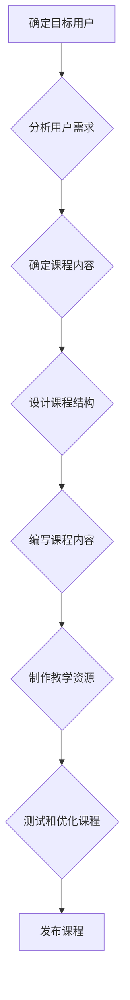

                 

## 程序员知识付费：打造体系化课程

> 关键词：程序员知识付费、体系化课程、在线教育、技术技能、课程设计

### 1. 背景介绍

在当今科技飞速发展的时代，程序员的需求量持续增长，而优质的程序员人才却显得愈发稀缺。传统的教育模式难以满足程序员快速学习和提升技能的需求，知识付费模式应运而生，为程序员提供了一种高效便捷的学习途径。

知识付费平台为程序员提供了丰富的学习资源，涵盖了从基础编程语言到高级架构设计等各个领域。通过付费购买课程，程序员可以获得专业的知识指导、实践案例和代码示例，快速提升自己的技术水平。

然而，现有的许多程序员知识付费课程存在着一些问题，例如：

* **碎片化内容：** 许多课程缺乏整体架构，内容分散，难以形成系统性的学习体系。
* **缺乏实践性：** 一些课程过于理论化，缺乏实际操作案例和代码练习，难以帮助程序员真正掌握技能。
* **教学质量参差不齐：** 由于知识付费平台门槛较低，一些课程的教学质量参差不齐，难以保证学习效果。

为了解决这些问题，打造体系化、高质量的程序员知识付费课程至关重要。

### 2. 核心概念与联系

体系化课程的核心概念在于将知识按照一定的逻辑结构和层次进行组织，形成一个完整的学习体系。

**体系化课程的构建需要考虑以下几个方面：**

* **目标用户：** 课程的目标用户是谁？他们的技术水平如何？他们希望学习什么内容？
* **课程内容：** 课程内容应该涵盖哪些知识点？如何进行知识的组织和分层？
* **学习路径：** 课程应该提供什么样的学习路径？如何引导用户循序渐进地学习？
* **教学方法：** 课程应该采用什么样的教学方法？如何提高课程的趣味性和互动性？

**体系化课程的构建流程：**



### 3. 核心算法原理 & 具体操作步骤

**3.1 算法原理概述**

在程序员知识付费课程中，算法是不可或缺的一部分。算法的学习和掌握对于程序员来说至关重要。

**3.2 算法步骤详解**

**举例说明：**

选择一个常见的算法，例如**二分查找算法**，详细讲解其步骤：

1. **确定查找范围：** 将待查找数据范围缩小到一个区间。
2. **计算中间值：** 计算区间中间值。
3. **比较中间值：** 将中间值与目标值进行比较。
4. **调整查找范围：** 
    * 如果中间值等于目标值，则查找成功。
    * 如果中间值小于目标值，则将查找范围调整为中间值右边的区间。
    * 如果中间值大于目标值，则将查找范围调整为中间值左边的区间。
5. **重复步骤2-4：** 重复上述步骤，直到查找成功或查找范围为空。

**3.3 算法优缺点**

**二分查找算法的优点：**

* 时间复杂度为O(log n)，效率高。
* 适用于有序数据。

**二分查找算法的缺点：**

* 只能用于有序数据。
* 需要预先排序数据。

**3.4 算法应用领域**

二分查找算法广泛应用于以下领域：

* 搜索引擎
* 数据库
* 图像处理
* 数据结构

### 4. 数学模型和公式 & 详细讲解 & 举例说明

**4.1 数学模型构建**

**举例说明：**

使用数学模型描述二分查找算法的时间复杂度：

假设待查找数据有n个元素，则二分查找算法的时间复杂度为O(log n)。

**4.2 公式推导过程**

每次查找，查找范围都会缩小一半。因此，需要log₂n次查找才能找到目标值。

**4.3 案例分析与讲解**

**举例说明：**

查找一个有序数组中值为5的元素，假设数组长度为16，则需要进行4次查找才能找到目标值：

1. 查找范围：[1, 16]
2. 查找范围：[9, 16]
3. 查找范围：[13, 16]
4. 查找范围：[15, 16]

### 5. 项目实践：代码实例和详细解释说明

**5.1 开发环境搭建**

使用Python语言编写二分查找算法的代码示例：

```python
def binary_search(arr, target):
    left = 0
    right = len(arr) - 1
    while left <= right:
        mid = (left + right) // 2
        if arr[mid] == target:
            return mid
        elif arr[mid] < target:
            left = mid + 1
        else:
            right = mid - 1
    return -1
```

**5.2 源代码详细实现**

代码解释：

* `binary_search(arr, target)`函数接收一个有序数组`arr`和一个目标值`target`作为参数。
* `left`和`right`分别表示查找范围的左边界和右边界。
* `while left <= right`循环执行，直到查找范围为空。
* `mid = (left + right) // 2`计算中间值。
* `if arr[mid] == target`判断中间值是否等于目标值，如果相等则返回中间值的下标。
* `elif arr[mid] < target`判断中间值小于目标值，则将左边界调整为中间值右边的区间。
* `else`判断中间值大于目标值，则将右边界调整为中间值左边的区间。
* `return -1`如果循环结束后未找到目标值，则返回-1。

**5.3 代码解读与分析**

代码实现了二分查找算法的基本逻辑，通过不断缩小查找范围，提高了查找效率。

**5.4 运行结果展示**

```
>>> binary_search([2, 5, 7, 8, 11, 12], 11)
4
```

### 6. 实际应用场景

**6.1 搜索引擎**

搜索引擎使用二分查找算法来查找网页索引，提高搜索效率。

**6.2 数据库**

数据库使用二分查找算法来查找数据记录，提高查询速度。

**6.3 图像处理**

图像处理中使用二分查找算法来查找特定像素值，用于图像分割、边缘检测等操作。

**6.4 未来应用展望**

随着人工智能和机器学习的发展，二分查找算法在更多领域得到应用，例如：

* **推荐系统：** 使用二分查找算法来查找用户感兴趣的商品或内容。
* **自然语言处理：** 使用二分查找算法来查找文本中的特定词语或短语。
* **生物信息学：** 使用二分查找算法来查找基因序列中的特定片段。

### 7. 工具和资源推荐

**7.1 学习资源推荐**

* **在线课程平台：** Coursera、edX、Udemy等平台提供丰富的程序员知识付费课程。
* **技术博客和论坛：** CSDN、Stack Overflow等平台提供大量的技术文章和讨论，可以帮助程序员学习和交流。
* **开源项目：** GitHub等平台提供大量的开源项目，可以帮助程序员实践和学习。

**7.2 开发工具推荐**

* **代码编辑器：** VS Code、Sublime Text、Atom等代码编辑器可以提高程序员的开发效率。
* **调试工具：** GDB、PyCharm Debugger等调试工具可以帮助程序员查找和修复代码错误。
* **版本控制系统：** Git、SVN等版本控制系统可以帮助程序员管理代码版本和协同开发。

**7.3 相关论文推荐**

* **Introduction to Algorithms** by Cormen, Leiserson, Rivest, and Stein
* **The Art of Computer Programming** by Donald Knuth

### 8. 总结：未来发展趋势与挑战

**8.1 研究成果总结**

体系化课程的构建对于提升程序员知识付费课程的质量和效率至关重要。

**8.2 未来发展趋势**

未来，程序员知识付费课程将朝着以下方向发展：

* **个性化定制：** 根据用户的学习目标和进度，提供个性化的学习路径和内容。
* **沉浸式体验：** 使用虚拟现实、增强现实等技术，提供更加沉浸式的学习体验。
* **人工智能辅助学习：** 使用人工智能技术，提供智能化的学习建议和反馈。

**8.3 面临的挑战**

程序员知识付费课程的未来发展也面临着一些挑战：

* **知识更新速度快：** 科技发展日新月异，需要不断更新课程内容，以满足用户的学习需求。
* **教学质量控制：** 需要建立有效的教学质量控制机制，确保课程质量。
* **商业模式创新：** 需要探索新的商业模式，以实现可持续发展。

**8.4 研究展望**

未来，我们将继续研究和探索程序员知识付费课程的构建方法，以帮助程序员更高效地学习和提升技能。

### 9. 附录：常见问题与解答

**常见问题：**

* 如何选择合适的程序员知识付费课程？
* 如何提高学习效率？
* 如何将学习到的知识应用到实际项目中？

**解答：**

* 选择课程时，应该考虑课程内容、教学质量、用户评价等因素。
* 学习时，应该制定学习计划，保持学习的专注力和持续性。
* 将学习到的知识应用到实际项目中，可以帮助巩固知识，提升实践能力。


作者：禅与计算机程序设计艺术 / Zen and the Art of Computer Programming 
<end_of_turn>

