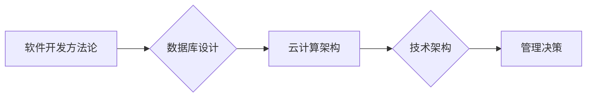

                 

## 经典书籍:管理者构建知识体系的基石

> 关键词：知识体系、管理者、技术架构、学习路径、实践经验、持续学习、技术洞察

## 1. 背景介绍

在当今瞬息万变的科技时代，管理者需要具备更深层次的科技洞察力，才能有效地引领团队，做出明智的决策。然而，技术领域日新月异，学习曲线陡峭，对于非技术背景的管理者来说，构建一个完善的知识体系，并将其应用于实际工作中，显得尤为重要。

本书旨在为管理者提供一个构建知识体系的基石，帮助他们理解核心技术概念，掌握技术架构原理，并将其应用于实际工作中。我们将会从以下几个方面进行探讨：

* **核心技术概念的梳理:**  本书将介绍一些重要的技术概念，例如软件开发方法论、数据库设计、云计算架构等，并解释其原理和应用场景。
* **技术架构的构建:**  本书将介绍一些常见的技术架构模式，例如微服务架构、事件驱动架构等，并讲解其优缺点和适用场景。
* **学习路径的规划:**  本书将提供一些学习技术知识的建议和资源，帮助管理者制定个性化的学习计划。
* **实践经验的分享:**  本书将分享一些管理者在实际工作中应用技术知识的案例，帮助管理者更好地理解和运用技术。

## 2. 核心概念与联系

### 2.1  软件开发方法论

软件开发方法论是指软件开发过程中遵循的一套规范和流程，旨在提高软件开发效率和质量。常见的软件开发方法论包括：

* **瀑布模型:**  传统的软件开发方法，将软件开发过程划分为多个阶段，每个阶段完成后再进入下一个阶段。
* **敏捷开发:**  强调灵活性和迭代开发，将软件开发过程划分为多个短周期迭代，每个迭代都包含需求分析、设计、开发、测试和部署等环节。

### 2.2  数据库设计

数据库设计是指如何组织和存储数据，以便于高效地检索和管理。常见的数据库设计模式包括：

* **关系型数据库:**  数据以表的形式存储，表之间通过关系连接。
* **非关系型数据库:**  数据以其他形式存储，例如文档、键值对等。

### 2.3  云计算架构

云计算架构是指利用互联网提供的计算资源，提供弹性、可扩展的计算服务。常见的云计算架构模式包括：

* **IaaS (基础设施即服务):**  提供计算、存储、网络等基础设施资源。
* **PaaS (平台即服务):**  提供开发和部署应用程序的平台环境。
* **SaaS (软件即服务):**  提供已经部署好的应用程序，用户可以通过网络访问使用。

**核心概念联系流程图:**



## 3. 核心算法原理 & 具体操作步骤

### 3.1  算法原理概述

算法是解决特定问题的步骤或规则，是计算机程序的核心。管理者需要了解一些常见的算法原理，例如排序算法、搜索算法、图算法等，以便更好地理解技术架构和软件开发过程。

### 3.2  算法步骤详解

**示例：冒泡排序算法**

冒泡排序是一种简单而直观的排序算法，其原理是通过多次比较相邻元素，将较大的元素“冒泡”到排序后的末尾。

1. 比较相邻元素，如果顺序错误，则交换它们的位置。
2. 重复步骤1，直到整个数组排序完成。

**代码示例 (Python):**

```python
def bubble_sort(arr):
    n = len(arr)
    for i in range(n):
        for j in range(0, n-i-1):
            if arr[j] > arr[j+1]:
                arr[j], arr[j+1] = arr[j+1], arr[j]
    return arr

# 测试代码
arr = [64, 34, 25, 12, 22, 11, 90]
sorted_arr = bubble_sort(arr)
print("排序后的数组:", sorted_arr)
```

### 3.3  算法优缺点

**冒泡排序算法的优缺点:**

* **优点:**  实现简单，易于理解。
* **缺点:**  时间复杂度较高，效率较低，不适合处理大型数据。

### 3.4  算法应用领域

冒泡排序算法常用于教育领域，作为算法学习的入门示例。在实际应用中，由于其效率较低，通常不推荐用于处理大型数据。

## 4. 数学模型和公式 & 详细讲解 & 举例说明

### 4.1  数学模型构建

数学模型是利用数学语言和符号来描述现实世界现象的抽象表示。在技术领域，数学模型广泛应用于算法分析、数据结构设计、网络拓扑优化等方面。

### 4.2  公式推导过程

**示例：时间复杂度分析**

时间复杂度是指算法执行时间随输入数据规模变化的趋势。常用的时间复杂度表示方法包括：

* **O(n):**  线性时间复杂度，执行时间与输入数据规模成正比。
* **O(n^2):**  平方时间复杂度，执行时间与输入数据规模的平方成正比。
* **O(log n):**  对数时间复杂度，执行时间与输入数据规模的对数成正比。

**推导过程:**

假设一个算法需要遍历 n 个元素，每次操作的时间复杂度为 O(1)。则算法的总执行时间为 n * O(1) = O(n)。

### 4.3  案例分析与讲解

**案例:**

冒泡排序算法的时间复杂度为 O(n^2)。

**讲解:**

冒泡排序算法需要进行 n-1 轮比较，每轮比较需要遍历 n-i 个元素，其中 i 为当前轮数。因此，总执行时间为：

```
(n-1) * (n-2) + (n-1) * (n-3) + ... + (n-1) * 1
= (n-1) * (n+n-2+n-3+...+1)
= (n-1) * (n*(n+1)/2 - (1+2+...+(n-1)))
= (n-1) * (n*(n+1)/2 - (n*(n-1))/2)
= (n-1) * (n/2)
= O(n^2)
```

## 5. 项目实践：代码实例和详细解释说明

### 5.1  开发环境搭建

* **操作系统:**  Linux 或 macOS
* **编程语言:**  Python
* **开发工具:**  VS Code 或 Atom

### 5.2  源代码详细实现

```python
# 冒泡排序算法实现
def bubble_sort(arr):
    n = len(arr)
    for i in range(n):
        for j in range(0, n-i-1):
            if arr[j] > arr[j+1]:
                arr[j], arr[j+1] = arr[j+1], arr[j]
    return arr

# 测试代码
arr = [64, 34, 25, 12, 22, 11, 90]
sorted_arr = bubble_sort(arr)
print("排序后的数组:", sorted_arr)
```

### 5.3  代码解读与分析

* **函数定义:**  `bubble_sort(arr)` 函数接受一个数组 `arr` 作为输入，并返回排序后的数组。
* **外层循环:**  `for i in range(n)` 循环遍历数组 `n` 次，每次循环将最大的元素“冒泡”到数组末尾。
* **内层循环:**  `for j in range(0, n-i-1)` 循环遍历未排序部分的数组，比较相邻元素，如果顺序错误，则交换它们的位置。
* **交换操作:**  `arr[j], arr[j+1] = arr[j+1], arr[j]` 使用 Python 的元组解包语法进行元素交换。

### 5.4  运行结果展示

```
排序后的数组: [11, 12, 22, 25, 34, 64, 90]
```

## 6. 实际应用场景

### 6.1  数据排序

冒泡排序算法可以用于对数据进行排序，例如对用户列表按年龄排序、对商品列表按价格排序等。

### 6.2  算法学习

冒泡排序算法是一种简单易懂的排序算法，常用于教育领域，作为算法学习的入门示例。

### 6.3  小型数据处理

对于小型数据，冒泡排序算法的效率相对较高，可以用于快速排序数据。

### 6.4  未来应用展望

随着人工智能和机器学习的发展，新的排序算法不断涌现，例如快速排序、归并排序等，这些算法效率更高，更适合处理大型数据。


## 7. 工具和资源推荐

### 7.1  学习资源推荐

* **书籍:**
    * 《算法导论》
    * 《数据结构与算法分析》
* **在线课程:**
    * Coursera: 数据结构与算法
    * edX: 算法导论
* **网站:**
    * GeeksforGeeks
    * LeetCode

### 7.2  开发工具推荐

* **IDE:**  VS Code, IntelliJ IDEA, Eclipse
* **版本控制:**  Git
* **云平台:**  AWS, Azure, GCP

### 7.3  相关论文推荐

* **The Art of Computer Programming** by Donald Knuth
* **Introduction to Algorithms** by Thomas H. Cormen, Charles E. Leiserson, Ronald L. Rivest, and Clifford Stein

## 8. 总结：未来发展趋势与挑战

### 8.1  研究成果总结

本书介绍了管理者构建知识体系的基石，包括核心技术概念、算法原理、数学模型等。通过学习这些知识，管理者可以更好地理解技术架构，提高决策效率，引领团队在科技时代取得成功。

### 8.2  未来发展趋势

* **人工智能与机器学习:**  人工智能和机器学习技术将进一步推动技术发展，管理者需要了解这些技术的原理和应用场景。
* **云计算与大数据:**  云计算和大数据技术将成为未来技术发展的重要趋势，管理者需要掌握这些技术的架构和应用。
* **区块链技术:**  区块链技术具有去中心化、透明和安全等特点，将应用于越来越多的领域，管理者需要了解其原理和应用场景。

### 8.3  面临的挑战

* **技术更新迭代速度快:**  科技发展日新月异，管理者需要不断学习新知识，才能跟上技术发展步伐。
* **技术知识体系庞大:**  技术领域知识体系庞大复杂，管理者需要制定合理的学习计划，才能有效地掌握核心知识。
* **跨学科知识融合:**  未来技术发展将更加注重跨学科知识的融合，管理者需要具备更广阔的知识视野。

### 8.4  研究展望

未来，我们将继续关注科技发展趋势，为管理者提供更深入的技术洞察和实践经验，帮助他们更好地理解和应用技术，引领团队在科技时代取得成功。

## 9. 附录：常见问题与解答

**问题:**  如何快速学习技术知识？

**解答:**  制定合理的学习计划，选择适合自己的学习资源，并注重实践应用。

**问题:**  如何将技术知识应用于实际工作中？

**解答:**  通过参与项目实践，与技术人员交流学习，并不断总结经验教训。

**问题:**  如何应对技术更新迭代速度快？

**解答:**  保持学习的热情，关注行业动态，并积极尝试新技术。


作者：禅与计算机程序设计艺术 / Zen and the Art of Computer Programming 
<end_of_turn>

