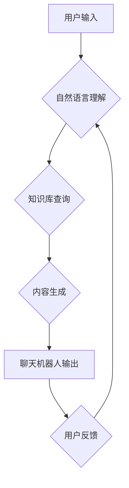

                 

## 聊天机器人道德规范：避免有害内容

> 关键词：聊天机器人、道德规范、有害内容、自然语言处理、机器学习、偏见、歧视、安全、责任

### 1. 背景介绍

聊天机器人技术近年来发展迅速，已广泛应用于客服、教育、娱乐等领域。这些智能对话系统能够理解和生成人类语言，为用户提供便捷、高效的服务。然而，随着聊天机器人的能力不断增强，其潜在的风险也日益凸显。

如果聊天机器人被用于传播虚假信息、煽动仇恨、进行欺诈等恶意目的，将对社会造成严重危害。因此，制定和实施聊天机器人道德规范，避免其产生有害内容，至关重要。

### 2. 核心概念与联系

**2.1 核心概念**

* **聊天机器人:** 利用自然语言处理（NLP）和机器学习（ML）技术，能够与人类进行自然对话的计算机程序。
* **道德规范:** 指导人们行为准则和价值观，确保其行为符合社会公德和伦理道德的原则。
* **有害内容:** 指可能对个人或社会造成伤害的信息，例如虚假信息、仇恨言论、暴力内容、色情内容等。

**2.2 核心概念联系**

聊天机器人道德规范旨在引导聊天机器人开发和应用，使其生成安全、有益、符合伦理道德的内容。

**2.3 架构流程图**



### 3. 核心算法原理 & 具体操作步骤

**3.1 算法原理概述**

聊天机器人生成内容的核心算法主要包括：

* **自然语言处理（NLP）:** 用于理解用户输入的语言含义，包括词性标注、依存句法分析、语义角色标注等。
* **机器学习（ML）:** 用于训练聊天机器人生成符合语义和语法规则的回复，包括监督学习、强化学习、生成对抗网络（GAN）等。

**3.2 算法步骤详解**

1. **用户输入:** 用户向聊天机器人发送文本信息。
2. **自然语言理解:** NLP算法分析用户输入，识别关键词、句法结构和语义意图。
3. **知识库查询:** 根据用户意图，从知识库中检索相关信息。
4. **内容生成:** 基于检索到的信息和机器学习模型，生成符合语义和语法规则的回复。
5. **输出回复:** 聊天机器人将生成的回复发送给用户。

**3.3 算法优缺点**

* **优点:** 能够快速、高效地生成文本回复，并根据用户输入进行个性化定制。
* **缺点:** 容易受到训练数据的影响，可能生成偏见、歧视或有害内容。

**3.4 算法应用领域**

* **客服:** 自动回复用户咨询，提供快速、便捷的服务。
* **教育:** 为学生提供个性化学习辅导，解答疑问。
* **娱乐:** 与用户进行互动游戏，提供娱乐体验。

### 4. 数学模型和公式 & 详细讲解 & 举例说明

**4.1 数学模型构建**

聊天机器人的内容生成通常基于概率模型，例如条件语言模型（CLM）。CLM的目标是学习给定输入序列的下一个词的概率分布。

**4.2 公式推导过程**

假设我们有一个训练语料库，包含一系列文本序列。CLM的目标是最大化以下似然函数：

$$
P(w_1, w_2, ..., w_T) = \prod_{t=1}^{T} P(w_t | w_1, w_2, ..., w_{t-1})
$$

其中，$w_t$ 表示序列中第 $t$ 个词，$T$ 表示序列长度。

**4.3 案例分析与讲解**

例如，训练一个简单的CLM模型，预测下一个词是“猫”还是“狗”。如果训练语料库中包含句子“小猫在玩”，那么模型会学习到在“小猫在”之后，下一个词更有可能是“玩”。

**4.4 数学模型应用**

CLM模型可以应用于各种自然语言处理任务，例如文本生成、机器翻译、语音识别等。

### 5. 项目实践：代码实例和详细解释说明

**5.1 开发环境搭建**

* Python 3.x
* TensorFlow 或 PyTorch
* NLTK 或 spaCy

**5.2 源代码详细实现**

```python
import tensorflow as tf

# 定义模型结构
model = tf.keras.Sequential([
    tf.keras.layers.Embedding(input_dim=vocab_size, output_dim=embedding_dim),
    tf.keras.layers.LSTM(units=hidden_units),
    tf.keras.layers.Dense(units=vocab_size, activation='softmax')
])

# 编译模型
model.compile(optimizer='adam', loss='sparse_categorical_crossentropy', metrics=['accuracy'])

# 训练模型
model.fit(x_train, y_train, epochs=epochs)

# 生成文本
text = "小猫在"
for _ in range(max_length):
    predictions = model.predict(tf.expand_dims(text, 0))
    predicted_word = tf.argmax(predictions[0]).numpy()
    text += " " + words[predicted_word]
```

**5.3 代码解读与分析**

* 代码使用 TensorFlow 库构建了一个基于 LSTM 的文本生成模型。
* 模型输入是词嵌入向量，输出是每个词的概率分布。
* 模型通过训练语料库学习到词语之间的关系，并生成符合语义和语法规则的文本。

**5.4 运行结果展示**

运行代码后，模型将根据输入文本生成新的文本。例如，输入“小猫在”，模型可能生成“小猫在玩”。

### 6. 实际应用场景

**6.1 客服机器人:** 聊天机器人可以自动回复用户咨询，例如订单查询、退换货流程等，提高客服效率。

**6.2 教育机器人:** 聊天机器人可以为学生提供个性化学习辅导，解答疑问，帮助学生理解知识。

**6.3 娱乐机器人:** 聊天机器人可以与用户进行互动游戏，例如文字冒险游戏、角色扮演游戏等，提供娱乐体验。

**6.4 未来应用展望**

随着人工智能技术的不断发展，聊天机器人将应用于更多领域，例如医疗、金融、法律等。

### 7. 工具和资源推荐

**7.1 学习资源推荐**

* **书籍:**
    * 《深度学习》
    * 《自然语言处理》
* **在线课程:**
    * Coursera: 自然语言处理
    * edX: 深度学习

**7.2 开发工具推荐**

* **TensorFlow:** 开源深度学习框架
* **PyTorch:** 开源深度学习框架
* **NLTK:** 自然语言处理工具包
* **spaCy:** 自然语言处理工具包

**7.3 相关论文推荐**

* 《Attention Is All You Need》
* 《BERT: Pre-training of Deep Bidirectional Transformers for Language Understanding》

### 8. 总结：未来发展趋势与挑战

**8.1 研究成果总结**

近年来，聊天机器人技术取得了显著进展，能够生成更自然、更流畅的文本回复。

**8.2 未来发展趋势**

* **更强大的模型:** 研究更强大的深度学习模型，提高聊天机器人的理解和生成能力。
* **多模态交互:** 结合语音、图像、视频等多模态信息，实现更丰富的交互体验。
* **个性化定制:** 根据用户的偏好和需求，定制个性化的聊天机器人体验。

**8.3 面临的挑战**

* **有害内容生成:** 聊天机器人可能被用于生成虚假信息、仇恨言论、暴力内容等有害内容。
* **数据偏见:** 训练数据可能包含偏见，导致聊天机器人生成带有偏见的回复。
* **隐私安全:** 聊天机器人可能收集用户的个人信息，需要保障用户的隐私安全。

**8.4 研究展望**

未来研究将重点关注如何解决聊天机器人带来的伦理和安全挑战，使其成为更安全、更可靠、更友好的智能助手。

### 9. 附录：常见问题与解答

**9.1 如何防止聊天机器人生成有害内容？**

* 使用高质量的训练数据，并进行数据清洗和过滤。
* 开发专门的检测机制，识别和过滤有害内容。
* 建立伦理规范，指导聊天机器人的开发和应用。

**9.2 如何解决聊天机器人数据偏见的问题？**

* 使用更加多样化的训练数据，减少数据偏见。
* 开发算法来识别和缓解数据偏见。
* 定期评估聊天机器人的输出，并进行调整。

**9.3 如何保障聊天机器人的隐私安全？**

* 仅收集必要的用户数据，并进行匿名化处理。
* 加强数据加密和安全防护措施。
* 明确用户数据的使用政策，并获得用户的同意。


作者：禅与计算机程序设计艺术 / Zen and the Art of Computer Programming 
<end_of_turn>

