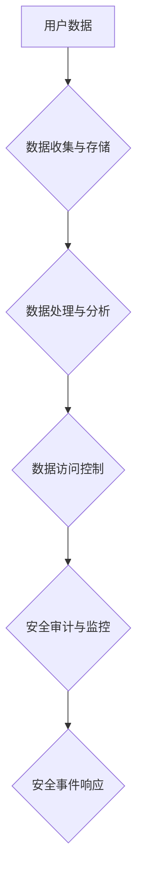

                 

## 聊天机器人隐私保护措施：数据安全

> 关键词：聊天机器人、隐私保护、数据安全、数据加密、匿名化、差分隐私、联邦学习、安全审计、法规合规

## 1. 背景介绍

随着人工智能技术的飞速发展，聊天机器人作为一种新型的人机交互方式，已广泛应用于各个领域，例如客服、教育、娱乐等。然而，聊天机器人处理大量用户数据，如对话内容、个人信息等，也带来了新的隐私安全挑战。

用户在与聊天机器人交互时，往往会分享敏感信息，例如姓名、地址、电话号码、健康状况等。这些信息如果被泄露或滥用，将可能导致用户隐私泄露、身份盗窃、经济损失等严重后果。因此，如何保障聊天机器人处理用户数据的安全和隐私，成为一个亟待解决的问题。

## 2. 核心概念与联系

### 2.1 隐私保护

隐私保护是指保护个人信息不被未经授权的访问、使用、披露或修改，确保个人信息安全和合法使用。

### 2.2 数据安全

数据安全是指保护数据免受未经授权的访问、使用、披露、修改或销毁，确保数据完整性、可用性和机密性。

### 2.3 聊天机器人数据安全架构

聊天机器人数据安全架构通常包括以下几个关键组件：

* **数据收集与存储:** 规范收集用户数据，并采用安全存储方式，例如加密存储、分级存储等。
* **数据处理与分析:** 对用户数据进行安全处理和分析，例如匿名化、去敏感化等，避免直接使用敏感信息。
* **数据访问控制:** 对用户数据进行严格的访问控制，确保只有授权人员才能访问相关数据。
* **安全审计与监控:** 对数据访问和处理进行安全审计和监控，及时发现和应对安全威胁。



## 3. 核心算法原理 & 具体操作步骤

### 3.1 算法原理概述

聊天机器人数据安全主要依赖于以下核心算法：

* **数据加密:** 将用户数据转换为不可读格式，防止未经授权的访问。
* **匿名化:** 去除用户数据中的直接识别信息，保护用户隐私。
* **差分隐私:** 在数据分析过程中，添加噪声，保护用户数据隐私，同时保证数据分析结果的准确性。
* **联邦学习:** 在不共享原始数据的情况下，训练机器学习模型，保护用户数据安全。

### 3.2 算法步骤详解

#### 3.2.1 数据加密

1. 选择合适的加密算法，例如AES、RSA等。
2. 生成加密密钥。
3. 对用户数据进行加密，并将加密后的数据存储。
4. 解密数据时，需要使用对应的解密密钥。

#### 3.2.2 匿名化

1. 识别用户数据中的直接识别信息，例如姓名、身份证号码等。
2. 对直接识别信息进行脱敏处理，例如替换为随机值、模糊化等。
3. 对匿名化后的数据进行安全存储和使用。

#### 3.2.3 差分隐私

1. 在数据分析过程中，添加噪声，使得数据分析结果难以推导出任何单个用户的隐私信息。
2. 噪声的大小需要根据数据敏感度和分析需求进行调整。
3. 差分隐私算法可以保证数据分析结果的准确性，同时保护用户数据隐私。

#### 3.2.4 联邦学习

1. 将机器学习模型分发到多个数据持有者处。
2. 数据持有者在本地训练模型，并将模型参数上传到中央服务器。
3. 中央服务器聚合所有模型参数，更新全局模型。
4. 更新后的全局模型再分发到各个数据持有者处，重复上述步骤，直到模型收敛。

### 3.3 算法优缺点

| 算法 | 优点 | 缺点 |
|---|---|---|
| 数据加密 | 保护数据机密性 | 加密解密过程可能带来性能损耗 |
| 匿名化 | 去除直接识别信息，保护用户隐私 | 可能导致数据分析精度下降 |
| 差分隐私 | 保护用户数据隐私，同时保证数据分析结果的准确性 | 噪声添加可能会影响数据分析结果的精度 |
| 联邦学习 | 不需要共享原始数据，保护用户数据安全 | 模型训练速度可能较慢 |

### 3.4 算法应用领域

* **医疗保健:** 保护患者医疗记录隐私，同时进行疾病诊断和治疗研究。
* **金融服务:** 保护客户金融数据隐私，防止欺诈和身份盗窃。
* **教育:** 保护学生个人信息隐私，同时进行个性化教育和学习分析。
* **零售:** 保护客户购物数据隐私，提供个性化商品推荐和营销服务。

## 4. 数学模型和公式 & 详细讲解 & 举例说明

### 4.1 数学模型构建

差分隐私算法的核心是引入噪声，使得数据分析结果难以推导出任何单个用户的隐私信息。

假设我们有一个数据集 D，包含 n 个用户的数据。我们想要对数据集 D 进行一个查询操作，例如计算平均年龄。差分隐私算法会将查询结果加上一个随机噪声，使得查询结果的分布满足以下条件：

* 对于任何两个相邻的数据集 D 和 D'，查询结果在 D 和 D' 上的差异，服从一个特定的概率分布。

### 4.2 公式推导过程

差分隐私的数学模型可以用以下公式来描述：

$$
\epsilon - \text{DP}
$$

其中，ε 是一个隐私预算参数，用来控制噪声的大小。

### 4.3 案例分析与讲解

假设我们有一个包含 100 个用户的年龄数据集，我们想要计算平均年龄。

使用差分隐私算法，我们可以添加一个随机噪声，使得平均年龄的查询结果满足以下条件：

* 对于任何两个相邻的数据集，平均年龄的差异，服从一个特定的概率分布。

通过调整隐私预算参数 ε，我们可以控制噪声的大小，从而平衡数据隐私和数据分析精度。

## 5. 项目实践：代码实例和详细解释说明

### 5.1 开发环境搭建

* Python 3.x
* TensorFlow 或 PyTorch 等深度学习框架
* NumPy、Pandas 等数据处理库
* 必要的库，例如OpenSSL、PyCryptodome等，用于数据加密

### 5.2 源代码详细实现

```python
# 数据加密示例
from cryptography.fernet import Fernet

# 生成加密密钥
key = Fernet.generate_key()
fernet = Fernet(key)

# 对数据进行加密
data = "敏感信息".encode()
encrypted_data = fernet.encrypt(data)

# 对数据进行解密
decrypted_data = fernet.decrypt(encrypted_data)

print(f"加密后的数据: {encrypted_data}")
print(f"解密后的数据: {decrypted_data.decode()}")
```

### 5.3 代码解读与分析

* 使用 `cryptography` 库实现数据加密。
* 生成一个随机密钥，用于加密和解密数据。
* 使用 `Fernet` 类对数据进行加密和解密。
* 加密后的数据为不可读的字节序列，需要使用对应的密钥解密。

### 5.4 运行结果展示

```
加密后的数据: b'gAAAAABj...'
解密后的数据: 敏感信息
```

## 6. 实际应用场景

### 6.1 医疗保健

* 保护患者医疗记录隐私，例如病历、诊断结果、治疗方案等。
* 进行疾病诊断和治疗研究，同时保护患者隐私。

### 6.2 金融服务

* 保护客户金融数据隐私，例如银行账户信息、交易记录、信用评分等。
* 预防欺诈和身份盗窃，保障客户资金安全。

### 6.3 教育

* 保护学生个人信息隐私，例如姓名、地址、成绩等。
* 进行个性化教育和学习分析，提高教学效果。

### 6.4 未来应用展望

随着人工智能技术的不断发展，聊天机器人将应用于更多领域，例如智能家居、自动驾驶、远程医疗等。在这些应用场景中，数据安全和隐私保护将更加重要。

未来，聊天机器人数据安全技术将更加成熟，例如：

* 更强大的加密算法和匿名化技术，能够更好地保护用户数据隐私。
* 更有效的差分隐私算法，能够在保证数据隐私的同时，提高数据分析精度。
* 更广泛的联邦学习应用，能够在不共享原始数据的情况下，训练更强大的机器学习模型。

## 7. 工具和资源推荐

### 7.1 学习资源推荐

* **书籍:**
    * 《隐私计算》
    * 《差分隐私》
    * 《联邦学习》
* **在线课程:**
    * Coursera: Privacy-Preserving Machine Learning
    * edX: Introduction to Differential Privacy
* **博客和论坛:**
    * OpenMined
    * Differential Privacy Blog

### 7.2 开发工具推荐

* **加密库:**
    * OpenSSL
    * PyCryptodome
* **差分隐私库:**
    * TensorFlow Privacy
    * PyDP
* **联邦学习库:**
    * TensorFlow Federated
    * PySyft

### 7.3 相关论文推荐

* 《A Survey of Privacy-Preserving Machine Learning》
* 《Differential Privacy》
* 《Federated Learning: Strategies for Improving Communication Efficiency》

## 8. 总结：未来发展趋势与挑战

### 8.1 研究成果总结

近年来，在聊天机器人数据安全领域取得了显著进展，例如差分隐私、联邦学习等技术得到了广泛应用。这些技术能够有效保护用户数据隐私，同时保证数据分析的准确性。

### 8.2 未来发展趋势

* **更强大的隐私保护技术:** 随着人工智能技术的不断发展，将涌现出更强大的隐私保护技术，例如零知识证明、同态加密等。
* **更广泛的应用场景:** 聊天机器人数据安全技术将应用于更多领域，例如智能家居、自动驾驶、远程医疗等。
* **更完善的法律法规:** 随着数据隐私保护意识的增强，各国将出台更完善的法律法规，规范聊天机器人数据安全的使用。

### 8.3 面临的挑战

* **技术复杂性:** 聊天机器人数据安全技术本身比较复杂，需要专业的技术人员进行开发和维护。
* **成本问题:** 采用先进的隐私保护技术，可能会带来一定的成本增加。
* **用户认知:** 一些用户可能对数据隐私保护不够重视，需要加强用户教育和宣传。

### 8.4 研究展望

未来，聊天机器人数据安全领域的研究将更加深入，例如：

* 研究更有效的差分隐私算法，提高数据分析精度。
* 研究更安全的联邦学习方法，防止模型训练过程中的数据泄露。
* 研究如何将隐私保护技术与其他人工智能技术结合，例如自然语言处理、计算机视觉等。


## 9. 附录：常见问题与解答

### 9.1 如何选择合适的隐私保护技术？

选择合适的隐私保护技术需要根据具体应用场景和数据敏感度进行评估。

* **数据敏感度低:** 可以采用匿名化技术，去除直接识别信息。
* **数据敏感度较高:** 需要采用更强大的隐私保护技术，例如差分隐私、联邦学习等。

### 9.2 聊天机器人数据安全有哪些法律法规？

各国对聊天机器人数据安全都有相关的法律法规，例如：

* **欧盟通用数据保护条例 (GDPR):** 对个人数据处理和保护提出了严格的要求。
* **美国加州消费者隐私法 (CCPA):** 给予加州居民更多控制权，例如访问、删除、选择不销售个人数据。

### 9.3 如何进行聊天机器人数据安全审计？

聊天机器人数据安全审计需要定期进行，包括以下内容：

* **数据收集和存储:** 检查数据收集和存储是否符合安全标准。
* **数据处理和分析:** 检查数据处理和分析是否采用了隐私保护技术。
* **数据访问控制:** 检查数据访问控制是否严格，只有授权人员才能访问相关数据。
* **安全事件响应:** 检查是否有有效的安全事件响应机制，能够及时发现和应对安全威胁。


作者：禅与计算机程序设计艺术 / Zen and the Art of Computer Programming 
<end_of_turn>

