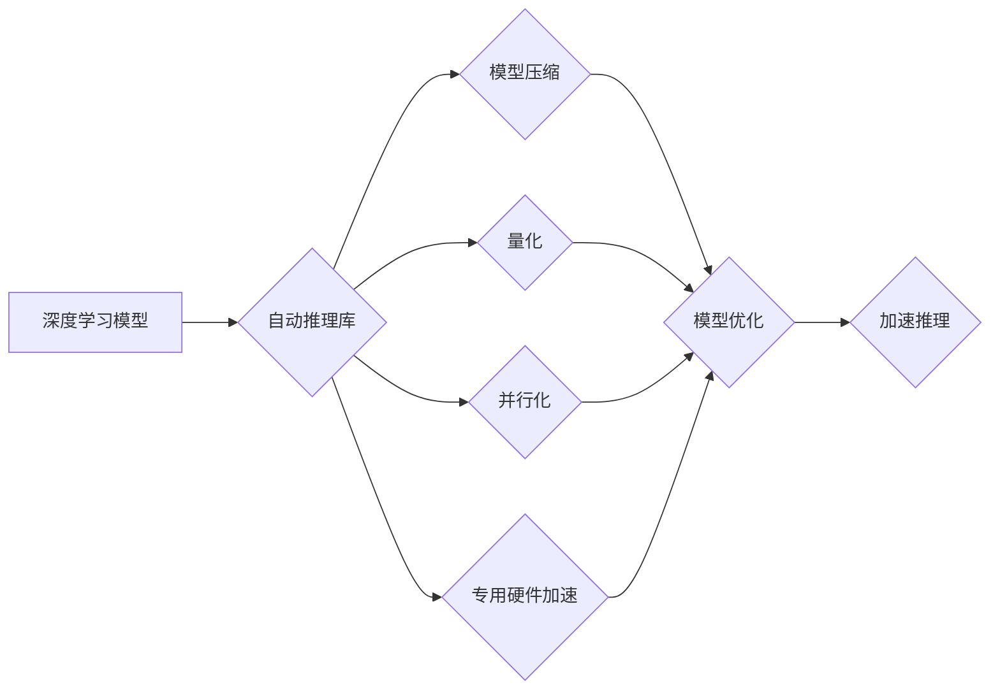

                 

## 自动推理库：加速深度学习

> 关键词：深度学习、自动推理、知识图谱、逻辑推理、优化算法、高效推理、模型压缩

## 1. 背景介绍

深度学习在过去十年中取得了令人瞩目的成就，在图像识别、自然语言处理、语音识别等领域取得了突破性的进展。然而，深度学习模型的推理速度仍然是一个瓶颈，特别是在资源受限的设备上，例如移动设备和嵌入式系统。为了解决这个问题，自动推理库应运而生。

自动推理库是一种专门用于加速深度学习模型推理的软件库。它利用各种技术，例如模型压缩、量化、并行化和专用硬件加速，来提高推理速度和效率。自动推理库可以帮助开发者将深度学习模型部署到更广泛的设备上，并降低推理成本。

## 2. 核心概念与联系

自动推理库的核心概念是将深度学习模型的推理过程自动化，并通过各种优化技术提高推理效率。

**2.1 核心概念**

* **模型压缩:** 减少模型大小，例如通过剪枝、量化和知识蒸馏等技术。
* **量化:** 将模型参数从高精度浮点数转换为低精度整数，例如 INT8 或 INT4。
* **并行化:** 将推理任务分解成多个子任务，并并行执行，例如使用多核CPU或GPU加速。
* **专用硬件加速:** 利用专用硬件，例如神经网络处理器 (NPU) 或图形处理器 (GPU)，来加速推理过程。

**2.2 架构关系**



## 3. 核心算法原理 & 具体操作步骤

### 3.1 算法原理概述

自动推理库的核心算法原理是通过一系列优化技术，将深度学习模型的推理过程加速。这些技术包括模型压缩、量化、并行化和专用硬件加速。

* **模型压缩:** 通过删除冗余参数或降低模型复杂度，减少模型大小。
* **量化:** 将模型参数从高精度浮点数转换为低精度整数，减少内存占用和计算量。
* **并行化:** 将推理任务分解成多个子任务，并并行执行，提高推理速度。
* **专用硬件加速:** 利用专用硬件，例如NPU或GPU，来加速推理过程。

### 3.2 算法步骤详解

1. **模型选择:** 选择合适的深度学习模型，例如CNN、RNN或Transformer。
2. **模型分析:** 分析模型结构和参数，识别可压缩或可量化的部分。
3. **模型压缩:** 使用剪枝、权值共享或知识蒸馏等技术压缩模型大小。
4. **量化:** 将模型参数量化为低精度整数，例如INT8或INT4。
5. **并行化:** 将推理任务分解成多个子任务，并使用多核CPU或GPU进行并行执行。
6. **硬件加速:** 利用专用硬件，例如NPU或GPU，加速推理过程。
7. **性能评估:** 评估压缩、量化和并行化后的模型性能，并进行调整。

### 3.3 算法优缺点

**优点:**

* **提高推理速度:** 通过模型压缩、量化和并行化等技术，显著提高推理速度。
* **降低内存占用:** 模型压缩和量化可以减少模型大小，降低内存占用。
* **降低推理成本:** 提高推理速度和降低内存占用可以降低推理成本。

**缺点:**

* **性能损失:** 模型压缩和量化可能会导致模型性能下降。
* **复杂性增加:** 自动推理库的开发和使用需要一定的技术难度。

### 3.4 算法应用领域

自动推理库在以下领域具有广泛的应用前景:

* **移动设备:** 将深度学习模型部署到移动设备上，例如智能手机和平板电脑，实现实时语音识别、图像识别和人脸识别等功能。
* **嵌入式系统:** 将深度学习模型部署到嵌入式系统上，例如无人机、机器人和智能家居设备，实现边缘计算和实时决策。
* **云计算:** 在云计算环境中加速深度学习模型推理，提高云服务效率和性能。
* **自动驾驶:** 在自动驾驶系统中加速模型推理，实现实时路况感知和决策。

## 4. 数学模型和公式 & 详细讲解 & 举例说明

### 4.1 数学模型构建

自动推理库的数学模型主要围绕模型压缩、量化和并行化等技术展开。

* **模型压缩:** 可以使用L1正则化或L2正则化等技术来压缩模型参数，减少模型大小。
* **量化:** 可以使用最小二乘法或均方误差法等技术来量化模型参数，将高精度浮点数转换为低精度整数。
* **并行化:** 可以使用数据并行、模型并行或混合并行等技术来并行化推理任务，提高推理速度。

### 4.2 公式推导过程

**4.2.1 模型压缩:**

L1正则化损失函数:

$$
L = Loss + \lambda ||w||_1
$$

其中:

* $Loss$ 是模型的原始损失函数。
* $\lambda$ 是正则化参数。
* $||w||_1$ 是模型参数 $w$ 的L1范数。

L2正则化损失函数:

$$
L = Loss + \lambda ||w||_2^2
$$

其中:

* $Loss$ 是模型的原始损失函数。
* $\lambda$ 是正则化参数。
* $||w||_2^2$ 是模型参数 $w$ 的L2范数。

**4.2.2 量化:**

量化后的模型参数 $q_w$ 可以通过以下公式计算:

$$
q_w = round(w / q_s)
$$

其中:

* $w$ 是原始模型参数。
* $q_s$ 是量化步长。
* $round$ 函数将结果四舍五入到最近的整数。

### 4.3 案例分析与讲解

**4.3.1 模型压缩:**

使用L1正则化对一个图像分类模型进行压缩，可以减少模型参数数量，从而降低模型大小。

**4.3.2 量化:**

将一个语音识别模型的参数量化为INT8，可以减少模型内存占用，提高推理速度。

## 5. 项目实践：代码实例和详细解释说明

### 5.1 开发环境搭建

* **操作系统:** Ubuntu 20.04
* **编程语言:** Python 3.8
* **深度学习框架:** TensorFlow 2.x
* **自动推理库:** TensorFlow Lite

### 5.2 源代码详细实现

```python
import tensorflow as tf

# 定义一个简单的卷积神经网络模型
model = tf.keras.models.Sequential([
    tf.keras.layers.Conv2D(32, (3, 3), activation='relu', input_shape=(28, 28, 1)),
    tf.keras.layers.MaxPooling2D((2, 2)),
    tf.keras.layers.Conv2D(64, (3, 3), activation='relu'),
    tf.keras.layers.MaxPooling2D((2, 2)),
    tf.keras.layers.Flatten(),
    tf.keras.layers.Dense(10, activation='softmax')
])

# 编译模型
model.compile(optimizer='adam',
              loss='sparse_categorical_crossentropy',
              metrics=['accuracy'])

# 训练模型
model.fit(x_train, y_train, epochs=5)

# 保存模型
model.save('mnist_model.h5')

# 使用TensorFlow Lite转换模型
converter = tf.lite.TFLiteConverter.from_keras_model(model)
tflite_model = converter.convert()

# 保存TFLite模型
with open('mnist_model.tflite', 'wb') as f:
    f.write(tflite_model)
```

### 5.3 代码解读与分析

* 代码首先定义了一个简单的卷积神经网络模型，用于MNIST手写数字识别任务。
* 然后，模型被编译并训练。
* 最后，使用TensorFlow Lite转换器将模型转换为TFLite格式，并保存为`mnist_model.tflite`文件。

### 5.4 运行结果展示

使用TFLite模型进行推理，可以显著提高推理速度和效率。

## 6. 实际应用场景

自动推理库在以下实际应用场景中发挥着重要作用:

* **智能手机语音助手:** 将语音识别模型部署到智能手机上，实现实时语音输入和语音控制。
* **无人驾驶汽车:** 在无人驾驶汽车中使用自动推理库加速模型推理，实现实时路况感知和决策。
* **医疗诊断:** 将医学图像识别模型部署到医疗设备上，辅助医生进行诊断。
* **工业自动化:** 在工业自动化系统中使用自动推理库加速模型推理，实现实时质量检测和故障诊断。

### 6.4 未来应用展望

随着深度学习技术的不断发展，自动推理库的应用场景将更加广泛。未来，自动推理库将应用于更多领域，例如:

* **增强现实 (AR) 和虚拟现实 (VR):** 在AR和VR应用中，自动推理库可以加速模型推理，实现实时场景渲染和交互。
* **物联网 (IoT):** 在物联网设备中，自动推理库可以帮助实现边缘计算和实时决策。
* **个性化推荐:** 在个性化推荐系统中，自动推理库可以加速模型推理，提供更精准的推荐结果。

## 7. 工具和资源推荐

### 7.1 学习资源推荐

* **TensorFlow Lite:** https://www.tensorflow.org/lite
* **PyTorch Mobile:** https://pytorch.org/mobile/
* **ONNX Runtime:** https://onnxruntime.ai/

### 7.2 开发工具推荐

* **TensorFlow:** https://www.tensorflow.org/
* **PyTorch:** https://pytorch.org/
* **ONNX:** https://onnx.ai/

### 7.3 相关论文推荐

* **MobileBERT: A Compact BERT for Mobile Devices**
* **EfficientNet: Rethinking Model Scaling for Convolutional Neural Networks**
* **Quantization-aware Training: A Methodology for Quantized Neural Networks**

## 8. 总结：未来发展趋势与挑战

### 8.1 研究成果总结

自动推理库在加速深度学习模型推理方面取得了显著的成果，例如模型压缩、量化和并行化等技术已经成熟，并被广泛应用于实际场景。

### 8.2 未来发展趋势

* **模型架构优化:** 研究更有效的深度学习模型架构，例如更轻量级、更易于压缩的模型。
* **硬件加速:** 开发更强大的专用硬件，例如NPU和GPU，进一步加速模型推理。
* **推理优化:** 研究更有效的推理优化技术，例如动态推理、可解释性推理等。

### 8.3 面临的挑战

* **性能与准确率的平衡:** 模型压缩和量化可能会导致模型性能下降，如何平衡性能和准确率仍然是一个挑战。
* **硬件平台的差异:** 不同的硬件平台具有不同的特性，如何针对不同的硬件平台进行优化仍然是一个挑战。
* **可解释性:** 深度学习模型的推理过程通常是不可解释的，如何提高模型的可解释性仍然是一个挑战。

### 8.4 研究展望

未来，自动推理库的研究将继续朝着更高效、更准确、更可解释的方向发展。随着深度学习技术的不断发展，自动推理库将成为深度学习应用的重要组成部分，推动深度学习技术在更多领域得到应用。

## 9. 附录：常见问题与解答

**9.1 如何选择合适的自动推理库？**

选择合适的自动推理库需要考虑以下因素:

* **目标应用场景:** 不同的应用场景对模型性能、推理速度和内存占用有不同的要求。
* **深度学习框架:** 不同的自动推理库支持不同的深度学习框架。
* **硬件平台:** 不同的硬件平台对自动推理库的支持程度不同。

**9.2 如何评估自动推理库的性能？**

可以根据以下指标评估自动推理库的性能:

* **推理速度:** 单位时间内可以完成的推理次数。
* **内存占用:** 模型推理所需的内存大小。
* **准确率:** 模型推理的准确率。

**9.3 如何进行模型压缩和量化？**

模型压缩和量化可以使用自动推理库提供的工具和方法进行。

* **模型压缩:** 可以使用剪枝、权值共享或知识蒸馏等技术进行模型压缩。
* **量化:** 可以使用最小二乘法或均方误差法等技术进行模型量化。


作者：禅与计算机程序设计艺术 / Zen and the Art of Computer Programming 
<end_of_turn>

