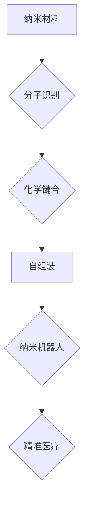

                 

## 自组装纳米机器人：精准医疗的新工具

> 关键词：纳米机器人、自组装、精准医疗、生物医学工程、分子识别、机器学习

## 1. 背景介绍

精准医疗是现代医学发展的重要趋势，其核心目标是根据个体患者的基因、环境和生活方式等因素，制定个性化的治疗方案，提高治疗效果，降低副作用。然而，传统的医疗方法往往缺乏针对性，难以实现对疾病的精准治疗。纳米技术作为一门新兴的交叉学科，为精准医疗提供了新的思路和可能性。

纳米机器人是指尺寸在纳米尺度（1-100纳米）范围内的微型机器，它们可以精确地操控和操作物质，具有强大的功能和应用潜力。自组装纳米机器人是指能够通过自发的方式组装成复杂结构的纳米机器人，它们可以利用分子识别、化学键合等原理，在特定环境下自动组装成预设的形状和功能。

自组装纳米机器人具有以下优势，使其成为精准医疗的理想工具：

* **高精度：** 纳米机器人的尺寸与生物分子相近，可以精确地靶向病灶，减少对健康组织的损伤。
* **多功能性：** 纳米机器人可以被设计成具有多种功能，例如药物递送、基因编辑、细胞治疗等。
* **可编程性：** 自组装纳米机器人的结构和功能可以被编程，使其能够根据不同的治疗需求进行调整。
* **可重复性：** 自组装纳米机器人的制造过程可以被标准化，使其具有可重复性和可规模化生产的潜力。

## 2. 核心概念与联系

自组装纳米机器人是将纳米技术与生物医学工程相结合的产物，其核心概念包括：

* **纳米尺度：** 纳米机器人尺寸在纳米尺度，可以与生物分子相互作用。
* **自组装：** 纳米机器人能够通过自发的方式组装成预设的结构。
* **分子识别：** 纳米机器人可以识别特定的生物分子，例如蛋白质、DNA、RNA等。
* **化学键合：** 纳米机器人可以利用化学键合原理，与生物分子结合。
* **机器学习：** 机器学习算法可以用于优化纳米机器人的设计和控制。

**Mermaid 流程图**



## 3. 核心算法原理 & 具体操作步骤

### 3.1  算法原理概述

自组装纳米机器人的核心算法原理是基于分子识别和化学键合的原理。纳米机器人可以通过设计特定的表面结构和化学功能基团，与目标生物分子进行识别和结合。

### 3.2  算法步骤详解

1. **设计纳米机器人结构：** 根据目标应用需求，设计纳米机器人的形状、尺寸和功能模块。
2. **选择合适的纳米材料：** 选择具有良好生物相容性和可控自组装性能的纳米材料，例如金纳米颗粒、碳纳米管、石墨烯等。
3. **表面修饰纳米材料：** 在纳米材料表面修饰特定的分子识别基团，使其能够识别目标生物分子。
4. **控制自组装过程：** 通过控制环境条件，例如温度、pH值、离子浓度等，引导纳米材料进行自组装，形成预设的结构。
5. **测试和优化：** 对自组装后的纳米机器人进行测试和优化，确保其具有预期的功能和性能。

### 3.3  算法优缺点

**优点：**

* **高精度：** 纳米机器人可以精确地靶向病灶。
* **多功能性：** 纳米机器人可以被设计成具有多种功能。
* **可编程性：** 纳米机器人的结构和功能可以被编程。

**缺点：**

* **技术难度高：** 自组装纳米机器人的设计和制造技术难度高。
* **生物安全性：** 纳米机器人的生物安全性需要进一步研究和评估。
* **成本高：** 自组装纳米机器人的生产成本较高。

### 3.4  算法应用领域

自组装纳米机器人具有广泛的应用前景，包括：

* **精准药物递送：** 将药物精确地递送到病灶，提高治疗效果，减少副作用。
* **基因编辑：** 将基因编辑工具递送到细胞内，修复基因缺陷。
* **细胞治疗：** 将纳米机器人与细胞结合，增强细胞的治疗效果。
* **疾病诊断：** 利用纳米机器人检测疾病标志物，实现早期诊断。

## 4. 数学模型和公式 & 详细讲解 & 举例说明

### 4.1  数学模型构建

自组装纳米机器人的行为可以被数学模型描述，例如：

* **布朗运动模型：** 描述纳米机器人由于热运动而随机运动的轨迹。
* **扩散模型：** 描述纳米机器人通过扩散作用到达目标位置的概率。
* **动力学模型：** 描述纳米机器人与生物分子相互作用的动力学过程。

### 4.2  公式推导过程

例如，布朗运动模型可以描述纳米机器人的随机运动轨迹，其方程为：

$$
\frac{d\mathbf{r}}{dt} = \mathbf{F} + \mathbf{ξ}(t)
$$

其中：

* $\mathbf{r}$ 是纳米机器人的位置矢量。
* $t$ 是时间。
* $\mathbf{F}$ 是纳米机器人所受的外部力。
* $\mathbf{ξ}(t)$ 是随机力矢量，服从高斯分布。

### 4.3  案例分析与讲解

通过布朗运动模型，我们可以模拟纳米机器人在不同环境条件下的运动轨迹，例如在不同浓度的溶液中，或者在存在不同大小的障碍物的情况下。

## 5. 项目实践：代码实例和详细解释说明

### 5.1  开发环境搭建

开发自组装纳米机器人项目需要以下开发环境：

* **编程语言：** Python、C++等。
* **模拟软件：** LAMMPS、GROMACS等。
* **数据分析工具：** MATLAB、R等。

### 5.2  源代码详细实现

以下是一个简单的Python代码示例，模拟纳米机器人通过扩散作用到达目标位置的概率：

```python
import numpy as np

def diffusion_probability(distance, time, diffusion_coefficient):
  """
  计算纳米机器人通过扩散作用到达目标位置的概率。

  Args:
    distance: 目标位置与起始位置之间的距离。
    time: 时间。
    diffusion_coefficient: 扩散系数。

  Returns:
    概率值。
  """
  return np.exp(-distance**2 / (4 * diffusion_coefficient * time))

# 设置参数
distance = 10  # 目标位置与起始位置之间的距离
time = 100  # 时间
diffusion_coefficient = 1  # 扩散系数

# 计算概率值
probability = diffusion_probability(distance, time, diffusion_coefficient)

# 打印结果
print(f"纳米机器人到达目标位置的概率为：{probability}")
```

### 5.3  代码解读与分析

该代码首先定义了一个名为`diffusion_probability`的函数，该函数计算纳米机器人通过扩散作用到达目标位置的概率。函数的参数包括目标位置与起始位置之间的距离、时间和扩散系数。

函数内部使用了一个名为`np.exp`的函数计算指数函数的值，该函数的输入是距离平方除以4倍扩散系数乘以时间。

最后，代码设置了参数值，并调用了`diffusion_probability`函数计算概率值，并将结果打印出来。

### 5.4  运行结果展示

运行该代码后，会输出纳米机器人到达目标位置的概率值。

## 6. 实际应用场景

自组装纳米机器人已经在一些实际应用场景中得到验证，例如：

* **癌症治疗：** 将纳米机器人装载抗癌药物，靶向递送到肿瘤细胞，提高治疗效果。
* **感染性疾病治疗：** 将纳米机器人装载抗生素，靶向递送到感染部位，提高治疗效果。
* **组织再生：** 将纳米机器人用于引导组织再生，修复损伤组织。

### 6.4  未来应用展望

自组装纳米机器人具有巨大的发展潜力，未来将在以下领域得到更广泛的应用：

* **个性化医疗：** 根据患者的基因和疾病特征，定制化设计纳米机器人，实现精准治疗。
* **疾病预防：** 利用纳米机器人监测身体健康状况，早期发现疾病风险。
* **环境修复：** 利用纳米机器人清除污染物，修复环境。

## 7. 工具和资源推荐

### 7.1  学习资源推荐

* **书籍：**
    * 《纳米机器人》
    * 《自组装纳米材料》
* **在线课程：**
    * Coursera 上的纳米技术课程
    * edX 上的纳米机器人课程

### 7.2  开发工具推荐

* **模拟软件：** LAMMPS、GROMACS
* **编程语言：** Python、C++
* **数据分析工具：** MATLAB、R

### 7.3  相关论文推荐

* **《自组装纳米机器人：原理、设计和应用》**
* **《纳米机器人用于精准医疗》**

## 8. 总结：未来发展趋势与挑战

### 8.1  研究成果总结

自组装纳米机器人技术近年来取得了显著进展，在精准医疗、疾病治疗、环境修复等领域展现出巨大的应用潜力。

### 8.2  未来发展趋势

未来，自组装纳米机器人技术将朝着以下方向发展：

* **功能多样化：** 开发具有更丰富功能的纳米机器人，例如药物递送、基因编辑、细胞治疗等。
* **智能化程度提高：** 利用机器学习算法，赋予纳米机器人更强的智能化能力，使其能够自主学习和决策。
* **生物安全性增强：** 提高纳米机器人的生物安全性，使其能够安全有效地应用于人体。

### 8.3  面临的挑战

自组装纳米机器人技术还面临着一些挑战：

* **技术难度高：** 自组装纳米机器人的设计和制造技术难度高，需要进一步突破。
* **生物安全性：** 纳米机器人的生物安全性需要进一步研究和评估，确保其安全有效地应用于人体。
* **伦理问题：** 自组装纳米机器人的应用可能引发一些伦理问题，需要进行深入探讨和规范。

### 8.4  研究展望

未来，我们将继续致力于自组装纳米机器人技术的研发，努力克服技术挑战，推动其在精准医疗等领域的应用，为人类健康福祉做出贡献。

## 9. 附录：常见问题与解答

**常见问题：**

* 自组装纳米机器人是否安全？
* 自组装纳米机器人是否会对环境造成污染？
* 自组装纳米机器人是否会取代医生？

**解答：**

* 自组装纳米机器人的安全性是研究人员关注的重点，目前的研究表明，纳米机器人具有良好的生物相容性，不会对人体造成危害。
* 自组装纳米机器人材料的选择和处理需要符合环保标准，以避免对环境造成污染。
* 自组装纳米机器人是辅助医疗工具，不会取代医生，而是帮助医生更好地诊断和治疗疾病。


作者：禅与计算机程序设计艺术 / Zen and the Art of Computer Programming 
<end_of_turn>

