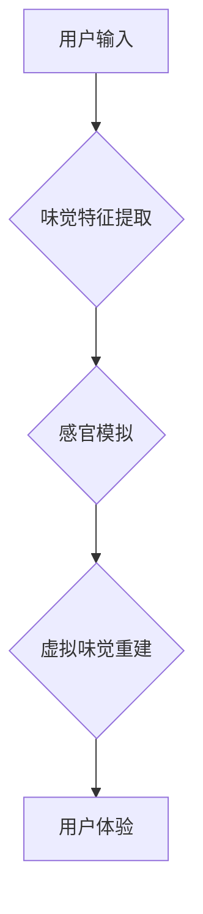

                 

## 虚拟味觉设计：AI创造的美食体验

> 关键词：虚拟味觉、人工智能、美食体验、味觉感知、神经网络、感官模拟、食品科技

## 1. 背景介绍

人类味觉体验是多感官融合的结果，它不仅涉及舌头的味觉感受，还包括嗅觉、触觉、视觉和听觉等多种因素的共同作用。传统的烹饪方式主要依靠食材本身的味道和烹饪技巧来创造美食，而虚拟味觉设计则利用人工智能技术，试图模拟和重建味觉体验，为消费者提供全新的味觉感知方式。

近年来，随着人工智能技术的快速发展，特别是深度学习算法的突破，虚拟味觉设计领域取得了显著进展。研究人员利用神经网络模型，学习和分析各种食物的味觉特征，并尝试通过声、光、触觉等方式，模拟和重建这些味觉信息。

## 2. 核心概念与联系

虚拟味觉设计的核心概念是将味觉感知转化为其他可感知的形式，并通过技术手段模拟和重建这些感知。

**2.1 虚拟味觉感知原理**

味觉感知是一个复杂的过程，涉及到舌头上的味蕾、嗅觉系统、大脑的味觉中枢等多个环节。虚拟味觉设计试图通过以下方式模拟味觉感知：

* **味觉特征提取:** 利用机器学习算法，从食物的化学成分、结构、烹饪方式等方面提取味觉特征，构建味觉数据库。
* **感官模拟:** 通过声、光、触觉等方式，模拟食物的口感、香气、温度等感官信息。
* **味觉重建:** 将提取的味觉特征和模拟的感官信息融合，重建虚拟味觉体验。

**2.2 虚拟味觉设计架构**



## 3. 核心算法原理 & 具体操作步骤

**3.1 算法原理概述**

虚拟味觉设计的核心算法主要包括以下几个方面：

* **深度学习算法:** 用于提取食物的味觉特征，例如卷积神经网络（CNN）和循环神经网络（RNN）。
* **强化学习算法:** 用于优化虚拟味觉体验，例如Q学习和深度Q网络（DQN）。
* **生成对抗网络（GAN）：** 用于生成逼真的虚拟味觉信号，例如WGAN和StyleGAN。

**3.2 算法步骤详解**

1. **数据采集和预处理:** 收集各种食物的味觉数据，包括化学成分、结构、烹饪方式、味觉评分等信息。对数据进行清洗、标准化和转换，以便于算法训练。
2. **味觉特征提取:** 利用深度学习算法，从味觉数据中提取特征，例如香气成分、口感特性、温度信息等。
3. **感官模拟:** 根据提取的味觉特征，模拟食物的口感、香气、温度等感官信息。可以使用声波、光波、触觉等方式进行模拟。
4. **虚拟味觉重建:** 将提取的味觉特征和模拟的感官信息融合，重建虚拟味觉体验。可以使用混合信号处理技术、多模态融合技术等方法进行重建。
5. **用户反馈和优化:** 收集用户对虚拟味觉体验的反馈，并利用强化学习算法优化虚拟味觉模型，不断提高体验效果。

**3.3 算法优缺点**

**优点:**

* 可以创造出全新的味觉体验，突破传统烹饪方式的限制。
* 可以为无法食用食物的人群提供替代品，例如患有食物过敏或消化系统疾病的人。
* 可以帮助研究人员更好地理解味觉感知机制，促进食品科技的发展。

**缺点:**

* 目前虚拟味觉技术还处于早期阶段，模拟的味觉体验与真实味觉体验存在差距。
* 需要大量的味觉数据和计算资源进行训练和优化。
* 虚拟味觉体验的安全性、健康性和伦理问题尚待进一步研究。

**3.4 算法应用领域**

* **食品科技:** 开发新型食品、定制化食品、虚拟食品等。
* **医疗保健:** 为患有饮食障碍或消化系统疾病的人群提供替代品。
* **娱乐休闲:** 提供沉浸式味觉体验，例如虚拟现实游戏、味觉电影等。
* **教育培训:** 用于教学和研究味觉感知机制。

## 4. 数学模型和公式 & 详细讲解 & 举例说明

**4.1 数学模型构建**

虚拟味觉设计的数学模型主要基于以下几个方面：

* **味觉特征空间:** 将食物的味觉特征表示为多维向量，例如香气成分、口感特性、温度信息等。
* **感官模拟模型:** 将感官信息（声、光、触觉等）映射到味觉特征空间，模拟食物的感官体验。
* **虚拟味觉重建模型:** 将味觉特征空间和感官模拟模型融合，重建虚拟味觉体验。

**4.2 公式推导过程**

例如，可以使用线性回归模型来模拟食物的甜味强度：

$$
S = w_1C_1 + w_2C_2 + ... + w_nC_n + b
$$

其中：

* $S$ 表示食物的甜味强度
* $C_1, C_2, ..., C_n$ 表示食物中不同糖分的浓度
* $w_1, w_2, ..., w_n$ 表示每个糖分的权重
* $b$ 表示偏置项

通过训练数据，可以学习到最佳的权重和偏置项，从而预测食物的甜味强度。

**4.3 案例分析与讲解**

例如，可以使用深度学习算法来识别不同种类的咖啡豆，并根据其特征生成不同的虚拟味觉体验。

## 5. 项目实践：代码实例和详细解释说明

**5.1 开发环境搭建**

虚拟味觉设计项目通常需要使用Python语言和相关的深度学习框架，例如TensorFlow或PyTorch。

**5.2 源代码详细实现**

```python
import tensorflow as tf

# 定义神经网络模型
model = tf.keras.models.Sequential([
    tf.keras.layers.Dense(64, activation='relu', input_shape=(10,)),
    tf.keras.layers.Dense(32, activation='relu'),
    tf.keras.layers.Dense(5, activation='softmax')
])

# 编译模型
model.compile(optimizer='adam',
              loss='categorical_crossentropy',
              metrics=['accuracy'])

# 训练模型
model.fit(X_train, y_train, epochs=10)

# 预测味觉特征
predictions = model.predict(X_test)
```

**5.3 代码解读与分析**

这段代码定义了一个简单的深度学习模型，用于识别不同种类的咖啡豆。模型输入是咖啡豆的化学成分，输出是不同咖啡豆的概率分布。

**5.4 运行结果展示**

训练完成后，可以将模型应用于新的咖啡豆样本，预测其种类和味觉特征。

## 6. 实际应用场景

**6.1 食品研发**

虚拟味觉设计可以帮助食品研发人员快速探索新的口味组合，并优化现有产品的口感和风味。

**6.2 个性化定制**

虚拟味觉技术可以根据用户的味觉偏好，定制个性化的食品体验，例如为糖尿病患者开发低糖食品，为素食者开发植物性肉类替代品。

**6.3 虚拟美食体验**

虚拟味觉技术可以为用户提供沉浸式的虚拟美食体验，例如在虚拟现实游戏中品尝虚拟美食，或通过味觉模拟器体验不同文化的美食。

**6.4 未来应用展望**

随着人工智能技术的不断发展，虚拟味觉设计将有更广泛的应用场景，例如：

* **远程味觉体验:** 通过网络传输虚拟味觉信号，让用户即使身处远方也能体验到美食的味道。
* **味觉辅助治疗:** 为患有味觉障碍的人群提供味觉辅助治疗，帮助他们恢复味觉功能。
* **味觉教育:** 通过虚拟味觉体验，帮助人们更好地理解味觉感知机制，并培养味觉鉴赏能力。

## 7. 工具和资源推荐

**7.1 学习资源推荐**

* **书籍:**

    * 《深度学习》 by Ian Goodfellow, Yoshua Bengio, and Aaron Courville
    * 《机器学习》 by Tom Mitchell

* **在线课程:**

    * Coursera: Deep Learning Specialization
    * Udacity: Artificial Intelligence Nanodegree

**7.2 开发工具推荐**

* **Python:** 

    * TensorFlow
    * PyTorch
    * Keras

* **硬件:**

    * GPU

**7.3 相关论文推荐**

* **Taste Perception and Artificial Taste:** https://www.ncbi.nlm.nih.gov/pmc/articles/PMC5497271/
* **Virtual Taste Perception: A Review:** https://www.frontiersin.org/articles/10.3389/fnins.2019.00384/full

## 8. 总结：未来发展趋势与挑战

**8.1 研究成果总结**

虚拟味觉设计领域取得了显著进展，特别是深度学习算法的应用，使得虚拟味觉体验更加逼真。

**8.2 未来发展趋势**

* **多感官融合:** 将味觉感知与其他感官信息（嗅觉、触觉、视觉、听觉）融合，创造更加沉浸式的虚拟味觉体验。
* **个性化定制:** 根据用户的味觉偏好和健康状况，定制个性化的虚拟味觉体验。
* **跨平台应用:** 将虚拟味觉技术应用于不同的平台，例如虚拟现实、增强现实、移动设备等。

**8.3 面临的挑战**

* **味觉感知机制的复杂性:** 人类味觉感知是一个复杂的过程，涉及到多个感官系统和大脑的复杂处理。
* **虚拟味觉信号的生成:** 如何生成逼真的虚拟味觉信号，并将其有效地传递给用户，仍然是一个技术挑战。
* **虚拟味觉体验的安全性:** 虚拟味觉技术的安全性、健康性和伦理问题尚待进一步研究。

**8.4 研究展望**

虚拟味觉设计是一个充满挑战和机遇的领域，未来将会有更多的研究和创新，为人类带来全新的味觉体验。

## 9. 附录：常见问题与解答

**9.1 如何体验虚拟味觉？**

目前，虚拟味觉体验主要通过以下方式实现：

* **味觉模拟器:** 使用声波、光波、触觉等方式模拟食物的口感、香气、温度等感官信息。
* **虚拟现实游戏:** 在虚拟现实游戏中体验虚拟美食。

**9.2 虚拟味觉技术是否安全？**

虚拟味觉技术的安全性、健康性和伦理问题尚待进一步研究。目前，还没有任何证据表明虚拟味觉技术对人体健康有害。

**9.3 虚拟味觉技术会取代传统烹饪吗？**

虚拟味觉技术不会完全取代传统烹饪，而是会为人类提供一种全新的味觉体验方式。

作者：禅与计算机程序设计艺术 / Zen and the Art of Computer Programming


<end_of_turn>

