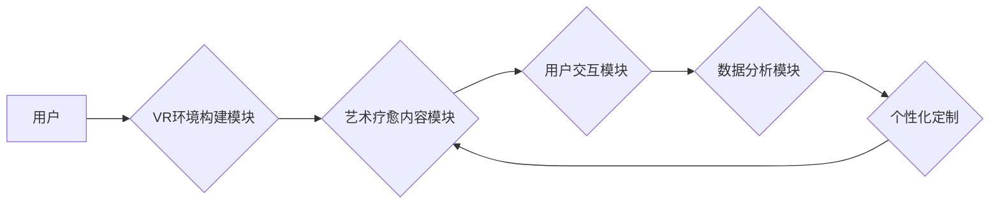

                 

## 虚拟现实艺术疗愈创业：创作与治疗的数字平台

> 关键词：虚拟现实、艺术疗愈、数字平台、神经科学、用户体验、交互设计、创业

## 1. 背景介绍

近年来，虚拟现实（VR）技术飞速发展，其沉浸式体验和交互性为艺术创作和治疗领域带来了前所未有的机遇。艺术疗愈作为一种利用艺术媒介促进身心健康和自我探索的疗法，在心理治疗、情绪调节、认知功能训练等方面展现出显著疗效。将VR技术与艺术疗愈相结合，可以构建一个全新的数字平台，为用户提供更具沉浸性和互动性的艺术创作和治疗体验。

**1.1. VR技术的应用前景**

VR技术能够创造逼真的虚拟环境，让用户身临其境地体验不同的场景和互动。在艺术创作领域，VR可以提供无限的创作空间和工具，打破传统媒介的限制，让艺术家能够自由地表达自己的创意。在艺术疗愈领域，VR可以模拟不同的环境和情境，帮助用户放松身心，减轻压力，并通过艺术创作来表达和处理自己的情绪。

**1.2. 艺术疗愈的疗效与发展**

艺术疗愈已被广泛应用于心理治疗、情绪调节、认知功能训练等领域，并取得了显著的疗效。研究表明，艺术创作可以帮助用户释放压力，减轻焦虑，提高情绪调节能力，并促进自我认知和自我表达。随着对艺术疗愈的认识不断加深，其应用范围也在不断扩大。

**1.3. 数字平台的优势**

数字平台可以将VR技术和艺术疗愈相结合，提供更便捷、更个性化的服务。数字平台可以根据用户的需求和喜好，定制不同的艺术创作和治疗方案，并提供实时反馈和指导。此外，数字平台还可以收集用户的创作数据和治疗效果，为后续的治疗和研究提供参考。

## 2. 核心概念与联系

**2.1. 虚拟现实艺术疗愈平台架构**

虚拟现实艺术疗愈平台是一个集VR技术、艺术疗愈理论、用户体验设计和数据分析于一体的综合性平台。其核心架构包括以下几个模块：

* **VR环境构建模块:** 负责创建虚拟环境，包括场景设计、虚拟道具、交互机制等。
* **艺术疗愈内容模块:** 提供各种艺术创作工具和疗愈方案，例如绘画、雕塑、音乐创作、冥想等。
* **用户交互模块:** 负责用户与虚拟环境的交互，包括手势识别、语音识别、表情识别等。
* **数据分析模块:** 收集用户创作数据和治疗效果，并进行分析和评估。

**2.2. 核心概念原理与流程图**

* **沉浸式体验:** VR技术能够创造逼真的虚拟环境，让用户身临其境地体验艺术创作和治疗过程。
* **交互性:** 用户可以通过手势、语音等方式与虚拟环境进行交互，增强参与感和体验感。
* **个性化定制:** 平台可以根据用户的需求和喜好，定制不同的艺术创作和治疗方案。
* **数据驱动:** 平台可以收集用户创作数据和治疗效果，为后续的治疗和研究提供参考。

## 3. 核心算法原理 & 具体操作步骤

**3.1. 算法原理概述**

虚拟现实艺术疗愈平台的核心算法主要包括：

* **虚拟环境渲染算法:** 负责将虚拟场景渲染成用户可以看到的图像。
* **用户交互算法:** 负责识别用户的动作和指令，并将其转化为虚拟环境中的操作。
* **艺术创作算法:** 提供各种艺术创作工具和功能，例如绘画、雕塑、音乐创作等。
* **数据分析算法:** 分析用户创作数据和治疗效果，并提供个性化建议和反馈。

**3.2. 算法步骤详解**

* **虚拟环境渲染算法:**

    1. 根据用户输入的场景参数，构建虚拟场景的几何模型和材质信息。
    2. 使用渲染引擎将虚拟场景渲染成图像，并根据用户的视角和移动方向进行实时更新。
    3. 将渲染后的图像显示在VR设备的屏幕上，提供沉浸式的视觉体验。

* **用户交互算法:**

    1. 使用传感器识别用户的动作和指令，例如手势、语音、眼动等。
    2. 将识别的动作和指令转化为虚拟环境中的操作，例如移动、旋转、缩放、绘画等。
    3. 提供实时反馈，让用户能够感受到自己的操作对虚拟环境的影响。

* **艺术创作算法:**

    1. 提供各种艺术创作工具和功能，例如绘画笔刷、雕塑工具、音乐合成器等。
    2. 根据用户的操作，生成相应的艺术作品，并保存到平台数据库中。
    3. 提供艺术创作的指导和建议，帮助用户提高创作水平。

* **数据分析算法:**

    1. 收集用户的创作数据和治疗效果，例如创作时间、创作内容、情绪变化等。
    2. 使用机器学习算法对数据进行分析，识别用户创作的模式和趋势。
    3. 提供个性化建议和反馈，帮助用户更好地进行艺术创作和治疗。

**3.3. 算法优缺点**

* **优点:**

    * 沉浸式体验，增强用户参与感和体验感。
    * 个性化定制，满足不同用户的需求。
    * 数据驱动，提供科学的治疗和创作建议。

* **缺点:**

    * 技术门槛高，需要专业的VR开发和数据分析能力。
    * 硬件成本高，需要配备VR设备和高性能计算机。
    * 伦理问题，需要考虑用户隐私和数据安全。

**3.4. 算法应用领域**

* **心理治疗:** 帮助用户缓解焦虑、抑郁、创伤后应激障碍等心理问题。
* **情绪调节:** 帮助用户释放压力、提升情绪、改善人际关系。
* **认知功能训练:** 帮助用户提高注意力、记忆力、决策能力等认知功能。
* **艺术教育:** 提供沉浸式的艺术创作体验，激发用户的创造力和想象力。

## 4. 数学模型和公式 & 详细讲解 & 举例说明

**4.1. 数学模型构建**

虚拟现实艺术疗愈平台的数学模型主要包括：

* **用户行为模型:** 描述用户的行为模式，例如创作时间、创作内容、情绪变化等。
* **虚拟环境模型:** 描述虚拟环境的几何结构、物理属性和交互机制。
* **艺术创作模型:** 描述艺术创作过程中的各种因素，例如色彩、形状、材质、节奏等。

**4.2. 公式推导过程**

* **用户行为模型:** 可以使用马尔科夫链模型来描述用户的行为模式。马尔科夫链模型假设用户的当前状态只依赖于其前一个状态，而与过去的任何其他状态无关。

* **虚拟环境模型:** 可以使用三维图形学算法来描述虚拟环境的几何结构和物理属性。

* **艺术创作模型:** 可以使用神经网络模型来描述艺术创作过程中的各种因素。神经网络模型能够学习和模拟人类的艺术创作能力。

**4.3. 案例分析与讲解**

* **用户行为模型:** 可以分析用户的创作时间分布，发现用户在特定时间段内创作活跃度更高。

* **虚拟环境模型:** 可以模拟不同类型的虚拟环境，例如自然场景、城市场景、抽象场景等，并根据用户的反馈进行优化。

* **艺术创作模型:** 可以训练一个神经网络模型，能够根据用户的输入生成不同的艺术作品，例如绘画、音乐、诗歌等。

## 5. 项目实践：代码实例和详细解释说明

**5.1. 开发环境搭建**

* **操作系统:** Windows/macOS/Linux
* **编程语言:** C++/Python
* **VR引擎:** Unity/Unreal Engine
* **数据分析工具:** TensorFlow/PyTorch

**5.2. 源代码详细实现**

* **虚拟环境渲染算法:** 使用OpenGL/DirectX渲染引擎渲染虚拟场景。

* **用户交互算法:** 使用OpenVR/SteamVR API识别用户的动作和指令。

* **艺术创作算法:** 使用Unity/Unreal Engine提供的脚本语言实现艺术创作工具和功能。

* **数据分析算法:** 使用TensorFlow/PyTorch框架训练机器学习模型。

**5.3. 代码解读与分析**

* **虚拟环境渲染算法:** 代码主要负责将虚拟场景的几何模型和材质信息转化为图像，并根据用户的视角和移动方向进行实时更新。

* **用户交互算法:** 代码主要负责识别用户的动作和指令，并将其转化为虚拟环境中的操作。

* **艺术创作算法:** 代码主要负责实现艺术创作工具和功能，例如绘画笔刷、雕塑工具、音乐合成器等。

* **数据分析算法:** 代码主要负责训练机器学习模型，并对用户的创作数据和治疗效果进行分析。

**5.4. 运行结果展示**

* 用户可以戴上VR设备，进入虚拟环境，进行艺术创作和治疗。
* 用户可以通过手势、语音等方式与虚拟环境进行交互。
* 平台可以根据用户的创作数据和治疗效果，提供个性化建议和反馈。

## 6. 实际应用场景

**6.1. 心理治疗中心**

* VR艺术疗愈平台可以帮助心理治疗师提供更沉浸式的治疗体验，并收集用户的创作数据和治疗效果，为后续的治疗提供参考。

**6.2. 学校教育机构**

* VR艺术疗愈平台可以帮助学生释放压力、提升情绪、提高创造力和想象力。

**6.3. 艺术工作室**

* VR艺术疗愈平台可以为艺术家提供无限的创作空间和工具，并帮助他们探索新的艺术形式。

**6.4. 未来应用展望**

* **远程医疗:** VR艺术疗愈平台可以帮助远程患者获得艺术疗愈服务。
* **个性化定制:** 平台可以根据用户的需求和喜好，定制更个性化的艺术创作和治疗方案。
* **人工智能辅助:** 人工智能可以辅助用户进行艺术创作，并提供更精准的治疗建议。

## 7. 工具和资源推荐

**7.1. 学习资源推荐**

* **书籍:** 《虚拟现实技术原理与应用》、《艺术疗愈理论与实践》
* **在线课程:** Coursera、edX、Udemy等平台提供VR技术和艺术疗愈相关的在线课程。

**7.2. 开发工具推荐**

* **VR引擎:** Unity、Unreal Engine
* **编程语言:** C++、Python
* **数据分析工具:** TensorFlow、PyTorch

**7.3. 相关论文推荐**

* **VR艺术疗愈:** "Virtual Reality Art Therapy: A Systematic Review"
* **艺术疗愈:** "Art Therapy: A Review of the Literature"

## 8. 总结：未来发展趋势与挑战

**8.1. 研究成果总结**

虚拟现实艺术疗愈平台是一个充满潜力的创新项目，它将VR技术和艺术疗愈相结合，为用户提供更沉浸式、更个性化的体验。

**8.2. 未来发展趋势**

* **技术进步:** VR技术将不断发展，提供更逼真的虚拟环境和更丰富的交互体验。
* **应用拓展:** VR艺术疗愈平台将应用于更多领域，例如教育、医疗、娱乐等。
* **商业化发展:** VR艺术疗愈平台将逐渐走向商业化，为用户提供付费服务。

**8.3. 面临的挑战**

* **技术难题:** VR技术仍然存在一些技术难题，例如渲染效率、交互精度、用户体验等。
* **伦理问题:** VR艺术疗愈平台需要解决用户隐私、数据安全、伦理道德等问题。
* **市场竞争:** VR艺术疗愈平台面临着来自传统艺术疗愈和游戏行业的竞争。

**8.4. 研究展望**

未来，我们需要继续深入研究VR艺术疗愈平台的技术、应用和伦理问题，并探索其在更多领域的发展潜力。

## 9. 附录：常见问题与解答

* **Q1: VR艺术疗愈平台需要哪些硬件设备？**

    A1: 需要VR头显、手柄、计算机等设备。

* **Q2: VR艺术疗愈平台的费用是多少？**

    A2: 费用取决于平台的功能、服务内容和使用时长。

* **Q3: VR艺术疗愈平台是否安全可靠？**

    A3: 平台会采取措施保护用户的隐私和数据安全。

* **Q4: VR艺术疗愈平台适合哪些人？**

    A4: 适合需要艺术疗愈、放松身心、提升创造力和想象力的用户。

* **Q5: 如何使用VR艺术疗愈平台？**

    A5: 可以通过平台官网或App下载安装，并按照平台的说明进行操作。

作者：禅与计算机程序设计艺术 / Zen and the Art of Computer Programming 
<end_of_turn>

