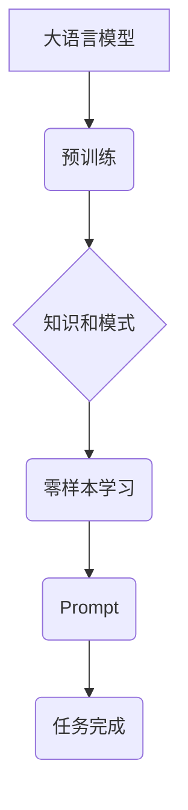

                 

## 零样本学习：Prompt的设计

> 关键词：零样本学习、Prompt工程、自然语言处理、大语言模型、文本生成、机器学习

### 1. 背景介绍

近年来，大语言模型（LLM）在自然语言处理（NLP）领域取得了令人瞩目的成就，例如文本生成、翻译、问答等。这些模型通常需要大量的标注数据进行训练，这在数据获取成本高、标注工作繁琐的情况下显得十分困难。零样本学习（Zero-Shot Learning）应运而生，它旨在让模型能够在没有见过特定任务样本的情况下，直接根据提示（Prompt）完成任务。

Prompt的设计是零样本学习的关键环节，它直接影响着模型的性能和泛化能力。一个精心设计的Prompt能够引导模型理解任务需求，并生成准确、符合预期结果的输出。然而，Prompt的设计并非易事，它需要对模型的特性、任务的性质以及语言的微妙之处有深入的理解。

### 2. 核心概念与联系

**2.1 零样本学习的原理**

零样本学习的核心思想是利用模型在预训练阶段已经学习到的知识和模式，通过提示引导模型完成新的、从未见过的任务。

**2.2 Prompt工程的定义**

Prompt工程是指设计、优化和评估用于引导大语言模型完成特定任务的提示文本的过程。它是一个跨学科的领域，涉及自然语言处理、机器学习、计算机科学等多个领域。

**2.3 核心概念关系图**



### 3. 核心算法原理 & 具体操作步骤

**3.1 算法原理概述**

零样本学习算法的核心是利用预训练语言模型的强大的表示能力和泛化能力。这些模型在海量文本数据上进行预训练，学习了语言的语法、语义和上下文关系。在零样本学习场景中，模型会将输入的Prompt和任务描述作为上下文信息，并根据其学习到的知识和模式生成相应的输出。

**3.2 算法步骤详解**

1. **准备Prompt:** 设计一个清晰、简洁、准确的Prompt，明确任务要求和输入输出格式。
2. **输入Prompt:** 将准备好的Prompt输入到预训练的语言模型中。
3. **模型推理:** 模型根据Prompt和任务描述进行推理，生成相应的输出。
4. **输出结果:** 模型输出的结果需要进行评估和筛选，确保其准确性和有效性。

**3.3 算法优缺点**

**优点:**

* 不需要额外的标注数据，降低了数据获取和标注成本。
* 能够推广到新的任务和领域，提高模型的泛化能力。

**缺点:**

* 模型的性能可能不如有监督学习，尤其是在数据稀疏的任务上。
* Prompt的设计需要专业知识和经验，难以自动化。

**3.4 算法应用领域**

* 文本分类
* 问答系统
* 机器翻译
* 代码生成
* 文本摘要

### 4. 数学模型和公式 & 详细讲解 & 举例说明

**4.1 数学模型构建**

零样本学习的数学模型通常基于Transformer架构，例如BERT、GPT等。这些模型使用注意力机制来捕捉文本序列中的长距离依赖关系，并学习文本的语义表示。

**4.2 公式推导过程**

零样本学习的具体公式推导过程较为复杂，涉及到Transformer架构的注意力机制、词嵌入、层级化网络结构等多个方面。

**4.3 案例分析与讲解**

假设我们想要训练一个零样本学习模型来进行文本分类任务，例如判断文本是正面评价还是负面评价。我们可以设计一个Prompt，例如：

```
文本：这个电影非常精彩，剧情引人入胜，演员演技 superb！
任务：判断文本的 sentiment。
```

模型会根据Prompt和文本内容进行推理，并输出结果，例如：

```
sentiment: positive
```

### 5. 项目实践：代码实例和详细解释说明

**5.1 开发环境搭建**

需要安装Python、PyTorch或TensorFlow等深度学习框架，以及一些NLP相关的库，例如transformers、datasets等。

**5.2 源代码详细实现**

```python
from transformers import AutoModelForSequenceClassification, AutoTokenizer

# 加载预训练模型和词典
model_name = "bert-base-uncased"
tokenizer = AutoTokenizer.from_pretrained(model_name)
model = AutoModelForSequenceClassification.from_pretrained(model_name)

# 定义Prompt模板
prompt_template = "文本：{text}\n任务：判断文本的 sentiment。"

# 输入文本和生成Prompt
text = "这个电影非常精彩，剧情引人入胜，演员演技 superb！"
prompt = prompt_template.format(text=text)

# Token化Prompt
inputs = tokenizer(prompt, return_tensors="pt")

# 模型推理
outputs = model(**inputs)

# 获取预测结果
predicted_class = outputs.logits.argmax().item()

# 输出结果
print(f"预测结果：{predicted_class}")
```

**5.3 代码解读与分析**

这段代码首先加载预训练的BERT模型和词典。然后，定义了一个Prompt模板，并将输入文本插入到模板中生成完整的Prompt。接着，将Prompt进行Token化，并输入到模型中进行推理。最后，获取模型的预测结果并输出。

**5.4 运行结果展示**

运行这段代码后，模型会输出预测结果，例如：

```
预测结果：1
```

其中，1代表正面的 sentiment。

### 6. 实际应用场景

零样本学习在许多实际应用场景中展现出巨大的潜力，例如：

* **客户服务:** 利用零样本学习，可以训练一个聊天机器人，即使没有针对特定问题的训练数据，也能理解客户的问题并提供帮助。
* **搜索引擎:** 零样本学习可以帮助搜索引擎更好地理解用户搜索意图，并提供更精准的搜索结果。
* **医疗诊断:** 零样本学习可以帮助医生更快、更准确地诊断疾病，即使没有针对特定疾病的训练数据。

**6.4 未来应用展望**

随着大语言模型的不断发展，零样本学习的应用场景将会更加广泛。未来，零样本学习将可能被应用于：

* **个性化教育:** 根据学生的学习情况，自动生成个性化的学习内容和练习。
* **代码生成:** 自动生成代码，减少程序员的工作量。
* **创意写作:** 帮助作家克服创作瓶颈，生成新的故事和创意。

### 7. 工具和资源推荐

**7.1 学习资源推荐**

* **书籍:**
    * 《深度学习》 by Ian Goodfellow, Yoshua Bengio, and Aaron Courville
    * 《自然语言处理》 by Dan Jurafsky and James H. Martin
* **在线课程:**
    * Coursera: Natural Language Processing Specialization
    * Stanford CS224N: Natural Language Processing with Deep Learning

**7.2 开发工具推荐**

* **Python:** 
    * PyTorch
    * TensorFlow
* **NLP库:**
    * transformers
    * spaCy
    * NLTK

**7.3 相关论文推荐**

* **BERT: Pre-training of Deep Bidirectional Transformers for Language Understanding**
* **GPT-3: Language Models are Few-Shot Learners**
* **Prompt Engineering for Zero-Shot Learning**

### 8. 总结：未来发展趋势与挑战

**8.1 研究成果总结**

零样本学习在NLP领域取得了显著进展，为模型的泛化能力和应用场景拓展提供了新的可能性。

**8.2 未来发展趋势**

* **更强大的预训练模型:** 预训练模型的规模和能力将不断提升，从而提高零样本学习的性能。
* **更有效的Prompt设计方法:** 将开发出更智能、更有效的Prompt设计方法，例如基于强化学习的Prompt优化。
* **跨模态零样本学习:** 将零样本学习扩展到多模态数据，例如文本、图像、音频等。

**8.3 面临的挑战**

* **Prompt设计复杂性:** 设计一个有效的Prompt仍然是一个复杂的任务，需要对任务和模型有深入的理解。
* **数据偏差问题:** 预训练模型可能存在数据偏差，导致零样本学习模型在某些任务上表现不佳。
* **可解释性问题:** 零样本学习模型的决策过程难以解释，这可能会影响其在一些安全敏感领域中的应用。

**8.4 研究展望**

未来，零样本学习的研究将继续深入，探索更有效的模型架构、Prompt设计方法和应用场景，推动人工智能技术的发展和应用。

### 9. 附录：常见问题与解答

**9.1 如何设计一个好的Prompt？**

设计一个好的Prompt需要考虑以下几个方面：

* **明确任务要求:** Prompt应该清楚地表达任务目标。
* **提供足够的上下文信息:** Prompt应该提供足够的背景信息，帮助模型理解任务需求。
* **使用简洁明了的语言:** Prompt应该使用易于理解的语言，避免使用过于复杂的术语。
* **进行测试和优化:** 需要不断测试和优化Prompt，以提高模型的性能。

**9.2 零样本学习的局限性是什么？**

零样本学习的局限性包括：

* **性能不如有监督学习:** 在数据稀疏的任务上，零样本学习的性能可能不如有监督学习。
* **Prompt设计复杂:** 设计一个有效的Prompt仍然是一个复杂的任务。
* **数据偏差问题:** 预训练模型可能存在数据偏差，导致零样本学习模型在某些任务上表现不佳。


作者：禅与计算机程序设计艺术 / Zen and the Art of Computer Programming 
<end_of_turn>

