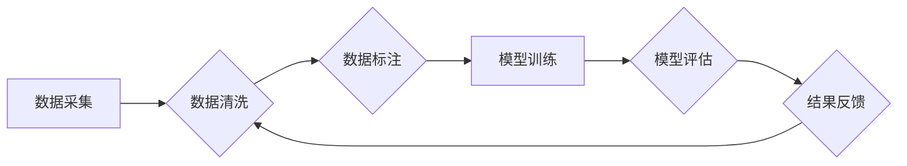

                 

## AI 大模型在电商搜索推荐中的数据质量控制策略：提高推荐准确率与可靠性

> 关键词：AI大模型、电商搜索推荐、数据质量控制、推荐准确率、可靠性、数据清洗、数据标注、模型训练、评估指标

## 1. 背景介绍

电商平台的搜索推荐系统是用户获取商品信息和完成购买的重要途径。随着电商平台的规模不断扩大，用户需求日益多样化，搜索推荐系统的准确性和可靠性显得尤为重要。传统的搜索推荐系统主要依赖于基于规则的算法和协同过滤算法，但这些算法难以应对海量数据和用户行为的复杂性。

近年来，基于深度学习的AI大模型在自然语言处理、计算机视觉等领域取得了突破性进展，也为电商搜索推荐系统带来了新的机遇。AI大模型能够学习用户行为、商品特征和文本语义等复杂关系，从而提供更精准、个性化的推荐结果。然而，AI大模型的训练和应用也面临着数据质量控制的挑战。

数据质量问题会直接影响AI大模型的训练效果和推荐结果的准确性。例如，数据中的噪声、缺失值、重复数据等都会导致模型训练不稳定，甚至产生错误的推荐结果。因此，在电商搜索推荐系统中，建立有效的AI大模型数据质量控制策略至关重要。

## 2. 核心概念与联系

### 2.1  AI大模型

AI大模型是指在海量数据上训练的深度学习模型，具有强大的泛化能力和学习能力。常见的AI大模型架构包括Transformer、BERT、GPT等。

### 2.2  电商搜索推荐系统

电商搜索推荐系统是指帮助用户快速找到所需商品的系统，它通常包含以下几个模块：

* **搜索引擎:** 处理用户搜索关键词，并返回相关商品列表。
* **推荐引擎:** 基于用户行为、商品特征等信息，推荐用户可能感兴趣的商品。
* **个性化引擎:** 根据用户的历史行为、偏好等信息，个性化推荐商品。

### 2.3  数据质量控制

数据质量控制是指确保数据准确、完整、一致、及时等方面的过程。在AI大模型训练中，数据质量控制是至关重要的环节，它直接影响模型的性能和可靠性。

**数据质量控制流程图**



## 3. 核心算法原理 & 具体操作步骤

### 3.1  算法原理概述

在电商搜索推荐系统中，常用的AI大模型算法包括：

* **协同过滤算法:** 基于用户的历史行为和商品的购买记录，预测用户对商品的兴趣。
* **内容推荐算法:** 基于商品的特征和用户对商品的偏好，推荐相关商品。
* **深度学习推荐算法:** 利用深度神经网络学习用户行为、商品特征和文本语义等复杂关系，提供更精准的推荐结果。

### 3.2  算法步骤详解

**协同过滤算法步骤:**

1. **数据收集:** 收集用户行为数据，例如用户对商品的评分、购买记录、浏览历史等。
2. **用户和商品相似度计算:** 计算用户之间的相似度和商品之间的相似度。
3. **推荐生成:** 根据用户和商品的相似度，推荐用户可能感兴趣的商品。

**内容推荐算法步骤:**

1. **商品特征提取:** 从商品描述、图片、属性等信息中提取商品特征。
2. **用户兴趣建模:** 根据用户的历史行为和偏好，构建用户的兴趣模型。
3. **推荐生成:** 根据商品特征和用户的兴趣模型，推荐用户可能感兴趣的商品。

**深度学习推荐算法步骤:**

1. **数据预处理:** 对数据进行清洗、转换、编码等预处理操作。
2. **模型构建:** 选择合适的深度学习模型架构，例如Transformer、BERT等。
3. **模型训练:** 利用训练数据训练模型，并进行参数优化。
4. **模型评估:** 使用测试数据评估模型的性能，并进行调参优化。
5. **推荐生成:** 将训练好的模型应用于新的数据，生成推荐结果。

### 3.3  算法优缺点

| 算法类型 | 优点 | 缺点 |
|---|---|---|
| 协同过滤算法 | 简单易实现，效果较好 | 数据稀疏性问题，冷启动问题 |
| 内容推荐算法 | 不依赖用户行为数据，可以推荐新商品 | 商品特征提取难度大，难以捕捉用户隐性需求 |
| 深度学习推荐算法 | 能够学习复杂关系，效果更精准 | 数据需求量大，训练成本高 |

### 3.4  算法应用领域

* **电商平台:** 商品推荐、用户画像、个性化营销
* **社交媒体:** 内容推荐、用户兴趣挖掘、广告投放
* **音乐平台:** 音乐推荐、用户偏好分析、音乐创作
* **视频平台:** 视频推荐、用户行为分析、内容创作

## 4. 数学模型和公式 & 详细讲解 & 举例说明

### 4.1  数学模型构建

在电商搜索推荐系统中，常用的数学模型包括协同过滤模型、内容推荐模型和深度学习模型。

**协同过滤模型:**

协同过滤模型通常使用矩阵分解技术，将用户-商品交互矩阵分解成用户特征矩阵和商品特征矩阵。

**公式:**

$$
R = U \cdot V^T
$$

其中，R是用户-商品交互矩阵，U是用户特征矩阵，V是商品特征矩阵。

**内容推荐模型:**

内容推荐模型通常使用机器学习算法，例如逻辑回归、支持向量机等，学习商品特征和用户兴趣之间的关系。

**公式:**

$$
P(y|x) = \frac{e^{w^T x + b}}{1 + e^{w^T x + b}}
$$

其中，P(y|x)是用户对商品的点击概率，x是商品特征向量，w是模型参数，b是偏置项。

**深度学习模型:**

深度学习模型通常使用神经网络架构，例如Transformer、BERT等，学习用户行为、商品特征和文本语义等复杂关系。

### 4.2  公式推导过程

协同过滤模型的公式推导过程涉及矩阵分解、奇异值分解等数学工具。内容推荐模型的公式推导过程涉及概率论、统计学等知识。深度学习模型的公式推导过程涉及微积分、线性代数等数学工具。

### 4.3  案例分析与讲解

**案例:**

假设有一个电商平台，用户购买了以下商品：

* 用户A购买了商品1、商品2、商品3。
* 用户B购买了商品2、商品3、商品4。
* 用户C购买了商品1、商品3、商品5。

可以使用协同过滤算法计算用户之间的相似度和商品之间的相似度，并根据这些相似度推荐商品。例如，用户A和用户C购买了相同的商品1和3，因此用户A和用户C的相似度较高。

## 5. 项目实践：代码实例和详细解释说明

### 5.1  开发环境搭建

* **操作系统:** Linux/macOS/Windows
* **编程语言:** Python
* **深度学习框架:** TensorFlow/PyTorch
* **数据处理工具:** Pandas/NumPy

### 5.2  源代码详细实现

```python
# 导入必要的库
import pandas as pd
from sklearn.metrics.pairwise import cosine_similarity

# 加载用户-商品交互数据
data = pd.read_csv('user_item_interactions.csv')

# 计算用户之间的相似度
user_similarity = cosine_similarity(data.T)

# 计算商品之间的相似度
item_similarity = cosine_similarity(data)

# 根据用户相似度推荐商品
def recommend_items(user_id, top_n=5):
    # 获取用户与其他用户的相似度
    user_similarities = user_similarity[user_id]
    # 获取相似度排序后的用户列表
    similar_users = user_similarities.argsort()[::-1][1:top_n+1]
    # 获取相似用户购买的商品列表
    recommended_items = data.loc[similar_users].sum().sort_values(ascending=False).index
    return recommended_items.tolist()

# 根据商品相似度推荐商品
def recommend_items_by_item(item_id, top_n=5):
    # 获取商品与其他商品的相似度
    item_similarities = item_similarity[item_id]
    # 获取相似度排序后的商品列表
    similar_items = item_similarities.argsort()[::-1][1:top_n+1]
    # 获取相似商品的ID列表
    recommended_items = similar_items.tolist()
    return recommended_items

# 示例
user_id = 0
recommended_items = recommend_items(user_id)
print(f'推荐给用户 {user_id} 的商品：{recommended_items}')

item_id = 0
recommended_items = recommend_items_by_item(item_id)
print(f'与商品 {item_id} 相似的商品：{recommended_items}')
```

### 5.3  代码解读与分析

* **数据加载:** 使用Pandas库加载用户-商品交互数据。
* **相似度计算:** 使用Scikit-learn库的cosine_similarity函数计算用户之间的相似度和商品之间的相似度。
* **推荐算法:** 定义了两个推荐算法函数：`recommend_items`和`recommend_items_by_item`。
* **示例:** 使用示例代码演示了如何使用推荐算法获取推荐结果。

### 5.4  运行结果展示

运行代码后，会输出用户和商品的推荐结果。

## 6. 实际应用场景

### 6.1  电商平台商品推荐

AI大模型可以根据用户的历史购买记录、浏览记录、搜索记录等信息，推荐用户可能感兴趣的商品。

### 6.2  个性化营销

AI大模型可以分析用户的兴趣爱好、消费习惯等信息，进行个性化营销，例如推荐相关的优惠券、促销活动等。

### 6.3  搜索结果排序

AI大模型可以学习用户搜索行为和商品特征之间的关系，对搜索结果进行排序，提高用户搜索体验。

### 6.4  未来应用展望

* **多模态推荐:** 将文本、图片、视频等多模态数据融合，提供更丰富的推荐结果。
* **实时推荐:** 基于用户的实时行为，提供更精准的个性化推荐。
* **跨平台推荐:** 将用户行为数据整合，实现跨平台的个性化推荐。

## 7. 工具和资源推荐

### 7.1  学习资源推荐

* **书籍:**
    * Deep Learning by Ian Goodfellow
    * Recommender Systems Handbook by  Koren
* **在线课程:**
    * Coursera: Machine Learning
    * Udacity: Deep Learning Nanodegree
* **博客和论坛:**
    * Towards Data Science
    * Kaggle

### 7.2  开发工具推荐

* **深度学习框架:** TensorFlow, PyTorch
* **数据处理工具:** Pandas, NumPy
* **云计算平台:** AWS, Azure, GCP

### 7.3  相关论文推荐

* **Collaborative Filtering for Implicit Feedback Datasets**
* **Deep Learning for Recommender Systems**
* **BERT for Recommender Systems**

## 8. 总结：未来发展趋势与挑战

### 8.1  研究成果总结

AI大模型在电商搜索推荐系统中取得了显著的成果，能够提供更精准、个性化的推荐结果，提升用户体验。

### 8.2  未来发展趋势

* **模型架构创新:** 探索新的深度学习模型架构，例如Transformer、BERT等，提高推荐效果。
* **数据质量控制:** 加强数据清洗、标注、验证等环节，提高数据质量，提升模型性能。
* **多模态融合:** 将文本、图片、视频等多模态数据融合，提供更丰富的推荐结果。
* **个性化定制:** 基于用户的个性化需求，提供定制化的推荐服务。

### 8.3  面临的挑战

* **数据稀疏性:** 用户行为数据往往稀疏，难以训练有效的推荐模型。
* **冷启动问题:** 新用户和新商品难以获得推荐，需要解决冷启动问题。
* **数据安全和隐私:** 用户数据安全和隐私保护是重要的挑战。

### 8.4  研究展望

未来，AI大模型在电商搜索推荐系统中的应用将更加广泛和深入，需要不断探索新的算法、模型和技术，解决数据质量控制、冷启动问题等挑战，为用户提供更智能、更个性化的推荐服务。

## 9. 附录：常见问题与解答

**Q1: 如何解决数据稀疏性问题？**

**A1:** 可以使用以下方法解决数据稀疏性问题：

* **协同过滤算法的改进:** 使用矩阵分解、因子分解机等技术，提高模型对稀疏数据的处理能力。
* **内容推荐算法的结合:** 利用商品特征和用户兴趣信息，补充用户行为数据。
* **迁移学习:** 利用其他领域的数据进行预训练，提高模型泛化能力。

**Q2: 如何解决冷启动问题？**

**A2:** 可以使用以下方法解决冷启动问题：

* **基于内容的推荐:** 利用商品特征和用户兴趣信息，推荐新商品。
* **基于规则的推荐:** 根据商品分类、标签等信息，推荐新商品。
* **用户反馈引导:** 鼓励用户对新商品进行评分、评论等反馈，帮助模型学习。


作者：禅与计算机程序设计艺术 / Zen and the Art of Computer Programming 
<end_of_turn>

