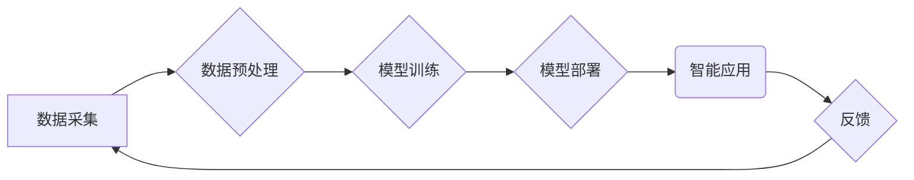

                 

## AIGC助力智慧城市建设

> 关键词：AIGC, 智慧城市, 深度学习, 自然语言处理, 图像识别, 城市管理, 智能应用

## 1. 背景介绍

智慧城市建设是全球范围内一个重要的发展趋势，旨在通过信息技术和数据分析，提升城市管理效率、改善居民生活质量。近年来，人工智能（AI）技术取得了长足进步，特别是生成式人工智能（AIGC）的兴起，为智慧城市建设提供了强大的新工具。AIGC能够自动生成文本、图像、音频等多种内容，具有强大的创造力和应用潜力，可以有效解决智慧城市建设中面临的一些挑战，推动城市智能化发展。

### 1.1 智慧城市建设面临的挑战

传统城市管理模式面临着诸多挑战，例如：

* **数据孤岛问题:** 城市内各部门的数据分散存储，缺乏有效整合和共享机制。
* **信息处理效率低下:** 城市管理信息处理依赖人工，效率低下，难以应对海量数据带来的挑战。
* **服务响应速度慢:** 城市公共服务响应速度慢，难以满足居民日益增长的需求。
* **城市治理缺乏智能化:** 城市治理决策缺乏数据支撑，难以实现精准化和智能化。

### 1.2 AIGC的优势与应用

AIGC技术能够有效解决上述挑战，其优势主要体现在以下几个方面：

* **自动生成内容:** AIGC可以自动生成各种城市管理相关的文本、图像、音频等内容，例如城市规划方案、交通流量预测、居民服务指南等。
* **数据分析与挖掘:** AIGC可以对海量城市数据进行分析和挖掘，发现城市发展趋势和潜在问题，为城市决策提供数据支撑。
* **智能化服务:** AIGC可以构建智能化城市服务平台，例如智能客服、智能交通调度、智能医疗诊断等，提高服务效率和用户体验。
* **个性化定制:** AIGC可以根据居民需求进行个性化定制，例如生成个性化城市服务推荐、个性化交通路线规划等。

## 2. 核心概念与联系

### 2.1 核心概念

* **AIGC (生成式人工智能):**  AIGC是指能够根据输入数据生成新内容的AI模型，例如文本、图像、音频、视频等。
* **智慧城市:** 智慧城市是指通过信息技术和数据分析，提升城市管理效率、改善居民生活质量的城市。
* **深度学习:** 深度学习是机器学习的一种，利用多层神经网络模拟人类大脑学习过程，能够学习复杂数据模式。
* **自然语言处理 (NLP):** NLP是人工智能的一个分支，旨在使计算机能够理解和处理人类语言。
* **图像识别:** 图像识别是计算机视觉领域的重要技术，能够识别图像中的物体、场景和文本等信息。

### 2.2  AIGC助力智慧城市建设架构



## 3. 核心算法原理 & 具体操作步骤

### 3.1  算法原理概述

AIGC的核心算法主要包括：

* **生成式对抗网络 (GAN):** GAN由两个网络组成，一个是生成器，负责生成新内容；另一个是鉴别器，负责判断内容是否真实。两者相互竞争，最终生成逼真的新内容。
* **变分自编码器 (VAE):** VAE通过编码器将输入数据压缩成低维表示，然后通过解码器将低维表示恢复成原始数据。在训练过程中，VAE学习到数据的潜在结构，可以用于生成新的数据。
* **Transformer:** Transformer是一种基于注意力机制的神经网络架构，能够处理长序列数据，例如文本。Transformer在自然语言处理领域取得了突破性进展，例如机器翻译、文本摘要、对话系统等。

### 3.2  算法步骤详解

以GAN为例，其训练步骤如下：

1. **初始化生成器和鉴别器:** 生成器和鉴别器都是神经网络，需要进行初始化。
2. **生成器生成数据:** 生成器根据随机噪声生成新数据。
3. **鉴别器判断真实性:** 鉴别器对真实数据和生成器生成的假数据进行判断，输出判断结果。
4. **更新生成器和鉴别器:** 根据鉴别器的判断结果，更新生成器的参数，使其生成更逼真的数据。同时，更新鉴别器的参数，使其更好地区分真实数据和假数据。
5. **重复步骤2-4:** 重复上述步骤，直到生成器能够生成与真实数据几乎 indistinguishable 的数据。

### 3.3  算法优缺点

**优点:**

* 生成能力强，能够生成逼真的新内容。
* 应用领域广泛，可以应用于文本生成、图像生成、音频生成等多个领域。

**缺点:**

* 训练复杂，需要大量的训练数据和计算资源。
* 生成内容的质量难以保证，可能存在偏差或错误。
* 存在伦理风险，例如生成虚假信息、侵犯版权等。

### 3.4  算法应用领域

* **文本生成:** 自动生成新闻报道、小说、诗歌、代码等。
* **图像生成:** 生成逼真的图像、艺术作品、产品设计等。
* **音频生成:** 生成语音、音乐、音效等。
* **视频生成:** 生成视频剪辑、动画、特效等。

## 4. 数学模型和公式 & 详细讲解 & 举例说明

### 4.1  数学模型构建

GAN的数学模型主要包括生成器G和鉴别器D。

* **生成器G:**  G是一个神经网络，输入随机噪声z，输出生成数据x。

* **鉴别器D:** D也是一个神经网络，输入数据x，输出判断结果y，表示x是真实数据还是生成数据。

### 4.2  公式推导过程

* **生成器损失函数:**  生成器希望生成的数据能够被鉴别器误判为真实数据，因此损失函数定义为鉴别器对生成数据的判断概率的负值。

$$
L_G(G,D) = -E_{z \sim p_z(z)}[log(D(G(z)))]
$$

* **鉴别器损失函数:** 鉴别器希望能够正确区分真实数据和生成数据，因此损失函数定义为真实数据和生成数据的判断概率的平均值。

$$
L_D(D,G) = -E_{x \sim p_{data}(x)}[log(D(x))] - E_{z \sim p_z(z)}[log(1-D(G(z)))]
$$

### 4.3  案例分析与讲解

例如，在图像生成领域，可以使用GAN生成逼真的图像。训练过程中，生成器会不断生成新的图像，鉴别器会判断这些图像是否真实。通过不断迭代，生成器最终能够生成与真实图像几乎 indistinguishable 的图像。

## 5. 项目实践：代码实例和详细解释说明

### 5.1  开发环境搭建

* **操作系统:** Ubuntu 20.04 LTS
* **编程语言:** Python 3.8
* **深度学习框架:** TensorFlow 2.0
* **其他依赖:** NumPy, Matplotlib, PIL

### 5.2  源代码详细实现

```python
import tensorflow as tf

# 定义生成器模型
def generator_model():
    # ...

# 定义鉴别器模型
def discriminator_model():
    # ...

# 实例化生成器和鉴别器模型
generator = generator_model()
discriminator = discriminator_model()

# 定义损失函数和优化器
loss_fn = tf.keras.losses.BinaryCrossentropy()
optimizer_G = tf.keras.optimizers.Adam(learning_rate=0.0002, beta_1=0.5)
optimizer_D = tf.keras.optimizers.Adam(learning_rate=0.0002, beta_1=0.5)

# 训练循环
for epoch in range(num_epochs):
    for batch in dataset:
        # ...

# 保存生成模型
generator.save("generator_model.h5")
```

### 5.3  代码解读与分析

* **模型定义:** 代码中定义了生成器和鉴别器模型，可以使用不同的神经网络架构构建模型。
* **损失函数和优化器:** 选择合适的损失函数和优化器对模型进行训练。
* **训练循环:** 训练循环中，会迭代训练生成器和鉴别器模型，直到达到预设的指标。
* **模型保存:** 训练完成后，可以保存生成模型，以便后续使用。

### 5.4  运行结果展示

训练完成后，可以使用生成器模型生成新的数据，例如图像、文本等。生成的數據可以与真实数据进行比较，评估模型的性能。

## 6. 实际应用场景

### 6.1 城市规划与设计

* **城市模拟:** 利用AIGC生成城市模拟模型，模拟城市发展趋势，预测城市规划方案的效果。
* **建筑设计:** 利用AIGC生成建筑设计方案，优化建筑布局、结构和功能。
* **景观设计:** 利用AIGC生成城市景观设计方案，提升城市美观度和宜居性。

### 6.2 交通管理与优化

* **交通流量预测:** 利用AIGC分析历史交通数据，预测未来交通流量，优化交通信号灯控制策略。
* **智能导航:** 利用AIGC生成个性化导航路线，避免交通拥堵，提高出行效率。
* **自动驾驶:** 利用AIGC训练自动驾驶算法，实现无人驾驶车辆的智能决策。

### 6.3 公共服务与管理

* **智能客服:** 利用AIGC构建智能客服系统，自动解答居民常见问题，提高服务效率。
* **医疗诊断:** 利用AIGC辅助医生进行医疗诊断，提高诊断准确率和效率。
* **教育教学:** 利用AIGC生成个性化学习内容，提高教育教学质量。

### 6.4 未来应用展望

随着AIGC技术的不断发展，其在智慧城市建设中的应用场景将更加广泛，例如：

* **城市安全:** 利用AIGC构建城市安全监控系统，识别潜在安全隐患，提高城市安全水平。
* **环境保护:** 利用AIGC监测环境污染情况，优化资源配置，促进城市可持续发展。
* **文化旅游:** 利用AIGC打造沉浸式文化旅游体验，提升城市文化魅力。

## 7. 工具和资源推荐

### 7.1 学习资源推荐

* **书籍:**
    * 《Deep Learning》 by Ian Goodfellow, Yoshua Bengio, and Aaron Courville
    * 《Generative Deep Learning》 by David Foster
* **在线课程:**
    * Coursera: Deep Learning Specialization
    * Udacity: Deep Learning Nanodegree
* **博客和论坛:**
    * Towards Data Science
    * Reddit: r/MachineLearning

### 7.2 开发工具推荐

* **深度学习框架:** TensorFlow, PyTorch, Keras
* **数据处理工具:** Pandas, NumPy
* **可视化工具:** Matplotlib, Seaborn

### 7.3 相关论文推荐

* **Generative Adversarial Networks** by Ian Goodfellow et al. (2014)
* **Variational Autoencoders for Generation** by Diederik P. Kingma and Max Welling (2013)
* **Attention Is All You Need** by Ashish Vaswani et al. (2017)

## 8. 总结：未来发展趋势与挑战

### 8.1 研究成果总结

AIGC技术在智慧城市建设领域取得了显著成果，例如：

* **城市规划:** 利用AIGC生成城市规划方案，优化城市布局和功能。
* **交通管理:** 利用AIGC预测交通流量，优化交通信号灯控制策略。
* **公共服务:** 利用AIGC构建智能客服系统，提高服务效率。

### 8.2 未来发展趋势

* **模型性能提升:** 研究更强大的AIGC模型，提高生成内容的质量和多样性。
* **应用场景拓展:** 将AIGC应用于更多智慧城市领域，例如城市安全、环境保护、文化旅游等。
* **数据安全与隐私保护:** 研究AIGC技术在数据安全和隐私保护方面的解决方案。

### 8.3 面临的挑战

* **数据获取与标注:** AIGC模型需要大量的训练数据，数据获取和标注成本较高。
* **模型解释性:** AIGC模型的决策过程难以解释，缺乏透明度。
* **伦理风险:** AIGC技术可能带来伦理风险，例如生成虚假信息、侵犯版权等。

### 8.4 研究展望

未来，AIGC技术将继续发展，为智慧城市建设提供更强大的工具和支持。研究者需要关注模型性能提升、应用场景拓展、数据安全与隐私保护、伦理风险等方面，推动AIGC技术在智慧城市建设中的健康发展。

## 9. 附录：常见问题与解答

### 9.1  AIGC与传统人工智能的区别是什么？

传统人工智能主要依赖于规则和算法，而AIGC则能够自动生成新的内容，具有更强的创造力和应用潜力。

### 9.2  AIGC技术有哪些应用场景？

AIGC技术可以应用于文本生成、图像生成、音频生成、视频生成等多个领域，在智慧城市建设中，可以应用于城市规划、交通管理、公共服务等方面。

### 9.3  AIGC技术有哪些挑战？

AIGC技术面临着数据获取与标注成本高、模型解释性差、伦理风险等挑战。

### 9.4  如何学习AIGC技术？

可以通过阅读相关书籍、在线课程、博客和论坛等方式学习AIGC技术。

### 9.5  AIGC技术未来发展趋势是什么？

AIGC技术未来将朝着模型性能提升、应用场景拓展、数据安全与隐私保护、伦理风险控制等方向发展。


作者：禅与计算机程序设计艺术 / Zen and the Art of Computer Programming 
<end_of_turn>

