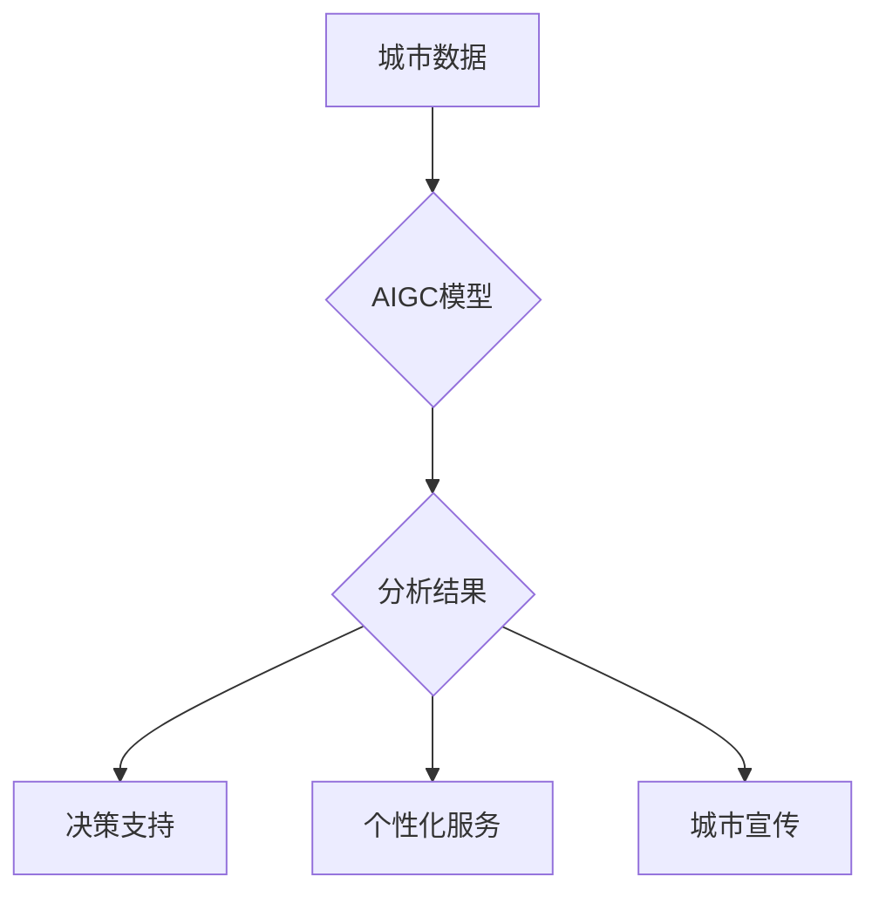

                 

## AIGC助力智能城市运营

> 关键词：AIGC, 智能城市, 运营效率, 数据分析, 预测建模, 决策支持, 智慧交通, 智慧能源, 智慧环境

## 1. 背景介绍

随着全球人口增长和城市化进程加速，城市面临着日益严峻的挑战，包括资源短缺、环境污染、交通拥堵、公共安全等。为了应对这些挑战，各国纷纷探索构建“智能城市”，利用信息技术和数据分析手段提升城市管理水平、提高居民生活质量。

人工智能（AI）作为新一代信息技术的重要组成部分，在智能城市建设中发挥着越来越重要的作用。其中，AIGC（人工智能生成内容）作为AI技术的最新发展方向，凭借其强大的文本生成、图像生成、音频生成等能力，为智能城市运营提供了全新的解决方案。

## 2. 核心概念与联系

**2.1 核心概念**

* **智能城市:**  利用信息技术和数据分析手段，提升城市管理水平、提高居民生活质量的城市发展模式。
* **AIGC (人工智能生成内容):** 利用人工智能技术自动生成文本、图像、音频等各种内容的系统。

**2.2 联系**

AIGC技术可以为智能城市运营提供以下方面的支持：

* **数据分析与洞察:** AIGC可以对海量城市数据进行分析，提取关键信息，生成可视化报告，帮助城市管理者洞察城市运行状况，发现问题和趋势。
* **智能决策支持:** AIGC可以根据城市数据和预设规则，生成决策建议，帮助城市管理者做出更科学、更有效的决策。
* **个性化服务:** AIGC可以根据居民需求生成个性化服务内容，例如交通路线规划、生活信息推送、医疗预约等，提升居民生活体验。
* **城市宣传推广:** AIGC可以生成城市宣传文案、图片、视频等内容，提升城市形象，吸引投资和人才。

**2.3 架构图**



## 3. 核心算法原理 & 具体操作步骤

**3.1 算法原理概述**

AIGC的核心算法主要包括：

* **自然语言处理 (NLP):** 用于理解和生成人类语言的算法，例如文本分类、情感分析、机器翻译等。
* **深度学习 (DL):** 用于训练复杂的机器学习模型，例如生成对抗网络 (GAN)、变分自编码器 (VAE) 等。
* **强化学习 (RL):** 用于训练模型在特定环境中做出最佳决策的算法。

**3.2 算法步骤详解**

1. **数据收集与预处理:** 收集城市相关数据，例如交通流量、环境监测、公共服务等，并进行清洗、格式化等预处理。
2. **模型训练:** 利用深度学习算法，训练AIGC模型，使其能够理解城市数据并生成相应的输出内容。
3. **模型评估与优化:** 对训练好的模型进行评估，并根据评估结果进行调整和优化，提高模型的准确性和效率。
4. **内容生成与应用:** 利用训练好的模型，对城市数据进行分析，生成文本、图像、音频等内容，并应用于智能城市运营各个环节。

**3.3 算法优缺点**

* **优点:**

    * 自动化生成内容，提高效率。
    * 能够处理海量数据，发现隐藏的模式和趋势。
    * 个性化服务，提升用户体验。

* **缺点:**

    * 模型训练需要大量数据和计算资源。
    * 模型的输出内容可能存在偏差或错误。
    * 缺乏对复杂情境的理解和处理能力。

**3.4 算法应用领域**

* **智慧交通:** 生成交通流量预测、拥堵路段预警、路线规划等内容。
* **智慧能源:** 生成能源消耗预测、节能建议、故障诊断等内容。
* **智慧环境:** 生成空气质量预报、环境污染监测、垃圾分类指导等内容。
* **公共安全:** 生成犯罪风险预测、紧急事件预警、安全巡逻规划等内容。

## 4. 数学模型和公式 & 详细讲解 & 举例说明

**4.1 数学模型构建**

AIGC模型通常基于深度学习算法，例如生成对抗网络 (GAN)。GAN由两个网络组成：生成器 (Generator) 和鉴别器 (Discriminator)。

* **生成器:** 负责生成新的数据样本，例如文本、图像、音频等。
* **鉴别器:** 负责判断数据样本是真实数据还是生成数据。

**4.2 公式推导过程**

GAN的训练过程是一个博弈过程，生成器和鉴别器相互竞争，不断提升自己的性能。

* **生成器的损失函数:**  

$$L_G = E_{x \sim p_{data}(x)}[log(D(G(z)))]$$

* **鉴别器的损失函数:**

$$L_D = E_{x \sim p_{data}(x)}[log(D(x))] + E_{z \sim p_z(z)}[log(1-D(G(z)))]$$

其中：

* $x$ 表示真实数据样本。
* $z$ 表示随机噪声向量。
* $p_{data}(x)$ 表示真实数据分布。
* $p_z(z)$ 表示噪声分布。
* $D(x)$ 表示鉴别器对数据样本 $x$ 的判断概率。
* $G(z)$ 表示生成器生成的样本。

**4.3 案例分析与讲解**

例如，在智慧交通领域，可以使用GAN生成交通流量预测结果。

* **训练数据:**  历史交通流量数据。
* **生成器:**  学习历史数据模式，生成未来交通流量预测。
* **鉴别器:**  判断预测结果的真实性，与实际交通流量进行比较。

通过训练，生成器能够生成越来越准确的交通流量预测结果，帮助城市管理者优化交通调度，缓解交通拥堵。

## 5. 项目实践：代码实例和详细解释说明

**5.1 开发环境搭建**

* 操作系统: Ubuntu 20.04
* Python 版本: 3.8
* 必要的库: TensorFlow, PyTorch, NumPy, Pandas

**5.2 源代码详细实现**

```python
# 导入必要的库
import tensorflow as tf

# 定义生成器模型
def generator_model():
    # ... 模型结构定义 ...

# 定义鉴别器模型
def discriminator_model():
    # ... 模型结构定义 ...

# 实例化生成器和鉴别器模型
generator = generator_model()
discriminator = discriminator_model()

# 定义损失函数和优化器
loss_fn = tf.keras.losses.BinaryCrossentropy()
optimizer_G = tf.keras.optimizers.Adam(learning_rate=0.0002, beta_1=0.5)
optimizer_D = tf.keras.optimizers.Adam(learning_rate=0.0002, beta_1=0.5)

# 训练循环
for epoch in range(num_epochs):
    for batch in dataset:
        # ... 数据预处理 ...

        # 生成器训练
        with tf.GradientTape() as tape_G:
            fake_data = generator(noise)
            fake_output = discriminator(fake_data)
            loss_G = loss_fn(tf.ones_like(fake_output), fake_output)

        gradients_G = tape_G.gradient(loss_G, generator.trainable_variables)
        optimizer_G.apply_gradients(zip(gradients_G, generator.trainable_variables))

        # 鉴别器训练
        with tf.GradientTape() as tape_D:
            real_output = discriminator(real_data)
            fake_output = discriminator(fake_data)
            loss_D_real = loss_fn(tf.ones_like(real_output), real_output)
            loss_D_fake = loss_fn(tf.zeros_like(fake_output), fake_output)
            loss_D = loss_D_real + loss_D_fake

        gradients_D = tape_D.gradient(loss_D, discriminator.trainable_variables)
        optimizer_D.apply_gradients(zip(gradients_D, discriminator.trainable_variables))

    # ... 每隔一段时间保存模型权重 ...

```

**5.3 代码解读与分析**

* 代码首先定义了生成器和鉴别器模型的结构。
* 然后定义了损失函数和优化器。
* 训练循环中，首先使用生成器生成伪数据，然后通过鉴别器进行判断，计算生成器损失。
* 接着使用真实数据和伪数据训练鉴别器，计算鉴别器损失。
* 最后使用优化器更新生成器和鉴别器的参数。

**5.4 运行结果展示**

训练完成后，可以利用生成器生成新的数据样本，例如文本、图像、音频等，并进行评估，验证模型的性能。

## 6. 实际应用场景

**6.1 智慧交通**

* **交通流量预测:** 利用AIGC生成交通流量预测结果，帮助城市管理者优化交通信号灯控制、道路规划等。
* **拥堵路段预警:**  根据实时交通数据，AIGC可以生成拥堵路段预警信息，引导驾驶员选择最佳路线，缓解交通拥堵。
* **智能停车:** AIGC可以根据停车场实时空余情况，生成停车位推荐信息，帮助驾驶员快速找到停车位。

**6.2 智慧能源**

* **能源消耗预测:**  利用AIGC生成能源消耗预测结果，帮助城市管理者优化能源分配、节约能源消耗。
* **故障诊断:**  AIGC可以根据设备运行数据，生成故障诊断报告，帮助维护人员快速定位和解决故障。
* **智能电网:** AIGC可以帮助智能电网实现实时监测、预测和控制，提高电网运行效率和可靠性。

**6.3 智慧环境**

* **空气质量预报:**  利用AIGC生成空气质量预报结果，帮助居民了解空气质量状况，采取相应的防护措施。
* **环境污染监测:** AIGC可以分析环境监测数据，生成环境污染地图，帮助城市管理者识别污染源，采取治理措施。
* **垃圾分类指导:** AIGC可以根据垃圾类型，生成垃圾分类指导信息，提高居民垃圾分类意识和效率。

**6.4 未来应用展望**

随着AIGC技术的不断发展，其在智能城市运营中的应用场景将更加广泛，例如：

* **个性化城市服务:**  根据居民需求，AIGC可以生成个性化城市服务内容，例如交通路线规划、生活信息推送、医疗预约等。
* **城市安全保障:** AIGC可以帮助城市管理者预测和应对突发事件，提高城市安全保障水平。
* **城市规划与设计:** AIGC可以帮助城市规划者模拟城市发展趋势，优化城市规划方案。


## 7. 工具和资源推荐

**7.1 学习资源推荐**

* **书籍:**
    * 《深度学习》 - Ian Goodfellow, Yoshua Bengio, Aaron Courville
    * 《Generative Deep Learning》 - David Foster
* **在线课程:**
    * Coursera: Deep Learning Specialization
    * Udacity: Deep Learning Nanodegree
* **博客和论坛:**
    * Towards Data Science
    * Reddit: r/MachineLearning

**7.2 开发工具推荐**

* **TensorFlow:**  开源深度学习框架，支持多种硬件平台。
* **PyTorch:**  开源深度学习框架，以其灵活性和易用性而闻名。
* **Keras:**  基于TensorFlow的高级API，简化了深度学习模型的构建和训练。

**7.3 相关论文推荐**

* **Generative Adversarial Networks** - Ian Goodfellow et al. (2014)
* **Wasserstein GAN** - Martin Arjovsky et al. (2017)
* **Progressive Growing of GANs for Improved Quality, Stability, and Variation** - Tero Karras et al. (2017)

## 8. 总结：未来发展趋势与挑战

**8.1 研究成果总结**

AIGC技术在智能城市运营领域取得了显著的成果，例如交通流量预测、能源消耗预测、环境污染监测等。

**8.2 未来发展趋势**

* **模型性能提升:**  研究人员将继续探索新的AIGC模型架构和训练方法，提高模型的准确性和效率。
* **数据融合与分析:**  AIGC将与其他城市数据分析技术融合，实现更深入的数据分析和洞察。
* **个性化服务:**  AIGC将更加注重个性化服务，根据居民需求生成定制化的城市服务内容。

**8.3 面临的挑战**

* **数据安全与隐私:**  AIGC模型训练需要大量数据，如何保证数据安全和隐私保护是一个重要挑战。
* **模型解释性:**  AIGC模型的决策过程往往是复杂的，如何提高模型的解释性，增强用户信任是一个关键问题。
* **伦理与社会影响:**  AIGC技术的发展可能带来一些伦理和社会问题，例如算法偏见、就业影响等，需要引起重视和探讨。

**8.4 研究展望**

未来，AIGC技术将继续在智能城市运营领域发挥重要作用，为城市管理者和居民提供更智能、更便捷、更舒适的生活体验。


## 9. 附录：常见问题与解答

**9.1 如何选择合适的AIGC模型？**

选择合适的AIGC模型需要根据具体应用场景和数据特点进行评估。例如，对于文本生成任务，可以选择GPT-3等语言模型；对于图像生成任务，可以选择GAN等生成对抗网络。

**9.2 如何保证AIGC模型的准确性和可靠性？**

保证AIGC模型的准确性和可靠性需要从以下几个方面入手：

* 使用高质量的数据进行训练。
* 选择合适的模型架构和训练方法。
* 对模型进行充分的测试和评估。
* 定期更新模型，使其能够适应不断变化的数据环境。

**9.3 如何解决AIGC模型的解释性问题？**

提高AIGC模型的解释性可以采用以下方法：

* 使用可解释的机器学习模型，例如决策树、线性回归等。
* 使用可视化技术，例如注意力机制、特征重要性分析等，展示模型的决策过程。
* 开发解释性AI工具，帮助用户理解模型的决策结果。


作者：禅与计算机程序设计艺术 / Zen and the Art of Computer Programming 
<end_of_turn>

