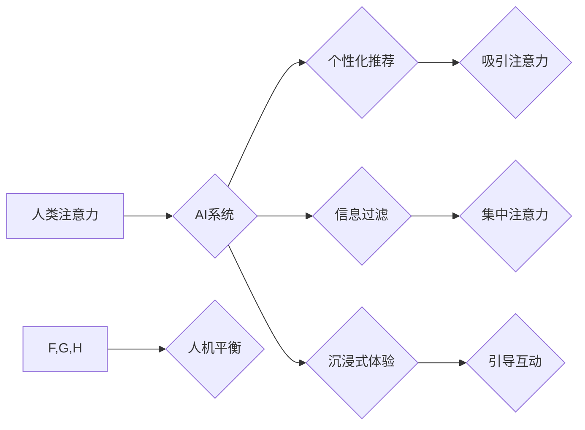

                 

## AI与人类注意力流：打造人机平衡

> 关键词：人工智能、注意力流、人机交互、深度学习、认知科学、可持续发展、用户体验、伦理

### 1. 背景介绍

在信息爆炸的时代，人类的注意力资源日益稀缺。我们每天被来自各种渠道的信息轰炸，从社交媒体的通知到电子邮件的提醒，从新闻网站的滚动条到广告的推送，无处不在的干扰让我们难以集中精力完成任务。与此同时，人工智能（AI）技术飞速发展，AI系统能够以惊人的速度处理海量数据，并提供个性化、智能化的服务。然而，AI的快速发展也带来了新的挑战，如何让AI更好地与人类注意力相协调，打造人机平衡，成为一个亟待解决的问题。

### 2. 核心概念与联系

#### 2.1 人类注意力流

人类注意力流是一个复杂的心理过程，它涉及到感知、认知、情感和行为等多个方面。注意力流可以被理解为一种资源分配机制，我们的大脑会根据任务的紧急程度、重要性以及个人兴趣等因素，将有限的注意力资源分配到不同的信息源上。

#### 2.2 AI与注意力流的交互

AI系统可以通过多种方式影响人类注意力流。例如：

* **个性化推荐:** AI算法可以根据用户的历史行为和偏好，推荐个性化的内容，从而吸引用户的注意力。
* **信息过滤:** AI系统可以过滤掉无关的信息，并将重要的信息突出显示，帮助用户集中注意力。
* **沉浸式体验:** AI可以创造沉浸式的虚拟现实或增强现实体验，吸引用户的注意力并引导其参与互动。

#### 2.3 人机平衡的意义

人机平衡是指在AI技术发展的同时，要确保AI系统与人类的互动能够和谐共处，既能发挥AI的优势，又能保护人类的注意力资源。人机平衡对于以下方面至关重要：

* **用户体验:** 人机平衡可以提升用户体验，避免过度刺激和信息过载。
* **认知健康:** 人机平衡可以帮助人们更好地管理注意力，提高认知效率和创造力。
* **社会和谐:** 人机平衡可以促进人与人之间的交流和合作，避免AI技术带来的社会分化和孤独感。

**Mermaid 流程图**



### 3. 核心算法原理 & 具体操作步骤

#### 3.1 算法原理概述

为了实现人机平衡，需要开发能够理解和预测人类注意力流的算法。这些算法通常基于深度学习技术，可以从海量用户行为数据中学习到人类注意力模式。

#### 3.2 算法步骤详解

1. **数据收集:** 收集用户与AI系统交互的数据，包括用户点击、滑动、停留时间、眼动追踪等信息。
2. **数据预处理:** 对收集到的数据进行清洗、转换和特征提取，以便于算法训练。
3. **模型训练:** 使用深度学习算法，例如循环神经网络（RNN）或Transformer，训练模型以预测用户的注意力流。
4. **模型评估:** 使用测试数据评估模型的预测准确率和性能。
5. **模型部署:** 将训练好的模型部署到实际应用场景中，例如个性化推荐系统或信息过滤系统。

#### 3.3 算法优缺点

**优点:**

* 能够准确预测用户的注意力流。
* 可以根据用户的注意力模式提供个性化的服务。
* 可以帮助用户集中注意力，提高效率。

**缺点:**

* 需要大量的用户数据进行训练。
* 模型训练过程复杂，需要专业的技术人员。
* 存在隐私安全问题，需要妥善处理用户数据。

#### 3.4 算法应用领域

* **个性化推荐:** 为用户推荐感兴趣的内容，例如新闻、视频、商品等。
* **信息过滤:** 过滤掉无关的信息，帮助用户快速获取所需信息。
* **教育培训:** 根据学生的注意力模式，提供个性化的学习内容和教学方法。
* **医疗诊断:** 分析患者的注意力流，辅助医生进行诊断和治疗。

### 4. 数学模型和公式 & 详细讲解 & 举例说明

#### 4.1 数学模型构建

我们可以使用马尔科夫链模型来描述人类注意力流。马尔科夫链是一种统计模型，它假设当前状态只依赖于前一个状态，而与过去的其他状态无关。

在注意力流模型中，每个状态代表用户关注的某个信息源，状态转移概率代表用户从一个信息源切换到另一个信息源的可能性。

#### 4.2 公式推导过程

假设有N个不同的信息源，我们可以用一个N维向量来表示用户当前的注意力状态，其中每个元素代表用户对某个信息源的关注程度。

状态转移概率矩阵P可以表示用户从一个状态转移到另一个状态的可能性。

用户在时间步t的注意力状态可以表示为：

$$
a_t = P * a_{t-1}
$$

其中，$a_t$表示用户在时间步t的注意力状态，$a_{t-1}$表示用户在时间步t-1的注意力状态，$P$表示状态转移概率矩阵。

#### 4.3 案例分析与讲解

例如，假设用户正在阅读一篇文章，文章包含三个不同的段落。我们可以将这三个段落分别作为信息源，构建一个3x3的马尔科夫链模型。

如果用户从第一个段落切换到第二个段落的概率为0.6，从第二个段落切换到第三个段落的概率为0.4，那么状态转移概率矩阵P可以表示为：

$$
P = \begin{bmatrix}
0.4 & 0.6 & 0 \\
0 & 0.4 & 0.6 \\
0 & 0 & 1
\end{bmatrix}
$$

通过不断迭代上述公式，我们可以预测用户在不同时间步上的注意力状态，从而了解用户阅读文章的模式。

### 5. 项目实践：代码实例和详细解释说明

#### 5.1 开发环境搭建

* Python 3.7+
* TensorFlow 2.0+
* Jupyter Notebook

#### 5.2 源代码详细实现

```python
import tensorflow as tf

# 定义模型结构
model = tf.keras.Sequential([
    tf.keras.layers.Embedding(input_dim=vocab_size, output_dim=embedding_dim),
    tf.keras.layers.LSTM(units=128),
    tf.keras.layers.Dense(units=num_classes, activation='softmax')
])

# 编译模型
model.compile(optimizer='adam',
              loss='sparse_categorical_crossentropy',
              metrics=['accuracy'])

# 训练模型
model.fit(x_train, y_train, epochs=10)

# 评估模型
loss, accuracy = model.evaluate(x_test, y_test)
print('Loss:', loss)
print('Accuracy:', accuracy)
```

#### 5.3 代码解读与分析

* 首先，我们定义了一个基于LSTM的深度学习模型。
* 模型输入是用户的历史行为数据，例如点击记录、滑动记录等。
* 模型输出是用户对不同信息源的注意力预测。
* 我们使用Adam优化器和交叉熵损失函数训练模型。
* 训练完成后，我们使用测试数据评估模型的性能。

#### 5.4 运行结果展示

训练完成后，我们可以使用模型预测用户在不同时间步上的注意力状态。例如，我们可以预测用户在阅读一篇文章时，对每个段落的关注程度。

### 6. 实际应用场景

#### 6.1 个性化推荐系统

AI可以根据用户的注意力流，推荐更符合其兴趣和需求的内容。例如，电商平台可以根据用户的浏览记录和点击行为，推荐更相关的商品；视频网站可以根据用户的观看历史和停留时间，推荐更受欢迎的视频。

#### 6.2 信息过滤系统

AI可以过滤掉无关的信息，帮助用户快速获取所需信息。例如，电子邮件系统可以根据用户的阅读习惯，过滤掉垃圾邮件和无关邮件；新闻网站可以根据用户的兴趣爱好，推荐更相关的新闻资讯。

#### 6.3 教育培训系统

AI可以根据学生的注意力流，提供个性化的学习内容和教学方法。例如，在线学习平台可以根据学生的学习进度和理解程度，调整学习内容的难度和节奏；教育软件可以根据学生的注意力集中程度，调整学习内容的呈现方式。

#### 6.4 未来应用展望

随着AI技术的不断发展，人机平衡将成为越来越重要的研究方向。未来，AI系统将能够更加深入地理解和预测人类注意力流，从而提供更加个性化、智能化的服务。

### 7. 工具和资源推荐

#### 7.1 学习资源推荐

* **书籍:**
    * 《深度学习》
    * 《自然语言处理》
    * 《认知科学导论》
* **在线课程:**
    * Coursera: 深度学习
    * edX: 自然语言处理
    * Udacity: 人工智能工程师

#### 7.2 开发工具推荐

* **Python:** 
    * TensorFlow
    * PyTorch
    * Keras
* **数据分析工具:**
    * Pandas
    * NumPy
    * Scikit-learn

#### 7.3 相关论文推荐

* **Attention Is All You Need**
* **BERT: Pre-training of Deep Bidirectional Transformers for Language Understanding**
* **Transformer-XL: Attentive Language Models Beyond a Fixed-Length Context**

### 8. 总结：未来发展趋势与挑战

#### 8.1 研究成果总结

近年来，在AI与人类注意力流的研究领域取得了显著进展。深度学习算法能够有效地预测用户的注意力模式，并根据这些模式提供个性化的服务。

#### 8.2 未来发展趋势

* **更精准的注意力预测:** 未来，AI系统将能够更加精准地预测用户的注意力流，并根据用户的实时注意力状态动态调整服务内容。
* **更个性化的服务:** AI系统将能够根据用户的个性化需求，提供更加个性化的服务，例如定制化的学习计划、个性化的新闻推荐等。
* **更安全的隐私保护:** 未来，AI系统将更加注重用户隐私保护，采用更加安全的算法和技术来处理用户数据。

#### 8.3 面临的挑战

* **数据隐私问题:** AI系统需要大量用户数据进行训练，如何保护用户隐私安全是一个重要的挑战。
* **算法可解释性问题:** 深度学习算法的决策过程往往难以解释，如何提高算法的可解释性，让用户能够理解AI系统的决策逻辑，也是一个重要的挑战。
* **伦理问题:** AI系统可能会被用于操纵用户注意力，例如通过推送虚假信息或制造网络舆论，如何避免AI技术被滥用，是一个需要认真思考的伦理问题。

#### 8.4 研究展望

未来，AI与人类注意力流的研究将继续深入，探索更深层次的人机交互模式，并为人类社会带来更多福祉。


### 9. 附录：常见问题与解答

**Q1: AI系统会取代人类吗？**

A1: AI技术的发展可能会改变一些工作模式，但不会完全取代人类。AI擅长处理重复性、规则性的任务，而人类更擅长解决复杂问题、进行创造性思考和情感交流。未来，人类和AI将更加紧密地合作，共同完成各种任务。

**Q2: 如何保护用户隐私安全？**

A2: 在开发AI系统时，需要充分考虑用户隐私安全问题。例如，可以采用数据加密、匿名化等技术来保护用户数据，并制定严格的隐私政策，确保用户数据得到安全保护。

**Q3: 如何避免AI技术被滥用？**

A3: 避免AI技术被滥用需要多方面的努力，包括政府监管、行业自律和社会监督。需要制定相应的法律法规，规范AI技术的应用，并加强对AI技术的伦理研究，引导AI技术朝着更加安全、可持续的方向发展。


作者：禅与计算机程序设计艺术 / Zen and the Art of Computer Programming 
<end_of_turn>

