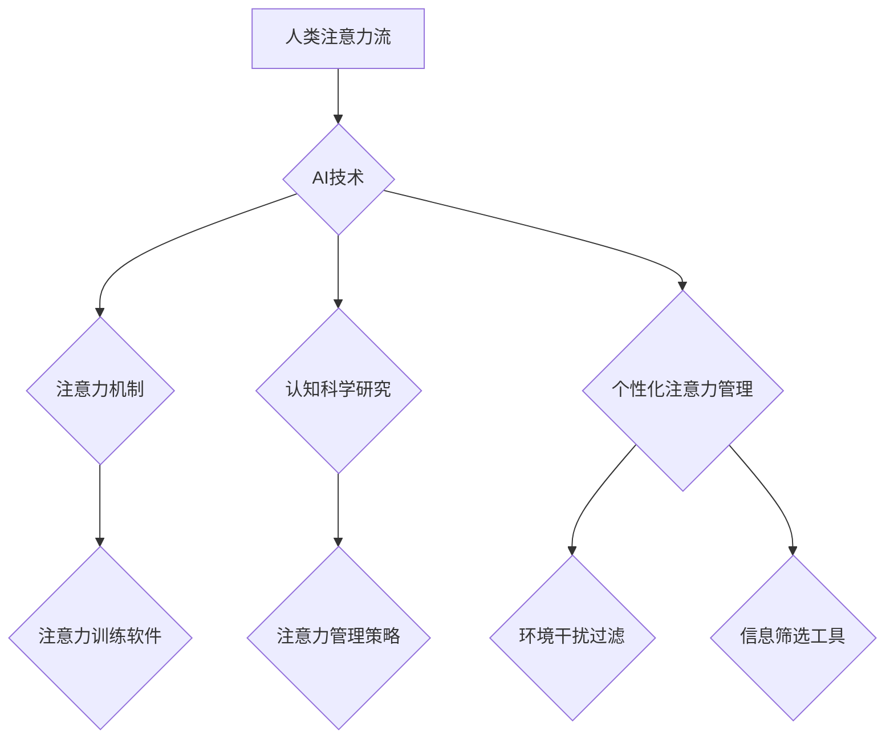

                 

## 关键词：人工智能、注意力流、认知科学、深度学习、注意力机制、工作效率、生活方式、注意力管理策略、技术应用

## 1. 背景介绍

在信息爆炸的时代，人类面临着前所未有的注意力挑战。来自社交媒体、电子邮件、新闻推送等各种渠道的信息洪流，不断地抢夺着我们的注意力，导致专注力下降、效率低下、心理压力增加。与此同时，人工智能（AI）技术飞速发展，其强大的计算能力和学习能力为理解和管理人类注意力流提供了新的可能性。

### 1.1  注意力流的本质

注意力流是指人类对信息进行选择性感知和处理的过程，它是一个动态、复杂的认知过程，受多种因素影响，包括个体差异、环境刺激、任务要求等。注意力流的本质是资源分配，我们的大脑有有限的认知资源，需要根据需要分配给不同的任务或信息。

### 1.2  注意力挑战与影响

现代社会的信息化和网络化趋势加剧了对人类注意力的需求，同时也带来了前所未有的注意力挑战。

* **信息过载:**  互联网时代，信息爆炸式增长，各种信息源不断涌入，导致信息过载，难以集中注意力。
* **碎片化信息:**  短视频、社交媒体等平台的兴起，导致信息碎片化，注意力难以持续集中。
* **多任务处理:**  人们经常需要同时处理多个任务，这会分散注意力，降低效率。
* **数字依赖:**  过度依赖智能手机、电脑等电子设备，会影响注意力集中能力。

这些注意力挑战对个人和社会都产生了深远的影响：

* **个人层面:**  注意力下降会导致学习效率降低、工作效率低下、生活质量下降、心理压力增加等问题。
* **社会层面:**  注意力分散会影响决策、沟通、协作等社会活动，降低社会整体效率。

## 2. 核心概念与联系

### 2.1  AI与注意力流

人工智能（AI）技术可以帮助我们理解和管理人类注意力流。

* **注意力机制:**  深度学习领域中，注意力机制是一种模仿人类注意力机制的技术，可以帮助模型聚焦于重要信息，提高学习效率。
* **认知科学研究:**  AI技术可以辅助认知科学研究，帮助科学家更深入地理解人类注意力机制的原理。
* **个性化注意力管理:**  AI可以根据个人的注意力特点，提供个性化的注意力管理策略和工具。

### 2.2  AI与注意力管理

AI技术可以为我们提供多种注意力管理策略和工具，帮助我们提高注意力集中能力，提升工作和生活效率。

* **注意力训练软件:**  利用AI算法，提供个性化的注意力训练计划，帮助用户增强注意力控制能力。
* **环境干扰过滤:**  AI可以识别和过滤环境中的干扰因素，创造更专注的学习和工作环境。
* **信息筛选工具:**  AI可以根据用户的兴趣和需求，筛选出重要的信息，减少信息过载。

**Mermaid 流程图**



## 3. 核心算法原理 & 具体操作步骤

### 3.1  算法原理概述

注意力机制是一种模仿人类注意力机制的技术，它可以帮助模型聚焦于重要信息，提高学习效率。注意力机制的核心思想是，在处理信息时，模型应该根据信息的 relevance 和 importance 来分配不同的权重，从而提高对重要信息的关注度。

### 3.2  算法步骤详解

1. **输入数据:**  将输入数据（例如文本、图像）转换为模型可以理解的格式。
2. **特征提取:**  使用神经网络等方法提取数据的特征，例如词向量、图像特征等。
3. **注意力计算:**  计算每个特征的注意力权重，权重越高，表示该特征越重要。
4. **加权求和:**  根据注意力权重，对特征进行加权求和，得到最终的输出。

### 3.3  算法优缺点

**优点:**

* **提高学习效率:**  通过聚焦于重要信息，注意力机制可以提高模型的学习效率。
* **增强模型表达能力:**  注意力机制可以帮助模型更好地理解和表达复杂的信息关系。
* **解释性强:**  注意力权重可以直观地反映模型对信息的关注程度，提高模型的解释性。

**缺点:**

* **计算复杂度高:**  注意力机制的计算复杂度较高，需要更多的计算资源。
* **参数量大:**  注意力机制需要更多的参数，训练时间更长。
* **可解释性有限:**  虽然注意力权重可以反映模型的关注点，但其背后的机制仍然需要进一步研究。

### 3.4  算法应用领域

注意力机制在自然语言处理、计算机视觉、语音识别等领域都有广泛的应用。

* **机器翻译:**  注意力机制可以帮助模型更好地理解句子结构和语义关系，提高翻译质量。
* **文本摘要:**  注意力机制可以帮助模型识别文本中的关键信息，生成更准确的摘要。
* **图像识别:**  注意力机制可以帮助模型聚焦于图像中的重要区域，提高识别准确率。

## 4. 数学模型和公式 & 详细讲解 & 举例说明

### 4.1  数学模型构建

注意力机制的数学模型通常基于一个加权求和的操作，其中权重由一个注意力函数计算得到。

**注意力函数:**

$$
\text{Attention}(Q, K, V) = \text{softmax}\left(\frac{Q K^T}{\sqrt{d_k}}\right) V
$$

其中：

* $Q$：查询向量
* $K$：键向量
* $V$：值向量
* $d_k$：键向量的维度
* $\text{softmax}$：softmax函数，用于将权重归一化到[0, 1]之间。

### 4.2  公式推导过程

注意力函数的推导过程基于以下几个假设：

* **查询向量** $Q$ 代表模型当前需要关注的信息。
* **键向量** $K$ 代表所有候选信息的表示。
* **值向量** $V$ 代表候选信息的具体内容。

注意力函数通过计算查询向量与键向量的相似度来确定每个候选信息的权重，然后根据权重对值向量进行加权求和，得到最终的输出。

### 4.3  案例分析与讲解

**机器翻译:**

在机器翻译任务中，查询向量 $Q$ 是目标语言的词嵌入，键向量 $K$ 是源语言的词嵌入，值向量 $V$ 是源语言的词向量。注意力机制可以帮助模型聚焦于源语言中与目标语言词语相关的关键信息，从而提高翻译质量。

## 5. 项目实践：代码实例和详细解释说明

### 5.1  开发环境搭建

* **操作系统:**  Linux/macOS/Windows
* **编程语言:**  Python
* **深度学习框架:**  TensorFlow/PyTorch

### 5.2  源代码详细实现

```python
import tensorflow as tf

# 定义注意力机制
def attention_layer(inputs, key, value, mask=None):
    # 计算查询向量与键向量的相似度
    scores = tf.matmul(inputs, key, transpose_b=True) / tf.math.sqrt(tf.cast(key.shape[-1], tf.float32))
    # 应用掩码
    if mask is not None:
        scores += (mask * -1e9)
    # 计算注意力权重
    attention_weights = tf.nn.softmax(scores, axis=-1)
    # 对值向量进行加权求和
    context_vector = tf.matmul(attention_weights, value)
    return context_vector, attention_weights

# 示例代码
# 输入数据
inputs = tf.random.normal([1, 5, 128])
key = tf.random.normal([1, 5, 128])
value = tf.random.normal([1, 5, 128])

# 计算注意力输出
context_vector, attention_weights = attention_layer(inputs, key, value)

# 打印结果
print(context_vector.shape)
print(attention_weights.shape)
```

### 5.3  代码解读与分析

* **`attention_layer` 函数:**  定义了注意力机制的核心逻辑，包括计算相似度、应用掩码、计算权重和加权求和。
* **`inputs`、`key`、`value`:**  分别代表查询向量、键向量和值向量。
* **`mask`:**  可选参数，用于屏蔽不需要关注的信息。
* **`tf.matmul`:**  用于计算矩阵乘法。
* **`tf.nn.softmax`:**  用于计算softmax函数，将权重归一化到[0, 1]之间。

### 5.4  运行结果展示

运行代码后，会输出注意力输出的形状，以及注意力权重的形状。

## 6. 实际应用场景

### 6.1  工作场景

* **提高工作效率:**  利用注意力训练软件，集中注意力完成重要任务，减少分心和拖延。
* **增强学习能力:**  使用注意力管理工具，专注于学习内容，提高记忆和理解能力。
* **改善沟通协作:**  通过注意力训练，提升倾听和理解能力，促进更有效的沟通和协作。

### 6.2  生活场景

* **减少信息焦虑:**  使用信息筛选工具，过滤无关信息，减少信息过载带来的焦虑。
* **提升专注力:**  通过环境干扰过滤，创造更专注的学习和休息环境。
* **改善睡眠质量:**  利用注意力管理策略，减少睡前电子设备的使用，改善睡眠质量。

### 6.4  未来应用展望

随着AI技术的不断发展，注意力管理将成为越来越重要的应用领域。未来，我们可以期待看到更多更智能、更个性化的注意力管理工具和策略，帮助我们更好地应对信息时代带来的挑战，提升生活和工作效率。

## 7. 工具和资源推荐

### 7.1  学习资源推荐

* **书籍:**
    * 《深度学习》
    * 《Attention Is All You Need》
* **在线课程:**
    * Coursera: 深度学习
    * Udacity: 自然语言处理
* **博客:**
    * TensorFlow Blog
    * PyTorch Blog

### 7.2  开发工具推荐

* **深度学习框架:**
    * TensorFlow
    * PyTorch
* **编程语言:**
    * Python
* **云平台:**
    * Google Cloud Platform
    * Amazon Web Services

### 7.3  相关论文推荐

* **Attention Is All You Need:** https://arxiv.org/abs/1706.03762
* **BERT: Pre-training of Deep Bidirectional Transformers for Language Understanding:** https://arxiv.org/abs/1810.04805

## 8. 总结：未来发展趋势与挑战

### 8.1  研究成果总结

近年来，AI技术在注意力流研究领域取得了显著进展，注意力机制成为深度学习领域的重要组成部分，并在自然语言处理、计算机视觉等领域取得了成功应用。

### 8.2  未来发展趋势

* **更强大的注意力机制:**  研究更有效的注意力机制，提高模型的学习效率和表达能力。
* **个性化注意力管理:**  根据个人的注意力特点，提供个性化的注意力管理策略和工具。
* **跨模态注意力:**  研究跨模态注意力机制，帮助模型理解和处理不同模态的信息。
* **注意力与认知科学的融合:**  将注意力机制与认知科学研究相结合，更深入地理解人类注意力机制的原理。

### 8.3  面临的挑战

* **计算复杂度:**  注意力机制的计算复杂度较高，需要更多的计算资源。
* **可解释性:**  虽然注意力权重可以反映模型的关注点，但其背后的机制仍然需要进一步研究。
* **数据隐私:**  注意力机制的应用可能会涉及到个人数据，需要考虑数据隐私保护问题。

### 8.4  研究展望

未来，AI技术将继续推动注意力流研究的进展，为我们提供更智能、更有效的注意力管理工具和策略，帮助我们更好地应对信息时代带来的挑战，提升生活和工作效率。

## 9. 附录：常见问题与解答

### 9.1  Q1: 注意力机制是如何工作的？

**A1:** 注意力机制通过计算查询向量与键向量的相似度来确定每个候选信息的权重，然后根据权重对值向量进行加权求和，得到最终的输出。

### 9.2  Q2: 注意力机制有哪些应用场景？

**A2:** 注意力机制在自然语言处理、计算机视觉、语音识别等领域都有广泛的应用，例如机器翻译、文本摘要、图像识别等。

### 9.3  Q3: 如何选择合适的注意力机制？

**A3:** 选择合适的注意力机制需要根据具体任务和数据特点进行选择。例如，对于序列数据，可以使用自注意力机制；对于图像数据，可以使用空间注意力机制。

### 9.4  Q4: 注意力机制有哪些局限性？

**A4:** 注意力机制的计算复杂度较高，可解释性有限，并且需要大量的训练数据。


作者：禅与计算机程序设计艺术 / Zen and the Art of Computer Programming 
<end_of_turn>

