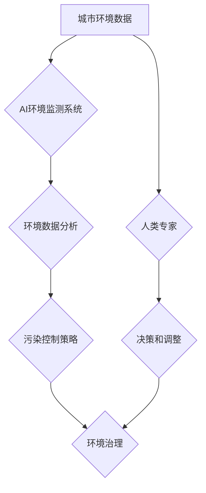

                 

## AI与人类计算：打造可持续发展的城市环境管理

> 关键词：人工智能、城市环境管理、可持续发展、人类计算、数据分析、机器学习、优化算法、环境监测、智能决策

## 1. 背景介绍

随着全球人口的快速增长和城市化的进程加速，城市环境面临着前所未有的挑战。资源短缺、污染加剧、基础设施压力等问题日益突出，严重影响着城市居民的健康和生活质量。传统的人工管理模式已难以有效应对这些复杂问题，迫切需要引入新的技术手段和理念来构建更加智能、高效、可持续的城市环境管理体系。

人工智能（AI）作为一门新兴技术，凭借其强大的数据处理能力、学习能力和决策能力，为城市环境管理提供了全新的解决方案。AI技术能够帮助城市政府和管理者更好地收集、分析和利用城市环境数据，从而实现环境监测、污染控制、资源优化、基础设施管理等方面的智能化转型。

## 2. 核心概念与联系

**2.1 城市环境管理**

城市环境管理是指通过科学规划、合理组织和有效管理，维护城市生态环境、保障城市居民健康和生活质量的综合性工作。其核心目标是实现城市环境的可持续发展，即满足当前城市发展需求，同时不损害未来世代的生存环境。

**2.2 人工智能（AI）**

人工智能是指模拟人类智能行为的计算机系统。AI技术涵盖了多个领域，包括机器学习、深度学习、自然语言处理、计算机视觉等。在城市环境管理领域，AI技术主要应用于以下几个方面：

* **环境监测:** 利用传感器网络和机器学习算法，实时监测空气质量、水质、噪音等环境指标，并进行预警和分析。
* **污染控制:** 通过数据分析和预测模型，识别污染源，优化排放控制策略，提高环境治理效率。
* **资源优化:** 利用AI算法优化城市资源配置，例如水资源、能源资源、交通资源等，提高资源利用率和节约成本。
* **基础设施管理:** 利用AI技术进行城市基础设施的智能化管理，例如交通信号灯优化、道路维护预测、供水管网监测等，提高基础设施运行效率和安全性。

**2.3 人类计算**

人类计算是指利用人类的智慧和经验来辅助人工智能系统进行决策和解决问题。在城市环境管理领域，人类计算可以与AI技术相结合，形成一个协同工作机制。例如，AI系统可以提供环境数据分析和预测结果，而人类专家可以根据这些结果进行判断和决策，并提供必要的指导和调整。

**2.4 架构图**



## 3. 核心算法原理 & 具体操作步骤

**3.1 算法原理概述**

在城市环境管理领域，常用的AI算法包括机器学习、深度学习、强化学习等。

* **机器学习:** 通过训练模型，让算法从数据中学习规律，并进行预测或分类。例如，可以利用机器学习算法预测空气质量指数，识别污染源等。
* **深度学习:** 基于多层神经网络，能够学习更复杂的特征和模式。例如，可以利用深度学习算法识别交通拥堵区域，优化交通流量等。
* **强化学习:** 通过奖励机制，让算法学习最佳策略。例如，可以利用强化学习算法优化城市能源调度，降低能源消耗等。

**3.2 算法步骤详解**

以机器学习算法为例，其基本步骤如下：

1. **数据收集:** 收集城市环境相关数据，例如空气质量、水质、温度、湿度、交通流量等。
2. **数据预处理:** 对收集到的数据进行清洗、转换、归一化等处理，使其适合模型训练。
3. **模型选择:** 根据具体任务选择合适的机器学习算法，例如线性回归、逻辑回归、决策树、支持向量机等。
4. **模型训练:** 利用训练数据训练模型，调整模型参数，使其能够准确预测或分类。
5. **模型评估:** 利用测试数据评估模型的性能，例如准确率、召回率、F1-score等。
6. **模型部署:** 将训练好的模型部署到实际应用环境中，用于环境监测、污染控制、资源优化等。

**3.3 算法优缺点**

* **优点:**

    * 能够自动学习数据规律，无需人工编程。
    * 能够处理海量数据，发现隐藏的模式。
    * 能够不断优化模型，提高预测精度。

* **缺点:**

    * 需要大量的数据进行训练，否则模型性能会下降。
    * 对数据质量要求较高，数据噪声会影响模型效果。
    * 模型解释性较差，难以理解模型的决策过程。

**3.4 算法应用领域**

* **环境监测:** 预测空气质量、水质、噪音等环境指标。
* **污染控制:** 识别污染源、优化排放控制策略。
* **资源优化:** 优化城市水资源、能源资源、交通资源等配置。
* **基础设施管理:** 智能化管理交通信号灯、道路维护、供水管网等。

## 4. 数学模型和公式 & 详细讲解 & 举例说明

**4.1 数学模型构建**

在城市环境管理领域，可以使用数学模型来描述城市环境系统，并进行预测和优化。例如，可以构建空气质量模型，描述空气污染物的扩散和沉降过程。

**4.2 公式推导过程**

空气质量模型的推导过程通常涉及以下几个方面：

* **污染物排放:** 考虑城市各污染源的排放量和排放时间。
* **大气扩散:** 利用扩散方程描述污染物在空气中的扩散过程。
* **沉降过程:** 考虑污染物在不同地表上的沉降速率。
* **风场影响:** 考虑风速和风向对污染物扩散的影响。

**4.3 案例分析与讲解**

假设我们想要预测城市某区域的空气质量指数（AQI）。我们可以构建一个基于机器学习的AQI预测模型。

* **输入数据:** 
    * 历史空气质量数据
    * 气象数据（温度、湿度、风速、风向等）
    * 交通流量数据
    * 工业生产数据

* **模型训练:** 利用历史数据训练机器学习模型，例如线性回归或神经网络。
* **预测结果:** 将最新的气象数据、交通流量数据和工业生产数据输入模型，得到该区域未来小时的AQI预测值。

## 5. 项目实践：代码实例和详细解释说明

**5.1 开发环境搭建**

* 操作系统：Linux或Windows
* Python版本：3.6或以上
* 必要的库：NumPy、Pandas、Scikit-learn、TensorFlow等

**5.2 源代码详细实现**

```python
# 导入必要的库
import numpy as np
from sklearn.linear_model import LinearRegression

# 加载数据
data = pd.read_csv("air_quality_data.csv")

# 数据预处理
X = data[['temperature', 'humidity', 'wind_speed', 'traffic_volume']]
y = data['AQI']

# 训练模型
model = LinearRegression()
model.fit(X, y)

# 预测AQI
new_data = [[25, 60, 10, 5000]]  # 新数据示例
predicted_AQI = model.predict(new_data)
print(f"预测AQI: {predicted_AQI}")
```

**5.3 代码解读与分析**

* 代码首先导入必要的库，例如NumPy用于数值计算、Pandas用于数据处理、Scikit-learn用于机器学习模型。
* 然后加载空气质量数据，并进行数据预处理，例如选择特征变量、归一化数据等。
* 接下来训练线性回归模型，并将训练好的模型用于预测新的空气质量数据。

**5.4 运行结果展示**

运行代码后，会输出预测的AQI值。

## 6. 实际应用场景

**6.1 环境监测**

* 利用传感器网络和AI算法，实时监测城市空气质量、水质、噪音等环境指标，并进行预警和分析。
* 建立城市环境监测平台，提供环境数据可视化和分析工具，帮助政府和公众了解城市环境状况。

**6.2 污染控制**

* 利用AI算法识别污染源，分析污染物排放情况，制定精准的污染控制策略。
* 建立智能化污染控制系统，根据实时环境数据自动调整排放控制措施，提高污染控制效率。

**6.3 资源优化**

* 利用AI算法优化城市水资源、能源资源、交通资源等配置，提高资源利用率和节约成本。
* 建立智能化资源管理平台，提供资源使用情况分析和优化建议，帮助政府和企业进行科学决策。

**6.4 未来应用展望**

* **更精准的环境预测:** 利用更先进的AI算法和更丰富的环境数据，实现更精准的环境预测，例如预测未来一周的空气质量、水质等。
* **更智能的环境治理:** 利用AI算法和机器人技术，实现更智能的环境治理，例如自动清理垃圾、自动监测污染源等。
* **更可持续的城市发展:** 利用AI技术和数据分析，帮助城市规划者制定更可持续的城市发展规划，实现城市环境的可持续发展。

## 7. 工具和资源推荐

**7.1 学习资源推荐**

* **在线课程:** Coursera、edX、Udacity等平台提供丰富的AI课程。
* **书籍:** 《深度学习》、《机器学习实战》等书籍。
* **开源项目:** TensorFlow、PyTorch等开源项目。

**7.2 开发工具推荐**

* **Python:** 作为AI开发的主要语言，Python拥有丰富的库和工具。
* **Jupyter Notebook:** 用于编写和运行Python代码，并进行数据可视化。
* **Git:** 用于版本控制和代码管理。

**7.3 相关论文推荐**

* **环境监测:** "Air Quality Forecasting Using Deep Learning"
* **污染控制:** "Deep Reinforcement Learning for Optimal Emission Control"
* **资源优化:** "Smart City Resource Management Using Machine Learning"

## 8. 总结：未来发展趋势与挑战

**8.1 研究成果总结**

AI技术在城市环境管理领域取得了显著成果，例如环境监测、污染控制、资源优化等方面都取得了突破。

**8.2 未来发展趋势**

* **更强大的AI算法:** 随着AI技术的不断发展，将出现更强大的AI算法，能够处理更复杂的环境问题。
* **更丰富的环境数据:** 城市环境数据将更加丰富，包括传感器数据、卫星数据、社交媒体数据等，为AI算法提供更全面的信息。
* **更智能的城市环境管理系统:** 将出现更智能的城市环境管理系统，能够自动收集、分析和处理环境数据，并进行智能决策。

**8.3 面临的挑战**

* **数据隐私保护:** 城市环境数据可能包含个人隐私信息，需要采取有效措施保护数据隐私。
* **算法解释性:** AI算法的决策过程往往难以理解，需要提高算法的解释性，增强公众对AI技术的信任。
* **技术可持续性:** 需要确保AI技术能够长期稳定运行，并适应不断变化的环境需求。

**8.4 研究展望**

未来，AI技术将在城市环境管理领域发挥更加重要的作用，帮助城市构建更加智能、高效、可持续的未来。


## 9. 附录：常见问题与解答

**9.1 如何选择合适的AI算法？**

选择合适的AI算法取决于具体的应用场景和数据特点。例如，对于预测连续数值的场景，可以使用线性回归或神经网络；对于分类问题，可以使用决策树或支持向量机。

**9.2 如何处理环境数据中的噪声？**

环境数据中可能存在噪声，可以使用数据清洗和预处理技术来去除噪声。例如，可以使用均值滤波、中值滤波等方法去除数据中的异常值。

**9.3 如何评估AI模型的性能？**

可以使用多种指标来评估AI模型的性能，例如准确率、召回率、F1-score等。选择合适的评估指标取决于具体的应用场景。


作者：禅与计算机程序设计艺术 / Zen and the Art of Computer Programming 
<end_of_turn>

