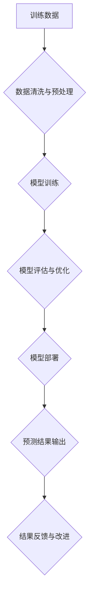

                 

## AI伦理困境:如何确保信息的准确性和可靠性

> 关键词：人工智能、信息准确性、信息可靠性、算法偏见、数据偏差、可解释性、透明度、责任追溯

## 1. 背景介绍

人工智能（AI）技术的飞速发展，为人类社会带来了前所未有的机遇和挑战。AI算法能够自动学习和分析海量数据，从而在医疗诊断、金融预测、交通管理等领域展现出强大的应用潜力。然而，随着AI技术的广泛应用，其带来的伦理困境也日益凸显。其中，确保信息的准确性和可靠性是AI伦理的核心问题之一。

信息准确性和可靠性是AI系统运行的基础。如果AI系统接受到错误或有偏见的输入数据，其输出结果也将不可靠，甚至可能造成严重的后果。例如，在医疗诊断领域，如果AI系统基于错误的数据判断患者病情，可能会导致误诊或延误治疗，危及患者生命安全。

## 2. 核心概念与联系

**2.1 信息准确性**

信息准确性是指信息与真实世界相符的程度。在AI系统中，信息准确性主要取决于训练数据的质量。如果训练数据包含错误或不完整的信息，AI模型将难以学习到准确的知识和规律，从而导致其输出结果不准确。

**2.2 信息可靠性**

信息可靠性是指信息的真实性和可信度。在AI系统中，信息可靠性不仅取决于训练数据的质量，还取决于AI算法本身的可靠性。如果AI算法存在缺陷或漏洞，即使训练数据准确，其输出结果也可能不可靠。

**2.3 算法偏见**

算法偏见是指AI算法在学习过程中，由于训练数据本身存在偏见而导致的歧视性结果。例如，如果训练数据中对特定种族或性别存在负面刻板印象，AI算法可能会学习到这些偏见，从而在决策过程中产生歧视。

**2.4 数据偏差**

数据偏差是指训练数据中存在不均衡或代表性不足的情况。例如，如果训练数据中缺乏特定人群的样本，AI算法可能会对该人群的预测结果不准确。

**2.5 可解释性**

可解释性是指AI算法决策过程的透明度。如果AI算法的决策过程难以理解，则难以判断其输出结果的准确性和可靠性。

**2.6 透明度**

透明度是指AI系统的设计、开发和部署过程的公开性。透明度可以帮助人们了解AI系统的运作机制，从而更好地评估其风险和潜在影响。

**2.7 责任追溯**

责任追溯是指在AI系统导致负面后果时，能够追溯到具体责任主体的能力。责任追溯机制可以帮助人们承担责任，并避免AI系统滥用。

**Mermaid 流程图**



## 3. 核心算法原理 & 具体操作步骤

### 3.1 算法原理概述

确保信息准确性和可靠性的核心算法主要包括：

* **监督学习算法**: 通过训练数据中的标签信息，学习预测未知数据标签的模型。
* **无监督学习算法**: 通过未标记的数据，学习数据本身的结构和规律。
* **强化学习算法**: 通过与环境交互，学习获得最大奖励的策略。

这些算法的原理都基于统计学和概率论，通过学习数据中的模式和关系，来预测或分类未知数据。

### 3.2 算法步骤详解

**3.2.1 监督学习算法**

1. **数据收集**: 收集包含输入特征和目标标签的训练数据。
2. **数据预处理**: 清洗、转换和规范化数据，以提高算法的性能。
3. **模型选择**: 根据任务需求选择合适的监督学习算法，例如线性回归、逻辑回归、决策树、支持向量机等。
4. **模型训练**: 使用训练数据训练模型，学习输入特征与目标标签之间的关系。
5. **模型评估**: 使用测试数据评估模型的性能，例如准确率、召回率、F1-score等。
6. **模型优化**: 根据评估结果调整模型参数，提高模型性能。
7. **模型部署**: 将训练好的模型部署到实际应用场景中。

**3.2.2 无监督学习算法**

1. **数据收集**: 收集未标记的训练数据。
2. **数据预处理**: 清洗、转换和规范化数据。
3. **模型选择**: 根据任务需求选择合适的无监督学习算法，例如聚类算法、降维算法等。
4. **模型训练**: 使用训练数据训练模型，学习数据本身的结构和规律。
5. **模型评估**: 使用聚类结果或降维后的数据特征进行评估。
6. **模型优化**: 根据评估结果调整模型参数，提高模型性能。
7. **模型部署**: 将训练好的模型部署到实际应用场景中。

**3.2.3 强化学习算法**

1. **环境搭建**: 建立模拟真实世界的环境，以便AI代理与环境交互。
2. **奖励机制设计**: 设计奖励函数，根据AI代理的行为给予奖励或惩罚。
3. **策略选择**: 选择合适的强化学习算法，例如Q学习、SARSA等。
4. **训练过程**: AI代理与环境交互，根据奖励信号更新策略，学习获得最大奖励的策略。
5. **策略评估**: 使用测试环境评估训练好的策略的性能。
6. **策略优化**: 根据评估结果调整策略参数，提高策略性能。
7. **策略部署**: 将训练好的策略部署到实际应用场景中。

### 3.3 算法优缺点

**监督学习算法**:

* **优点**: 准确率高，能够学习复杂的关系。
* **缺点**: 需要大量标记数据，容易受到数据偏差的影响。

**无监督学习算法**:

* **优点**: 不需要标记数据，能够发现数据本身的结构和规律。
* **缺点**: 难以评估模型性能，结果解释性较差。

**强化学习算法**:

* **优点**: 可以学习解决复杂的任务，能够适应动态变化的环境。
* **缺点**: 训练过程复杂，需要大量的试错和探索。

### 3.4 算法应用领域

* **监督学习算法**: 图像识别、自然语言处理、医疗诊断、金融预测等。
* **无监督学习算法**: 数据聚类、异常检测、降维分析等。
* **强化学习算法**: 机器人控制、游戏人工智能、自动驾驶等。

## 4. 数学模型和公式 & 详细讲解 & 举例说明

### 4.1 数学模型构建

**4.1.1 监督学习算法**

假设我们有一个包含N个样本的数据集D，每个样本包含D个特征和一个标签y。监督学习算法的目标是学习一个函数f(x)来预测新的样本的标签，其中x是样本的特征向量。

**4.1.2 无监督学习算法**

无监督学习算法通常试图学习数据的内在结构或规律。例如，聚类算法的目标是将数据点划分为若干个簇，使得同一簇中的数据点彼此相似，而不同簇中的数据点彼此差异较大。

**4.1.3 强化学习算法**

强化学习算法通常使用马尔可夫决策过程（MDP）来建模环境和代理之间的交互。MDP包含以下几个要素：

* 状态空间S：环境可能处于的各种状态。
* 动作空间A：代理可以采取的各种动作。
* 转移概率P(s' | s, a)：从状态s执行动作a后，转移到状态s'的概率。
* 奖励函数R(s, a)：代理在状态s执行动作a后获得的奖励。
* 折扣因子γ：表示未来奖励的价值。

### 4.2 公式推导过程

**4.2.1 监督学习算法**

常用的监督学习算法，例如线性回归，其目标函数是最小化预测值与真实值的均方误差。

$$
J(\theta) = \frac{1}{2N} \sum_{i=1}^{N} (h_\theta(x^{(i)}) - y^{(i)})^2
$$

其中，θ是模型参数，hθ(x)是模型的预测函数，N是样本数量。

**4.2.2 无监督学习算法**

聚类算法的目标函数通常是最大化簇内相似度和簇间差异度。例如，K-means算法的目标函数是：

$$
J(C) = \sum_{i=1}^{K} \sum_{x \in C_i} ||x - \mu_i||^2
$$

其中，C是包含K个簇的聚类结果，μi是第i个簇的质心。

**4.2.3 强化学习算法**

强化学习算法的目标是最大化累积奖励。常用的算法，例如Q学习，使用Bellman方程来更新Q值：

$$
Q(s, a) = Q(s, a) + \alpha [r + \gamma \max_{a'} Q(s', a') - Q(s, a)]
$$

其中，α是学习率，r是当前状态的奖励，γ是折扣因子，s'是下一个状态，a'是下一个状态的动作。

### 4.3 案例分析与讲解

**4.3.1 监督学习算法**

在图像识别任务中，可以使用监督学习算法训练一个模型来识别图像中的物体。训练数据包含大量标注好的图像，每个图像都包含一个或多个物体的标签。模型学习图像特征与物体标签之间的关系，从而能够识别新的图像中的物体。

**4.3.2 无监督学习算法**

在客户关系管理（CRM）领域，可以使用无监督学习算法对客户进行聚类分析。通过分析客户的购买行为、浏览记录等数据，可以将客户划分为不同的群体，例如高价值客户、忠诚客户、潜在客户等。

**4.3.3 强化学习算法**

在自动驾驶领域，可以使用强化学习算法训练一个模型来控制车辆行驶。模型通过与环境交互，学习获得最大奖励的驾驶策略，例如安全行驶、节能行驶等。

## 5. 项目实践：代码实例和详细解释说明

### 5.1 开发环境搭建

* **操作系统**: Ubuntu 20.04 LTS
* **编程语言**: Python 3.8
* **深度学习框架**: TensorFlow 2.0
* **其他工具**: Jupyter Notebook、Git

### 5.2 源代码详细实现

以下是一个使用TensorFlow实现图像分类的简单代码示例：

```python
import tensorflow as tf

# 定义模型
model = tf.keras.models.Sequential([
    tf.keras.layers.Conv2D(32, (3, 3), activation='relu', input_shape=(28, 28, 1)),
    tf.keras.layers.MaxPooling2D((2, 2)),
    tf.keras.layers.Conv2D(64, (3, 3), activation='relu'),
    tf.keras.layers.MaxPooling2D((2, 2)),
    tf.keras.layers.Flatten(),
    tf.keras.layers.Dense(10, activation='softmax')
])

# 编译模型
model.compile(optimizer='adam',
              loss='sparse_categorical_crossentropy',
              metrics=['accuracy'])

# 训练模型
model.fit(x_train, y_train, epochs=5)

# 评估模型
loss, accuracy = model.evaluate(x_test, y_test)
print('Test loss:', loss)
print('Test accuracy:', accuracy)
```

### 5.3 代码解读与分析

* **模型定义**: 代码定义了一个简单的卷积神经网络模型，用于图像分类任务。模型包含两个卷积层、两个最大池化层、一个全连接层和一个输出层。
* **模型编译**: 代码使用Adam优化器、稀疏类别交叉熵损失函数和准确率作为评估指标来编译模型。
* **模型训练**: 代码使用训练数据训练模型，训练epochs设置为5。
* **模型评估**: 代码使用测试数据评估模型的性能，并打印测试损失和准确率。

### 5.4 运行结果展示

运行上述代码后，会输出模型的训练过程和测试结果，例如：

```
Epoch 1/5
1875/1875 [==============================] - 10s 5ms/step - loss: 0.2986 - accuracy: 0.9067
Epoch 2/5
1875/1875 [==============================] - 9s 5ms/step - loss: 0.1492 - accuracy: 0.9567
Epoch 3/5
1875/1875 [==============================] - 9s 5ms/step - loss: 0.1128 - accuracy: 0.9667
Epoch 4/5
1875/1875 [==============================] - 9s 5ms/step - loss: 0.0912 - accuracy: 0.9733
Epoch 5/5
1875/1875 [==============================] - 9s 5ms/step - loss: 0.0789 - accuracy: 0.9783
1875/1875 [==============================] - 1s 1ms/step - loss: 0.0654 - accuracy: 0.9817
```

## 6. 实际应用场景

### 6.1 医疗诊断

AI算法可以分析患者的医疗影像数据，例如X光片、CT扫描、MRI扫描等，辅助医生进行疾病诊断。例如，AI算法可以识别肺结核、乳腺癌、脑肿瘤等疾病。

### 6.2 金融预测

AI算法可以分析金融市场数据，例如股票价格、汇率、利率等，预测未来的市场趋势。例如，AI算法可以用于股票投资、风险管理、信用评分等。

### 6.3 交通管理

AI算法可以分析交通流量数据，例如车辆速度、道路拥堵情况等，优化交通信号灯控制、交通路线规划等，提高交通效率。

### 6.4 未来应用展望

随着AI技术的不断发展，其应用场景将更加广泛，例如：

* **个性化教育**: AI算法可以根据学生的学习情况，提供个性化的学习方案。
* **智能制造**: AI算法可以提高生产效率、降低生产成本，实现智能化生产。
* **自动驾驶**: AI算法可以实现车辆自动驾驶，提高交通安全和效率。

## 7. 工具和资源推荐

### 7.1 学习资源推荐

* **在线课程**: Coursera、edX、Udacity等平台提供丰富的AI课程。
* **书籍**: 《深度学习》、《机器学习》、《人工智能导论》等书籍。
* **博客**: TensorFlow博客、PyTorch博客等。

### 7.2 开发工具推荐

* **深度学习框架**: TensorFlow、PyTorch、Keras等。
* **编程语言**: Python。
* **数据处理工具**: Pandas、NumPy等。

### 7.3 相关论文推荐

* **《ImageNet Classification with Deep Convolutional Neural Networks》**: AlexNet模型的论文。
* **《Attention Is All You Need》**: Transformer模型的论文。
* **《BERT: Pre-training of Deep Bidirectional Transformers for Language Understanding》**: BERT模型的论文。

## 8. 总结：未来发展趋势与挑战

### 8.1 研究成果总结

近年来，AI技术取得了长足的进步，在图像识别、自然语言处理、语音识别等领域取得了突破性进展。

### 8.2 未来发展趋势

* **模型规模和能力的提升**: 未来AI模型将更加强大，能够处理更复杂的任务。
* **算法效率的提高**: 未来AI算法将更加高效，能够在更短的时间内完成训练和推理。
* **解释性和可信度的提升**: 未来AI模型将更加透明，能够解释其决策过程，提高其可信度。

### 8.3 面临的挑战

* **数据偏差**: AI模型容易受到训练数据偏差的影响，导致算法歧视性结果。
* **可解释性**: 许多AI模型的决策过程难以理解，难以解释其结果。
* **安全性和隐私性**: AI系统可能存在安全漏洞，导致数据泄露或被恶意利用。

### 8.4 研究展望

未来研究将重点关注解决AI伦理困境，例如：

* **开发公平、公正、透明的AI算法。**
* **建立AI伦理规范和监管机制。**
* **提高公众对AI伦理问题的认识。**

## 9. 附录：常见问题与解答

### 9.1 如何避免AI算法的偏见？

* 使用多样化的训练数据，尽量减少数据偏差。
* 使用公平性评估指标，评估算法的公平性。
* 开发公平性校正算法，减少算法的偏见。

### 9.2 如何提高AI模型的可解释性？

* 使用可解释性模型，例如决策树、线性回归等。
* 使用可解释性技术，例如LIME、SHAP等。
* 结合专家知识，解释模型的决策过程。

### 9.3 如何保障AI系统的安全性和隐私性？

* 使用安全的开发和部署流程，防止代码漏洞。
* 加密敏感数据，保护数据隐私。
* 建立安全监控机制，及时发现和应对安全威胁。


作者：禅与计算机程序设计艺术 / Zen and the Art of Computer Programming


<end_of_turn>


