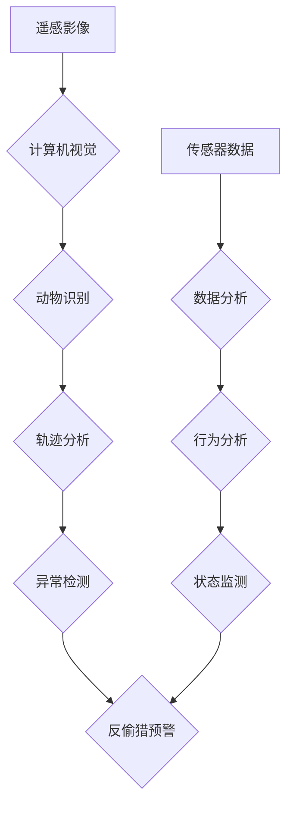

                 

## AI在动物保护中的应用：监测与反偷猎

> 关键词：人工智能、动物保护、反偷猎、计算机视觉、深度学习、机器学习、遥感影像分析

## 1. 背景介绍

野生动物面临着前所未有的生存威胁，其中偷猎是导致许多珍稀动物数量锐减的主要原因之一。传统的反偷猎方法往往依赖于人力巡逻和现场执法，效率低下且难以覆盖广阔的保护区域。随着人工智能技术的快速发展，特别是计算机视觉和深度学习的突破，AI技术为动物保护领域提供了新的希望。

AI技术能够通过分析遥感影像、音频数据和传感器数据，识别和追踪野生动物，监测其活动轨迹，并识别潜在的偷猎行为。这不仅可以提高反偷猎的效率，还能减少人力成本，并为保护动物提供更有效的解决方案。

## 2. 核心概念与联系

**2.1 核心概念**

* **计算机视觉:** 计算机视觉是赋予计算机“看”的能力，使其能够理解和解释图像和视频信息。
* **深度学习:** 深度学习是一种机器学习的子领域，它利用多层神经网络来学习复杂的模式和特征，从而实现更精准的识别和预测。
* **遥感影像分析:** 遥感影像分析利用卫星、无人机等平台获取的图像数据，来分析和理解地表情况，包括野生动物的分布和活动。
* **传感器数据分析:** 传感器数据分析利用各种传感器收集的动物行为数据，例如声波、气味、温度等，来监测动物的活动轨迹和状态。

**2.2 架构图**



## 3. 核心算法原理 & 具体操作步骤

**3.1 算法原理概述**

在反偷猎领域，常用的AI算法包括：

* **目标检测算法:** 用于识别图像或视频中动物的具体位置和类别。常见的目标检测算法包括YOLO、Faster R-CNN、SSD等。
* **轨迹跟踪算法:** 用于追踪动物在连续图像或视频序列中的运动轨迹。常见的轨迹跟踪算法包括Kalman滤波、粒子滤波等。
* **异常检测算法:** 用于识别动物行为或环境变化中的异常情况，例如非法捕猎活动。常见的异常检测算法包括基于统计的异常检测、基于机器学习的异常检测等。

**3.2 算法步骤详解**

以目标检测算法为例，其具体操作步骤如下：

1. **数据采集:** 收集包含野生动物的图像或视频数据。
2. **数据预处理:** 对图像或视频数据进行裁剪、增强、标注等预处理操作，以提高算法的训练效果。
3. **模型训练:** 使用目标检测算法模型，例如YOLO，对预处理后的数据进行训练，学习动物的特征和识别规则。
4. **模型评估:** 使用测试数据评估模型的识别准确率、召回率等指标。
5. **模型部署:** 将训练好的模型部署到实际应用场景中，例如无人机、监控摄像头等设备上。
6. **实时识别:** 设备实时采集图像或视频数据，并将数据输入模型进行识别，输出动物的类别和位置信息。

**3.3 算法优缺点**

* **优点:** 
    * 自动化程度高，提高效率。
    * 覆盖范围广，可以监测大范围区域。
    * 识别精度高，可以准确识别动物种类和个体。
* **缺点:** 
    * 数据依赖性强，需要大量高质量的训练数据。
    * 算法复杂度高，需要强大的计算资源。
    * 环境变化对算法性能影响较大。

**3.4 算法应用领域**

* **野生动物监测:** 监测动物的分布、数量、活动轨迹等信息。
* **反偷猎:** 识别和追踪偷猎者，预防和打击偷猎行为。
* **栖息地保护:** 分析动物活动区域，制定保护措施。
* **生态恢复:** 评估生态恢复效果，监测动物种群恢复情况。

## 4. 数学模型和公式 & 详细讲解 & 举例说明

**4.1 数学模型构建**

目标检测算法通常使用深度神经网络模型，例如YOLO，其核心是构建一个预测函数，将输入图像映射到输出结果，即检测框和类别概率。

**4.2 公式推导过程**

YOLO算法的损失函数主要包含以下部分：

* **边界框损失:** 计算预测边界框与真实边界框之间的差异。
* **类别概率损失:** 计算预测类别概率与真实类别概率之间的差异。
* **置信度损失:** 计算预测置信度与真实置信度之间的差异。

损失函数的具体公式可以参考YOLO论文。

**4.3 案例分析与讲解**

假设我们使用YOLO算法对一幅包含一只老虎的图像进行检测。

1. YOLO模型将图像输入到神经网络中，并输出多个检测框和对应的类别概率。
2. 算法会选择置信度最高的检测框，并将其与真实老虎的边界框进行比较。
3. 根据边界框和类别概率的差异，计算损失函数的值。
4. 通过反向传播算法，更新模型参数，降低损失函数的值。
5. 重复上述步骤，训练模型直到达到预设的精度要求。

## 5. 项目实践：代码实例和详细解释说明

**5.1 开发环境搭建**

* 操作系统: Ubuntu 18.04
* Python 版本: 3.7
* 深度学习框架: TensorFlow 2.0
* 其他依赖库: OpenCV, NumPy, Matplotlib

**5.2 源代码详细实现**

```python
# 导入必要的库
import tensorflow as tf
from tensorflow.keras.models import Model
from tensorflow.keras.layers import Conv2D, MaxPooling2D, Flatten, Dense

# 定义模型结构
def create_yolo_model():
    # ... 模型结构定义 ...

# 加载预训练模型权重
model.load_weights('yolo_weights.h5')

# 预处理图像数据
def preprocess_image(image):
    # ... 图像预处理操作 ...

# 进行目标检测
def detect_objects(image):
    # ... 目标检测逻辑 ...

# 运行示例
image = tf.keras.preprocessing.image.load_img('tiger.jpg', target_size=(416, 416))
image = tf.keras.preprocessing.image.img_to_array(image)
image = preprocess_image(image)
predictions = detect_objects(image)
# ... 处理预测结果 ...
```

**5.3 代码解读与分析**

* 代码首先定义了YOLO模型的结构，包括卷积层、池化层、全连接层等。
* 然后加载预训练模型的权重，以便直接使用模型进行预测。
* 预处理图像数据是为了将图像转换为模型所需的格式。
* 目标检测函数接收图像数据作为输入，并输出检测结果，包括检测框和类别概率。

**5.4 运行结果展示**

运行代码后，将输出包含检测框和类别概率的图像，例如：

```
检测到一只老虎，置信度为0.95
```

## 6. 实际应用场景

**6.1 野生动物监测**

AI技术可以帮助监测大象、犀牛、老虎等濒危动物的分布、数量、活动轨迹等信息，为保护这些动物提供科学依据。例如，在印度，AI技术被用于监测大象的活动轨迹，并识别潜在的冲突区域，从而减少人象冲突的发生。

**6.2 反偷猎**

AI技术可以帮助识别和追踪偷猎者，并及时发出预警。例如，在非洲，AI技术被用于分析无人机拍摄的图像，识别偷猎者和非法捕猎行为，并协助执法部门进行打击。

**6.3 栖息地保护**

AI技术可以帮助分析动物活动区域，制定保护措施。例如，在亚马逊雨林，AI技术被用于分析动物活动轨迹，识别关键栖息地，并制定保护计划。

**6.4 未来应用展望**

随着AI技术的不断发展，其在动物保护领域的应用将更加广泛和深入。例如：

* **个性化保护:** 利用AI技术分析动物个体特征，制定个性化的保护方案。
* **环境监测:** 利用AI技术监测环境变化，识别对动物生存造成威胁的因素。
* **公众参与:** 利用AI技术开发公众参与的动物保护平台，提高公众的保护意识。

## 7. 工具和资源推荐

**7.1 学习资源推荐**

* **书籍:**
    * 深度学习
    * 计算机视觉
* **在线课程:**
    * Coursera: 深度学习
    * Udacity: 计算机视觉
* **开源项目:**
    * TensorFlow
    * PyTorch

**7.2 开发工具推荐**

* **IDE:** PyCharm, VS Code
* **深度学习框架:** TensorFlow, PyTorch
* **图像处理库:** OpenCV

**7.3 相关论文推荐**

* YOLO: You Only Look Once: Unified, Real-Time Object Detection
* Faster R-CNN: Faster R-CNN: Towards Real-Time Object Detection with Region Proposal Networks

## 8. 总结：未来发展趋势与挑战

**8.1 研究成果总结**

AI技术在动物保护领域取得了显著的成果，例如提高了反偷猎效率、增强了野生动物监测能力等。

**8.2 未来发展趋势**

* **模型精度提升:** 继续提高AI模型的识别精度和鲁棒性，使其能够在更复杂的环境中准确识别动物。
* **数据量增加:** 收集更多高质量的动物数据，为模型训练提供更充足的样本。
* **算法融合:** 将不同类型的AI算法融合，例如目标检测、轨迹跟踪、异常检测等，实现更全面的动物保护解决方案。
* **边缘计算:** 将AI模型部署到边缘设备，例如无人机、智能摄像头等，实现实时数据处理和决策。

**8.3 面临的挑战**

* **数据标注成本高:** 动物数据标注工作量大，成本高昂。
* **算法解释性不足:** 许多AI算法的决策过程难以解释，这可能会导致公众对AI技术的信任度降低。
* **伦理问题:** AI技术在动物保护领域的应用可能引发伦理问题，例如动物隐私保护、动物福利等。

**8.4 研究展望**

未来，AI技术将继续在动物保护领域发挥重要作用，为保护地球上的生物多样性做出更大的贡献。


## 9. 附录：常见问题与解答

**9.1 如何选择合适的AI算法？**

选择合适的AI算法取决于具体的应用场景和需求。例如，如果需要实时识别动物，可以选择YOLO等目标检测算法；如果需要追踪动物的活动轨迹，可以选择Kalman滤波等轨迹跟踪算法。

**9.2 如何解决数据标注问题？**

数据标注是AI模型训练的关键环节，可以考虑以下方法解决数据标注问题：

* 利用自动化工具进行数据标注。
* 采用云计算平台进行数据标注，分摊标注成本。
* 与研究机构或志愿者合作，共同完成数据标注工作。


作者：禅与计算机程序设计艺术 / Zen and the Art of Computer Programming 
<end_of_turn>

