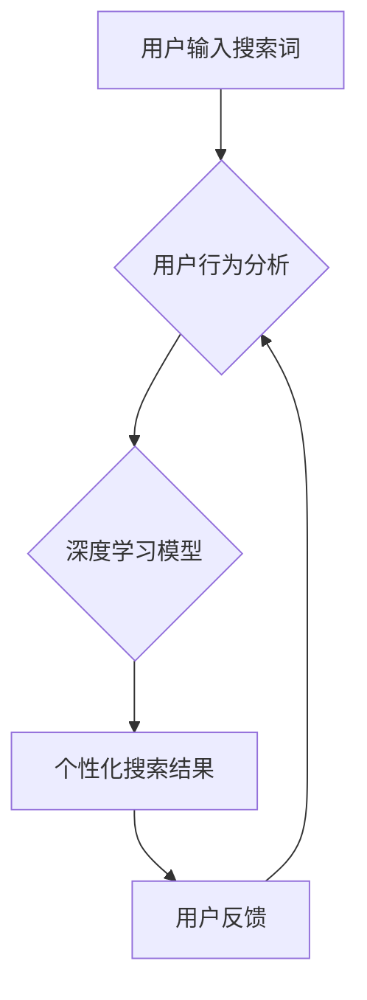

                 

## AI在搜索引擎个性化方面的应用

> 关键词：搜索引擎、个性化推荐、深度学习、自然语言处理、用户行为分析、机器学习、推荐系统

## 1. 背景介绍

随着互联网的蓬勃发展，搜索引擎已成为人们获取信息的主要途径。然而，传统的搜索引擎基于关键词匹配，往往难以满足用户多样化的信息需求。个性化搜索引擎应运而生，旨在根据用户的兴趣、偏好、历史行为等信息，提供更加精准、相关的搜索结果。

近年来，人工智能（AI）技术取得了飞速发展，为搜索引擎个性化提供了强大的技术支撑。深度学习、自然语言处理（NLP）等AI技术能够有效地分析用户行为、理解用户意图，并生成更加个性化的搜索结果。

## 2. 核心概念与联系

**2.1 核心概念**

* **个性化搜索:** 根据用户的特定特征和需求，提供定制化的搜索结果，提升用户体验。
* **用户行为分析:** 收集和分析用户的搜索历史、点击记录、浏览行为等数据，以了解用户的兴趣和偏好。
* **深度学习:** 一种机器学习方法，能够从海量数据中学习复杂的模式和关系，用于预测用户需求和生成个性化推荐。
* **自然语言处理:** 处理和理解人类语言的技术，用于分析用户搜索词语的语义和意图。

**2.2 架构图**



**2.3 联系**

个性化搜索引擎的核心是利用AI技术分析用户行为，并根据分析结果生成个性化推荐。用户行为分析模块收集用户数据，深度学习模型对数据进行训练，学习用户偏好，最终生成个性化搜索结果。用户反馈会反馈到用户行为分析模块，不断优化模型，提升推荐效果。

## 3. 核心算法原理 & 具体操作步骤

**3.1 算法原理概述**

个性化搜索引擎通常采用基于用户的协同过滤算法或基于内容的推荐算法。

* **协同过滤算法:** 

根据用户的历史行为数据，预测用户对特定内容的兴趣。例如，如果用户A和用户B都喜欢电影X，那么系统可能会推荐电影Y，因为用户A和用户B都喜欢电影Y。

* **基于内容的推荐算法:** 

根据内容本身的特征，推荐与用户兴趣相符的内容。例如，如果用户喜欢科幻电影，那么系统可能会推荐其他科幻电影。

**3.2 算法步骤详解**

**协同过滤算法:**

1. **数据收集:** 收集用户的历史行为数据，例如用户对哪些电影评分、哪些商品购买等。
2. **用户相似度计算:** 计算用户之间的相似度，例如使用余弦相似度或皮尔逊相关系数。
3. **预测用户兴趣:** 根据用户之间的相似度，预测用户对特定内容的兴趣。
4. **排序推荐:** 对预测结果进行排序，推荐用户最感兴趣的内容。

**基于内容的推荐算法:**

1. **内容特征提取:** 从内容中提取特征，例如电影的类型、演员、导演等。
2. **用户兴趣建模:** 建立用户兴趣模型，例如使用词袋模型或主题模型。
3. **内容与用户兴趣匹配:** 计算内容特征与用户兴趣模型之间的匹配度。
4. **排序推荐:** 对匹配度进行排序，推荐用户最感兴趣的内容。

**3.3 算法优缺点**

**协同过滤算法:**

* **优点:** 可以发现用户之间的隐性关系，推荐更加个性化的内容。
* **缺点:** 数据稀疏性问题，当用户行为数据不足时，算法效果会下降。

**基于内容的推荐算法:**

* **优点:** 不需要用户行为数据，可以推荐新内容。
* **缺点:** 难以捕捉用户之间的隐性关系，推荐结果可能不够个性化。

**3.4 算法应用领域**

个性化搜索引擎的算法广泛应用于电商、娱乐、新闻等领域，例如：

* **电商:** 推荐商品、个性化购物清单
* **娱乐:** 推荐电影、音乐、游戏
* **新闻:** 推荐新闻资讯、个性化新闻订阅

## 4. 数学模型和公式 & 详细讲解 & 举例说明

**4.1 数学模型构建**

协同过滤算法中常用的数学模型是矩阵分解模型。假设用户集合为U，物品集合为I，用户对物品的评分矩阵为R，其中R(u,i)表示用户u对物品i的评分。

矩阵分解模型将评分矩阵R分解成两个低维矩阵：用户特征矩阵P和物品特征矩阵Q。

**4.2 公式推导过程**

$$R(u,i) \approx P(u) \cdot Q(i)$$

其中，P(u)表示用户u的特征向量，Q(i)表示物品i的特征向量。

目标函数是最小化预测评分与实际评分之间的误差。

$$J(P,Q) = \frac{1}{2} \sum_{u \in U, i \in I} (R(u,i) - P(u) \cdot Q(i))^2$$

使用梯度下降算法优化目标函数，得到用户特征矩阵P和物品特征矩阵Q。

**4.3 案例分析与讲解**

假设用户A对电影X评分为5，对电影Y评分为3，用户B对电影X评分为4，对电影Y评分为2。

使用矩阵分解模型，可以将用户和电影的特征向量表示为：

$$P(A) = [a_1, a_2, a_3]$$

$$P(B) = [b_1, b_2, b_3]$$

$$Q(X) = [q_1, q_2, q_3]$$

$$Q(Y) = [r_1, r_2, r_3]$$

通过优化目标函数，可以得到用户和电影的特征向量，并预测用户对其他电影的评分。

## 5. 项目实践：代码实例和详细解释说明

**5.1 开发环境搭建**

* Python 3.x
* TensorFlow 或 PyTorch
* Jupyter Notebook

**5.2 源代码详细实现**

```python
import tensorflow as tf

# 定义用户特征矩阵和物品特征矩阵
user_features = tf.Variable(tf.random.normal([10, 5]))
item_features = tf.Variable(tf.random.normal([5, 5]))

# 定义评分预测函数
def predict_rating(user_id, item_id):
  user_vector = user_features[user_id]
  item_vector = item_features[item_id]
  return tf.reduce_sum(user_vector * item_vector)

# 定义损失函数
def loss_function(ratings, predictions):
  return tf.reduce_mean(tf.square(ratings - predictions))

# 定义优化器
optimizer = tf.keras.optimizers.Adam()

# 训练模型
for epoch in range(10):
  for user_id in range(10):
    for item_id in range(5):
      rating = ratings[user_id, item_id]
      prediction = predict_rating(user_id, item_id)
      loss = loss_function(rating, prediction)
      optimizer.minimize(loss)

# 预测用户对物品的评分
predicted_rating = predict_rating(0, 2)
print(predicted_rating)
```

**5.3 代码解读与分析**

代码实现了一个简单的基于矩阵分解的协同过滤推荐模型。

* 用户特征矩阵和物品特征矩阵分别表示用户的兴趣和物品的属性。
* 评分预测函数计算用户和物品的特征向量的点积，得到预测评分。
* 损失函数计算预测评分与实际评分之间的误差。
* 优化器使用梯度下降算法最小化损失函数。

**5.4 运行结果展示**

运行代码后，会输出用户对特定物品的预测评分。

## 6. 实际应用场景

**6.1 搜索引擎个性化推荐**

* 根据用户的搜索历史、浏览记录、点击行为等数据，推荐与用户兴趣相关的搜索结果。
* 提供个性化的搜索结果排序，提升用户体验。

**6.2 电子商务个性化推荐**

* 根据用户的购买历史、浏览记录、购物车内容等数据，推荐与用户兴趣相关的商品。
* 提供个性化的商品列表、促销信息和优惠券。

**6.3 内容平台个性化推荐**

* 根据用户的阅读历史、观看记录、点赞行为等数据，推荐与用户兴趣相关的文章、视频、音频等内容。
* 提供个性化的内容订阅和推荐列表。

**6.4 未来应用展望**

随着AI技术的不断发展，个性化搜索引擎将更加智能化、精准化。未来，个性化搜索引擎可能具备以下能力：

* 更深入地理解用户的意图和需求。
* 提供更加个性化的内容推荐和服务。
* 跨平台、跨设备的个性化体验。
* 与其他AI技术融合，例如语音识别、图像识别等，提供更加丰富的个性化服务。

## 7. 工具和资源推荐

**7.1 学习资源推荐**

* **书籍:**
    * 《推荐系统实践》
    * 《深度学习》
* **在线课程:**
    * Coursera: Recommender Systems
    * Udacity: Deep Learning Nanodegree

**7.2 开发工具推荐**

* **Python:** TensorFlow, PyTorch, Scikit-learn
* **数据库:** MySQL, MongoDB

**7.3 相关论文推荐**

* 《Collaborative Filtering for Implicit Feedback Datasets》
* 《Matrix Factorization Techniques for Recommender Systems》

## 8. 总结：未来发展趋势与挑战

**8.1 研究成果总结**

AI技术在搜索引擎个性化方面取得了显著成果，例如协同过滤算法、矩阵分解模型等，能够有效地分析用户行为，生成个性化推荐。

**8.2 未来发展趋势**

* **更深层次的用户理解:** 利用自然语言处理、情感分析等技术，更深入地理解用户的意图和需求。
* **跨平台、跨设备的个性化体验:** 提供更加统一、连续的个性化体验，跨越不同的平台和设备。
* **个性化服务定制化:** 根据用户的具体需求，定制化个性化服务，例如个性化新闻订阅、个性化购物推荐等。

**8.3 面临的挑战**

* **数据隐私保护:** 个性化推荐需要收集和分析用户的个人数据，如何保护用户隐私是一个重要的挑战。
* **算法公平性:** 个性化推荐算法可能会存在偏见，导致某些用户获得不公平的推荐结果。
* **解释性问题:** 许多AI算法是黑箱模型，难以解释其推荐结果，这可能会导致用户对推荐结果的信任度降低。

**8.4 研究展望**

未来，个性化搜索引擎的研究将更加注重用户隐私保护、算法公平性、解释性等方面，以提供更加安全、公平、透明的个性化服务。

## 9. 附录：常见问题与解答

**9.1 如何提高个性化推荐的准确性?**

* 收集更多用户数据，例如用户行为、偏好、兴趣等。
* 使用更先进的算法模型，例如深度学习模型。
* 结合多种数据源，例如用户行为数据、商品属性数据、社会关系数据等。

**9.2 如何解决数据稀疏性问题?**

* 使用协同过滤算法的改进方法，例如基于矩阵分解的协同过滤算法。
* 使用基于内容的推荐算法，例如基于关键词匹配、主题模型等。
* 使用混合推荐算法，结合协同过滤和基于内容的推荐算法。

**9.3 如何保证个性化推荐的公平性?**

* 使用公平性算法，例如对算法进行调优，避免算法偏见。
* 定期评估算法的公平性，并进行必要的调整。
* 透明化算法，让用户了解算法是如何工作的。


作者：禅与计算机程序设计艺术 / Zen and the Art of Computer Programming 
<end_of_turn>

