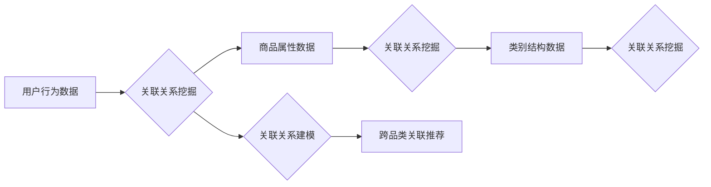

                 

## AI在电商搜索中的跨品类关联推荐

> 关键词：跨品类关联推荐、电商搜索、人工智能、协同过滤、深度学习、推荐系统

## 1. 背景介绍

在当今以电商为主导的消费时代，搜索引擎已成为用户获取商品信息和完成购买的主要途径。然而，传统的电商搜索引擎往往局限于单品类搜索，无法有效挖掘用户潜在需求，从而导致用户体验下降和转化率降低。跨品类关联推荐技术应运而生，旨在通过分析用户行为和商品属性，挖掘不同品类之间的关联关系，为用户推荐跨品类相关的商品，从而提升用户购物体验和商家销售额。

随着人工智能技术的快速发展，跨品类关联推荐技术也取得了长足进步。深度学习算法的应用使得推荐系统能够更准确地理解用户需求和商品特征，从而提供更精准、更个性化的推荐结果。

## 2. 核心概念与联系

跨品类关联推荐的核心概念是挖掘不同品类之间潜在的关联关系。这些关联关系可以是基于用户行为、商品属性、商品类别结构等多种因素。

**2.1 用户行为关联**

用户在浏览商品时，往往会同时关注多个品类，例如购买手机的用户也可能同时购买手机壳、耳机等配件。通过分析用户历史购买记录、浏览记录、收藏记录等行为数据，可以挖掘出不同品类之间的用户行为关联。

**2.2 商品属性关联**

不同品类商品之间可能存在一些共同的属性，例如颜色、材质、尺寸等。通过分析商品属性信息，可以挖掘出基于属性的跨品类关联关系。

**2.3 类别结构关联**

商品类别结构可以反映出不同品类之间的层次关系和关联性。例如，手机和手机配件属于同一类别，但手机配件又可以细分为多个子类别，例如耳机、充电器、保护壳等。通过分析类别结构，可以挖掘出基于类别结构的跨品类关联关系。

**2.4 关联关系建模**

跨品类关联关系可以采用多种方式进行建模，例如：

* **图模型:** 将商品和用户表示为节点，将关联关系表示为边，构建一个商品-用户关联图。
* **矩阵模型:** 将商品和用户表示为矩阵的行和列，将关联关系表示为矩阵元素，构建一个商品-用户关联矩阵。

**Mermaid 流程图**



## 3. 核心算法原理 & 具体操作步骤

### 3.1 算法原理概述

跨品类关联推荐算法的核心是基于用户行为和商品属性的协同过滤技术。协同过滤算法通过分析用户对不同商品的评分或购买行为，预测用户对其他商品的兴趣。

### 3.2 算法步骤详解

1. **数据预处理:** 收集用户行为数据、商品属性数据和类别结构数据，并进行清洗、转换和特征提取。
2. **用户-商品矩阵构建:** 将用户和商品表示为矩阵的行和列，将用户对商品的评分或购买行为表示为矩阵元素。
3. **相似性计算:** 计算用户之间的相似度和商品之间的相似度。常用的相似性度量方法包括余弦相似度、皮尔逊相关系数等。
4. **推荐生成:** 基于用户相似度和商品相似度，为用户推荐跨品类相关的商品。

### 3.3 算法优缺点

**优点:**

* 能够挖掘用户潜在需求，推荐个性化商品。
* 不需要人工标注数据，算法能够自动学习用户偏好。
* 能够处理高维数据，适用于大规模电商平台。

**缺点:**

* 数据稀疏性问题，当用户对商品评分或购买行为较少时，算法难以准确预测用户兴趣。
* 冷启动问题，对于新用户和新商品，算法难以进行推荐。
* 算法复杂度较高，需要较高的计算资源。

### 3.4 算法应用领域

协同过滤算法广泛应用于电商搜索、推荐系统、电影推荐、音乐推荐等领域。

## 4. 数学模型和公式 & 详细讲解 & 举例说明

### 4.1 数学模型构建

协同过滤算法的核心是基于用户-商品交互矩阵的相似性计算。假设用户集合为U，商品集合为I，则用户-商品交互矩阵为R，其中R(u,i)表示用户u对商品i的评分或购买行为。

### 4.2 公式推导过程

**用户相似度计算:**

常用的用户相似度度量方法是余弦相似度，公式如下：

$$
\text{Sim}(u_1, u_2) = \frac{\sum_{i \in I} R(u_1, i) \cdot R(u_2, i)}{\sqrt{\sum_{i \in I} R(u_1, i)^2} \cdot \sqrt{\sum_{i \in I} R(u_2, i)^2}}
$$

其中，Sim(u1, u2)表示用户u1和u2之间的相似度。

**商品相似度计算:**

商品相似度计算方法与用户相似度计算类似，公式如下：

$$
\text{Sim}(i_1, i_2) = \frac{\sum_{u \in U} R(u, i_1) \cdot R(u, i_2)}{\sqrt{\sum_{u \in U} R(u, i_1)^2} \cdot \sqrt{\sum_{u \in U} R(u, i_2)^2}}
$$

其中，Sim(i1, i2)表示商品i1和i2之间的相似度。

### 4.3 案例分析与讲解

假设有一个电商平台，用户集合为U = {u1, u2, u3}, 商品集合为I = {i1, i2, i3}, 用户-商品交互矩阵为：

```
R = [
    [5, 4, 3],
    [3, 5, 2],
    [2, 3, 5]
]
```

其中，R(u1, i1)表示用户u1对商品i1的评分为5。

我们可以计算用户u1和u2之间的相似度：

$$
\text{Sim}(u_1, u_2) = \frac{5 \cdot 3 + 4 \cdot 5 + 3 \cdot 2}{\sqrt{5^2 + 4^2 + 3^2} \cdot \sqrt{3^2 + 5^2 + 2^2}} = 0.8
$$

结果表明，用户u1和u2之间的相似度为0.8，说明他们对商品的偏好有一定的相似性。

## 5. 项目实践：代码实例和详细解释说明

### 5.1 开发环境搭建

* Python 3.x
* scikit-learn
* pandas
* numpy

### 5.2 源代码详细实现

```python
import pandas as pd
from sklearn.metrics.pairwise import cosine_similarity

# 加载用户-商品交互数据
data = pd.read_csv('user_item_data.csv')

# 构建用户-商品矩阵
user_item_matrix = data.pivot_table(index='user_id', columns='item_id', values='rating')

# 计算用户相似度
user_similarity = cosine_similarity(user_item_matrix)

# 计算商品相似度
item_similarity = cosine_similarity(user_item_matrix.T)

# 根据用户相似度推荐商品
def recommend_items(user_id, top_n=5):
    # 获取用户相似用户
    similar_users = user_similarity[user_id].argsort()[:-top_n-1:-1]

    # 获取相似用户喜欢的商品
    recommended_items = []
    for similar_user in similar_users:
        # 获取相似用户喜欢的商品
        similar_user_items = user_item_matrix.loc[similar_user].index[user_item_matrix.loc[similar_user] > 0]
        # 添加到推荐列表
        recommended_items.extend(similar_user_items)

    # 去除重复商品
    recommended_items = list(set(recommended_items))

    # 返回推荐商品
    return recommended_items

# 获取用户id
user_id = 1

# 推荐商品
recommended_items = recommend_items(user_id)

# 打印推荐结果
print(f'推荐给用户 {user_id} 的商品：{recommended_items}')
```

### 5.3 代码解读与分析

* 代码首先加载用户-商品交互数据，并构建用户-商品矩阵。
* 然后，使用余弦相似度计算用户相似度和商品相似度。
* 基于用户相似度，实现推荐商品的函数`recommend_items`。
* 最后，根据用户id获取推荐商品并打印结果。

### 5.4 运行结果展示

运行代码后，将输出用户1的推荐商品列表。

## 6. 实际应用场景

跨品类关联推荐技术在电商搜索中具有广泛的应用场景，例如：

* **商品推荐:** 为用户推荐跨品类相关的商品，例如，用户购买手机后，推荐手机壳、耳机、充电器等配件。
* **搜索结果增强:** 在用户搜索商品时，将跨品类相关的商品添加到搜索结果中，丰富用户搜索体验。
* **个性化营销:** 根据用户的购买历史和浏览记录，推荐跨品类相关的促销活动和优惠信息。

### 6.4 未来应用展望

随着人工智能技术的不断发展，跨品类关联推荐技术将更加智能化、个性化和精准化。未来，跨品类关联推荐技术可能应用于以下领域：

* **跨平台推荐:** 将用户行为数据整合到多个平台，实现跨平台的跨品类关联推荐。
* **场景化推荐:** 根据用户的场景需求，推荐跨品类相关的商品，例如，用户在旅行前，推荐旅行相关的商品。
* **多模态推荐:** 将文本、图像、视频等多模态数据融合到推荐系统中，实现更加丰富的跨品类关联推荐。

## 7. 工具和资源推荐

### 7.1 学习资源推荐

* **书籍:**
    * 《推荐系统实践》
    * 《深度学习》
* **在线课程:**
    * Coursera: Recommender Systems
    * Udacity: Deep Learning Nanodegree

### 7.2 开发工具推荐

* **Python:** 
    * scikit-learn
    * pandas
    * numpy
* **Spark:** 
    * MLlib

### 7.3 相关论文推荐

* **Collaborative Filtering for Implicit Feedback Datasets**
* **Deep Learning for Recommender Systems**

## 8. 总结：未来发展趋势与挑战

### 8.1 研究成果总结

跨品类关联推荐技术在电商搜索中取得了显著的成果，能够有效提升用户购物体验和商家销售额。

### 8.2 未来发展趋势

未来，跨品类关联推荐技术将朝着更加智能化、个性化和精准化的方向发展。

### 8.3 面临的挑战

跨品类关联推荐技术也面临着一些挑战，例如：

* 数据稀疏性问题
* 冷启动问题
* 计算复杂度问题

### 8.4 研究展望

未来研究将重点关注解决上述挑战，并探索新的跨品类关联推荐算法和技术。

## 9. 附录：常见问题与解答

* **Q1: 跨品类关联推荐技术与传统的商品推荐技术有什么区别？**

**A1:** 传统的商品推荐技术主要基于用户历史购买记录或浏览记录，而跨品类关联推荐技术则能够挖掘不同品类之间的关联关系，推荐跨品类相关的商品，从而更加丰富用户购物体验。

* **Q2: 如何解决跨品类关联推荐技术中的数据稀疏性问题？**

**A2:** 可以采用多种方法解决数据稀疏性问题，例如：

* 使用协同过滤算法的改进版本，例如矩阵分解
* 使用深度学习算法，例如神经网络
* 使用其他数据源，例如商品属性数据、类别结构数据

* **Q3: 如何评估跨品类关联推荐技术的性能？**

**A3:** 可以使用多种指标评估跨品类关联推荐技术的性能，例如：

* 点击率
* 购买率
* 用户满意度


作者：禅与计算机程序设计艺术 / Zen and the Art of Computer Programming 
<end_of_turn>

