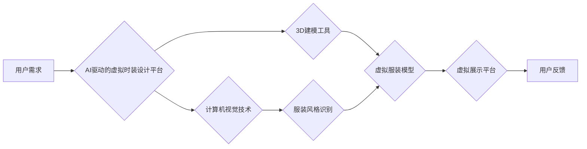

                 

## AI在虚拟时装设计中的应用：减少实体样品

> 关键词：人工智能、虚拟时装、3D设计、深度学习、计算机视觉、可持续时尚、实体样品

## 1. 背景介绍

时尚产业是一个充满创意和激情的领域，但同时也面临着诸多挑战，其中之一就是对环境的巨大影响。传统的服装设计流程依赖于大量实体样品，这导致了资源浪费、能源消耗和碳排放的增加。随着人工智能（AI）技术的快速发展，虚拟时装设计逐渐成为一种可持续的解决方案，它利用AI算法和3D建模技术，在虚拟空间中创建和展示服装设计，从而减少实体样品的生产和使用。

## 2. 核心概念与联系

虚拟时装设计的核心概念是将服装设计流程数字化，利用计算机技术模拟和呈现服装的形态、材质和细节。

**2.1 核心概念**

* **虚拟时装:** 在虚拟空间中创建和展示的服装，可以是数字化的服装模型，也可以是虚拟现实（VR）或增强现实（AR）环境中的服装体验。
* **3D建模:** 利用计算机软件创建三维服装模型，可以精确地模拟服装的形状、结构和细节。
* **人工智能 (AI):** 利用机器学习、深度学习等算法，帮助虚拟时装设计完成自动生成、个性化定制、风格识别等任务。
* **计算机视觉:** 利用图像识别、物体检测等技术，从现实世界中获取服装信息，并将其转化为虚拟服装模型。

**2.2 架构图**



## 3. 核心算法原理 & 具体操作步骤

**3.1 算法原理概述**

虚拟时装设计的核心算法主要包括：

* **3D服装建模算法:** 利用几何学、拓扑学等原理，构建服装的3D模型。常见的算法包括 NURBS 曲面建模、网格建模等。
* **风格识别算法:** 利用深度学习技术，从大量服装图像数据中学习服装风格特征，并将其应用于虚拟服装的设计。常见的算法包括卷积神经网络（CNN）、循环神经网络（RNN）等。
* **个性化定制算法:** 利用用户数据和AI算法，根据用户的体型、喜好、风格等信息，生成个性化的虚拟服装设计。

**3.2 算法步骤详解**

1. **数据收集:** 收集大量服装图像数据、3D服装模型数据、用户风格偏好数据等。
2. **数据预处理:** 对收集到的数据进行清洗、格式转换、特征提取等预处理工作。
3. **模型训练:** 利用深度学习算法，训练风格识别模型、个性化定制模型等。
4. **虚拟服装生成:** 根据用户需求和模型预测结果，生成虚拟服装模型。
5. **虚拟展示:** 利用VR/AR技术，在虚拟空间中展示虚拟服装。
6. **用户反馈:** 收集用户反馈，并将其用于模型优化和迭代。

**3.3 算法优缺点**

**优点:**

* **减少实体样品:** 虚拟时装设计可以大幅减少实体样品的生产，从而降低资源消耗和环境污染。
* **提高设计效率:** AI算法可以自动生成服装设计，并根据用户反馈进行优化，提高设计效率。
* **个性化定制:** AI算法可以根据用户数据生成个性化的服装设计，满足用户的独特需求。
* **降低成本:** 虚拟时装设计可以降低服装生产成本，并提高设计灵活性。

**缺点:**

* **技术门槛高:** 虚拟时装设计需要掌握3D建模、计算机视觉、AI等多方面的技术。
* **数据依赖:** AI算法需要大量的数据进行训练，数据质量直接影响算法性能。
* **缺乏真实感:** 虚拟服装的触感、 drape 等物理特性难以完全模拟。

**3.4 算法应用领域**

* **服装设计:** 虚拟时装设计可以帮助设计师快速生成服装设计方案，并进行虚拟试穿和展示。
* **服装零售:** 虚拟时装可以为消费者提供个性化定制服务，并减少退货率。
* **游戏和娱乐:** 虚拟时装可以为游戏角色和虚拟人物提供服装选择，并增强游戏体验。
* **虚拟世界:** 虚拟时装可以为虚拟世界中的用户提供服装和个性化表达。

## 4. 数学模型和公式 & 详细讲解 & 举例说明

**4.1 数学模型构建**

虚拟时装设计中常用的数学模型包括：

* **3D服装模型建模:** 利用 NURBS 曲面、B样条曲线等数学模型，构建服装的3D形状。
* **风格识别模型:** 利用深度学习中的卷积神经网络（CNN）构建风格识别模型，将服装图像映射到风格特征空间。
* **个性化定制模型:** 利用机器学习中的回归模型或分类模型，根据用户数据预测用户的服装偏好，并生成个性化的服装设计。

**4.2 公式推导过程**

* **NURBS 曲面建模:** NURBS 曲面可以用以下公式表示：

$$
P(u,v) = \sum_{i=0}^{n} N_i(u) \cdot W_i \cdot P_i
$$

其中：

* $P(u,v)$ 是曲面上的点
* $N_i(u)$ 是 B样条基函数
* $W_i$ 是权重
* $P_i$ 是控制点

* **CNN 风格识别:** CNN 使用卷积层、池化层、全连接层等结构，提取服装图像的特征。卷积层的核心操作是卷积运算，其公式如下：

$$
f(x,y) = \sum_{i=0}^{m} \sum_{j=0}^{n} w_{i,j} \cdot I(x+i,y+j)
$$

其中：

* $f(x,y)$ 是卷积层的输出
* $w_{i,j}$ 是卷积核的权重
* $I(x+i,y+j)$ 是输入图像的像素值

**4.3 案例分析与讲解**

* **案例:** 利用 CNN 模型识别服装风格，例如将衬衫、裤子、裙子等不同类型的服装分类。

* **讲解:** 训练 CNN 模型时，需要使用大量不同风格的服装图像数据。模型学习了服装图像的特征，例如颜色、纹理、形状等，并将其映射到风格特征空间。通过训练好的模型，可以对新的服装图像进行风格识别，例如判断一件衣服是衬衫还是裙子。

## 5. 项目实践：代码实例和详细解释说明

**5.1 开发环境搭建**

* **操作系统:** Windows/macOS/Linux
* **编程语言:** Python
* **深度学习框架:** TensorFlow/PyTorch
* **3D建模软件:** Blender/Maya

**5.2 源代码详细实现**

```python
# 使用 TensorFlow 构建风格识别模型

import tensorflow as tf

# 定义模型结构
model = tf.keras.models.Sequential([
    tf.keras.layers.Conv2D(32, (3, 3), activation='relu', input_shape=(224, 224, 3)),
    tf.keras.layers.MaxPooling2D((2, 2)),
    tf.keras.layers.Conv2D(64, (3, 3), activation='relu'),
    tf.keras.layers.MaxPooling2D((2, 2)),
    tf.keras.layers.Flatten(),
    tf.keras.layers.Dense(10, activation='softmax')
])

# 编译模型
model.compile(optimizer='adam',
              loss='sparse_categorical_crossentropy',
              metrics=['accuracy'])

# 训练模型
model.fit(train_images, train_labels, epochs=10)

# 预测风格
predictions = model.predict(test_images)
```

**5.3 代码解读与分析**

* **模型结构:** 代码定义了一个简单的 CNN 模型，包含卷积层、池化层和全连接层。
* **模型编译:** 模型使用 Adam 优化器、交叉熵损失函数和准确率指标进行编译。
* **模型训练:** 模型使用训练数据进行训练，训练 epochs 次。
* **模型预测:** 使用训练好的模型对测试数据进行预测，得到服装风格的预测结果。

**5.4 运行结果展示**

运行代码后，可以得到模型的训练精度和测试精度，以及对测试图像的风格预测结果。

## 6. 实际应用场景

**6.1 服装设计**

* **快速原型设计:** 设计师可以使用虚拟时装设计平台快速生成服装设计方案，并进行虚拟试穿和展示，节省时间和成本。
* **风格探索:** 设计师可以利用 AI 算法探索不同的服装风格，并根据用户反馈进行优化，提高设计创意和灵活性。
* **个性化定制:** 设计师可以根据用户的体型、喜好、风格等信息，生成个性化的服装设计，满足用户的独特需求。

**6.2 服装零售**

* **虚拟试衣间:** 消费者可以在网上使用虚拟试衣间，尝试不同的服装款式和搭配，提高购物体验。
* **个性化推荐:** 虚拟时装设计平台可以根据用户的购买历史和浏览记录，推荐个性化的服装款式，提高销售转化率。
* **减少退货率:** 虚拟试衣间可以帮助消费者更准确地选择服装尺寸和款式，减少退货率。

**6.3 游戏和娱乐**

* **虚拟角色服装:** 游戏开发商可以使用虚拟时装设计平台为游戏角色提供丰富的服装选择，增强游戏体验。
* **虚拟服装交易:** 游戏玩家可以购买、交易虚拟服装，创造新的游戏经济模式。
* **虚拟演唱会服装:** 歌手可以使用虚拟时装设计平台为虚拟演唱会设计独特的服装，增强舞台效果。

**6.4 未来应用展望**

* **更逼真的虚拟服装:** 未来虚拟服装的设计将更加逼真，能够模拟服装的触感、 drape 等物理特性。
* **更智能的个性化定制:** AI 算法将更加智能，能够更好地理解用户的需求，并生成更个性化的服装设计。
* **虚拟服装与现实世界融合:** 虚拟服装将与现实世界更加融合，例如通过 AR 技术，将虚拟服装叠加到现实世界中。

## 7. 工具和资源推荐

**7.1 学习资源推荐**

* **书籍:**
    * 《深度学习》 by Ian Goodfellow, Yoshua Bengio, Aaron Courville
    * 《计算机视觉:算法与应用》 by Richard Szeliski
* **在线课程:**
    * Coursera: 深度学习 Specialization
    * Udacity: 计算机视觉 Nanodegree
* **开源项目:**
    * TensorFlow: https://www.tensorflow.org/
    * PyTorch: https://pytorch.org/

**7.2 开发工具推荐**

* **3D建模软件:** Blender, Maya, 3ds Max
* **虚拟现实平台:** Unity, Unreal Engine
* **人工智能平台:** Google Cloud AI Platform, Amazon SageMaker

**7.3 相关论文推荐**

* **Generative Adversarial Networks for Image Synthesis** by Ian Goodfellow et al.
* **Deep Learning for Computer Vision** by Yann LeCun et al.
* **Style Transfer Using Convolutional Neural Networks** by Leon A. Gatys et al.

## 8. 总结：未来发展趋势与挑战

**8.1 研究成果总结**

虚拟时装设计领域取得了显著的进展，AI算法和3D建模技术不断发展，使得虚拟服装的设计更加逼真、个性化。虚拟时装设计平台也逐渐成熟，为设计师和消费者提供了便捷的工具和服务。

**8.2 未来发展趋势**

* **更逼真的虚拟服装:** 未来虚拟服装的设计将更加逼真，能够模拟服装的触感、 drape 等物理特性。
* **更智能的个性化定制:** AI 算法将更加智能，能够更好地理解用户的需求，并生成更个性化的服装设计。
* **虚拟服装与现实世界融合:** 虚拟服装将与现实世界更加融合，例如通过 AR 技术，将虚拟服装叠加到现实世界中。

**8.3 面临的挑战**

* **技术门槛高:** 虚拟时装设计需要掌握3D建模、计算机视觉、AI等多方面的技术，技术门槛较高。
* **数据依赖:** AI算法需要大量的数据进行训练，数据质量直接影响算法性能。
* **缺乏真实感:** 虚拟服装的触感、 drape 等物理特性难以完全模拟。

**8.4 研究展望**

未来虚拟时装设计领域的研究将集中在以下几个方面:

* **提高虚拟服装的真实感:** 研究更先进的物理模拟技术，使虚拟服装更加逼真。
* **开发更智能的 AI 算法:** 研究更强大的 AI 算法，能够更好地理解用户的需求，并生成更个性化的服装设计。
* **探索虚拟服装与现实世界的融合:** 研究将虚拟服装与现实世界融合的新技术，例如 AR/VR 技术。


## 9. 附录：常见问题与解答

**9.1 如何学习虚拟时装设计？**

* 学习 3D 建模软件，例如 Blender 或 Maya。
* 学习 计算机视觉和深度学习基础知识。
* 关注虚拟时装设计领域的最新研究和发展趋势。
* 参加相关的线上或线下课程和培训。

**9.2 虚拟时装设计平台有哪些？**

* CLO3D
* Browzwear
* Optitex
* Marvelous Designer

**9.3 虚拟时装设计有哪些应用场景？**

* 服装设计
* 服装零售
* 游戏和娱乐
* 虚拟世界

**9.4 虚拟时装设计对环境有什么益处？**

* 减少实体样品的生产，降低资源消耗和碳排放。
* 提高服装设计效率，减少浪费。

**9.5 虚拟时装设计未来发展趋势是什么？**

* 更逼真的虚拟服装
* 更智能的个性化定制
* 虚拟服装与现实世界融合


作者：禅与计算机程序设计艺术 / Zen and the Art of Computer Programming<end_of_turn>

