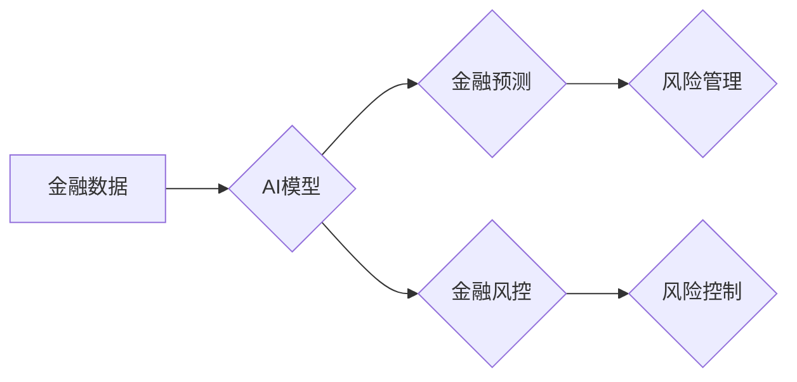

                 

## AI在金融领域的应用：预测与风控

> 关键词：人工智能、金融科技、预测模型、风控模型、机器学习、深度学习、数据分析、风险管理

## 1. 背景介绍

金融行业一直以来都依赖于数据驱动决策，而随着数据量的爆炸式增长和人工智能技术的快速发展，金融科技（FinTech）领域迎来了前所未有的机遇。人工智能（AI）凭借其强大的数据分析、模式识别和预测能力，正在深刻地改变金融行业的运作方式，尤其是在预测和风控领域展现出巨大的潜力。

传统的金融风险管理主要依赖于经验法则和统计模型，但这些方法往往难以捕捉到复杂金融市场的动态变化和非线性关系。而AI技术能够通过学习海量历史数据，识别出隐藏的模式和趋势，从而构建更精准、更有效的预测和风控模型。

## 2. 核心概念与联系

### 2.1  金融预测

金融预测是指利用历史数据和统计模型，预测未来金融市场趋势、资产价格、投资回报率等。AI技术在金融预测领域应用广泛，例如：

* **股票价格预测:** 利用机器学习算法分析股票历史价格、交易量、新闻事件等数据，预测未来股票价格走势。
* **信用风险评估:** 通过分析客户的财务状况、信用历史、行为模式等数据，评估客户的信用风险，帮助金融机构做出贷款决策。
* **欺诈检测:** 利用机器学习算法识别异常交易行为，及时发现和阻止金融欺诈。

### 2.2  金融风控

金融风控是指金融机构为了规避风险，采取的各种措施和策略。AI技术在金融风控领域应用也日益广泛，例如：

* **风险识别:** 利用机器学习算法分析海量数据，识别潜在的风险因素，例如客户信用风险、市场风险、操作风险等。
* **风险评估:** 利用统计模型和机器学习算法，量化风险，评估风险的程度和可能性。
* **风险控制:** 根据风险评估结果，制定相应的风险控制措施，例如调整贷款利率、限制交易额度、加强客户审查等。

**核心概念与联系流程图:**



## 3. 核心算法原理 & 具体操作步骤

### 3.1  算法原理概述

在金融预测和风控领域，常用的AI算法包括：

* **线性回归:** 用于预测连续变量，例如股票价格、贷款利率等。
* **逻辑回归:** 用于预测分类变量，例如客户是否会违约、交易是否为欺诈等。
* **支持向量机 (SVM):** 用于分类和回归问题，能够处理高维数据。
* **决策树:** 用于分类和回归问题，易于理解和解释。
* **随机森林:** 结合多个决策树，提高预测精度。
* **神经网络:** 能够学习复杂非线性关系，适用于更复杂的预测和风控任务。

### 3.2  算法步骤详解

以线性回归为例，其具体操作步骤如下：

1. **数据收集和预处理:** 收集相关金融数据，并进行清洗、转换、特征工程等预处理操作。
2. **模型训练:** 使用训练数据训练线性回归模型，学习数据之间的线性关系。
3. **模型评估:** 使用测试数据评估模型的预测精度，例如使用均方误差 (MSE) 或 R-squared 等指标。
4. **模型调参:** 根据评估结果，调整模型参数，例如学习率、正则化系数等，提高模型性能。
5. **模型部署:** 将训练好的模型部署到生产环境中，用于预测和风控决策。

### 3.3  算法优缺点

不同的AI算法具有不同的优缺点，需要根据具体应用场景选择合适的算法。例如：

* **线性回归:** 优点是简单易懂、计算效率高；缺点是只能处理线性关系，对非线性关系的捕捉能力较弱。
* **支持向量机:** 优点是能够处理高维数据、对噪声数据鲁棒性强；缺点是训练时间较长，参数选择较复杂。
* **神经网络:** 优点是能够学习复杂非线性关系，预测精度高；缺点是训练时间长、参数众多、解释性较差。

### 3.4  算法应用领域

AI算法在金融领域的应用非常广泛，例如：

* **股票预测:** 利用机器学习算法分析股票历史价格、交易量、新闻事件等数据，预测未来股票价格走势。
* **信用风险评估:** 通过分析客户的财务状况、信用历史、行为模式等数据，评估客户的信用风险，帮助金融机构做出贷款决策。
* **欺诈检测:** 利用机器学习算法识别异常交易行为，及时发现和阻止金融欺诈。
* **客户关系管理 (CRM):** 利用机器学习算法分析客户行为数据，个性化推荐产品和服务，提高客户满意度。
* **投资组合管理:** 利用机器学习算法优化投资组合，提高投资回报率。

## 4. 数学模型和公式 & 详细讲解 & 举例说明

### 4.1  数学模型构建

在金融预测和风控领域，常用的数学模型包括线性回归模型、逻辑回归模型、支持向量机模型等。

**线性回归模型:**

假设我们想要预测变量y与自变量x之间的关系，线性回归模型假设这种关系可以用一条直线来表示。

$$y = \beta_0 + \beta_1x + \epsilon$$

其中：

* $y$ 是预测变量
* $x$ 是自变量
* $\beta_0$ 是截距
* $\beta_1$ 是斜率
* $\epsilon$ 是误差项

**逻辑回归模型:**

逻辑回归模型用于预测分类变量，例如客户是否会违约。它将线性回归模型的输出映射到0到1之间的概率值，表示事件发生的可能性。

$$P(y=1) = \frac{1}{1 + e^{-( \beta_0 + \beta_1x )}}$$

其中：

* $P(y=1)$ 是事件发生的概率
* $x$ 是自变量
* $\beta_0$ 和 $\beta_1$ 是模型参数

### 4.2  公式推导过程

线性回归模型的参数 $\beta_0$ 和 $\beta_1$ 可以通过最小二乘法来估计。最小二乘法试图找到一条直线，使得预测值与实际值之间的误差平方和最小。

逻辑回归模型的参数 $\beta_0$ 和 $\beta_1$ 可以通过最大似然估计来估计。最大似然估计试图找到参数值，使得模型生成的样本分布与实际样本分布最接近。

### 4.3  案例分析与讲解

**案例:** 假设我们想要预测客户是否会违约。我们可以收集客户的财务数据，例如收入、负债、信用评分等，并使用逻辑回归模型进行训练。

训练完成后，我们可以将模型应用于新的客户数据，预测他们是否会违约。例如，如果模型预测客户违约概率为0.8，则意味着该客户有80%的可能性会违约。

## 5. 项目实践：代码实例和详细解释说明

### 5.1  开发环境搭建

为了实现金融预测和风控项目，我们需要搭建一个合适的开发环境。常用的开发环境包括：

* **Python:** Python 是一个流行的编程语言，拥有丰富的机器学习库，例如 scikit-learn、TensorFlow、PyTorch 等。
* **Jupyter Notebook:** Jupyter Notebook 是一个交互式编程环境，方便进行数据分析和模型开发。
* **云计算平台:** 云计算平台，例如 AWS、Azure、GCP 等，可以提供强大的计算资源和存储空间，支持大规模数据处理和模型训练。

### 5.2  源代码详细实现

以下是一个使用 Python 和 scikit-learn 库实现线性回归模型的简单代码示例：

```python
from sklearn.linear_model import LinearRegression
from sklearn.model_selection import train_test_split
from sklearn.metrics import mean_squared_error

# 加载数据
data = ...

# 将数据分为训练集和测试集
X_train, X_test, y_train, y_test = train_test_split(data.drop('target', axis=1), data['target'], test_size=0.2)

# 创建线性回归模型
model = LinearRegression()

# 训练模型
model.fit(X_train, y_train)

# 预测测试集数据
y_pred = model.predict(X_test)

# 计算模型精度
mse = mean_squared_error(y_test, y_pred)
print(f'Mean Squared Error: {mse}')
```

### 5.3  代码解读与分析

这段代码首先加载数据，然后将数据分为训练集和测试集。接着，创建了一个线性回归模型，并使用训练集数据训练模型。最后，使用测试集数据预测目标变量的值，并计算模型的精度。

### 5.4  运行结果展示

运行这段代码后，会输出模型的精度指标，例如均方误差 (MSE)。

## 6. 实际应用场景

### 6.1  股票预测

AI技术可以帮助投资者预测股票价格走势，从而做出更明智的投资决策。例如，一些金融机构使用机器学习算法分析股票历史价格、交易量、新闻事件等数据，构建股票预测模型，为投资者提供投资建议。

### 6.2  信用风险评估

金融机构需要评估客户的信用风险，以便做出贷款决策。AI技术可以帮助金融机构更准确地评估客户的信用风险。例如，一些金融机构使用机器学习算法分析客户的财务状况、信用历史、行为模式等数据，构建信用风险评估模型，为贷款申请者提供信用评分。

### 6.3  欺诈检测

金融欺诈是金融行业面临的一大挑战。AI技术可以帮助金融机构识别和阻止金融欺诈。例如，一些金融机构使用机器学习算法分析交易数据，识别异常交易行为，及时发现和阻止金融欺诈。

### 6.4  未来应用展望

随着人工智能技术的不断发展，AI在金融领域的应用将更加广泛和深入。例如：

* **个性化金融服务:** AI可以根据客户的个人需求和行为模式，提供个性化的金融服务，例如推荐合适的投资产品、提供定制化的理财建议等。
* **自动交易:** AI可以自动执行交易，例如根据市场趋势自动买卖股票、债券等金融资产。
* **智能客服:** AI可以提供智能客服，例如通过聊天机器人回答客户的金融咨询问题。

## 7. 工具和资源推荐

### 7.1  学习资源推荐

* **在线课程:** Coursera、edX、Udacity 等平台提供丰富的机器学习和深度学习课程。
* **书籍:** 《Python机器学习》、《深度学习》等书籍是学习AI技术的经典教材。
* **博客和论坛:** Kaggle、Towards Data Science 等网站提供大量的AI技术博客文章和论坛讨论。

### 7.2  开发工具推荐

* **Python:** Python 是一个流行的编程语言，拥有丰富的机器学习库，例如 scikit-learn、TensorFlow、PyTorch 等。
* **Jupyter Notebook:** Jupyter Notebook 是一个交互式编程环境，方便进行数据分析和模型开发。
* **云计算平台:** 云计算平台，例如 AWS、Azure、GCP 等，可以提供强大的计算资源和存储空间，支持大规模数据处理和模型训练。

### 7.3  相关论文推荐

* **《机器学习》:** Tom Mitchell 著
* **《深度学习》:** Ian Goodfellow、Yoshua Bengio 和 Aaron Courville 著

## 8. 总结：未来发展趋势与挑战

### 8.1  研究成果总结

AI技术在金融领域的应用取得了显著的成果，例如提高了预测精度、降低了风险，提升了客户体验。

### 8.2  未来发展趋势

未来，AI在金融领域的应用将更加广泛和深入，例如：

* **更精准的预测模型:** 随着数据量的增加和算法的改进，金融预测模型将更加精准。
* **更智能的风险管理:** AI将帮助金融机构更智能地识别和管理风险。
* **更个性化的金融服务:** AI将帮助金融机构提供更个性化的金融服务。

### 8.3  面临的挑战

AI技术在金融领域的应用也面临一些挑战，例如：

* **数据质量:** AI模型的性能依赖于数据质量，金融数据往往存在噪声、缺失值等问题。
* **算法解释性:** 一些AI算法的决策过程难以解释，这可能会导致金融机构难以信任AI模型的决策结果。
* **监管合规:** AI技术的应用需要遵守相关的监管合规要求。

### 8.4  研究展望

未来，需要进一步研究以下问题：

* 如何提高AI模型的鲁棒性和解释性。
* 如何解决金融数据质量问题。
* 如何确保AI技术的应用符合监管合规要求。


## 9. 附录：常见问题与解答

**Q1: AI技术是否会取代金融工作者？**

A1: AI技术可以自动化一些金融工作，但不会完全取代金融工作者。AI技术需要人类的指导和监督，并且人类在金融领域仍然扮演着重要的角色，例如制定策略、分析风险、提供客户服务等。

**Q2: 如何学习AI技术？**

A2: 可以通过在线课程、书籍、博客和论坛等方式学习AI技术。

**Q3: 如何选择合适的AI算法？**

A3: 选择合适的AI算法需要根据具体应用场景和数据特点来决定。

**作者：禅与计算机程序设计艺术 / Zen and the Art of Computer Programming**<end_of_turn>

