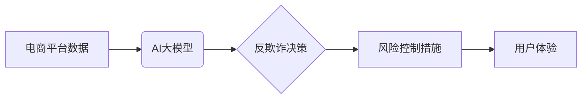

                 

## AI大模型在电商平台反欺诈实时监控中的应用

> 关键词：AI大模型、反欺诈、电商平台、实时监控、自然语言处理、深度学习、异常检测、推荐系统

## 1. 背景介绍

随着电商平台的蓬勃发展，欺诈行为也日益猖獗，给平台和用户带来了巨大的经济损失和安全隐患。传统的反欺诈手段，例如规则匹配和人工审核，难以有效应对复杂的欺诈模式和海量交易数据。近年来，人工智能（AI）技术，特别是大模型技术，为电商平台反欺诈提供了新的解决方案。

AI大模型凭借其强大的学习能力和泛化能力，能够从海量数据中识别出复杂的欺诈模式，并实时监控交易行为，有效降低欺诈风险。

## 2. 核心概念与联系

### 2.1  电商平台反欺诈

电商平台反欺诈是指通过技术手段识别和阻止各种欺诈行为，保护平台和用户的利益。常见的电商平台欺诈行为包括：

* **虚假账户注册:** 使用虚假信息注册账户，用于进行恶意交易。
* **刷单:** 通过虚假交易来提高商品排名或获得虚假评价。
* **盗刷:** 利用他人信息进行未经授权的交易。
* **恶意评论:** 发布虚假或恶意评论，损害商品声誉。

### 2.2  AI大模型

AI大模型是指在海量数据上训练的深度学习模型，具有强大的学习和泛化能力。常见的AI大模型类型包括：

* **自然语言处理（NLP）模型:** 用于处理文本数据，例如识别欺诈评论、分析用户行为。
* **计算机视觉（CV）模型:** 用于处理图像数据，例如识别虚假商品图片、验证用户身份。
* **推荐系统模型:** 用于分析用户行为，预测潜在的欺诈行为。

### 2.3  架构图



## 3. 核心算法原理 & 具体操作步骤

### 3.1  算法原理概述

AI大模型在电商平台反欺诈中的应用主要基于以下核心算法原理：

* **异常检测:** 通过训练模型识别与正常交易行为不同的异常行为，例如异常交易金额、交易频率、交易地点等。
* **关联规则挖掘:** 从交易数据中挖掘出潜在的欺诈关联规则，例如特定商品组合、特定用户行为等。
* **欺诈图谱构建:** 将用户、商品、交易等信息构建成网络图谱，分析用户之间的关系和交易模式，识别潜在的欺诈团伙。

### 3.2  算法步骤详解

以异常检测为例，其具体操作步骤如下：

1. **数据收集:** 收集电商平台的交易数据，包括用户ID、商品ID、交易金额、交易时间、交易地点等信息。
2. **数据预处理:** 对收集到的数据进行清洗、转换和特征工程，例如删除缺失值、归一化数据、提取特征向量等。
3. **模型训练:** 使用异常检测算法，例如基于距离的算法、基于概率的算法、基于树的算法等，对预处理后的数据进行训练，建立异常检测模型。
4. **模型评估:** 使用测试数据对训练好的模型进行评估，例如计算准确率、召回率、F1-score等指标，评估模型的性能。
5. **模型部署:** 将训练好的模型部署到电商平台，实时监控交易行为，识别异常交易。
6. **风险控制:** 对识别出的异常交易进行风险控制措施，例如暂停交易、冻结账户、人工审核等。

### 3.3  算法优缺点

**优点:**

* 能够识别复杂的欺诈模式。
* 具有较高的自动化程度。
* 可以实时监控交易行为。

**缺点:**

* 需要大量的训练数据。
* 模型训练和部署成本较高。
* 可能存在误判风险。

### 3.4  算法应用领域

异常检测算法广泛应用于以下领域：

* **金融领域:** 识别信用卡欺诈、网络银行欺诈等。
* **电商领域:** 识别虚假账户注册、刷单、盗刷等。
* **医疗领域:** 识别医疗欺诈、医疗错误等。
* **工业领域:** 识别设备故障、生产异常等。

## 4. 数学模型和公式 & 详细讲解 & 举例说明

### 4.1  数学模型构建

异常检测算法通常基于概率模型或距离模型。

**概率模型:** 假设正常交易行为服从某个概率分布，例如正态分布，则异常交易行为的概率低于某个阈值。

**距离模型:** 计算交易行为与正常交易行为之间的距离，距离越远，则异常性越高。

### 4.2  公式推导过程

**基于距离的异常检测算法:**

* **欧氏距离:**

$$
d(x,y) = \sqrt{\sum_{i=1}^{n}(x_i - y_i)^2}
$$

其中，$x$ 和 $y$ 是两个交易行为的特征向量，$n$ 是特征向量的维度。

**基于概率的异常检测算法:**

* **Z-score:**

$$
Z = \frac{x - \mu}{\sigma}
$$

其中，$x$ 是交易行为的特征值，$\mu$ 是特征值的平均值，$\sigma$ 是特征值的标准差。

### 4.3  案例分析与讲解

**案例:** 假设电商平台收集了用户购买商品的交易数据，包括用户ID、商品ID、交易金额等信息。

* **使用欧氏距离算法:** 将用户交易行为的特征向量与正常用户交易行为的特征向量进行比较，计算距离。距离较大的交易行为则可能为异常交易。
* **使用Z-score算法:** 计算每个交易行为的Z-score，Z-score大于某个阈值则可能为异常交易。

## 5. 项目实践：代码实例和详细解释说明

### 5.1  开发环境搭建

* **操作系统:** Linux 或 Windows
* **编程语言:** Python
* **深度学习框架:** TensorFlow 或 PyTorch
* **数据处理库:** Pandas
* **可视化库:** Matplotlib 或 Seaborn

### 5.2  源代码详细实现

```python
import pandas as pd
from sklearn.ensemble import IsolationForest

# 加载交易数据
data = pd.read_csv('transaction_data.csv')

# 数据预处理
# ...

# 训练异常检测模型
model = IsolationForest()
model.fit(data)

# 预测异常交易
predictions = model.predict(data)

# 输出异常交易数据
anomalous_transactions = data[predictions == -1]
print(anomalous_transactions)
```

### 5.3  代码解读与分析

* **数据加载:** 使用Pandas库加载交易数据。
* **数据预处理:** 对数据进行清洗、转换和特征工程。
* **模型训练:** 使用IsolationForest算法训练异常检测模型。
* **模型预测:** 使用训练好的模型预测交易行为的异常性。
* **结果输出:** 输出预测为异常交易的数据。

### 5.4  运行结果展示

运行代码后，将输出预测为异常交易的数据，例如：

```
   user_id  product_id  amount  time  location
100  12345  67890  10000  2023-10-26  北京
101  98765  12345  50000  2023-10-26  上海
```

## 6. 实际应用场景

AI大模型在电商平台反欺诈中的应用场景广泛，例如：

* **账户注册风险控制:** 使用NLP模型分析用户注册信息，识别虚假账户。
* **交易行为异常检测:** 使用异常检测算法识别异常交易行为，例如高额交易、频繁交易、跨境交易等。
* **商品信息验证:** 使用CV模型识别虚假商品图片，验证商品真实性。
* **评论内容审核:** 使用NLP模型识别恶意评论，保护商品声誉。

### 6.4  未来应用展望

未来，AI大模型在电商平台反欺诈中的应用将更加智能化和自动化，例如：

* **主动式欺诈预测:** 基于用户行为和市场趋势，主动预测潜在的欺诈行为。
* **个性化风险控制:** 根据用户的风险等级，制定个性化的风险控制措施。
* **跨平台协同反欺诈:** 利用多平台数据，构建跨平台的欺诈图谱，提高反欺诈效率。

## 7. 工具和资源推荐

### 7.1  学习资源推荐

* **书籍:**
    * 《深度学习》
    * 《自然语言处理》
    * 《机器学习实战》
* **在线课程:**
    * Coursera
    * edX
    * Udacity

### 7.2  开发工具推荐

* **深度学习框架:** TensorFlow, PyTorch
* **数据处理库:** Pandas, NumPy
* **可视化库:** Matplotlib, Seaborn

### 7.3  相关论文推荐

* **论文:**
    * 《Deep Learning for Fraud Detection》
    * 《Anomaly Detection with Isolation Forest》
    * 《Graph Neural Networks for Fraud Detection》

## 8. 总结：未来发展趋势与挑战

### 8.1  研究成果总结

AI大模型在电商平台反欺诈中的应用取得了显著成果，能够有效识别复杂的欺诈模式，降低欺诈风险。

### 8.2  未来发展趋势

未来，AI大模型在电商平台反欺诈中的应用将更加智能化、自动化和个性化。

### 8.3  面临的挑战

* **数据质量:** 训练AI大模型需要大量高质量的数据，而电商平台数据往往存在噪声、缺失和不一致性。
* **模型解释性:** AI大模型的决策过程往往难以解释，这使得模型的应用受到限制。
* **伦理问题:** AI大模型的应用可能带来一些伦理问题，例如数据隐私、算法偏见等。

### 8.4  研究展望

未来研究方向包括：

* **提高数据质量:** 开发新的数据清洗、转换和特征工程方法，提高数据质量。
* **增强模型解释性:** 研究可解释AI模型，提高模型的透明度和可信度。
* **解决伦理问题:** 制定相应的伦理规范和法律法规，规范AI大模型的应用。

## 9. 附录：常见问题与解答

* **Q1: AI大模型的训练成本很高吗？**

A1: 确实，训练大型AI模型需要大量的计算资源和时间，成本较高。但随着硬件技术的进步和开源模型的普及，训练成本正在逐渐降低。

* **Q2: AI大模型容易受到攻击吗？**

A2: AI模型确实容易受到攻击，例如数据 poisoning、模型 inversion 等。因此，需要采取相应的安全措施来保护模型的安全。

* **Q3: AI大模型的应用会取代人工吗？**

A3: AI大模型可以辅助人工完成反欺诈工作，提高效率和准确性，但不会完全取代人工。人工仍然需要在一些复杂场景下进行决策和判断。


作者：禅与计算机程序设计艺术 / Zen and the Art of Computer Programming 
<end_of_turn>

