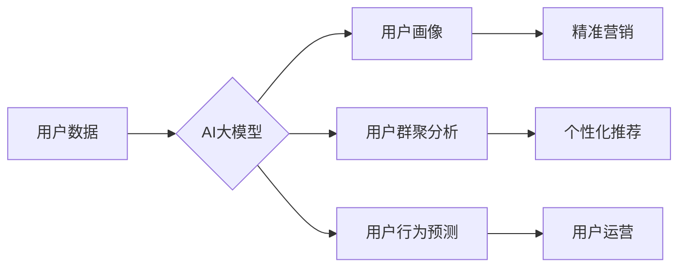

                 

## AI大模型在电商平台用户群体分析中的作用

> 关键词：AI大模型、用户群体分析、电商平台、自然语言处理、机器学习、推荐系统、个性化营销

## 1. 背景介绍

随着电商平台的蓬勃发展，用户群体规模不断扩大，用户行为日益复杂多样。传统的用户群体分析方法难以有效地挖掘用户需求、洞察用户画像，并为精准营销提供支持。而近年来，人工智能（AI）技术的快速发展，特别是大模型技术的突破，为电商平台用户群体分析提供了全新的思路和方法。

AI大模型，指的是拥有海量参数、强大的学习能力和泛化能力的深度学习模型。它们能够从海量数据中学习用户行为模式、兴趣偏好、消费习惯等，并进行精准的用户画像构建、用户群聚分析、用户行为预测等，为电商平台提供更精准、更有效的用户群体分析服务。

## 2. 核心概念与联系

### 2.1 用户群体分析

用户群体分析是指通过对用户数据进行收集、整理、分析，以揭示用户群体特征、行为模式、需求偏好等，从而为电商平台制定更精准的营销策略、产品开发策略和用户运营策略提供依据。

### 2.2 AI大模型

AI大模型是指参数规模庞大、训练数据海量、具备强大泛化能力的深度学习模型。它们能够通过学习海量数据，识别复杂模式，并进行预测、分类、生成等任务。

### 2.3 关系

AI大模型在电商平台用户群体分析中扮演着核心角色。通过对用户行为数据、商品数据、平台运营数据等进行分析，AI大模型能够构建用户画像、进行用户群聚分析、预测用户行为，为电商平台提供更精准的用户群体分析服务。

**Mermaid 流程图**



## 3. 核心算法原理 & 具体操作步骤

### 3.1 算法原理概述

AI大模型在用户群体分析中常用的算法包括：

* **自然语言处理（NLP）算法**: 用于分析用户文本数据，如评论、聊天记录等，提取用户意图、情感、兴趣等信息。
* **机器学习（ML）算法**: 用于从用户行为数据中学习用户行为模式，进行用户画像构建、用户群聚分析、用户行为预测等。常见的ML算法包括：
    * **聚类算法**: 将用户根据相似度进行分组，形成用户群体。
    * **分类算法**: 根据用户特征进行分类，例如用户类型、购买意愿等。
    * **回归算法**: 预测用户未来的行为，例如购买概率、消费金额等。
* **深度学习（DL）算法**: 用于构建更复杂的模型，例如循环神经网络（RNN）、长短期记忆网络（LSTM）等，能够更好地处理时间序列数据，例如用户浏览历史、购买记录等。

### 3.2 算法步骤详解

以用户画像构建为例，其具体操作步骤如下：

1. **数据收集**: 收集用户相关数据，包括用户基本信息、购买记录、浏览历史、评论反馈等。
2. **数据预处理**: 对收集到的数据进行清洗、转换、编码等预处理，使其适合模型训练。
3. **特征工程**: 从原始数据中提取用户特征，例如年龄、性别、职业、购买频率、平均消费金额等。
4. **模型选择**: 根据用户画像构建的目标，选择合适的机器学习算法，例如决策树、支持向量机、神经网络等。
5. **模型训练**: 使用训练数据训练模型，并通过评估指标，例如准确率、召回率等，评估模型性能。
6. **模型部署**: 将训练好的模型部署到线上环境，用于对新用户的画像构建。

### 3.3 算法优缺点

**优点**:

* **精准度高**: AI大模型能够从海量数据中学习用户行为模式，构建更精准的用户画像。
* **自动化程度高**: AI大模型能够自动完成用户画像构建、用户群聚分析等任务，提高效率。
* **可扩展性强**: AI大模型能够处理海量数据，并随着数据量的增加而不断提升性能。

**缺点**:

* **数据依赖性强**: AI大模型的性能取决于训练数据的质量和数量。
* **解释性差**: 一些AI大模型的决策过程难以解释，难以理解模型是如何得出结论的。
* **计算资源需求高**: 训练大型AI模型需要大量的计算资源。

### 3.4 算法应用领域

AI大模型在电商平台用户群体分析中的应用领域广泛，包括：

* **用户画像构建**: 构建用户画像，了解用户的基本信息、兴趣偏好、消费习惯等。
* **用户群聚分析**: 将用户根据相似度进行分组，形成用户群体，例如忠诚用户、潜在用户、高价值用户等。
* **用户行为预测**: 预测用户的未来行为，例如购买概率、消费金额等，为精准营销提供支持。
* **个性化推荐**: 根据用户的兴趣偏好和购买历史，推荐个性化的商品和服务。
* **用户运营**: 根据用户画像和行为分析，制定针对性的用户运营策略，例如会员权益、促销活动等。

## 4. 数学模型和公式 & 详细讲解 & 举例说明

### 4.1 数学模型构建

用户画像构建可以采用多种数学模型，例如：

* **K-means聚类算法**: 用于将用户根据相似度进行分组。其目标函数为：

$$
J = \sum_{i=1}^{k} \sum_{x \in C_i} ||x - \mu_i||^2
$$

其中：

* $k$ 为聚类数
* $C_i$ 为第 $i$ 个聚类
* $x$ 为用户
* $\mu_i$ 为第 $i$ 个聚类的中心点

* **决策树算法**: 用于根据用户特征进行分类。其构建过程基于信息增益或基尼系数等指标，选择最优特征进行划分。

### 4.2 公式推导过程

K-means算法的迭代过程如下：

1. **初始化**: 随机选择 $k$ 个用户作为初始聚类中心。
2. **分配**: 将每个用户分配到距离其最近的聚类中心所属的类别。
3. **更新**: 计算每个聚类中心的新的位置，即所有用户在该聚类中的平均值。
4. **重复**: 重复步骤2和3，直到聚类中心不再变化或达到最大迭代次数。

### 4.3 案例分析与讲解

假设我们有以下用户数据：

* 用户1: 年龄=25，性别=男，购买频率=2次/月，平均消费金额=100元
* 用户2: 年龄=30，性别=女，购买频率=1次/月，平均消费金额=200元
* 用户3: 年龄=28，性别=男，购买频率=3次/月，平均消费金额=50元
* 用户4: 年龄=35，性别=女，购买频率=2次/月，平均消费金额=150元

我们可以使用K-means算法将这些用户进行聚类，例如将用户1和3归为一类，用户2和4归为另一类。

## 5. 项目实践：代码实例和详细解释说明

### 5.1 开发环境搭建

* Python 3.x
* TensorFlow/PyTorch 等深度学习框架
* Jupyter Notebook 或其他代码编辑器

### 5.2 源代码详细实现

```python
# 使用scikit-learn库中的K-means算法进行用户聚类
from sklearn.cluster import KMeans
import pandas as pd

# 加载用户数据
data = pd.read_csv('user_data.csv')

# 选择用户特征
features = ['年龄', '性别', '购买频率', '平均消费金额']
X = data[features]

# 确定聚类数
k = 2

# 创建K-means模型
kmeans = KMeans(n_clusters=k, random_state=0)

# 训练模型
kmeans.fit(X)

# 获取聚类结果
labels = kmeans.labels_

# 将聚类结果添加到数据中
data['聚类'] = labels

# 保存聚类结果
data.to_csv('user_clusters.csv', index=False)
```

### 5.3 代码解读与分析

* 首先，我们使用pandas库加载用户数据，并选择需要进行聚类的特征。
* 然后，我们使用scikit-learn库中的K-means算法创建模型，并指定聚类数。
* 接着，我们训练模型，并获取聚类结果。
* 最后，我们将聚类结果添加到数据中，并保存结果。

### 5.4 运行结果展示

运行代码后，我们将得到一个包含用户聚类结果的CSV文件。我们可以使用其他工具，例如Excel或Tableau，进行数据可视化，例如绘制用户聚类分布图。

## 6. 实际应用场景

### 6.1 精准营销

通过对用户画像分析，电商平台可以精准地推送个性化广告和促销活动，提高营销效果。例如，可以根据用户的兴趣偏好，推荐相关的商品，或者根据用户的消费习惯，发送个性化的优惠券。

### 6.2 个性化推荐

AI大模型可以根据用户的浏览历史、购买记录等数据，推荐个性化的商品和服务，提高用户体验和转化率。例如，电商平台可以推荐用户可能感兴趣的商品，或者根据用户的购买历史，推荐用户可能需要的配件或相关产品。

### 6.3 用户运营

通过对用户行为分析，电商平台可以制定针对性的用户运营策略，例如会员权益、促销活动等，提高用户粘性和复购率。例如，可以根据用户的活跃度，提供不同的会员等级和权益，或者根据用户的购买频率，发送个性化的促销信息。

### 6.4 未来应用展望

随着AI技术的不断发展，AI大模型在电商平台用户群体分析中的应用场景将更加广泛，例如：

* **更精准的用户画像构建**: 利用更先进的NLP和DL算法，构建更细致、更精准的用户画像。
* **更个性化的用户体验**: 基于用户画像和行为分析，提供更个性化的商品推荐、内容推荐、服务体验等。
* **更有效的用户运营**: 利用AI大模型预测用户行为，制定更有效的用户运营策略，提高用户粘性和复购率。

## 7. 工具和资源推荐

### 7.1 学习资源推荐

* **书籍**:
    * 《深度学习》
    * 《机器学习实战》
    * 《自然语言处理入门》
* **在线课程**:
    * Coursera
    * edX
    * Udacity

### 7.2 开发工具推荐

* **Python**: 
    * TensorFlow
    * PyTorch
    * scikit-learn
* **云平台**:
    * AWS
    * Azure
    * Google Cloud

### 7.3 相关论文推荐

* **BERT**: Devlin et al. (2018)
* **GPT-3**: Brown et al. (2020)
* **Transformer**: Vaswani et al. (2017)

## 8. 总结：未来发展趋势与挑战

### 8.1 研究成果总结

AI大模型在电商平台用户群体分析中取得了显著的成果，例如：

* **提高了用户画像的精准度**: AI大模型能够从海量数据中学习用户行为模式，构建更精准的用户画像。
* **提升了个性化推荐的效率**: AI大模型能够根据用户的兴趣偏好和购买历史，推荐个性化的商品和服务。
* **优化了用户运营策略**: AI大模型能够预测用户的未来行为，帮助电商平台制定更有效的用户运营策略。

### 8.2 未来发展趋势

* **模型规模和能力的提升**: 未来，AI大模型的规模和能力将进一步提升，能够处理更复杂的数据，构建更精准的用户画像。
* **多模态数据融合**: 未来，AI大模型将能够融合文本、图像、视频等多模态数据，构建更全面的用户画像。
* **解释性模型的开发**: 未来，研究人员将致力于开发更具解释性的AI模型，以便更好地理解模型的决策过程。

### 8.3 面临的挑战

* **数据质量和隐私问题**: AI大模型的性能取决于训练数据的质量，而电商平台的用户数据往往存在质量问题，例如缺失值、错误值等。此外，用户隐私保护也是一个重要的挑战。
* **模型可解释性和公平性**: 一些AI模型的决策过程难以解释，难以理解模型是如何得出结论的。此外，AI模型也可能存在偏见，导致不公平的结果。
* **计算资源需求**: 训练大型AI模型需要大量的计算资源，这对于一些中小电商平台来说是一个挑战。

### 8.4 研究展望

未来，AI大模型在电商平台用户群体分析领域将继续发挥重要作用，并带来更多创新应用。研究人员将继续致力于解决上述挑战，开发更强大、更安全、更可解释的AI模型，为电商平台提供更精准、更有效的用户群体分析服务。

## 9. 附录：常见问题与解答

**Q1: AI大模型的训练需要多少数据？**

A1: AI大模型的训练数据量取决于模型的复杂度和任务的难度。一般来说，需要海量数据才能训练出性能良好的AI模型。

**Q2: 如何保证AI模型的公平性？**

A2: 

* 使用公平性评估指标，例如公平性误差、不公平性度量等，评估模型的公平性。
* 在训练数据中进行去偏见处理，例如重新加权数据、使用对抗训练等。
* 开发可解释性模型，以便更好地理解模型的决策过程，并识别潜在的偏见。

**Q3: 如何保护用户隐私？**

A3: 

* 使用匿名化技术，将用户数据中的敏感信息脱敏。
* 使用联邦学习等隐私保护技术，在不泄露用户数据的情况下进行模型训练。
* 遵守相关数据隐私法规，例如GDPR、CCPA等。


作者：禅与计算机程序设计艺术 / Zen and the Art of Computer Programming<end_of_turn>

