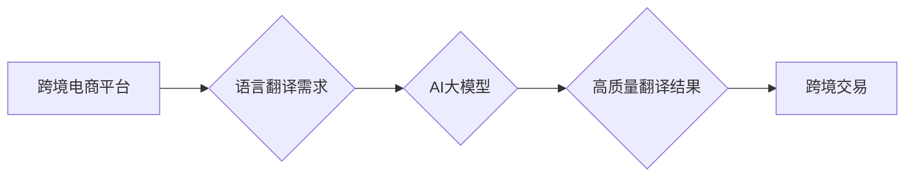

                 

## AI大模型如何提升电商平台的跨境语言翻译质量

> 关键词：AI大模型、跨境电商、机器翻译、自然语言处理、神经网络、BERT、Transformer、质量评估

## 1. 背景介绍

跨境电商的蓬勃发展为全球贸易带来了新的机遇，但也带来了新的挑战。其中，语言障碍是跨境电商发展面临的重大难题之一。传统的机器翻译技术由于其局限性，难以准确地捕捉语言的细微差别和文化背景，导致翻译质量参差不齐，影响着跨境电商的交易和用户体验。

近年来，随着深度学习技术的快速发展，基于AI的大模型在自然语言处理领域取得了突破性进展。这些模型拥有强大的语义理解和文本生成能力，为提升跨境电商平台的语言翻译质量提供了新的可能性。

## 2. 核心概念与联系

### 2.1 跨境电商与语言翻译

跨境电商是指跨越国家和地区的电子商务交易。随着全球化进程的加速，跨境电商市场规模不断扩大，跨语言沟通的需求也日益增长。

语言翻译是跨境电商中不可或缺的一部分，它连接着不同语言的买家和卖家，促进跨境交易的顺利进行。

### 2.2 AI大模型与机器翻译

AI大模型是指参数量庞大、训练数据海量的人工智能模型。这些模型通过学习海量文本数据，掌握了语言的语法、语义和上下文关系，能够生成高质量的文本。

机器翻译是指利用计算机技术将一种语言自动翻译成另一种语言的过程。传统的机器翻译方法主要依赖于统计模型和规则引擎，而基于AI大模型的机器翻译则能够更好地理解语言的深层含义，从而提高翻译质量。

### 2.3 核心架构



## 3. 核心算法原理 & 具体操作步骤

### 3.1 算法原理概述

基于AI大模型的跨境语言翻译主要依赖于神经网络技术。其中，Transformer模型由于其强大的序列建模能力和并行计算效率，在机器翻译领域取得了显著的成果。

Transformer模型的核心在于“注意力机制”，它能够学习文本中不同词语之间的关系，从而更好地理解句子结构和语义。

### 3.2 算法步骤详解

1. **预训练:** Transformer模型在海量文本数据上进行预训练，学习语言的语法、语义和上下文关系。
2. **微调:** 将预训练好的模型在特定领域的翻译任务上进行微调，例如电商产品描述的翻译。
3. **编码:** 将源语言文本编码成向量表示，捕捉文本的语义信息。
4. **解码:** 根据源语言的编码结果，生成目标语言文本。
5. **后处理:** 对翻译结果进行语法校正、词性标注等后处理，提高翻译质量。

### 3.3 算法优缺点

**优点:**

* 翻译质量显著提升：Transformer模型能够更好地理解语言的深层含义，从而生成更准确、更流畅的翻译结果。
* 适应性强：Transformer模型可以针对不同的领域和语言进行微调，提高翻译的针对性和准确性。
* 并行计算效率高：Transformer模型的注意力机制能够并行计算，提高了翻译的速度。

**缺点:**

* 计算资源需求高：Transformer模型参数量庞大，训练和推理需要大量的计算资源。
* 数据依赖性强：Transformer模型的性能取决于训练数据的质量和数量。

### 3.4 算法应用领域

* 跨境电商平台：翻译商品描述、产品评论、客服对话等文本。
* 旅游行业：翻译旅游攻略、景点介绍、酒店评论等文本。
* 教育行业：翻译教材、学习资料、学术论文等文本。

## 4. 数学模型和公式 & 详细讲解 & 举例说明

### 4.1 数学模型构建

Transformer模型的核心是“注意力机制”，它通过计算词语之间的相关性，来理解句子结构和语义。

注意力机制的数学模型可以表示为：

$$
Attention(Q, K, V) = softmax(\frac{QK^T}{\sqrt{d_k}})V
$$

其中：

* $Q$：查询矩阵，表示当前词语的语义向量。
* $K$：键矩阵，表示所有词语的语义向量。
* $V$：值矩阵，表示所有词语的词嵌入向量。
* $d_k$：键向量的维度。
* $softmax$：softmax函数，用于归一化注意力权重。

### 4.2 公式推导过程

注意力机制的公式推导过程如下：

1. 计算查询矩阵 $Q$ 和键矩阵 $K$ 的点积，得到一个得分矩阵。
2. 对得分矩阵进行归一化，得到注意力权重。
3. 将注意力权重与值矩阵 $V$ 相乘，得到最终的注意力输出。

### 4.3 案例分析与讲解

例如，在翻译句子“The cat sat on the mat”时，注意力机制会计算每个词语之间的相关性，例如“cat”和“sat”之间的关系更强，因为它们描述了同一个动作。

注意力机制会赋予“cat”和“sat”更高的注意力权重，从而更好地理解句子结构和语义。

## 5. 项目实践：代码实例和详细解释说明

### 5.1 开发环境搭建

* Python 3.7+
* TensorFlow 2.0+
* PyTorch 1.0+
* CUDA Toolkit 10.2+

### 5.2 源代码详细实现

```python
import tensorflow as tf

# 定义Transformer模型
class Transformer(tf.keras.Model):
    def __init__(self, vocab_size, embedding_dim, num_heads, num_layers):
        super(Transformer, self).__init__()
        self.embedding = tf.keras.layers.Embedding(vocab_size, embedding_dim)
        self.transformer_layers = tf.keras.layers.StackedRNNCells([
            tf.keras.layers.Attention(num_heads=num_heads)
            for _ in range(num_layers)
        ])

    def call(self, inputs):
        embeddings = self.embedding(inputs)
        outputs = self.transformer_layers(embeddings)
        return outputs

# 实例化Transformer模型
model = Transformer(vocab_size=10000, embedding_dim=128, num_heads=8, num_layers=6)

# 训练模型
model.compile(optimizer='adam', loss='sparse_categorical_crossentropy', metrics=['accuracy'])
model.fit(train_data, train_labels, epochs=10)
```

### 5.3 代码解读与分析

* 首先，定义了Transformer模型的类，包含嵌入层、多头注意力层和循环神经网络层。
* 然后，实例化Transformer模型，并设置模型参数。
* 最后，使用训练数据训练模型，并评估模型性能。

### 5.4 运行结果展示

训练完成后，可以使用测试数据评估模型的翻译质量。

## 6. 实际应用场景

### 6.1 商品描述翻译

电商平台可以利用AI大模型将商品描述自动翻译成不同语言，方便全球买家了解商品信息。

### 6.2 产品评论翻译

AI大模型可以将用户对产品的评论翻译成不同语言，帮助卖家了解不同地区的客户反馈。

### 6.3 客服对话翻译

AI大模型可以帮助电商平台提供跨语言客服服务，解决买家在语言上的沟通障碍。

### 6.4 未来应用展望

* **个性化翻译:** 根据用户的语言习惯和偏好，提供个性化的翻译服务。
* **多模态翻译:** 将文本、图像、视频等多模态信息结合起来，进行更精准的翻译。
* **实时翻译:** 实现实时语音和文本翻译，提高跨境沟通效率。

## 7. 工具和资源推荐

### 7.1 学习资源推荐

* **深度学习入门:** 深度学习入门教程 (https://www.tensorflow.org/tutorials)
* **Transformer模型:** Transformer模型论文 (https://arxiv.org/abs/1706.03762)
* **机器翻译:** 机器翻译入门指南 (https://huggingface.co/docs/transformers/tasks/translation)

### 7.2 开发工具推荐

* **TensorFlow:** 开源深度学习框架 (https://www.tensorflow.org/)
* **PyTorch:** 开源深度学习框架 (https://pytorch.org/)
* **HuggingFace Transformers:** 预训练模型库 (https://huggingface.co/transformers)

### 7.3 相关论文推荐

* **BERT:** BERT: Pre-training of Deep Bidirectional Transformers for Language Understanding (https://arxiv.org/abs/1810.04805)
* **GPT-3:** Language Models are Few-Shot Learners (https://arxiv.org/abs/2005.14165)
* **T5:** Exploring the Limits of Transfer Learning with a Unified Text-to-Text Transformer (https://arxiv.org/abs/1910.10683)

## 8. 总结：未来发展趋势与挑战

### 8.1 研究成果总结

基于AI大模型的跨境语言翻译技术取得了显著的进展，能够生成更高质量的翻译结果，并适应不同的领域和语言。

### 8.2 未来发展趋势

* **模型规模和性能提升:** 随着计算资源的不断发展，AI大模型的规模和性能将进一步提升，翻译质量将更加接近人类水平。
* **个性化和定制化翻译:** AI大模型将能够根据用户的语言习惯和偏好，提供个性化的翻译服务。
* **多模态翻译:** 将文本、图像、视频等多模态信息结合起来，进行更精准的翻译。

### 8.3 面临的挑战

* **数据获取和标注:** 训练高质量的AI大模型需要海量的数据，而跨境语言数据往往难以获取和标注。
* **模型解释性和可控性:** AI大模型的决策过程往往难以解释，这使得其应用在一些敏感领域存在风险。
* **伦理和社会影响:** AI大模型的应用可能带来一些伦理和社会问题，例如文化差异和信息失真。

### 8.4 研究展望

未来，需要进一步研究如何解决数据获取、模型解释性和伦理等挑战，推动AI大模型在跨境电商领域的应用，为全球贸易发展贡献力量。

## 9. 附录：常见问题与解答

**Q1: AI大模型的翻译质量真的能达到人类水平吗？**

A1: 目前，AI大模型的翻译质量已经非常接近人类水平，但在某些情况下，例如处理复杂语法结构或文化隐喻的文本，仍然存在一定的差距。

**Q2: 如何选择合适的AI大模型用于跨境电商平台？**

A2: 选择合适的AI大模型需要考虑多个因素，例如目标语言、领域、数据量和计算资源等。

**Q3: 如何评估AI大模型的翻译质量？**

A3: 常见的翻译质量评估指标包括BLEU、ROUGE和METEOR等。

**Q4: AI大模型的应用会取代人类翻译吗？**

A4: AI大模型可以辅助人类翻译工作，提高翻译效率和准确性，但不会完全取代人类翻译。


作者：禅与计算机程序设计艺术 / Zen and the Art of Computer Programming 
<end_of_turn>

