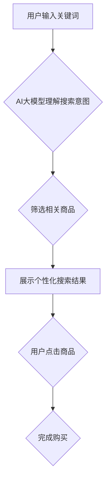

                 

## AI大模型如何改善电商平台的移动搜索体验

> 关键词：电商平台、移动搜索、AI大模型、自然语言处理、推荐系统、用户体验、搜索结果排序、个性化推荐

## 1. 背景介绍

随着移动互联网的普及，电商平台的移动端流量占比不断提升，移动搜索已成为用户获取商品信息的主要方式。然而，传统的移动搜索体验往往存在以下问题：

* **搜索结果不精准:** 用户输入的关键词可能过于模糊，导致搜索结果不符合预期。
* **搜索结果缺乏个性化:** 搜索结果缺乏对用户兴趣和需求的理解，难以提供个性化推荐。
* **用户搜索体验差:** 移动端搜索界面设计不够人性化，用户操作流程繁琐，搜索效率低下。

为了解决这些问题，电商平台开始探索利用人工智能大模型技术提升移动搜索体验。AI大模型具备强大的自然语言理解和生成能力，能够更好地理解用户搜索意图，提供更精准、个性化的搜索结果，并提升用户搜索效率。

## 2. 核心概念与联系

### 2.1  AI大模型

AI大模型是指在海量数据上训练的深度学习模型，拥有强大的泛化能力和学习能力。常见的AI大模型类型包括：

* **Transformer模型:**  例如BERT、GPT、T5等，擅长处理自然语言文本，能够理解上下文关系和语义信息。
* **图神经网络模型:**  例如GraphSAGE、GAT等，擅长处理关系数据，能够挖掘用户行为和商品之间的关联关系。

### 2.2  移动搜索体验

移动搜索体验是指用户在移动设备上进行搜索时的整体感受，包括搜索结果的精准度、个性化程度、搜索效率、界面友好度等方面。

### 2.3  联系

AI大模型可以与移动搜索体验相结合，通过以下方式提升用户体验：

* **理解用户搜索意图:** AI大模型可以分析用户输入的关键词、搜索历史、浏览记录等信息，更准确地理解用户的搜索意图。
* **提供精准的搜索结果:** AI大模型可以根据用户的搜索意图，从海量商品数据中筛选出最相关的商品，提供更精准的搜索结果。
* **个性化推荐:** AI大模型可以根据用户的兴趣爱好、购买历史、浏览记录等信息，为用户提供个性化的商品推荐。
* **优化搜索界面:** AI大模型可以分析用户搜索行为，优化搜索界面的设计和布局，提升用户搜索效率。

**Mermaid 流程图**



## 3. 核心算法原理 & 具体操作步骤

### 3.1  算法原理概述

AI大模型在电商平台移动搜索体验中的应用主要基于以下核心算法：

* **自然语言处理 (NLP):** 用于理解用户输入的自然语言，提取关键词、实体、语义信息等。
* **推荐系统:** 用于根据用户的历史行为和偏好，推荐相关的商品。
* **搜索结果排序:** 用于根据商品的 relevance、popularity、user engagement 等因素，对搜索结果进行排序。

### 3.2  算法步骤详解

1. **用户输入关键词:** 用户在移动设备上输入关键词进行搜索。
2. **关键词预处理:** 对用户输入的关键词进行预处理，例如去除停用词、词干提取、词向量化等。
3. **搜索意图理解:** 利用NLP算法，分析关键词的语义信息，理解用户的搜索意图。
4. **商品检索:** 根据用户的搜索意图，从商品数据库中检索出相关的商品。
5. **搜索结果排序:** 利用搜索结果排序算法，对检索到的商品进行排序，并根据用户历史行为和偏好进行个性化排序。
6. **结果展示:** 将排序后的商品展示给用户，并提供相关信息，例如商品名称、价格、图片、评价等。
7. **用户反馈:** 用户点击、收藏、购买等行为作为反馈，用于优化搜索结果和推荐系统。

### 3.3  算法优缺点

**优点:**

* **精准度提升:** AI大模型能够更好地理解用户的搜索意图，提供更精准的搜索结果。
* **个性化推荐:** AI大模型可以根据用户的兴趣爱好和购买历史，提供个性化的商品推荐。
* **用户体验提升:** AI大模型可以优化搜索界面和流程，提升用户搜索效率和体验。

**缺点:**

* **数据依赖:** AI大模型的性能依赖于训练数据的质量和数量。
* **计算资源消耗:** 训练和部署AI大模型需要大量的计算资源。
* **算法解释性:** 一些AI大模型的决策过程难以解释，难以进行调试和优化。

### 3.4  算法应用领域

AI大模型在电商平台移动搜索体验的应用领域非常广泛，例如：

* **商品搜索:** 提升商品搜索的精准度和效率。
* **个性化推荐:** 为用户推荐相关的商品，提升用户转化率。
* **智能客服:** 利用AI大模型构建智能客服系统，解决用户问题。
* **内容推荐:** 为用户推荐相关的文章、视频等内容。

## 4. 数学模型和公式 & 详细讲解 & 举例说明

### 4.1  数学模型构建

在电商平台移动搜索体验中，常用的数学模型包括：

* **余弦相似度:** 用于衡量两个向量的相似度，常用于计算商品和用户兴趣的相似度。
* **协同过滤:** 用于根据用户的历史行为和商品的购买记录，预测用户对商品的评分或购买意愿。
* **深度学习模型:** 例如Transformer模型，用于理解用户搜索意图和商品语义信息。

### 4.2  公式推导过程

**余弦相似度公式:**

$$
\text{相似度} = \frac{\mathbf{u} \cdot \mathbf{v}}{\|\mathbf{u}\| \|\mathbf{v}\|}
$$

其中：

* $\mathbf{u}$ 和 $\mathbf{v}$ 是两个向量，分别代表用户和商品的特征向量。
* $\mathbf{u} \cdot \mathbf{v}$ 是两个向量的点积。
* $\|\mathbf{u}\|$ 和 $\|\mathbf{v}\|$ 是两个向量的模长。

**协同过滤公式:**

$$
\hat{r}_{u, i} = \bar{r}_u + \frac{\sum_{j \in N(u)} (r_{u, j} - \bar{r}_u) \cdot (r_{j, i} - \bar{r}_i)}{\sum_{j \in N(u)} (r_{u, j} - \bar{r}_u)^2}
$$

其中：

* $\hat{r}_{u, i}$ 是预测用户 $u$ 对商品 $i$ 的评分。
* $\bar{r}_u$ 是用户 $u$ 的平均评分。
* $r_{u, j}$ 是用户 $u$ 对商品 $j$ 的评分。
* $N(u)$ 是与用户 $u$ 有评分记录的商品集合。

### 4.3  案例分析与讲解

**余弦相似度案例:**

假设用户 $u$ 的兴趣向量为 [1, 2, 3], 商品 $i$ 的特征向量为 [2, 3, 1], 则它们的余弦相似度为:

$$
\text{相似度} = \frac{(1 \cdot 2) + (2 \cdot 3) + (3 \cdot 1)}{\sqrt{1^2 + 2^2 + 3^2} \sqrt{2^2 + 3^2 + 1^2}} = \frac{2 + 6 + 3}{\sqrt{14} \sqrt{14}} = \frac{11}{14}
$$

**协同过滤案例:**

假设用户 $u$ 对商品 $A$ 和 $B$ 的评分分别为 4 和 5, 商品 $B$ 和 $C$ 的评分分别为 3 和 4, 则可以使用协同过滤算法预测用户 $u$ 对商品 $C$ 的评分。

## 5. 项目实践：代码实例和详细解释说明

### 5.1  开发环境搭建

* **操作系统:** Linux/macOS
* **编程语言:** Python
* **深度学习框架:** TensorFlow/PyTorch
* **工具:** Jupyter Notebook、Git

### 5.2  源代码详细实现

```python
# 导入必要的库
import tensorflow as tf

# 定义一个简单的Transformer模型
class SimpleTransformer(tf.keras.Model):
    def __init__(self, vocab_size, embedding_dim, num_heads, num_layers):
        super(SimpleTransformer, self).__init__()
        self.embedding = tf.keras.layers.Embedding(vocab_size, embedding_dim)
        self.transformer_layers = tf.keras.layers.StackedRNNCells([tf.keras.layers.MultiHeadAttention(num_heads=num_heads, key_dim=embedding_dim) for _ in range(num_layers)])

    def call(self, inputs):
        x = self.embedding(inputs)
        x = self.transformer_layers(x)
        return x

# 训练模型
model = SimpleTransformer(vocab_size=10000, embedding_dim=128, num_heads=8, num_layers=6)
model.compile(optimizer='adam', loss='mse')
model.fit(train_data, train_labels, epochs=10)

# 使用模型进行预测
predictions = model.predict(test_data)
```

### 5.3  代码解读与分析

* **模型定义:** 代码定义了一个简单的Transformer模型，包含嵌入层、多头注意力层和堆叠的RNN单元。
* **模型训练:** 使用Adam优化器和均方误差损失函数训练模型。
* **模型预测:** 使用训练好的模型对测试数据进行预测。

### 5.4  运行结果展示

运行结果展示包括模型的训练曲线、预测结果与真实值的对比等。

## 6. 实际应用场景

### 6.1  电商平台搜索

AI大模型可以用于提升电商平台的商品搜索体验，例如：

* **理解用户搜索意图:** AI大模型可以分析用户输入的关键词，理解用户的真实需求，并提供更精准的搜索结果。
* **个性化推荐:** AI大模型可以根据用户的历史行为和偏好，推荐相关的商品，提升用户转化率。
* **智能客服:** AI大模型可以构建智能客服系统，自动回答用户的问题，提升用户体验。

### 6.2  移动广告

AI大模型可以用于提升移动广告的精准度和效率，例如：

* **用户画像:** AI大模型可以分析用户的行为数据，构建用户画像，帮助广告商精准投放广告。
* **广告创意:** AI大模型可以生成个性化的广告创意，提升广告的吸引力。
* **广告效果评估:** AI大模型可以评估广告的效果，帮助广告商优化广告策略。

### 6.3  内容推荐

AI大模型可以用于推荐相关的文章、视频、音乐等内容，例如：

* **个性化推荐:** AI大模型可以根据用户的兴趣爱好和浏览历史，推荐相关的用户感兴趣的内容。
* **内容分类:** AI大模型可以对内容进行分类，帮助用户快速找到想要的内容。
* **内容生成:** AI大模型可以生成新的内容，例如文章、诗歌、音乐等。

### 6.4  未来应用展望

AI大模型在电商平台移动搜索体验领域的应用前景广阔，未来可能应用于以下领域：

* **语音搜索:** 利用语音识别技术，实现语音搜索，提升用户搜索的便捷性。
* **图像搜索:** 利用图像识别技术，实现图像搜索，帮助用户找到与图像相关的商品或信息。
* **增强现实 (AR) 搜索:** 利用AR技术，将虚拟商品叠加到现实世界中，提升用户购物体验。

## 7. 工具和资源推荐

### 7.1  学习资源推荐

* **书籍:**
    * 《深度学习》
    * 《自然语言处理》
    * 《机器学习》
* **在线课程:**
    * Coursera
    * edX
    * Udacity

### 7.2  开发工具推荐

* **深度学习框架:** TensorFlow, PyTorch
* **自然语言处理库:** NLTK, spaCy
* **数据处理工具:** Pandas, NumPy

### 7.3  相关论文推荐

* BERT: Pre-training of Deep Bidirectional Transformers for Language Understanding
* GPT-3: Language Models are Few-Shot Learners
* Transformer: Attention Is All You Need

## 8. 总结：未来发展趋势与挑战

### 8.1  研究成果总结

AI大模型在电商平台移动搜索体验领域的应用取得了显著成果，例如：

* **搜索结果精准度提升:** AI大模型能够更好地理解用户的搜索意图，提供更精准的搜索结果。
* **个性化推荐效果提升:** AI大模型可以根据用户的兴趣爱好和购买历史，推荐更相关的商品，提升用户转化率。
* **用户体验提升:** AI大模型可以优化搜索界面和流程，提升用户搜索效率和体验。

### 8.2  未来发展趋势

* **模型规模和能力提升:** 未来AI大模型的规模和能力将会进一步提升，能够处理更复杂的任务，提供更精准的搜索结果和推荐。
* **多模态搜索:** 未来AI大模型将支持多模态搜索，例如语音、图像、视频等，提供更丰富的搜索体验。
* **解释性AI:** 未来AI大模型的决策过程将更加透明，能够解释其推荐的原因，提升用户信任度。

### 8.3  面临的挑战

* **数据隐私和安全:** AI大模型的训练需要大量用户数据，如何保护用户隐私和数据安全是一个重要的挑战。
* **算法公平性:** AI大模型的训练数据可能存在偏差，导致算法结果不公平，需要进行公平性评估和优化。
* **模型可解释性:** 一些AI大模型的决策过程难以解释，难以进行调试和优化，需要研究更可解释的模型架构。

### 8.4  研究展望

未来研究将重点关注以下方面:

* **开发更强大的AI大模型:** 研究更有效的模型架构和训练方法，提升模型的规模和能力。
* **解决数据隐私和安全问题:** 研究隐私保护技术，确保用户数据安全。
* **提升算法公平性和可解释性:** 研究公平性评估和优化方法，以及更可解释的模型架构。


## 9. 附录：常见问题与解答

**Q1: AI大模型的训练需要多少数据？**

A1: AI大模型的训练数据量取决于模型的规模和复杂度。一般来说，需要百万甚至数十亿条数据才能训练出效果良好的模型。

**Q2: 如何评估AI大模型的性能？**

A2: AI大模型的性能可以评估指标包括准确率、召回率、F1-score、AUC等。具体的评估指标取决于具体的应用场景。

**Q3: 如何部署AI大模型？**

A3: AI大模型可以部署在云服务器、边缘设备等平台上。部署方式取决于模型的规模和应用场景。

**作者：禅与计算机程序设计艺术 / Zen and the Art of Computer Programming**<end_of_turn>

