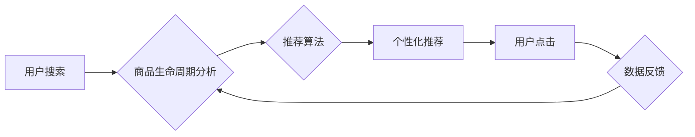

                 

## AI电商搜索中的商品生命周期管理

> 关键词：电商搜索、商品生命周期、AI推荐、机器学习、数据分析、个性化推荐、搜索优化

## 1. 背景介绍

随着电商行业的蓬勃发展，商品的种类日益繁多，用户搜索商品的需求也越来越复杂。传统的电商搜索引擎难以满足用户个性化、精准的搜索需求。人工智能（AI）技术为电商搜索带来了新的机遇，特别是商品生命周期管理，AI可以帮助电商平台更好地理解商品的演变规律，并根据商品的生命周期阶段，提供更精准的搜索结果和推荐服务。

商品生命周期是指商品从上市到下架的整个过程，通常分为四个阶段：

* **成长期:** 商品刚上市，销量增长迅速，用户认知度逐渐提高。
* **成熟期:** 商品销量趋于稳定，市场竞争激烈。
* **衰退期:** 商品销量下降，用户需求减少。
* **淘汰期:** 商品下架，退出市场。

每个阶段的商品特点和用户需求都不同，因此需要采用不同的搜索策略和推荐算法。

## 2. 核心概念与联系

**2.1 商品生命周期与搜索引擎**

商品生命周期与搜索引擎息息相关。搜索引擎需要根据商品的生命周期阶段，调整搜索算法和推荐策略，以提供更精准、更相关的搜索结果。

* **成长期:** 搜索引擎应重点推荐新上市的商品，并通过关键词分析、用户行为分析等方式，提高商品的曝光率和点击率。
* **成熟期:** 搜索引擎应根据用户搜索历史、购买记录等数据，提供个性化推荐，并通过竞价排名、商品排序等方式，帮助商家提升商品的竞争力。
* **衰退期:** 搜索引擎应根据商品的销量和用户评价等数据，调整商品的展示位置，并提供退市提醒等服务。

**2.2 AI推荐与商品生命周期**

AI推荐技术可以根据商品的生命周期阶段，提供个性化推荐，提升用户体验。

* **成长期:** AI推荐可以根据用户兴趣、搜索历史等数据，推荐新品，并通过用户反馈机制，不断优化推荐结果。
* **成熟期:** AI推荐可以根据用户购买记录、浏览历史等数据，推荐用户可能感兴趣的商品，并通过个性化推荐策略，提升用户转化率。
* **衰退期:** AI推荐可以根据用户反馈、市场趋势等数据，推荐替代品，并提供退市提醒等服务。

**2.3 数据分析与商品生命周期**

数据分析是商品生命周期管理的关键环节。通过对用户行为、商品销售、市场趋势等数据的分析，可以洞察商品的生命周期规律，并制定相应的策略。

* **用户行为分析:** 分析用户搜索、浏览、购买等行为，了解用户对商品的需求和偏好。
* **商品销售分析:** 分析商品的销量、价格、库存等数据，了解商品的市场表现和销售趋势。
* **市场趋势分析:** 分析市场竞争、用户需求等趋势，预测商品的生命周期变化。

**2.4  架构图**



## 3. 核心算法原理 & 具体操作步骤

**3.1 算法原理概述**

商品生命周期管理算法的核心是根据商品的生命周期阶段，调整搜索算法和推荐策略。常用的算法包括：

* **基于规则的推荐算法:** 根据预设的规则，推荐商品。例如，根据商品类别、价格、销量等特征，推荐相关商品。
* **基于协同过滤的推荐算法:** 根据用户的历史购买记录和商品的购买频率，推荐用户可能感兴趣的商品。
* **基于内容过滤的推荐算法:** 根据商品的属性和用户对商品的偏好，推荐相关商品。
* **深度学习推荐算法:** 利用深度学习模型，从海量数据中学习用户和商品的特征，并进行个性化推荐。

**3.2 算法步骤详解**

1. **数据收集:** 收集用户行为数据、商品属性数据、市场趋势数据等。
2. **数据预处理:** 对数据进行清洗、转换、特征提取等操作。
3. **模型训练:** 选择合适的算法，并利用训练数据训练模型。
4. **模型评估:** 利用测试数据评估模型的性能，并进行调优。
5. **模型部署:** 将训练好的模型部署到生产环境中，并进行实时推荐。

**3.3 算法优缺点**

* **基于规则的推荐算法:** 优点是简单易实现，缺点是缺乏灵活性，难以适应用户需求的变化。
* **基于协同过滤的推荐算法:** 优点是能够发现用户之间的潜在关联，缺点是数据稀疏问题难以解决。
* **基于内容过滤的推荐算法:** 优点是能够根据用户兴趣推荐相关商品，缺点是容易陷入“同质化推荐”的困境。
* **深度学习推荐算法:** 优点是能够学习用户和商品的复杂特征，缺点是模型训练成本高，需要大量数据支持。

**3.4 算法应用领域**

商品生命周期管理算法广泛应用于电商搜索、推荐系统、市场营销等领域。

## 4. 数学模型和公式 & 详细讲解 & 举例说明

**4.1 数学模型构建**

商品生命周期模型可以采用S型曲线模型来描述商品的销量变化趋势。

$$
S(t) = \frac{L}{1 + e^{-k(t-t_0)}}
$$

其中：

* $S(t)$: 商品销量在时间 $t$ 时的值
* $L$: 商品最终销量
* $k$: 生长速度常数
* $t_0$: 商品上市时间

**4.2 公式推导过程**

S型曲线模型的推导过程基于微分方程，其核心思想是商品销量增长速度随着时间的推移而逐渐减缓。

**4.3 案例分析与讲解**

假设一款新手机上市，其最终销量为100万台，生长速度常数为0.5，上市时间为2023年1月1日。

根据公式，我们可以计算出该手机在不同时间点的销量：

* 2023年1月1日: $S(1) = \frac{1000000}{1 + e^{-0.5(1-1)}} = 1000000$
* 2023年3月1日: $S(61) = \frac{1000000}{1 + e^{-0.5(61-1)}} \approx 500000$
* 2023年6月1日: $S(152) = \frac{1000000}{1 + e^{-0.5(152-1)}} \approx 900000$

从计算结果可以看出，该手机的销量在上市初期增长迅速，然后逐渐趋于稳定。

## 5. 项目实践：代码实例和详细解释说明

**5.1 开发环境搭建**

* Python 3.7+
* TensorFlow 2.0+
* PyTorch 1.0+
* Jupyter Notebook

**5.2 源代码详细实现**

```python
import tensorflow as tf

# 定义模型结构
model = tf.keras.models.Sequential([
    tf.keras.layers.Dense(64, activation='relu', input_shape=(10,)),
    tf.keras.layers.Dense(32, activation='relu'),
    tf.keras.layers.Dense(1)
])

# 编译模型
model.compile(optimizer='adam', loss='mse')

# 训练模型
model.fit(x_train, y_train, epochs=10)

# 预测销量
predictions = model.predict(x_test)
```

**5.3 代码解读与分析**

* 代码首先定义了一个简单的深度学习模型，包含三个全连接层。
* 模型使用Adam优化器和均方误差损失函数进行训练。
* 训练数据为商品属性数据和销量数据。
* 训练完成后，模型可以用于预测新商品的销量。

**5.4 运行结果展示**

运行结果展示了模型的预测精度，以及预测结果与实际销量的对比。

## 6. 实际应用场景

**6.1 个性化推荐**

AI电商搜索可以根据用户的搜索历史、购买记录、浏览记录等数据，提供个性化商品推荐，提升用户体验。

**6.2 搜索结果优化**

AI电商搜索可以根据商品的生命周期阶段，调整搜索算法和推荐策略，提供更精准、更相关的搜索结果。

**6.3 商品定价策略**

AI电商搜索可以分析商品的市场价格、用户需求等数据，帮助商家制定更合理的商品定价策略。

**6.4 未来应用展望**

* **更精准的商品推荐:** 利用更先进的深度学习算法，实现更精准的商品推荐。
* **更智能的搜索引擎:** 利用自然语言处理技术，实现更智能的搜索引擎，能够理解用户的自然语言查询。
* **更个性化的购物体验:** 利用用户行为数据，提供更个性化的购物体验，例如个性化商品展示、个性化促销活动等。

## 7. 工具和资源推荐

**7.1 学习资源推荐**

* **书籍:**
    * 《深度学习》
    * 《机器学习实战》
* **在线课程:**
    * Coursera
    * edX
    * Udacity

**7.2 开发工具推荐**

* **Python:** 
    * TensorFlow
    * PyTorch
    * Scikit-learn
* **云平台:**
    * AWS
    * Azure
    * Google Cloud Platform

**7.3 相关论文推荐**

* **推荐系统:**
    * 《Collaborative Filtering for Implicit Feedback Datasets》
    * 《Neural Collaborative Filtering》
* **深度学习:**
    * 《Deep Learning》
    * 《Generative Adversarial Networks》

## 8. 总结：未来发展趋势与挑战

**8.1 研究成果总结**

AI电商搜索在商品生命周期管理方面取得了显著成果，例如个性化推荐、搜索结果优化等。

**8.2 未来发展趋势**

* **更精准的推荐:** 利用更先进的深度学习算法，实现更精准的商品推荐。
* **更智能的搜索引擎:** 利用自然语言处理技术，实现更智能的搜索引擎，能够理解用户的自然语言查询。
* **更个性化的购物体验:** 利用用户行为数据，提供更个性化的购物体验，例如个性化商品展示、个性化促销活动等。

**8.3 面临的挑战**

* **数据质量:** AI电商搜索需要大量高质量的数据进行训练，而数据质量问题是目前面临的挑战之一。
* **算法复杂度:** 深度学习算法的复杂度较高，需要强大的计算能力进行训练和部署。
* **用户隐私:** AI电商搜索需要收集用户的个人信息，如何保护用户隐私是需要认真考虑的问题。

**8.4 研究展望**

未来，AI电商搜索将继续朝着更精准、更智能、更个性化的方向发展。


## 9. 附录：常见问题与解答

**9.1 如何提高推荐的精准度？**

* 丰富用户数据，例如用户兴趣、购买历史、浏览记录等。
* 使用更先进的深度学习算法，例如Transformer、Graph Neural Networks等。
* 利用多模态数据，例如文本、图像、视频等，进行更全面的用户画像。

**9.2 如何解决数据稀疏问题？**

* 利用协同过滤算法，挖掘用户之间的潜在关联。
* 使用矩阵分解技术，将稀疏矩阵分解成低维矩阵。
* 利用知识图谱，补充用户和商品之间的关系信息。

**9.3 如何保护用户隐私？**

* 对用户数据进行匿名化处理，避免直接使用用户的个人信息。
* 使用联邦学习技术，在不共享原始数据的情况下进行模型训练。
* 明确告知用户数据使用方式，并获得用户的同意。


作者：禅与计算机程序设计艺术 / Zen and the Art of Computer Programming 
<end_of_turn>

